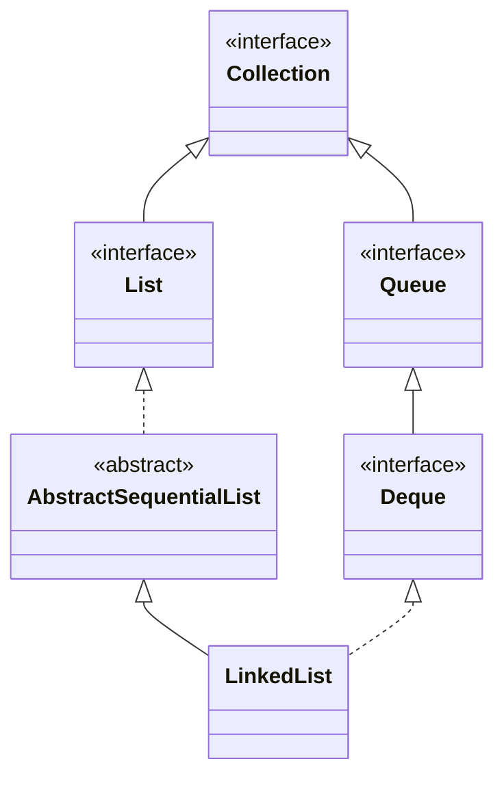

## Objective

Understand `LinkedList`, a doubly-linked-list-backed collection that implements `List`, `Deque`, and `Queue` at once — the same object can be treated as an indexable sequence, a double-ended queue, or a FIFO/stack, depending on which methods the caller reaches for.

## Use Cases

- Frequent insertion or removal at both ends, or in the middle once already positioned there, without the shifting cost `ArrayList` pays.
- Using a single collection type as a stack, a queue, or a positional list, without picking a different class for each role.
- Implementing algorithms that walk the list sequentially (via `Iterator`/`ListIterator`) rather than jumping to arbitrary indexes.

## Deep Dive

### LinkedList extends AbstractSequentialList

```java
class LinkedList<E>
```

`LinkedList` implements `List<E>`, `Deque<E>`, and (transitively, through `Deque`) `Queue<E>`. Two constructors:

```java
LinkedList<String> ll = new LinkedList<>();
LinkedList<String> ll2 = new LinkedList<>(List.of("a", "b"));
```



### Deque methods on a List

Because `LinkedList` implements `Deque`, both ends are addressable directly, instead of only through `List`'s index-0/index-`size()-1` positions:

```java
LinkedList<String> ll = new LinkedList<>();
ll.add("F"); ll.add("B"); ll.add("D"); ll.add("E"); ll.add("C");
ll.addLast("Z");
ll.addFirst("A");
ll.add(1, "A2");          // List-style positional insert
// ll: [A, A2, F, B, D, E, C, Z]

ll.remove("F");            // Collection-style remove by value
ll.remove(2);               // List-style remove by index
ll.removeFirst();
ll.removeLast();
```

`getFirst()`/`peekFirst()` and `getLast()`/`peekLast()` mirror the throwing-vs-reporting split `Deque` uses everywhere else.

### Positional access still works, just not efficiently

```java
String val = ll.get(2);
ll.set(2, val + " Changed");
```

`get`/`set` are still available because `LinkedList` implements `List`, and they still validate the index the same way `ArrayList`'s do — the difference is in how the element is located, not in the method contract.

## Trade-offs

- **`get(index)` is O(n), not O(1)** — `LinkedList` has no random-access array to jump into, so reaching index `i` means walking `i` nodes from whichever end is closer:

  ```java
  LinkedList<Integer> ll = new LinkedList<>();
  for (int i = 0; i < 100_000; i++) ll.add(i);
  ll.get(99_999); // walks the list to get there — no shortcut
  ```

  This is the mirror image of `ArrayList`'s trade-off.
- **`LinkedList` does not implement `RandomAccess`** — code that branches on `instanceof RandomAccess` (as some JDK algorithms in `Collections` do) falls back to iterator-based traversal instead of index-based loops when handed a `LinkedList`.
- **Every element is wrapped in a node object**, carrying prev/next references alongside the value — more per-element memory overhead than `ArrayList`'s flat backing array, independent of how many elements are stored.
- **Not synchronized**, same as `ArrayList` — concurrent structural modification (including during iteration) is unsafe and typically surfaces as `ConcurrentModificationException`.

## Documentation Links

- *Java: The Complete Reference*, 12th Edition (Herbert Schildt) — Chapter 20, pp. 589–590 — book
- [LinkedList — Java SE 25 API](https://docs.oracle.com/en/java/javase/25/docs/api/java.base/java/util/LinkedList.html) — doc
- [Deque — Java SE 25 API](https://docs.oracle.com/en/java/javase/25/docs/api/java.base/java/util/Deque.html) — doc
- [List — Java SE 25 API](https://docs.oracle.com/en/java/javase/25/docs/api/java.base/java/util/List.html) — doc
