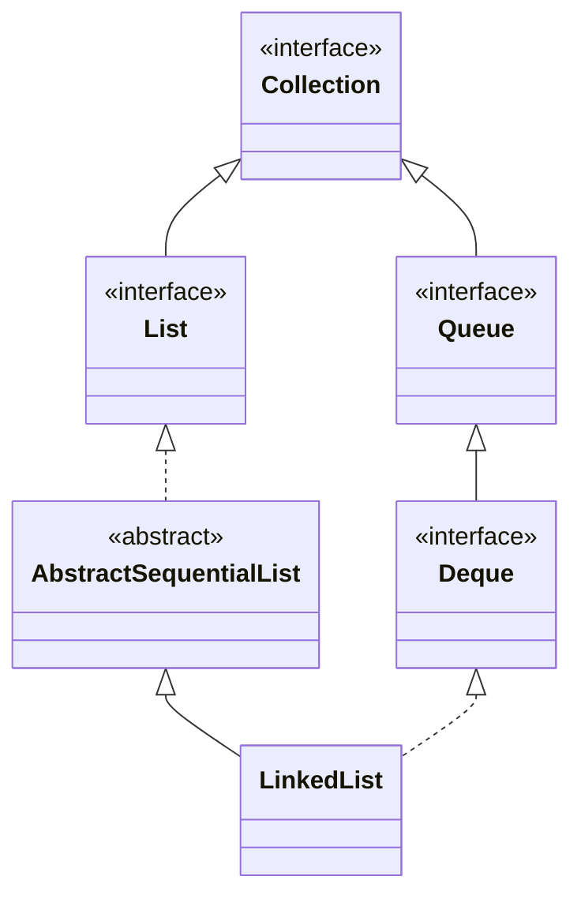

## Objective

Entender o `LinkedList`, uma collection baseada em lista duplamente ligada que implementa `List`, `Deque` e `Queue` ao mesmo tempo — o mesmo objeto pode ser tratado como uma sequência indexável, uma fila de duas pontas ou uma FIFO/pilha, dependendo de quais métodos o chamador usa.

## Use Cases

- Inserção ou remoção frequente em ambas as pontas, ou no meio quando já posicionado ali, sem o custo de deslocamento que o `ArrayList` paga.
- Usar um único tipo de collection como pilha, fila ou lista posicional, sem escolher uma classe diferente para cada papel.
- Implementar algoritmos que percorrem a lista sequencialmente (via `Iterator`/`ListIterator`) em vez de pular para índices arbitrários.

## Deep Dive

### LinkedList estende AbstractSequentialList

```java
class LinkedList<E>
```

`LinkedList` implementa `List<E>`, `Deque<E>` e (transitivamente, através de `Deque`) `Queue<E>`. Dois construtores:

```java
LinkedList<String> ll = new LinkedList<>();
LinkedList<String> ll2 = new LinkedList<>(List.of("a", "b"));
```



### Métodos de Deque em uma List

Como `LinkedList` implementa `Deque`, ambas as pontas são endereçáveis diretamente, em vez de apenas através das posições de índice-0/índice-`size()-1` de `List`:

```java
LinkedList<String> ll = new LinkedList<>();
ll.add("F"); ll.add("B"); ll.add("D"); ll.add("E"); ll.add("C");
ll.addLast("Z");
ll.addFirst("A");
ll.add(1, "A2");          // List-style positional insert
// ll: [A, A2, F, B, D, E, C, Z]

ll.remove("F");            // Collection-style remove by value
ll.remove(2);               // List-style remove by index
ll.removeFirst();
ll.removeLast();
```

`getFirst()`/`peekFirst()` e `getLast()`/`peekLast()` espelham a divisão entre lançar exceção e apenas reportar que `Deque` usa em todo lugar.

### Veja acontecendo: addFirst() crescendo a partir da cabeça

Cada `addFirst()` cai na frente — o slot 0 abaixo é a cabeça, uma inserção O(1) já que é só um novo nó sendo ligado, não um deslocamento de todos os outros elementos como faria `ArrayList.add(0, e)`:

```viz
type: formula
capacity = count
slot = capacity - 1 - index
---
A
B
C
D
```

O último a entrar (`D`) fica no slot 0. Compare isso com a viz do `ArrayList` — mesmos quatro elementos, regra de posicionamento oposta.

### O acesso posicional ainda funciona, só que não com eficiência

```java
String val = ll.get(2);
ll.set(2, val + " Changed");
```

`get`/`set` continuam disponíveis porque `LinkedList` implementa `List`, e continuam validando o índice da mesma forma que os do `ArrayList` — a diferença está em como o elemento é localizado, não no contrato do método.

## Trade-offs

- **`get(index)` é O(n), não O(1)** — o `LinkedList` não tem um array de acesso aleatório para pular direto; alcançar o índice `i` significa percorrer `i` nós a partir da ponta mais próxima:

  ```java
  LinkedList<Integer> ll = new LinkedList<>();
  for (int i = 0; i < 100_000; i++) ll.add(i);
  ll.get(99_999); // walks the list to get there — no shortcut
  ```

  Esse é o espelho exato do trade-off do `ArrayList`.
- **`LinkedList` não implementa `RandomAccess`** — código que decide seu comportamento com `instanceof RandomAccess` (como alguns algoritmos do JDK em `Collections` fazem) cai para percorrimento baseado em iterator em vez de loops baseados em índice quando recebe um `LinkedList`.
- **Todo elemento é envolvido em um objeto nó**, carregando referências prev/next junto com o valor — mais overhead de memória por elemento do que o array de suporte plano do `ArrayList`, independentemente de quantos elementos estejam armazenados.
- **Não é sincronizado**, assim como o `ArrayList` — modificação estrutural concorrente (inclusive durante a iteração) não é segura e tipicamente aparece como `ConcurrentModificationException`.

## Documentation Links

- *Java: The Complete Reference*, 12th Edition (Herbert Schildt) — Chapter 20, pp. 589–590 — book
- [LinkedList — Java SE 25 API](https://docs.oracle.com/en/java/javase/25/docs/api/java.base/java/util/LinkedList.html) — doc
- [Deque — Java SE 25 API](https://docs.oracle.com/en/java/javase/25/docs/api/java.base/java/util/Deque.html) — doc
- [List — Java SE 25 API](https://docs.oracle.com/en/java/javase/25/docs/api/java.base/java/util/List.html) — doc
