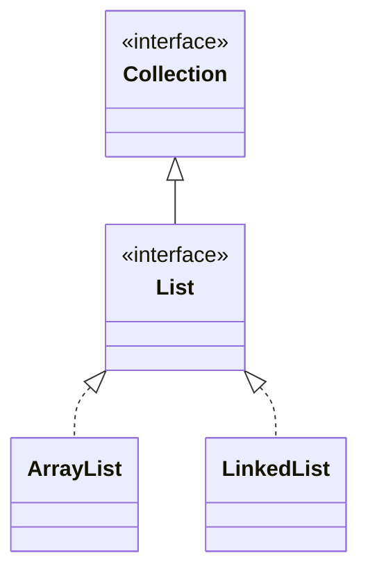

## Objective

Understand `List`: the `Collection` subinterface that stores a sequence of elements accessed by a zero-based index, and may contain duplicates. On top of everything `Collection` already declares, `List` adds positional operations — insert, read, replace, search, and slice by index.

## Use Cases

- Storing elements in a specific, caller-controlled order rather than the unordered bag a plain `Collection` implies.
- Inserting or replacing an element at a known position instead of removing and re-adding it.
- Finding where a value sits in the sequence with `indexOf` / `lastIndexOf`.
- Working on a window of a larger list via `subList`, without copying the underlying data.
- Sorting a list in place, or applying a transformation to every element with `replaceAll`.
- Building a small, fixed, unmodifiable list quickly with `List.of()` instead of `new ArrayList<>(...)`.

## Deep Dive

### List extends Collection

```java
interface List<E>
```

`E` specifies the type of objects the list will hold. Because `List` extends `Collection`, everything `Collection` declares — `add`, `remove`, `contains`, `stream`, ... — is available, but `List` gives `add(E)` and `addAll(Collection)` more specific semantics: elements always go in at a defined position (the end, unless told otherwise), and duplicates are allowed.



### Inserting at a position: add(int, E) and addAll(int, Collection)

```java
List<String> names = new ArrayList<>(List.of("Ann", "Cid"));
names.add(1, "Bob");                       // insert at index 1
names.addAll(1, List.of("Xx", "Yy"));      // insert every element starting at index 1
```

Both shift every subsequent element up by the number of elements inserted, rather than overwriting what was there.

### Positional access: get and set

```java
String first = names.get(0);   // read the element at index 0
names.set(0, "Zoe");            // replace it, returning the old value
```

`set` replaces in place; it does not change the list's size the way `add` does.

### Searching: indexOf and lastIndexOf

```java
names.indexOf("Bob");       // first index where Bob appears, or -1
names.lastIndexOf("Bob");   // last index where Bob appears, or -1
```

Both compare with `equals()`, so they find any element equal to the argument, not just the exact same reference.

### Sublists: a view, not a copy

```java
List<String> view = names.subList(1, 3); // elements at index 1 and 2
```

`subList` returns a `List` backed by the original — reads and writes to `view` pass through to `names` over that index range.

### Replacing and sorting in place

```java
names.replaceAll(String::toUpperCase);        // apply a function to every element
names.sort(Comparator.naturalOrder());        // sort using a Comparator
```

`sort()` is declared by `List` itself (not inherited from `Collection`), so any `List` implementation gets in-place sorting without a separate utility call.

### Unmodifiable lists: List.of()

Beginning with JDK 9, `List` includes the `of()` factory method, with 12 overloads (zero through ten arguments, plus a varargs form):

```java
List<String> empty = List.of();
List<String> one   = List.of("Ann");
List<String> many  = List.of("Ann", "Bob", "Cid", "Dee", "Eve", "Fay", "Gio", "Hal", "Ida", "Jax");
List<String> varargs = List.of("k1", "k2", "k3", "k4", "k5", "k6", "k7", "k8", "k9", "k10", "k11");
```

Every version returns an unmodifiable, value-based list. `null` elements are not allowed in any of them.

## Trade-offs

- **Unmodifiable lists reject mutation at runtime, not compile time** — a list from `List.of()` still exposes `add`/`set`/`remove`, so calling one type-checks fine and only fails when it runs:

  ```java
  List<String> fixed = List.of("a", "b");
  fixed.add("c"); // UnsupportedOperationException
  ```
- **Positional methods validate the index against the current size** — `get`, `set`, and `add(int, E)` all throw `IndexOutOfBoundsException` for a negative or out-of-range index, rather than silently clamping it:

  ```java
  List<String> names = new ArrayList<>(List.of("Ann"));
  names.get(5); // IndexOutOfBoundsException
  ```
- **subList is a live view, so structural changes to either side are visible in both** — mutating through the view mutates the backing list in place:

  ```java
  List<String> names = new ArrayList<>(List.of("Ann", "Bob", "Cid"));
  List<String> view = names.subList(0, 2);
  view.set(0, "Zoe");
  System.out.println(names); // [Zoe, Bob, Cid]
  ```
- **sort() only needs elements that are actually mutually comparable, and that isn't checked until it runs** — `List<E>` doesn't require `E` to implement `Comparable` unless the caller uses natural ordering, so a list of genuinely incomparable objects compiles fine and only fails once `sort()` tries to compare two of them.

## Documentation Links

- [List — Java SE 25 API](https://docs.oracle.com/en/java/javase/25/docs/api/java.base/java/util/List.html) — doc
- [Collection — Java SE 25 API](https://docs.oracle.com/en/java/javase/25/docs/api/java.base/java/util/Collection.html) — doc
