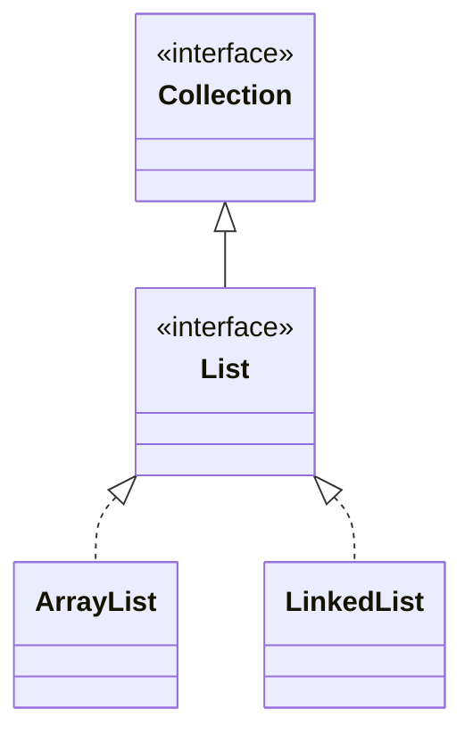

## Objective

Entender `List`: a subinterface de `Collection` que armazena uma sequência de elementos acessados por um índice baseado em zero, e pode conter duplicatas. Além de tudo que `Collection` já declara, `List` adiciona operações posicionais — inserir, ler, substituir, buscar e fatiar por índice.

## Use Cases

- Armazenar elementos em uma ordem específica, controlada pelo chamador, em vez do conjunto desordenado que uma `Collection` pura sugere.
- Inserir ou substituir um elemento em uma posição conhecida em vez de remover e readicionar.
- Encontrar onde um valor está na sequência com `indexOf` / `lastIndexOf`.
- Trabalhar em uma janela de uma lista maior via `subList`, sem copiar os dados subjacentes.
- Ordenar uma lista in-place, ou aplicar uma transformação a cada elemento com `replaceAll`.
- Construir rapidamente uma lista pequena, fixa e não modificável com `List.of()` em vez de `new ArrayList<>(...)`.

## Deep Dive

### List estende Collection

```java
interface List<E>
```

`E` especifica o tipo de objetos que a lista vai conter. Como `List` estende `Collection`, tudo que `Collection` declara — `add`, `remove`, `contains`, `stream`, ... — está disponível, mas `List` dá a `add(E)` e `addAll(Collection)` uma semântica mais específica: os elementos sempre entram em uma posição definida (o final, a menos que indicado de outra forma), e duplicatas são permitidas.



### Inserindo em uma posição: add(int, E) e addAll(int, Collection)

```java
List<String> names = new ArrayList<>(List.of("Ann", "Cid"));
names.add(1, "Bob");                       // insert at index 1
names.addAll(1, List.of("Xx", "Yy"));      // insert every element starting at index 1
```

Ambos deslocam todo elemento subsequente para cima pelo número de elementos inseridos, em vez de sobrescrever o que estava lá.

### Acesso posicional: get e set

```java
String first = names.get(0);   // read the element at index 0
names.set(0, "Zoe");            // replace it, returning the old value
```

`set` substitui in-place; não muda o tamanho da lista como `add` faz.

### Busca: indexOf e lastIndexOf

```java
names.indexOf("Bob");       // first index where Bob appears, or -1
names.lastIndexOf("Bob");   // last index where Bob appears, or -1
```

Ambos comparam com `equals()`, então encontram qualquer elemento igual ao argumento, não apenas a exata mesma referência.

### Sublistas: uma view, não uma cópia

```java
List<String> view = names.subList(1, 3); // elements at index 1 and 2
```

`subList` retorna uma `List` apoiada na original — leituras e escritas em `view` são repassadas para `names` naquela faixa de índices.

### Substituindo e ordenando in-place

```java
names.replaceAll(String::toUpperCase);        // apply a function to every element
names.sort(Comparator.naturalOrder());        // sort using a Comparator
```

`sort()` é declarado pela própria `List` (não herdado de `Collection`), então qualquer implementação de `List` ganha ordenação in-place sem uma chamada separada a algum utilitário.

### Listas não modificáveis: List.of()

A partir do JDK 9, `List` inclui o método de fábrica `of()`, com 12 sobrecargas (de zero a dez argumentos, mais uma forma varargs):

```java
List<String> empty = List.of();
List<String> one   = List.of("Ann");
List<String> many  = List.of("Ann", "Bob", "Cid", "Dee", "Eve", "Fay", "Gio", "Hal", "Ida", "Jax");
List<String> varargs = List.of("k1", "k2", "k3", "k4", "k5", "k6", "k7", "k8", "k9", "k10", "k11");
```

Toda versão retorna uma lista não modificável, baseada em valor. Elementos `null` não são permitidos em nenhuma delas.

## Trade-offs

- **Listas não modificáveis rejeitam mutação em tempo de execução, não em tempo de compilação** — uma lista vinda de `List.of()` ainda expõe `add`/`set`/`remove`, então chamar um desses passa na checagem de tipos normalmente e só falha quando executado:

  ```java
  List<String> fixed = List.of("a", "b");
  fixed.add("c"); // UnsupportedOperationException
  ```
- **Métodos posicionais validam o índice contra o tamanho atual** — `get`, `set` e `add(int, E)` lançam `IndexOutOfBoundsException` para um índice negativo ou fora do intervalo, em vez de simplesmente limitá-lo silenciosamente:

  ```java
  List<String> names = new ArrayList<>(List.of("Ann"));
  names.get(5); // IndexOutOfBoundsException
  ```
- **subList é uma view ao vivo, então mudanças estruturais em qualquer um dos lados ficam visíveis nos dois** — mutar através da view muta a lista de suporte in-place:

  ```java
  List<String> names = new ArrayList<>(List.of("Ann", "Bob", "Cid"));
  List<String> view = names.subList(0, 2);
  view.set(0, "Zoe");
  System.out.println(names); // [Zoe, Bob, Cid]
  ```
- **sort() só precisa de elementos que sejam de fato mutuamente comparáveis, e isso não é checado até a execução** — `List<E>` não exige que `E` implemente `Comparable` a menos que o chamador use a ordem natural, então uma lista de objetos genuinamente incomparáveis compila normalmente e só falha quando `sort()` tenta comparar dois deles.

## Documentation Links

- [List — Java SE 25 API](https://docs.oracle.com/en/java/javase/25/docs/api/java.base/java/util/List.html) — doc
- [Collection — Java SE 25 API](https://docs.oracle.com/en/java/javase/25/docs/api/java.base/java/util/Collection.html) — doc
