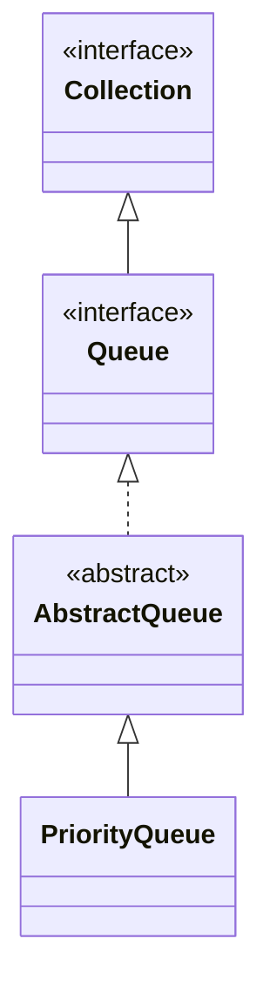

## Objective

Understand `PriorityQueue`, the `Queue` implementation that orders its elements by a comparator (or natural ordering) instead of insertion order — the head is always the smallest element by that ordering, backed internally by a heap rather than a fully-sorted structure.

## Use Cases

- Scheduling work by priority — task queues, event simulation, or graph algorithms like Dijkstra's shortest path.
- Repeatedly retrieving the smallest (or, with a reversing `Comparator`, the largest) element efficiently.
- Streaming "top-k" computations, where only the current extreme matters, not a fully sorted list.
- Plugging a custom ordering into code that's written against the generic `Queue` interface.

## Deep Dive

### PriorityQueue extends AbstractQueue

```java
class PriorityQueue<E>
```

Seven constructors:

```java
PriorityQueue<Integer> a = new PriorityQueue<>();                              // capacity 11, natural ordering
PriorityQueue<Integer> b = new PriorityQueue<>(50);                            // capacity 50, natural ordering
PriorityQueue<Integer> c = new PriorityQueue<>(Comparator.reverseOrder());     // max-heap via custom comparator
PriorityQueue<Integer> d = new PriorityQueue<>(50, Comparator.reverseOrder()); // capacity + comparator
PriorityQueue<Integer> e = new PriorityQueue<>(List.of(3, 1, 2));              // from a Collection
```

Capacity grows automatically as elements are added, same as `ArrayList`.



### Default ordering: a min-heap

Without an explicit `Comparator`, the natural ordering of the elements applies, so the smallest element is always at the head:

```java
PriorityQueue<Integer> pq = new PriorityQueue<>(List.of(5, 1, 3, 2, 4));
pq.poll(); // 1 — smallest first
pq.poll(); // 2
```

A `Comparator` inverts or replaces that ordering entirely — e.g. `Comparator.reverseOrder()` turns it into a max-heap. `comparator()` returns the comparator in use, or `null` if natural ordering applies.

### Watch it happen: poll() draining in priority order

Same five elements as above, same arrival order — this shows the order repeated `poll()` calls hand them back, not the actual internal heap array layout (which the next section covers):

```viz
type: formula
capacity = count
slot = rank(item)
---
5
1
3
2
4
```

### Iteration order is not priority order

```java
PriorityQueue<Integer> pq = new PriorityQueue<>(List.of(5, 1, 3, 2, 4));
for (int x : pq) {
    System.out.print(x + " "); // NOT guaranteed to print 1 2 3 4 5
}
```

To retrieve elements in priority order, repeated `poll()` (or `remove()`) calls are required — the `Iterator` walks the underlying heap array in whatever order it's laid out in, not in priority order.

## Trade-offs

- **A common bug: looping over the queue with a `for`-each and expecting sorted output** — only `poll()`/`peek()` respect the ordering; `Iterator` does not:

  ```java
  PriorityQueue<Integer> pq = new PriorityQueue<>(List.of(3, 1, 2));
  List<Integer> viaIterator = new ArrayList<>(pq);        // heap order, unsorted
  List<Integer> viaPoll = new ArrayList<>();
  while (!pq.isEmpty()) viaPoll.add(pq.poll());            // [1, 2, 3] — actually sorted
  ```
- **`offer`/`poll`/`remove` are O(log n); `peek`/`element` are O(1)** — the heap only guarantees the head is the extreme element, not that the rest of the array is sorted, which is what makes insertion/removal logarithmic instead of the O(n log n) a full sort would cost.
- **Elements must be mutually comparable, or a `Comparator` must be supplied** — as with `TreeSet`, a comparison failure surfaces as a `ClassCastException` at the point an ordering operation runs, not at compile time or insertion time in isolation.
- **`null` elements are rejected outright** (`NullPointerException`), for the same reason `Queue` disallows `null` elsewhere: `null` doubles as the empty-queue sentinel for `peek()`/`poll()`.

## Documentation Links

- *Java: The Complete Reference*, 12th Edition (Herbert Schildt) — Chapter 20, pp. 593–594 — book
- [PriorityQueue — Java SE 25 API](https://docs.oracle.com/en/java/javase/25/docs/api/java.base/java/util/PriorityQueue.html) — doc
- [Queue — Java SE 25 API](https://docs.oracle.com/en/java/javase/25/docs/api/java.base/java/util/Queue.html) — doc
