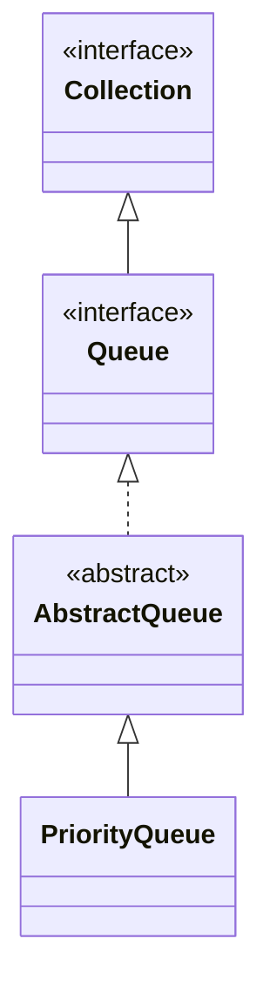

## Objective

Entender `PriorityQueue`, a implementação de `Queue` que ordena seus elementos por um comparator (ou ordenação natural) em vez da ordem de inserção — a cabeça é sempre o menor elemento por essa ordenação, apoiada internamente em um heap em vez de uma estrutura totalmente ordenada.

## Use Cases

- Agendar trabalho por prioridade — filas de tarefas, simulação de eventos, ou algoritmos de grafo como o caminho mais curto de Dijkstra.
- Recuperar repetidamente o menor elemento (ou, com um `Comparator` invertido, o maior) de forma eficiente.
- Computações de "top-k" em streaming, onde só o extremo atual importa, não uma lista totalmente ordenada.
- Plugar uma ordenação customizada em código escrito contra a interface genérica `Queue`.

## Deep Dive

### PriorityQueue estende AbstractQueue

```java
class PriorityQueue<E>
```

Sete construtores:

```java
PriorityQueue<Integer> a = new PriorityQueue<>();                              // capacity 11, natural ordering
PriorityQueue<Integer> b = new PriorityQueue<>(50);                            // capacity 50, natural ordering
PriorityQueue<Integer> c = new PriorityQueue<>(Comparator.reverseOrder());     // max-heap via custom comparator
PriorityQueue<Integer> d = new PriorityQueue<>(50, Comparator.reverseOrder()); // capacity + comparator
PriorityQueue<Integer> e = new PriorityQueue<>(List.of(3, 1, 2));              // from a Collection
```

A capacidade cresce automaticamente conforme elementos são adicionados, assim como em `ArrayList`.



### Ordenação padrão: um min-heap

Sem um `Comparator` explícito, a ordenação natural dos elementos se aplica, então o menor elemento está sempre na cabeça:

```java
PriorityQueue<Integer> pq = new PriorityQueue<>(List.of(5, 1, 3, 2, 4));
pq.poll(); // 1 — smallest first
pq.poll(); // 2
```

Um `Comparator` inverte ou substitui essa ordenação por completo — ex.: `Comparator.reverseOrder()` a transforma em um max-heap. `comparator()` retorna o comparator em uso, ou `null` se a ordenação natural se aplica.

### Veja acontecendo: poll() drenando em ordem de prioridade

Os mesmos cinco elementos de acima, na mesma ordem de chegada — isso mostra a ordem em que chamadas repetidas de `poll()` os devolvem, não o layout real do array interno do heap (que a próxima seção cobre):

```viz
type: formula
capacity = count
slot = rank(item)
---
5
1
3
2
4
```

### A ordem de iteração não é a ordem de prioridade

```java
PriorityQueue<Integer> pq = new PriorityQueue<>(List.of(5, 1, 3, 2, 4));
for (int x : pq) {
    System.out.print(x + " "); // NOT guaranteed to print 1 2 3 4 5
}
```

Para recuperar elementos em ordem de prioridade, chamadas repetidas de `poll()` (ou `remove()`) são necessárias — o `Iterator` percorre o array interno do heap na ordem em que ele está disposto, não em ordem de prioridade.

## Trade-offs

- **Um bug comum: iterar sobre a fila com um `for`-each esperando saída ordenada** — só `poll()`/`peek()` respeitam a ordenação; `Iterator` não:

  ```java
  PriorityQueue<Integer> pq = new PriorityQueue<>(List.of(3, 1, 2));
  List<Integer> viaIterator = new ArrayList<>(pq);        // heap order, unsorted
  List<Integer> viaPoll = new ArrayList<>();
  while (!pq.isEmpty()) viaPoll.add(pq.poll());            // [1, 2, 3] — actually sorted
  ```
- **`offer`/`poll`/`remove` são O(log n); `peek`/`element` são O(1)** — o heap só garante que a cabeça é o elemento extremo, não que o resto do array está ordenado, o que é o que torna inserção/remoção logarítmicas em vez do O(n log n) que uma ordenação completa custaria.
- **Os elementos precisam ser mutuamente comparáveis, ou um `Comparator` precisa ser fornecido** — assim como com `TreeSet`, uma falha de comparação aparece como `ClassCastException` no ponto em que uma operação de ordenação roda, não em tempo de compilação nem no momento da inserção isoladamente.
- **Elementos `null` são rejeitados de imediato** (`NullPointerException`), pelo mesmo motivo que `Queue` proíbe `null` em outros lugares: `null` dobra como sentinela de fila-vazia para `peek()`/`poll()`.

## Documentation Links

- *Java: The Complete Reference*, 12th Edition (Herbert Schildt) — Chapter 20, pp. 593–594 — book
- [PriorityQueue — Java SE 25 API](https://docs.oracle.com/en/java/javase/25/docs/api/java.base/java/util/PriorityQueue.html) — doc
- [Queue — Java SE 25 API](https://docs.oracle.com/en/java/javase/25/docs/api/java.base/java/util/Queue.html) — doc
