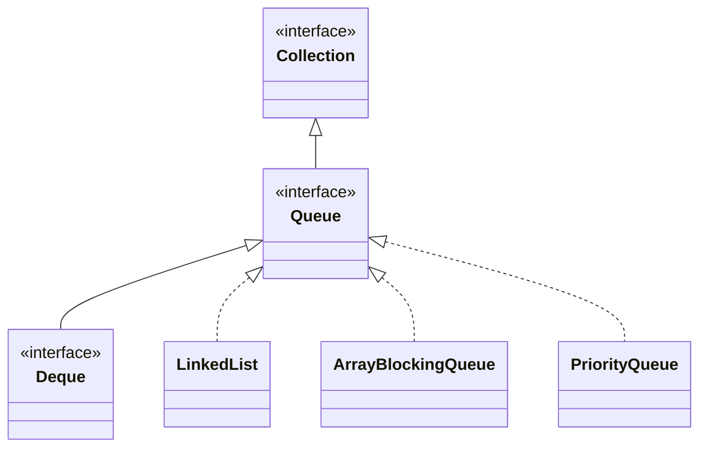

## Objective

Entender `Queue`: uma `Collection` que declara o comportamento de uma fila — frequentemente first-in, first-out, embora algumas implementações ordenem elementos por outros critérios (uma `PriorityQueue`, por exemplo, ordena por prioridade, não por ordem de chegada). `Queue` é construída em torno de dois pares de métodos paralelos: uma família lança exceção em caso de falha, a outra reporta a falha através de um valor de retorno.

## Use Cases

- Modelar uma fila de trabalho onde itens são processados na ordem em que chegam.
- Espiar o próximo item sem se comprometer a removê-lo, antes de decidir como tratá-lo.
- Trabalhar com uma fila limitada ou de tamanho fixo, onde "a fila está cheia" é uma condição esperada a ser tratada, não excepcional.
- Escolher entre uma operação que lança exceção em uma fila vazia e uma que retorna `null`, dependendo se "vazio" é um bug ou um estado normal para o chamador.
- Construir um pipeline de processamento ordenado por prioridade ou por outra ordenação customizada, ainda trabalhando contra o tipo genérico `Queue`.

## Deep Dive

### Queue estende Collection

```java
interface Queue<E>
```

`E` especifica o tipo de objetos que a fila vai conter. Vários dos métodos de `Queue` lançam `ClassCastException` quando um objeto é incompatível com os elementos já na fila, `NullPointerException` quando `null` não é permitido, e `IllegalArgumentException` se um argumento inválido é usado — o mesmo vocabulário de exceções que `Collection` usa em outros lugares.



### Adicionando: add() vs. offer()

`add()` (herdado de `Collection`) lança exceção se não conseguir adicionar o elemento. `offer()` é o método próprio de `Queue` para o mesmo trabalho, mas ele reporta a falha em vez de lançar exceção:

```java
Queue<Integer> q = new ArrayBlockingQueue<>(1); // fixed capacity: 1
q.add(10);          // true, added
q.add(20);           // IllegalStateException: queue full
```

```java
Queue<Integer> q = new ArrayBlockingQueue<>(1);
q.add(10);
boolean added = q.offer(20); // false — reports the failure instead of throwing
```

### Olhando sem remover: element() vs. peek()

Ambos retornam o elemento na cabeça da fila sem removê-lo. Eles diferem só em como tratam uma fila vazia:

```java
Queue<String> q = new LinkedList<>();
q.element(); // NoSuchElementException — queue is empty
q.peek();    // null — queue is empty
```

### Removendo: remove() vs. poll()

Ambos removem e retornam o elemento na cabeça da fila. A mesma divisão em relação a vazio:

```java
Queue<String> q = new LinkedList<>();
q.remove(); // NoSuchElementException — queue is empty
q.poll();   // null — queue is empty
```

### Escolhendo um par com base em como "vazio" ou "cheio" deve ser tratado

As duas famílias existem para que um chamador possa escolher o modo de falha que se encaixa na situação: `add()`/`remove()`/`element()` são apropriados quando uma fila vazia ou cheia é um bug que o chamador quer ver surgir imediatamente; `offer()`/`poll()`/`peek()` são apropriados quando é um resultado esperado sobre o qual o chamador vai ramificar.

```java
if (queue.offer(item)) {
    // handle success
} else {
    // queue full — handle without a try/catch
}
```

## Trade-offs

- **O par que lança exceção e o par que retorna null/false não são intercambiáveis** — trocar `element()`/`remove()` por `peek()`/`poll()` (ou vice-versa) muda como uma fila vazia é reportada, de uma exceção para um valor sentinela:

  ```java
  Queue<String> q = new LinkedList<>();
  q.element(); // NoSuchElementException
  q.peek();    // null
  ```
- **Uma fila de tamanho fixo faz add() lançar exceção onde offer() apenas reportaria false** — isso só aparece quando a fila é de fato limitada (ex.: `ArrayBlockingQueue`), não com uma ilimitada como `LinkedList`:

  ```java
  Queue<Integer> q = new ArrayBlockingQueue<>(1);
  q.add(1);
  q.add(2); // IllegalStateException: queue full
  ```
- **null dobra como o sentinela de "fila vazia" para peek()/poll()**, então uma fila que de fato armazenasse `null` como elemento tornaria "vazio" indistinguível de "cabeça é null". A maioria das implementações de `Queue` evita a ambiguidade proibindo `null` completamente:

  ```java
  Queue<String> q = new LinkedList<>();
  q.add(null); // NullPointerException — null elements are not allowed
  ```
- **FIFO é uma convenção que algumas implementações escolhem, não uma garantia que a própria `Queue` faz** — uma `PriorityQueue` implementa a mesma interface mas ordena elementos por prioridade em vez de ordem de inserção, então código que assume comportamento first-in-first-out estrito só pelo tipo `Queue` está assumindo mais do que a interface promete.

## Documentation Links

- [Queue — Java SE 25 API](https://docs.oracle.com/en/java/javase/25/docs/api/java.base/java/util/Queue.html) — doc
- [Collection — Java SE 25 API](https://docs.oracle.com/en/java/javase/25/docs/api/java.base/java/util/Collection.html) — doc
