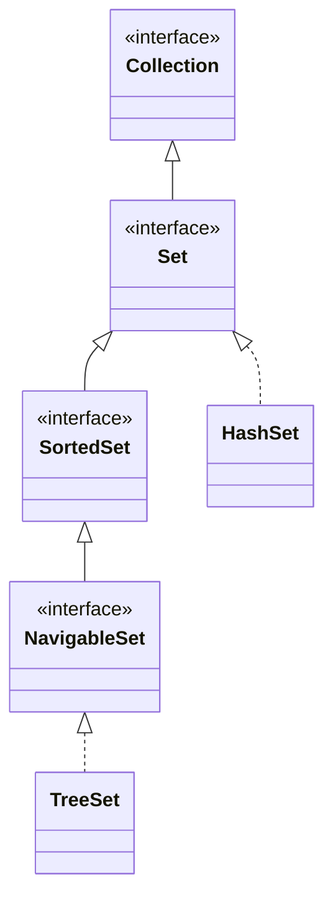

## Objective

Understand `Set` and the two interfaces that refine it: `Set` is a `Collection` that forbids duplicate elements; `SortedSet` adds ascending order on top of that; `NavigableSet` adds closest-match lookups (ceiling, floor, higher, lower) and range views on top of `SortedSet`.

## Use Cases

- Storing a group of values where membership is all that matters, and duplicates should be silently rejected rather than tracked.
- Building a small, fixed, unmodifiable set quickly with `Set.of()`.
- Keeping a collection in ascending order automatically, without a separate sort step (`SortedSet`).
- Getting the least or greatest element, or a whole range of elements, directly from the set instead of iterating (`SortedSet` / `NavigableSet`).
- Finding the closest match to a value that may not itself be in the set — the smallest element `>=` it, or the largest `<=` it (`NavigableSet`).
- Walking a set from greatest to least without maintaining a second, reverse-ordered structure (`NavigableSet.descendingSet()`).

## Deep Dive

### Set extends Collection: no duplicates

```java
interface Set<E>
```

`Set` declares no methods of its own beyond what `Collection` already has — the contract is entirely behavioral. `add()` returns `false`, instead of throwing, when the element is already present:



```java
Set<String> names = new HashSet<>();
names.add("Ann");    // true, added
names.add("Ann");    // false, already a member — not an error
```

### Unmodifiable sets: Set.of()

Beginning with JDK 9, `Set` includes the `of()` factory method, with the same 12 overloads as `List.of()` and `Collection.of()`-style factories (zero through ten arguments, plus varargs):

```java
Set<String> empty = Set.of();
Set<String> one   = Set.of("Ann");
Set<String> many  = Set.of("Ann", "Bob", "Cid");
```

Every version returns an unmodifiable, value-based set; `null` elements are not allowed.

### SortedSet: ascending order

```java
interface SortedSet<E>
```

A `SortedSet` keeps its elements sorted, either by their natural ordering or by a `Comparator` supplied when the set was created:

```java
SortedSet<Integer> nums = new TreeSet<>(List.of(5, 1, 3));
nums.comparator();   // null here — natural ordering is in use
nums.first();        // 1
nums.last();         // 5
```

`SortedSet.copyOf(Collection<? extends E> from)` returns an unmodifiable, value-based set with the same elements as `from`.

### SortedSet range views: headSet, subSet, tailSet

```java
SortedSet<Integer> nums = new TreeSet<>(List.of(1, 3, 5, 7, 9));
nums.headSet(5);     // [1, 3]        — elements < 5
nums.subSet(3, 7);   // [3, 5]        — elements >= 3 and < 7
nums.tailSet(5);     // [5, 7, 9]     — elements >= 5
```

Each of these returns a `SortedSet` backed by the invoking set over that range, not a copy.

### NavigableSet: closest-match lookups

```java
interface NavigableSet<E>
```

`NavigableSet` extends `SortedSet` and adds methods that search for the closest element to a given value, whether or not that exact value is present:

```java
NavigableSet<Integer> nums = new TreeSet<>(List.of(1, 3, 5, 7, 9));
nums.ceiling(4);    // 5 — smallest element >= 4
nums.floor(4);      // 3 — largest element <= 4
nums.higher(5);     // 7 — smallest element > 5
nums.lower(5);      // 3 — largest element < 5
```

Each returns `null` if no such element exists, instead of throwing.

### NavigableSet: destructive reads and reverse order

```java
nums.pollFirst();        // removes and returns the least element, or null if empty
nums.pollLast();         // removes and returns the greatest element, or null if empty
nums.descendingSet();    // a NavigableSet view, greatest to least, backed by nums
nums.descendingIterator(); // an Iterator that walks greatest to least
```

### NavigableSet range views with inclusive bounds

`NavigableSet` refines `headSet`/`subSet`/`tailSet` with an extra `boolean` per bound, controlling whether that boundary value itself is included:

```java
nums.headSet(5, true);          // elements < 5, plus 5 itself if present
nums.subSet(3, true, 7, false); // elements >= 3 (incl.) and < 7 (excl.)
nums.tailSet(5, false);         // elements > 5, excluding 5 itself
```

## Trade-offs

- **Set.of() rejects duplicate arguments outright** — unlike `List.of()`, passing the same value twice doesn't silently deduplicate; it fails as soon as the set is built:

  ```java
  Set<String> s = Set.of("a", "a"); // IllegalArgumentException: duplicate element
  ```
- **Unmodifiable sets throw at the call site, not silently** — as with `List.of()`, a mutator on a `Set.of()` result type-checks fine and only fails when it runs:

  ```java
  Set<String> fixed = Set.of("a", "b");
  fixed.add("c"); // UnsupportedOperationException
  ```
- **Range views are backed by the original set, in both directions** — `headSet`/`subSet`/`tailSet` on a `SortedSet` or `NavigableSet` share storage with the set they came from, so mutating one is visible through the other:

  ```java
  TreeSet<Integer> nums = new TreeSet<>(List.of(1, 3, 5, 7, 9));
  SortedSet<Integer> view = nums.headSet(5);
  view.remove(3);
  System.out.println(nums); // [1, 5, 7, 9] — removal through the view affected nums
  ```
- **Ordering assumes every element is mutually comparable, and nothing checks that up front** — a `TreeSet` accepts any `Object` at compile time (or via a `Comparator<? super E>`), so inserting an element that can't actually be compared to the others doesn't fail until an ordering operation forces the comparison, surfacing as a `ClassCastException` from `compareTo()` rather than from `Set` itself.

## Documentation Links

- [Set — Java SE 25 API](https://docs.oracle.com/en/java/javase/25/docs/api/java.base/java/util/Set.html) — doc
- [SortedSet — Java SE 25 API](https://docs.oracle.com/en/java/javase/25/docs/api/java.base/java/util/SortedSet.html) — doc
- [NavigableSet — Java SE 25 API](https://docs.oracle.com/en/java/javase/25/docs/api/java.base/java/util/NavigableSet.html) — doc
