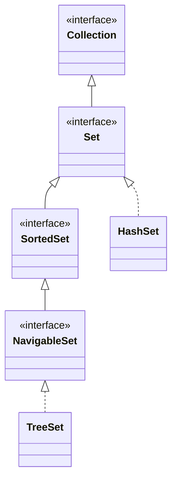

## Objective

Entender `Set` e as duas interfaces que a refinam: `Set` é uma `Collection` que proíbe elementos duplicados; `SortedSet` acrescenta ordem ascendente em cima disso; `NavigableSet` acrescenta buscas por correspondência mais próxima (ceiling, floor, higher, lower) e range views em cima de `SortedSet`.

## Use Cases

- Armazenar um grupo de valores onde só a associação (pertencer ou não ao conjunto) importa, e duplicatas devem ser silenciosamente rejeitadas em vez de rastreadas.
- Construir rapidamente um set pequeno, fixo e não modificável com `Set.of()`.
- Manter uma coleção em ordem ascendente automaticamente, sem uma etapa de ordenação separada (`SortedSet`).
- Obter o menor ou o maior elemento, ou um intervalo inteiro de elementos, diretamente do set em vez de iterar (`SortedSet` / `NavigableSet`).
- Encontrar a correspondência mais próxima de um valor que pode não estar presente no set — o menor elemento `>=` a ele, ou o maior `<=` a ele (`NavigableSet`).
- Percorrer um set do maior para o menor sem manter uma segunda estrutura em ordem reversa (`NavigableSet.descendingSet()`).

## Deep Dive

### Set estende Collection: sem duplicatas

```java
interface Set<E>
```

`Set` não declara nenhum método próprio além do que `Collection` já tem — o contrato é inteiramente comportamental. `add()` retorna `false`, em vez de lançar exceção, quando o elemento já está presente:



```java
Set<String> names = new HashSet<>();
names.add("Ann");    // true, added
names.add("Ann");    // false, already a member — not an error
```

### Sets não modificáveis: Set.of()

A partir do JDK 9, `Set` inclui o método factory `of()`, com as mesmas 12 sobrecargas no estilo de `List.of()` e `Collection.of()` (de zero a dez argumentos, mais varargs):

```java
Set<String> empty = Set.of();
Set<String> one   = Set.of("Ann");
Set<String> many  = Set.of("Ann", "Bob", "Cid");
```

Toda versão retorna um set não modificável, baseado em valor; elementos `null` não são permitidos.

### SortedSet: ordem ascendente

```java
interface SortedSet<E>
```

Um `SortedSet` mantém seus elementos ordenados, seja pela ordenação natural deles ou por um `Comparator` fornecido na criação do set:

```java
SortedSet<Integer> nums = new TreeSet<>(List.of(5, 1, 3));
nums.comparator();   // null here — natural ordering is in use
nums.first();        // 1
nums.last();         // 5
```

`SortedSet.copyOf(Collection<? extends E> from)` retorna um set não modificável, baseado em valor, com os mesmos elementos de `from`.

### Range views de SortedSet: headSet, subSet, tailSet

```java
SortedSet<Integer> nums = new TreeSet<>(List.of(1, 3, 5, 7, 9));
nums.headSet(5);     // [1, 3]        — elements < 5
nums.subSet(3, 7);   // [3, 5]        — elements >= 3 and < 7
nums.tailSet(5);     // [5, 7, 9]     — elements >= 5
```

Cada um desses métodos retorna um `SortedSet` apoiado no set que o invocou sobre aquele intervalo, não uma cópia.

### NavigableSet: buscas por correspondência mais próxima

```java
interface NavigableSet<E>
```

`NavigableSet` estende `SortedSet` e adiciona métodos que buscam o elemento mais próximo de um dado valor, esteja ou não esse valor exato presente:

```java
NavigableSet<Integer> nums = new TreeSet<>(List.of(1, 3, 5, 7, 9));
nums.ceiling(4);    // 5 — smallest element >= 4
nums.floor(4);      // 3 — largest element <= 4
nums.higher(5);     // 7 — smallest element > 5
nums.lower(5);      // 3 — largest element < 5
```

Cada um retorna `null` se não existir tal elemento, em vez de lançar exceção.

### NavigableSet: leituras destrutivas e ordem reversa

```java
nums.pollFirst();        // removes and returns the least element, or null if empty
nums.pollLast();         // removes and returns the greatest element, or null if empty
nums.descendingSet();    // a NavigableSet view, greatest to least, backed by nums
nums.descendingIterator(); // an Iterator that walks greatest to least
```

### Range views de NavigableSet com limites inclusivos

`NavigableSet` refina `headSet`/`subSet`/`tailSet` com um `boolean` extra por limite, controlando se o próprio valor-limite está incluído:

```java
nums.headSet(5, true);          // elements < 5, plus 5 itself if present
nums.subSet(3, true, 7, false); // elements >= 3 (incl.) and < 7 (excl.)
nums.tailSet(5, false);         // elements > 5, excluding 5 itself
```

## Trade-offs

- **Set.of() rejeita argumentos duplicados diretamente** — diferente de `List.of()`, passar o mesmo valor duas vezes não deduplica silenciosamente; falha assim que o set é construído:

  ```java
  Set<String> s = Set.of("a", "a"); // IllegalArgumentException: duplicate element
  ```
- **Sets não modificáveis lançam exceção no ponto de chamada, não silenciosamente** — assim como com `List.of()`, um mutador sobre um resultado de `Set.of()` compila normalmente e só falha quando é executado:

  ```java
  Set<String> fixed = Set.of("a", "b");
  fixed.add("c"); // UnsupportedOperationException
  ```
- **Range views são apoiadas no set original, nos dois sentidos** — `headSet`/`subSet`/`tailSet` sobre um `SortedSet` ou `NavigableSet` compartilham armazenamento com o set de onde vieram, então mutar um é visível através do outro:

  ```java
  TreeSet<Integer> nums = new TreeSet<>(List.of(1, 3, 5, 7, 9));
  SortedSet<Integer> view = nums.headSet(5);
  view.remove(3);
  System.out.println(nums); // [1, 5, 7, 9] — removal through the view affected nums
  ```
- **A ordenação assume que todo elemento é mutuamente comparável, e nada verifica isso de antemão** — um `TreeSet` aceita qualquer `Object` em tempo de compilação (ou via um `Comparator<? super E>`), então inserir um elemento que não pode de fato ser comparado aos outros só falha quando uma operação de ordenação força a comparação, surgindo como um `ClassCastException` vindo de `compareTo()`, e não do próprio `Set`.

## Documentation Links

- [Set — Java SE 25 API](https://docs.oracle.com/en/java/javase/25/docs/api/java.base/java/util/Set.html) — doc
- [SortedSet — Java SE 25 API](https://docs.oracle.com/en/java/javase/25/docs/api/java.base/java/util/SortedSet.html) — doc
- [NavigableSet — Java SE 25 API](https://docs.oracle.com/en/java/javase/25/docs/api/java.base/java/util/NavigableSet.html) — doc
