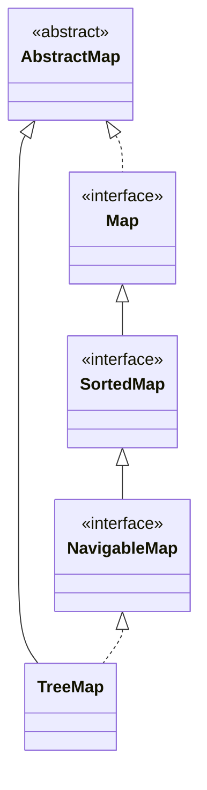

## Objective

Understand `TreeMap`, the `NavigableMap` implementation backed by a tree structure: keys are kept in ascending order automatically, by natural ordering or a supplied `Comparator`, in exchange for logarithmic rather than constant-time operations.

## Use Cases

- Needing keys always in sorted order for iteration or display, without a separate sort step after every `put`.
- Retrieving the first/last key, or a whole sorted range of entries, directly rather than scanning.
- Closest-match lookups (smallest key ≥ x, largest key ≤ x) via the `NavigableMap` methods (`ceilingKey`, `floorKey`, `higherKey`, `lowerKey`).
- Producing a deduplicated *and* key-sorted view of arbitrary input in one structure.

## Deep Dive

### TreeMap extends AbstractMap, implements NavigableMap

```java
class TreeMap<K, V>
```

Four constructors:

```java
TreeMap<String, Double> a = new TreeMap<>();                            // natural key ordering
TreeMap<String, Double> b = new TreeMap<>(Comparator.reverseOrder());   // custom ordering
TreeMap<String, Double> c = new TreeMap<>(existingMap);                 // from a Map, natural ordering
TreeMap<String, Double> d = new TreeMap<>(existingSortedMap);           // from a SortedMap, same ordering as sm
```

`TreeMap` adds no methods beyond `NavigableMap`/`AbstractMap`.



### Ascending key order is automatic

```java
TreeMap<String, Double> tm = new TreeMap<>();
tm.put("John Doe", 3434.34);
tm.put("Tom Smith", 123.22);
tm.put("Jane Baker", 1378.00);
tm.put("Tod Hall", 99.22);
tm.put("Ralph Smith", -19.08);

for (Map.Entry<String, Double> me : tm.entrySet()) {
    System.out.print(me.getKey() + ": ");
    System.out.println(me.getValue());
}
// Jane Baker: 1378.0
// John Doe: 3434.34
// Ralph Smith: -19.08
// Tod Hall: 99.22
// Tom Smith: 123.22
```

Notice the keys come out sorted by first name — `String`'s natural (lexicographic) order — regardless of the order they were `put`. Supplying a `Comparator` at construction changes what "sorted" means without touching any calling code.

### Watch it happen: put() landing keys in sorted position

Same five keys, same arrival order as above — each `put()` lands directly at its final ascending-order slot, not at the end like a `LinkedHashMap` would:

```viz
type: formula
capacity = count
slot = rank(item)
---
John Doe
Tom Smith
Jane Baker
Tod Hall
Ralph Smith
```

Slot 0 is the smallest key across the *whole* map, not the first one `put` — the same guarantee `TreeSet` gives for elements.

### Range and closest-key queries via NavigableMap

```java
tm.firstKey();           // "Jane Baker" — smallest key
tm.lastKey();             // "Tom Smith" — largest key
tm.headMap("John Doe");   // keys strictly < "John Doe", as a live view
tm.ceilingKey("Joe");     // smallest key >= "Joe" -> "John Doe"
```

`headMap`/`tailMap`/`subMap` return live `NavigableMap` views backed by `tm`, not copies — same relationship `TreeSet`'s `headSet`/`tailSet`/`subSet` has to its own tree.

## Trade-offs

- **O(log n) operations, not O(1)** — `get`/`put`/`remove` walk the tree to maintain sorted order, so a `TreeMap` is consistently slower than a `HashMap` for plain key lookup; pay that cost only when the ordering is actually used.
- **Key equality is decided by `compareTo()` (or the supplied `Comparator`), not by `equals()`/`hashCode()`** — two keys the ordering considers equal (`compareTo() == 0`) are treated as the *same* key even if `equals()` would say otherwise, so the second `put` overwrites the first instead of adding a new entry:

  ```java
  record Item(String name, int rank) {}
  Comparator<Item> byRank = Comparator.comparingInt(Item::rank);
  TreeMap<Item, String> tm = new TreeMap<>(byRank);
  tm.put(new Item("a", 1), "first");
  tm.put(new Item("b", 1), "second"); // same rank -> overwrites "first", not a new entry
  System.out.println(tm.size()); // 1
  ```
- **Keys must be mutually comparable, and nothing enforces that at compile time when no `Comparator` is supplied** — inserting a key that can't actually be compared to the others compiles fine and fails at the point a comparison is forced, as a `ClassCastException` thrown from `compareTo()`, not from `TreeMap` itself.
- **A `null` key throws immediately under natural ordering** — unlike `HashMap`, which allows one `null` key, `TreeMap.put(null, v)` throws `NullPointerException` unless the supplied `Comparator` explicitly handles `null` (e.g. via `Comparator.nullsFirst`).

## Documentation Links

- *Java: The Complete Reference*, 12th Edition (Herbert Schildt) — Chapter 20, pp. 614–615 — book
- [TreeMap — Java SE 25 API](https://docs.oracle.com/en/java/javase/25/docs/api/java.base/java/util/TreeMap.html) — doc
- [NavigableMap — Java SE 25 API](https://docs.oracle.com/en/java/javase/25/docs/api/java.base/java/util/NavigableMap.html) — doc
