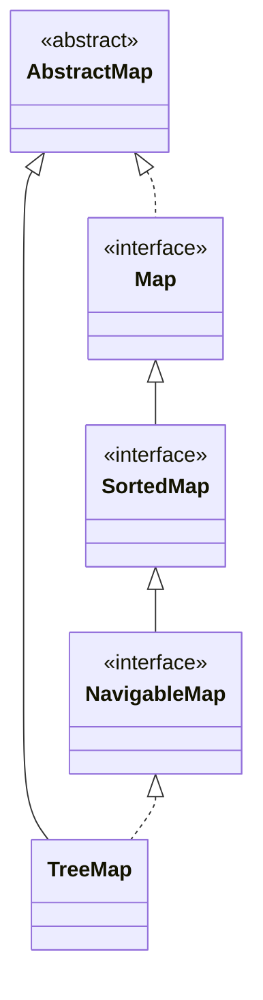
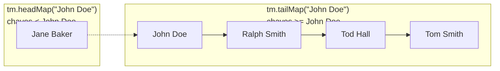
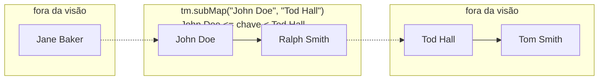

## Objective

Entender o `TreeMap`, a implementação de `NavigableMap` baseada em uma estrutura de árvore: as chaves são mantidas em ordem ascendente automaticamente, pela ordenação natural ou por um `Comparator` fornecido, em troca de operações logarítmicas em vez de tempo constante.

## Use Cases

- Precisar de chaves sempre em ordem ordenada para iteração ou exibição, sem uma etapa de ordenação separada depois de cada `put`.
- Recuperar a primeira/última chave, ou um intervalo inteiro de entradas ordenadas, diretamente em vez de varrer a coleção.
- Buscas por correspondência mais próxima (menor chave ≥ x, maior chave ≤ x) via os métodos de `NavigableMap` (`ceilingKey`, `floorKey`, `higherKey`, `lowerKey`).
- Produzir uma visão deduplicada *e* ordenada por chave de uma entrada arbitrária em uma única estrutura.

## Deep Dive

### TreeMap estende AbstractMap, implementa NavigableMap

```java
class TreeMap<K, V>
```

Quatro construtores:

```java
TreeMap<String, Double> a = new TreeMap<>();                            // ordenação natural das chaves
TreeMap<String, Double> b = new TreeMap<>(Comparator.reverseOrder());   // ordenação customizada
TreeMap<String, Double> c = new TreeMap<>(existingMap);                 // a partir de um Map, ordenação natural
TreeMap<String, Double> d = new TreeMap<>(existingSortedMap);           // a partir de um SortedMap, mesma ordenação de sm
```

`TreeMap` não adiciona métodos além dos de `NavigableMap`/`AbstractMap`.



### A ordem ascendente das chaves é automática

```java
TreeMap<String, Double> tm = new TreeMap<>();
tm.put("John Doe", 3434.34);
tm.put("Tom Smith", 123.22);
tm.put("Jane Baker", 1378.00);
tm.put("Tod Hall", 99.22);
tm.put("Ralph Smith", -19.08);

for (Map.Entry<String, Double> me : tm.entrySet()) {
    System.out.print(me.getKey() + ": ");
    System.out.println(me.getValue());
}
// Jane Baker: 1378.0
// John Doe: 3434.34
// Ralph Smith: -19.08
// Tod Hall: 99.22
// Tom Smith: 123.22
```

Note que as chaves saem ordenadas pelo primeiro nome — a ordem natural (lexicográfica) de `String` — independentemente da ordem em que foram inseridas com `put`. Fornecer um `Comparator` na construção muda o que "ordenado" significa sem tocar em nenhum código que consome o mapa.

### Observe acontecendo: put() posicionando chaves em posição ordenada

As mesmas cinco chaves, na mesma ordem de chegada de antes — cada `put()` cai diretamente em sua posição final em ordem ascendente, não no final como um `LinkedHashMap` faria:

```viz
type: formula
capacity = count
slot = rank(item)
---
John Doe
Tom Smith
Jane Baker
Tod Hall
Ralph Smith
```

O slot 0 é a menor chave de todo o mapa, não a primeira inserida com `put` — a mesma garantia que `TreeSet` dá para elementos.

### Consultas de intervalo e de chave mais próxima via NavigableMap

```java
tm.firstKey();           // "Jane Baker" — menor chave
tm.lastKey();             // "Tom Smith" — maior chave
tm.headMap("John Doe");   // chaves estritamente < "John Doe", como uma visão ao vivo
tm.ceilingKey("Joe");     // menor chave >= "Joe" -> "John Doe"
```

`headMap`/`tailMap`/`subMap` retornam visões `NavigableMap` ao vivo apoiadas em `tm`, não cópias — a mesma relação que `headSet`/`tailSet`/`subSet` de `TreeSet` têm com sua própria árvore.

### headMap, tailMap, subMap: janelas ao vivo sobre o intervalo

Os três métodos de visão por intervalo diferem apenas em qual fatia das chaves ordenadas expõem — os três continuam apoiados no mesmo `tm`:

```java
tm.headMap("John Doe");                   // {Jane Baker=1378.0}
tm.tailMap("John Doe");                   // {John Doe=3434.34, Ralph Smith=-19.08, Tod Hall=99.22, Tom Smith=123.22}
tm.subMap("John Doe", "Tod Hall");        // {John Doe=3434.34, Ralph Smith=-19.08}
```

- `headMap(toKey)` — chaves estritamente **menores que** `toKey`.
- `tailMap(fromKey)` — chaves **maiores ou iguais a** `fromKey`.
- `subMap(fromKey, toKey)` — chaves **maiores ou iguais a** `fromKey` **e menores que** `toKey` (`fromKey` inclusivo, `toKey` exclusivo — a mesma convenção que `List.subList` usa).





"Ao vivo" significa que uma escrita feita por qualquer um dos lados fica visível no outro, já que a visão e `tm` compartilham os mesmos nós da árvore:

```java
SortedMap<String, Double> sub = tm.subMap("John Doe", "Tod Hall");

sub.put("Ralph Smith", 500.00);            // chave já dentro de [John Doe, Tod Hall)
System.out.println(tm.get("Ralph Smith")); // 500.0 -- escrita via sub chegou a tm

tm.put("Judy", 42.0);                      // "Judy" também cai dentro de [John Doe, Tod Hall)
System.out.println(sub);                   // {John Doe=3434.34, Judy=42.0, Ralph Smith=-19.08} -- escrita via tm chegou a sub
```

A visão ainda assim impõe seus próprios limites nas escritas — inserir uma chave fora de `[fromKey, toKey)` através da visão lança exceção, mesmo que o `put` idêntico diretamente em `tm` funcionasse normalmente:

```java
sub.put("Zoe", 1.0);   // "Zoe" >= "Tod Hall" -> fora de [John Doe, Tod Hall)
// IllegalArgumentException: key out of range
```

## Trade-offs

- **Operações O(log n), não O(1)** — `get`/`put`/`remove` percorrem a árvore para manter a ordenação, então um `TreeMap` é consistentemente mais lento que um `HashMap` para uma simples busca por chave; pague esse custo apenas quando a ordenação realmente for usada.
- **A igualdade de chaves é decidida por `compareTo()` (ou pelo `Comparator` fornecido), não por `equals()`/`hashCode()`** — duas chaves que a ordenação considera iguais (`compareTo() == 0`) são tratadas como a *mesma* chave mesmo que `equals()` dissesse o contrário, então o segundo `put` sobrescreve o primeiro em vez de adicionar uma nova entrada:

  ```java
  record Item(String name, int rank) {}
  Comparator<Item> byRank = Comparator.comparingInt(Item::rank);
  TreeMap<Item, String> tm = new TreeMap<>(byRank);
  tm.put(new Item("a", 1), "first");
  tm.put(new Item("b", 1), "second"); // mesmo rank -> sobrescreve "first", não é uma nova entrada
  System.out.println(tm.size()); // 1
  ```
- **As chaves precisam ser mutuamente comparáveis, e nada garante isso em tempo de compilação quando nenhum `Comparator` é fornecido** — inserir uma chave que na verdade não pode ser comparada às outras compila normalmente e falha no momento em que uma comparação é forçada, como uma `ClassCastException` lançada de dentro de `compareTo()`, não do próprio `TreeMap`.
- **Uma chave `null` lança exceção imediatamente sob ordenação natural** — diferente de `HashMap`, que permite uma chave `null`, `TreeMap.put(null, v)` lança `NullPointerException` a menos que o `Comparator` fornecido trate `null` explicitamente (por exemplo, via `Comparator.nullsFirst`).

## Documentation Links

- *Java: The Complete Reference*, 12th Edition (Herbert Schildt) — Chapter 20, pp. 614–615 — book
- [TreeMap — Java SE 25 API](https://docs.oracle.com/en/java/javase/25/docs/api/java.base/java/util/TreeMap.html) — doc
- [NavigableMap — Java SE 25 API](https://docs.oracle.com/en/java/javase/25/docs/api/java.base/java/util/NavigableMap.html) — doc
