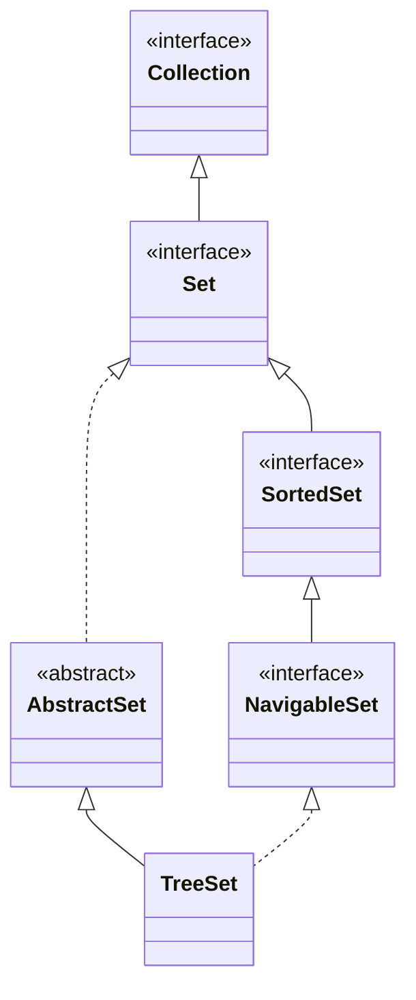

## Objective

Understand `TreeSet`, the `NavigableSet` implementation backed by a tree structure: elements are kept in ascending order automatically, by natural ordering or a supplied `Comparator`, in exchange for logarithmic rather than constant-time operations.

## Use Cases

- Needing elements to always be in sorted order without a separate sort step after every insert.
- Retrieving the minimum/maximum element, or a whole sorted range, directly rather than scanning.
- Closest-match lookups (smallest ≥ x, largest ≤ x) via the `NavigableSet` methods — see the Set interface concept for the full `ceiling`/`floor`/`higher`/`lower` breakdown.
- Producing a deduplicated *and* sorted view of arbitrary input in one structure.

## Deep Dive

### TreeSet extends AbstractSet, implements NavigableSet

```java
class TreeSet<E>
```

Four constructors:

```java
TreeSet<String> a = new TreeSet<>();                          // natural ordering
TreeSet<String> b = new TreeSet<>(List.of("C", "A", "B"));    // from a collection, natural ordering
TreeSet<String> c = new TreeSet<>(Comparator.reverseOrder());  // custom ordering
TreeSet<String> d = new TreeSet<>((SortedSet<String>) someSortedSet);
```



### Ascending order is automatic

```java
TreeSet<String> ts = new TreeSet<>();
ts.add("C"); ts.add("A"); ts.add("B"); ts.add("E"); ts.add("F"); ts.add("D");
System.out.println(ts); // [A, B, C, D, E, F] — sorted, regardless of insertion order
```

### Watch it happen: add() landing in sorted position

Same six elements, same arrival order as above — each `add()` lands directly at its final ascending-order slot, not at the end like a plain `ArrayList` would:

```viz
type: formula
capacity = count
slot = rank(item)
---
C
A
B
E
F
D
```

Slot 0 is the smallest element seen across the *whole* set, not the first one added — that's the difference between `NavigableSet`'s ordering guarantee and a `LinkedHashSet`'s insertion order.

### Range queries via NavigableSet

```java
ts.subSet("C", "F"); // [C, D, E] — >= C, < F
```

`subSet`/`headSet`/`tailSet` return a live `NavigableSet` view backed by `ts`, not a copy — see the Set interface concept for the inclusive-bound overloads and the closest-match methods (`ceiling`, `floor`, `higher`, `lower`).

## Trade-offs

- **O(log n) operations, not O(1)** — `add`/`remove`/`contains` walk the tree to maintain sorted order, so a `TreeSet` is consistently slower than a `HashSet` for plain membership testing; pay that cost only when the ordering is actually used.
- **Uniqueness is decided by `compareTo()` (or the supplied `Comparator`), not by `equals()`/`hashCode()`** — two elements the ordering considers equal (`compareTo() == 0`) are treated as duplicates even if `equals()` would say otherwise:

  ```java
  record Item(String name, int rank) {}
  Comparator<Item> byRank = Comparator.comparingInt(Item::rank);
  TreeSet<Item> ts = new TreeSet<>(byRank);
  ts.add(new Item("a", 1));
  ts.add(new Item("b", 1));  // rejected — compareTo() says rank 1 == rank 1, even though not equals()
  System.out.println(ts.size()); // 1
  ```
- **Elements must be mutually comparable, and nothing enforces that at compile time when no `Comparator` is supplied** — inserting an object that can't actually be compared to the others compiles fine and fails at the point a comparison is forced, as a `ClassCastException` thrown from `compareTo()`, not from `TreeSet` itself.

## Documentation Links

- *Java: The Complete Reference*, 12th Edition (Herbert Schildt) — Chapter 20, pp. 592–593 — book
- [TreeSet — Java SE 25 API](https://docs.oracle.com/en/java/javase/25/docs/api/java.base/java/util/TreeSet.html) — doc
- [NavigableSet — Java SE 25 API](https://docs.oracle.com/en/java/javase/25/docs/api/java.base/java/util/NavigableSet.html) — doc
