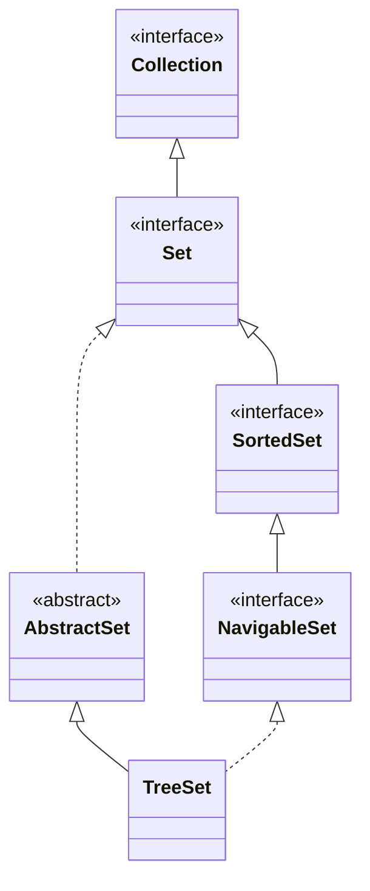

## Objective

Entender `TreeSet`, a implementação de `NavigableSet` apoiada em uma estrutura de árvore: os elementos são mantidos em ordem crescente automaticamente, pela ordenação natural ou por um `Comparator` fornecido, em troca de operações logarítmicas em vez de tempo constante.

## Use Cases

- Precisar que os elementos estejam sempre em ordem, sem uma etapa de ordenação separada depois de cada inserção.
- Recuperar o elemento mínimo/máximo, ou um intervalo ordenado inteiro, diretamente em vez de varrer a coleção.
- Buscas por correspondência mais próxima (o menor ≥ x, o maior ≤ x) via os métodos de `NavigableSet` — veja o conceito da interface Set para o detalhamento completo de `ceiling`/`floor`/`higher`/`lower`.
- Produzir uma view deduplicada *e* ordenada de uma entrada arbitrária em uma única estrutura.

## Deep Dive

### TreeSet estende AbstractSet, implementa NavigableSet

```java
class TreeSet<E>
```

Quatro construtores:

```java
TreeSet<String> a = new TreeSet<>();                          // natural ordering
TreeSet<String> b = new TreeSet<>(List.of("C", "A", "B"));    // from a collection, natural ordering
TreeSet<String> c = new TreeSet<>(Comparator.reverseOrder());  // custom ordering
TreeSet<String> d = new TreeSet<>((SortedSet<String>) someSortedSet);
```



### A ordem crescente é automática

```java
TreeSet<String> ts = new TreeSet<>();
ts.add("C"); ts.add("A"); ts.add("B"); ts.add("E"); ts.add("F"); ts.add("D");
System.out.println(ts); // [A, B, C, D, E, F] — sorted, regardless of insertion order
```

### Veja acontecendo: add() caindo na posição ordenada

Os mesmos seis elementos, na mesma ordem de chegada de acima — cada `add()` cai diretamente em sua posição final na ordem crescente, não no final como faria um `ArrayList` comum:

```viz
type: formula
capacity = count
slot = rank(item)
---
C
A
B
E
F
D
```

O slot 0 é o menor elemento visto em *todo* o conjunto, não o primeiro a ser adicionado — essa é a diferença entre a garantia de ordenação do `NavigableSet` e a ordem de inserção de um `LinkedHashSet`.

### Consultas por intervalo via NavigableSet

```java
ts.subSet("C", "F"); // [C, D, E] — >= C, < F
```

`subSet`/`headSet`/`tailSet` retornam uma view `NavigableSet` viva, apoiada em `ts`, não uma cópia — veja o conceito da interface Set para as sobrecargas com limite inclusivo e os métodos de correspondência mais próxima (`ceiling`, `floor`, `higher`, `lower`).

## Trade-offs

- **Operações O(log n), não O(1)** — `add`/`remove`/`contains` percorrem a árvore para manter a ordem, então um `TreeSet` é consistentemente mais lento que um `HashSet` para simples teste de pertencimento; pague esse custo só quando a ordenação for de fato utilizada.
- **A unicidade é decidida por `compareTo()` (ou pelo `Comparator` fornecido), não por `equals()`/`hashCode()`** — dois elementos que a ordenação considera iguais (`compareTo() == 0`) são tratados como duplicados mesmo que `equals()` dissesse o contrário:

  ```java
  record Item(String name, int rank) {}
  Comparator<Item> byRank = Comparator.comparingInt(Item::rank);
  TreeSet<Item> ts = new TreeSet<>(byRank);
  ts.add(new Item("a", 1));
  ts.add(new Item("b", 1));  // rejected — compareTo() says rank 1 == rank 1, even though not equals()
  System.out.println(ts.size()); // 1
  ```
- **Os elementos precisam ser mutuamente comparáveis, e nada garante isso em tempo de compilação quando nenhum `Comparator` é fornecido** — inserir um objeto que na verdade não pode ser comparado aos demais compila sem problemas e falha só no ponto em que uma comparação é forçada, como um `ClassCastException` lançado de dentro de `compareTo()`, não do próprio `TreeSet`.

## Documentation Links

- *Java: The Complete Reference*, 12th Edition (Herbert Schildt) — Chapter 20, pp. 592–593 — book
- [TreeSet — Java SE 25 API](https://docs.oracle.com/en/java/javase/25/docs/api/java.base/java/util/TreeSet.html) — doc
- [NavigableSet — Java SE 25 API](https://docs.oracle.com/en/java/javase/25/docs/api/java.base/java/util/NavigableSet.html) — doc
