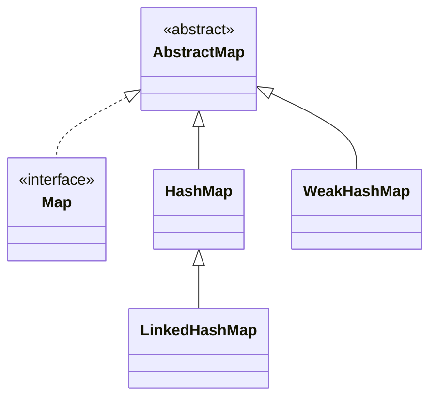
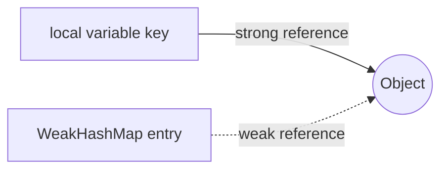
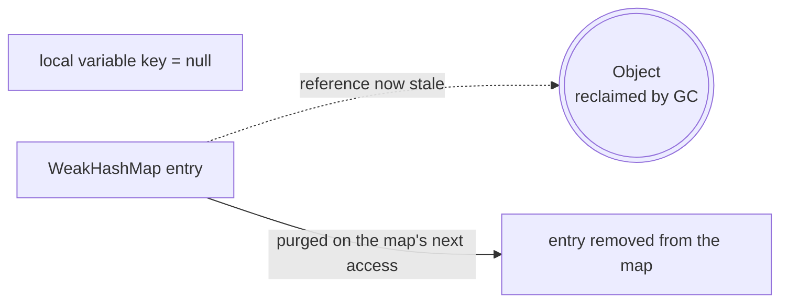

## Objective

Understand `WeakHashMap`, the `AbstractMap` implementation that stores each key inside a `WeakReference` instead of holding it directly: once nothing outside the map keeps a strong reference to a key, the JVM is free to reclaim it, and the map removes that entry on its own — trading a normal `Map`'s guarantee that a key survives as long as it's in the map for automatic cleanup once nothing else needs the key.

## Use Cases

- Per-object metadata or computed properties (framework internals attaching extra state to an application object) that should disappear the moment the object itself becomes unreachable, without an explicit "unregister" call.
- Listener/observer registries that shouldn't be the reason a listener outlives whatever registered it.
- `Class`-keyed caches (frameworks associating data with a `Class<?>`) so a cache entry doesn't pin its classloader in memory after everything else using that class is gone.
- **Not** a general-purpose size/TTL-bounded cache — a `WeakHashMap` only reacts to key reachability, never to memory pressure; that job belongs to `SoftReference`-based caching instead.

## Deep Dive

### WeakHashMap extends AbstractMap, implements Map

```java
class WeakHashMap<K, V>
```

Four constructors, mirroring `HashMap`'s:

```java
WeakHashMap<Object, String> a = new WeakHashMap<>();               // default capacity 16, load factor 0.75
WeakHashMap<Object, String> b = new WeakHashMap<>(existingMap);    // initialized from another Map
WeakHashMap<Object, String> c = new WeakHashMap<>(64);              // initial capacity 64
WeakHashMap<Object, String> d = new WeakHashMap<>(64, 0.5f);        // capacity 64, load factor 0.5
```

`WeakHashMap` sits next to `HashMap` under `AbstractMap`, not underneath it — unlike `LinkedHashMap`, it is not a `HashMap` subclass, even though both use a hash table internally:



### Each key lives inside a WeakReference, not as a plain field

Internally, every entry holds its key through a `WeakReference<K>` registered against the map's own `ReferenceQueue`. As long as something outside the map keeps a strong reference to the key, the entry behaves exactly like a `HashMap` entry. The moment that last strong reference goes away, the key becomes eligible for collection independently of the map holding it:

```java
Map<Object, String> registry = new WeakHashMap<>();

Object key = new Object();
registry.put(key, "metadata");
System.out.println(registry.size()); // 1

key = null;   // drop the only external strong reference to the key
System.gc();  // request a collection — not a hard guarantee, but reliable enough to observe here

System.out.println(registry.size()); // very likely 0 now
```





### Cleanup piggybacks on later map operations, not on the GC itself

The GC clears the `WeakReference` and enqueues it on the map's `ReferenceQueue`, but the *entry* isn't removed at that instant — nothing is watching the queue in the background. Removal happens lazily, the next time almost any map operation runs, because most of them call an internal `expungeStaleEntries()` first:

```java
Map<Object, String> registry = new WeakHashMap<>();
Object key = new Object();
registry.put(key, "metadata");
key = null;
System.gc();

// size() itself triggers the expunge pass before it counts, so this already reflects the collected key:
System.out.println(registry.size()); // very likely 0

// isEmpty(), get(), put(), containsKey(), keySet()/entrySet() iteration all trigger the same pass —
// but nothing purges stale entries on its own between calls, so a WeakHashMap that is never touched
// again can sit holding cleared-but-not-yet-removed entries indefinitely.
```

## Trade-offs

- **No guarantee of exactly *when* an entry disappears** — cleanup depends on GC timing plus a later map operation triggering the expunge pass, so `size()`/iteration can briefly lag behind actual key reachability; never rely on the count for correctness-critical logic, only as a memory-management convenience.
- **A value that strongly references its own key (directly or transitively) defeats the whole mechanism** — the map's value slot is an ordinary strong reference, so if the value keeps the key reachable, the entry can never become eligible for collection:

  ```java
  Map<Object, Object> m = new WeakHashMap<>();
  Object key = new Object();
  m.put(key, key);   // value == key -> the map itself now strongly holds the key via the value field
  key = null;
  System.gc();
  System.out.println(m.size()); // still 1 -- the entry leaks for as long as the map exists
  ```
- **Canonical/interned keys never get collected, silently defeating the point** — a `String` literal, a cached boxed `Integer` in `Integer.valueOf`'s range, or an `enum` constant is already held strongly elsewhere (the string pool, the JVM's boxing cache, the enum's own static fields), so wrapping it in a `WeakHashMap` key buys nothing:

  ```java
  Map<String, String> cache = new WeakHashMap<>();
  cache.put("hello", "cached value");  // "hello" is interned -> permanently strongly reachable
  System.gc();
  System.out.println(cache.size()); // 1, forever -- the string pool keeps the key alive
  ```
- **Not synchronized, and allows one `null` key** — same caveat as `HashMap`; concurrent access needs external synchronization or a different structure.

## Documentation Links

- *Java: The Complete Reference*, 12th Edition (Herbert Schildt) — Chapter 20, p. 612 — book
- [WeakHashMap — Java SE 25 API](https://docs.oracle.com/en/java/javase/25/docs/api/java.base/java/util/WeakHashMap.html) — doc
- [WeakReference — java.lang.ref](https://docs.oracle.com/en/java/javase/25/docs/api/java.base/java/lang/ref/WeakReference.html) — doc
- [Map — Java SE 25 API](https://docs.oracle.com/en/java/javase/25/docs/api/java.base/java/util/Map.html) — doc
