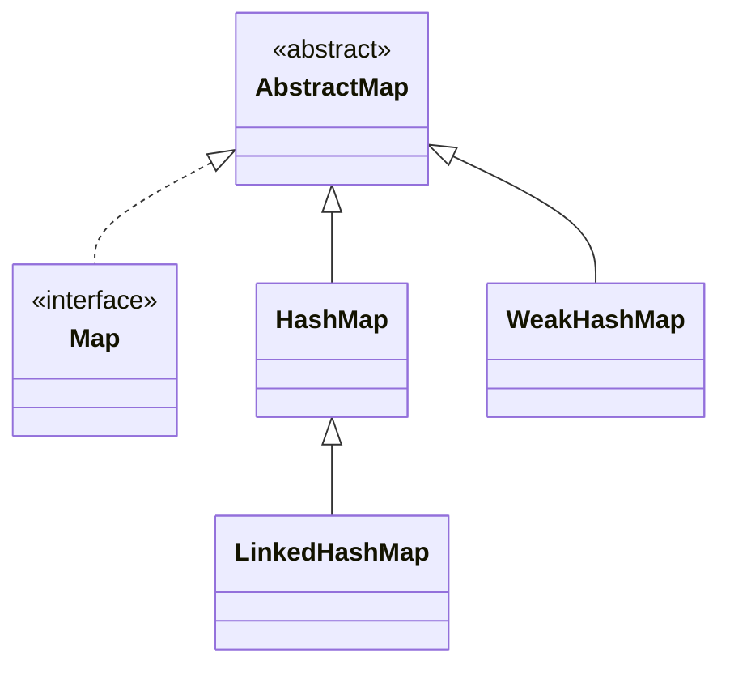
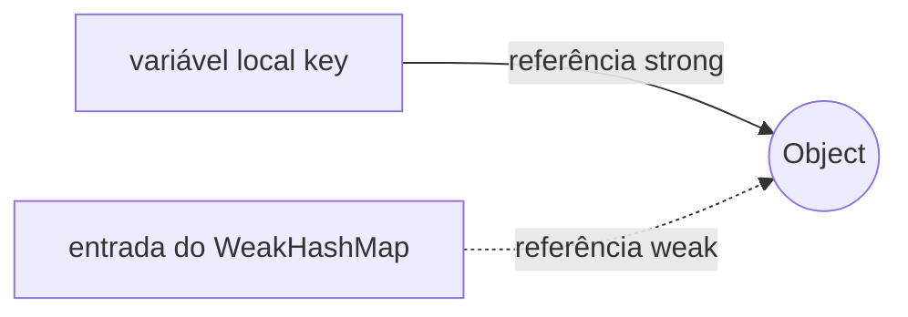
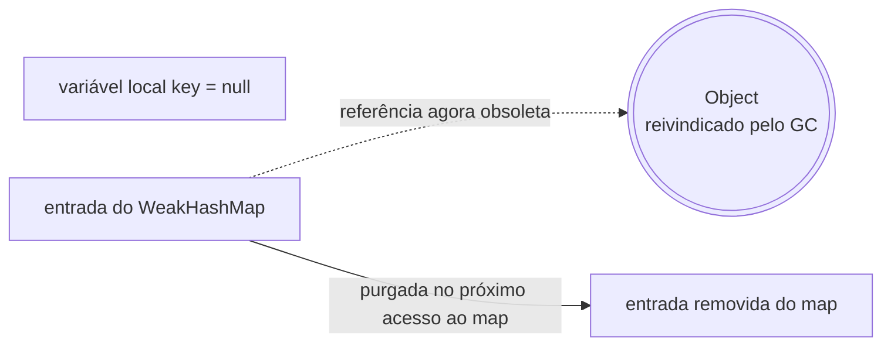

## Objective

Entender o `WeakHashMap`, a implementação de `AbstractMap` que armazena cada chave dentro de uma `WeakReference` em vez de segurá-la diretamente: assim que nada fora do map mantém uma referência strong a uma chave, a JVM fica livre para reivindicá-la, e o map remove essa entrada por conta própria — trocando a garantia normal de um `Map` (a chave sobrevive enquanto estiver no map) por limpeza automática assim que mais nada precisa da chave.

## Use Cases

- Metadados ou propriedades computadas por objeto (internals de framework anexando estado extra a um objeto da aplicação) que devem desaparecer no instante em que o próprio objeto se torna inalcançável, sem uma chamada explícita de "desregistrar".
- Registros de listener/observer que não devem ser o motivo de um listener sobreviver a quem o registrou.
- Caches indexados por `Class` (frameworks associando dados a um `Class<?>`) para que uma entrada de cache não prenda seu classloader em memória depois que tudo que usava aquela classe já foi embora.
- **Não** é um cache genérico com limite de tamanho/TTL — um `WeakHashMap` só reage à alcançabilidade da chave, nunca a pressão de memória; esse trabalho é do cache baseado em `SoftReference`.

## Deep Dive

### WeakHashMap estende AbstractMap, implementa Map

```java
class WeakHashMap<K, V>
```

Quatro construtores, espelhando os de `HashMap`:

```java
WeakHashMap<Object, String> a = new WeakHashMap<>();               // capacidade padrão 16, fator de carga 0.75
WeakHashMap<Object, String> b = new WeakHashMap<>(existingMap);    // inicializado a partir de outro Map
WeakHashMap<Object, String> c = new WeakHashMap<>(64);              // capacidade inicial 64
WeakHashMap<Object, String> d = new WeakHashMap<>(64, 0.5f);        // capacidade 64, fator de carga 0.5
```

`WeakHashMap` fica ao lado de `HashMap` sob `AbstractMap`, não abaixo dele — diferente de `LinkedHashMap`, ele não é uma subclasse de `HashMap`, mesmo os dois usando uma tabela hash internamente:



### Cada chave vive dentro de uma WeakReference, não como um campo comum

Internamente, cada entrada segura sua chave através de uma `WeakReference<K>` registrada na `ReferenceQueue` do próprio map. Enquanto algo fora do map mantiver uma referência strong à chave, a entrada se comporta exatamente como uma entrada de `HashMap`. No instante em que essa última referência strong desaparece, a chave fica elegível para coleta independentemente do map estar segurando-a:

```java
Map<Object, String> registry = new WeakHashMap<>();

Object key = new Object();
registry.put(key, "metadata");
System.out.println(registry.size()); // 1

key = null;   // solta a única referência strong externa à chave
System.gc();  // solicita uma coleta — não é garantia dura, mas confiável o suficiente para observar aqui

System.out.println(registry.size()); // muito provavelmente 0 agora
```





### A limpeza acontece de carona em operações posteriores do map, não no próprio GC

O GC limpa a `WeakReference` e a enfileira na `ReferenceQueue` do map, mas a *entrada* não é removida naquele instante — nada fica observando a fila em segundo plano. A remoção acontece de forma preguiçosa, na próxima vez que quase qualquer operação do map rodar, porque a maioria delas chama um `expungeStaleEntries()` interno primeiro:

```java
Map<Object, String> registry = new WeakHashMap<>();
Object key = new Object();
registry.put(key, "metadata");
key = null;
System.gc();

// o próprio size() dispara a passada de expunge antes de contar, então isso já reflete a chave coletada:
System.out.println(registry.size()); // muito provavelmente 0

// isEmpty(), get(), put(), containsKey(), iterar keySet()/entrySet() disparam a mesma passada —
// mas nada purga entradas obsoletas sozinho entre as chamadas, então um WeakHashMap nunca mais
// tocado pode ficar segurando entradas já limpas-mas-ainda-não-removidas indefinidamente.
```

## Trade-offs

- **Nenhuma garantia de exatamente *quando* uma entrada desaparece** — a limpeza depende do timing do GC mais uma operação posterior do map disparar a passada de expunge, então `size()`/iteração podem ficar momentaneamente atrasados em relação à alcançabilidade real da chave; nunca confie na contagem para lógica crítica de corretude, apenas como uma conveniência de gestão de memória.
- **Um valor que referencia sua própria chave, direta ou transitivamente, derruba todo o mecanismo** — o slot de valor do map é uma referência strong comum, então se o valor mantém a chave alcançável, a entrada nunca fica elegível para coleta:

  ```java
  Map<Object, Object> m = new WeakHashMap<>();
  Object key = new Object();
  m.put(key, key);   // value == key -> o próprio map agora segura a chave via o campo de valor
  key = null;
  System.gc();
  System.out.println(m.size()); // ainda 1 -- a entrada vaza enquanto o map existir
  ```
- **Chaves canônicas/internadas nunca são coletadas, derrubando o propósito silenciosamente** — um literal `String`, um `Integer` boxed dentro do cache de `Integer.valueOf`, ou uma constante `enum` já é mantido strong em outro lugar (o pool de strings, o cache de boxing da JVM, os próprios campos estáticos do enum), então embrulhá-lo como chave de `WeakHashMap` não ganha nada:

  ```java
  Map<String, String> cache = new WeakHashMap<>();
  cache.put("hello", "cached value");  // "hello" é internado -> permanentemente strong-alcançável
  System.gc();
  System.out.println(cache.size()); // 1, para sempre -- o pool de strings mantém a chave viva
  ```
- **Não sincronizado, e permite uma chave `null`** — mesma ressalva de `HashMap`; acesso concorrente precisa de sincronização externa ou de outra estrutura.

## Documentation Links

- *Java: The Complete Reference*, 12th Edition (Herbert Schildt) — Chapter 20, p. 612 — book
- [WeakHashMap — Java SE 25 API](https://docs.oracle.com/en/java/javase/25/docs/api/java.base/java/util/WeakHashMap.html) — doc
- [WeakReference — java.lang.ref](https://docs.oracle.com/en/java/javase/25/docs/api/java.base/java/lang/ref/WeakReference.html) — doc
- [Map — Java SE 25 API](https://docs.oracle.com/en/java/javase/25/docs/api/java.base/java/util/Map.html) — doc
