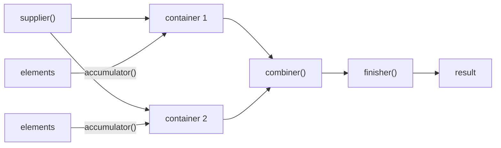

## Question

# What are the components of a Collector?

## Short Answer

An initializer, an accumulator, a combiner, and an optional finisher.

## Less Short Answer

That makes three mandatory components and one optional one. In a nutshell, a collector collects elements into a mutable container, and can optionally transform that container before returning it.

## The Four Components

- **Supplier (the initializer)**: creates the mutable container. It is modeled by a `Supplier<A>`.
- **Accumulator**: adds each element pushed to the collector into the container. It is a `BiConsumer<A, T>`: it modifies the container.
- **Combiner**: when the accumulation runs in parallel, you may end up with one container per thread, and at the end of the day you need to merge them. That is the job of the combiner, a `BinaryOperator<A>`. It may or may not modify the containers it receives.
- **Finisher (optional)**: maps the final mutable container to something else. It is a `Function<A, R>`, and in many cases it is simply the identity function.

## Visualizing



## Building One by Hand

`Collector.of` takes exactly these components. Here is a collector that joins strings with a `StringBuilder` and turns it into a `String` at the end:

```java
Collector<String, StringBuilder, String> joining =
    Collector.of(
        StringBuilder::new,                  // supplier
        (sb, s) -> sb.append(s),             // accumulator
        (sb1, sb2) -> sb1.append(sb2),       // combiner
        StringBuilder::toString              // finisher
    );

String result = Stream.of("a", "b", "c").collect(joining); // "abc"
```

When the container already is the result, leave the finisher out. `Collector.of` then uses the identity function and sets the `IDENTITY_FINISH` characteristic for you:

```java
Collector<String, List<String>, List<String>> toList =
    Collector.of(
        ArrayList::new,
        List::add,
        (l1, l2) -> { l1.addAll(l2); return l1; }
    );
```

## One Last Word

The `Collector` interface does not depend on the Stream API: it is completely independent, so you can use a collector to collect your data however you see fit. The same is true for the `Gatherer` interface.

```java
// no stream involved: drive the joining collector from above by hand
StringBuilder container = joining.supplier().get();
for (String s : List.of("one", "two", "three")) {
    joining.accumulator().accept(container, s);
}
String result = joining.finisher().apply(container); // "onetwothree"
```

## References

- [Java Coding Tip #399: What Are the Components of a Collector?](https://www.youtube.com/shorts/vEqhlRmjUDQ) (video)
- [Collector (Java SE 25 API)](https://docs.oracle.com/en/java/javase/25/docs/api/java.base/java/util/stream/Collector.html) (doc)
- [Collectors (Java SE 25 API)](https://docs.oracle.com/en/java/javase/25/docs/api/java.base/java/util/stream/Collectors.html) (doc)
