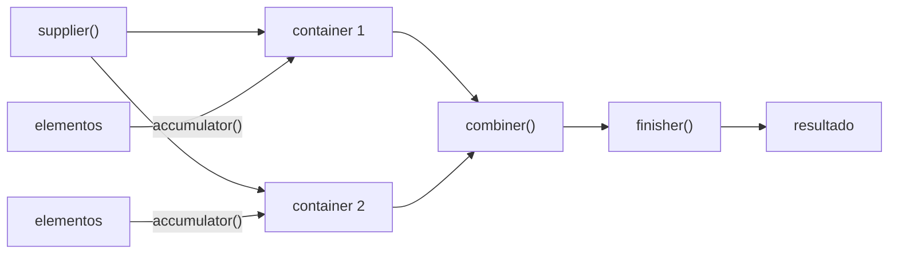

## Question

# Quais são os componentes de um Collector?

## Short Answer

Um inicializador, um acumulador, um combinador e um finalizador opcional.

## Less Short Answer

São três componentes obrigatórios e um opcional. Em resumo, um collector coleta elementos em um container mutável e pode, opcionalmente, transformar esse container antes de devolvê-lo.

## Os Quatro Componentes

- **Supplier (o inicializador)**: cria o container mutável. É modelado por um `Supplier<A>`.
- **Accumulator (acumulador)**: adiciona ao container cada elemento enviado ao collector. É um `BiConsumer<A, T>`: ele modifica o container.
- **Combiner (combinador)**: quando a acumulação roda em paralelo, você pode acabar com um container por thread, e no fim das contas precisa juntá-los. Esse é o papel do combiner, um `BinaryOperator<A>`. Ele pode ou não modificar os containers que recebe.
- **Finisher (finalizador, opcional)**: mapeia o container mutável final para outra coisa. É uma `Function<A, R>`, e em muitos casos é simplesmente a função identidade.

## Visualizando



## Construindo um à Mão

`Collector.of` recebe exatamente esses componentes. Aqui está um collector que junta strings com um `StringBuilder` e o transforma em `String` no final:

```java
Collector<String, StringBuilder, String> joining =
    Collector.of(
        StringBuilder::new,                  // supplier
        (sb, s) -> sb.append(s),             // accumulator
        (sb1, sb2) -> sb1.append(sb2),       // combiner
        StringBuilder::toString              // finisher
    );

String result = Stream.of("a", "b", "c").collect(joining); // "abc"
```

Quando o container já é o resultado, omita o finisher. Nesse caso `Collector.of` usa a função identidade e define a característica `IDENTITY_FINISH` para você:

```java
Collector<String, List<String>, List<String>> toList =
    Collector.of(
        ArrayList::new,
        List::add,
        (l1, l2) -> { l1.addAll(l2); return l1; }
    );
```

## One Last Word

A interface `Collector` não depende da Stream API: ela é completamente independente, então você pode usar um collector para coletar seus dados como achar melhor. O mesmo vale para a interface `Gatherer`.

```java
// sem stream: conduzindo à mão o collector joining de cima
StringBuilder container = joining.supplier().get();
for (String s : List.of("one", "two", "three")) {
    joining.accumulator().accept(container, s);
}
String result = joining.finisher().apply(container); // "onetwothree"
```

## References

- [Java Coding Tip #399: What Are the Components of a Collector?](https://www.youtube.com/shorts/vEqhlRmjUDQ) (video)
- [Collector (Java SE 25 API)](https://docs.oracle.com/en/java/javase/25/docs/api/java.base/java/util/stream/Collector.html) (doc)
- [Collectors (Java SE 25 API)](https://docs.oracle.com/en/java/javase/25/docs/api/java.base/java/util/stream/Collectors.html) (doc)
