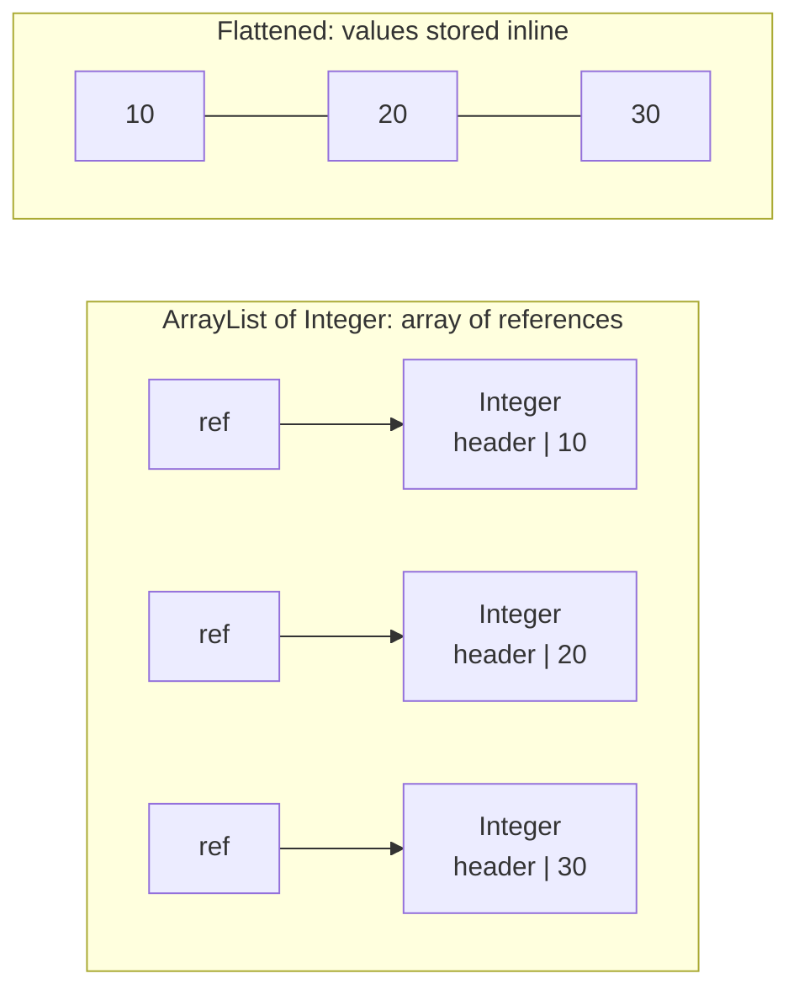

## Question

# What is flattening?

## Short Answer

Flattening is about copying the content of an object instead of creating a reference to it.

## Less Short Answer

Suppose you have an `ArrayList<Integer>`. Inside this `ArrayList` there is an array, and this array contains references to `Integer` objects. This is inefficient, both CPU-wise and memory-wise.

- **CPU-wise**: every time you need to read the value of an element, you first need to follow the reference to this element. That may lead to a cache miss, and a big performance hit.
- **Memory-wise**: all you need is to store a 32-bit `int`. But because it is wrapped in an `Integer` object, you end up storing a reference, then an object with a header, and possibly some bytes to preserve alignment in memory. That may represent 128 bits in the memory of your application.

Flattening is about storing this integer as a value: getting rid of the reference and of the object.

## Picture It



On the left, reading an element means one hop to the array, then another hop to an object that may be anywhere on the heap. On the right, the values are contiguous: no reference, no header, no hop.

## Examples

### Boxed vs primitive, today

```java
List<Integer> boxed = new ArrayList<>();
for (int i = 0; i < 1_000_000; i++) {
    boxed.add(i);   // autoboxing: Integer.valueOf(i)
}

int[] flat = new int[1_000_000];
for (int i = 0; i < 1_000_000; i++) {
    flat[i] = i;    // the value itself is stored in the array
}
```

On a typical 64-bit HotSpot JVM with compressed references, each element of `boxed` costs a 4-byte reference in the backing array plus a 16-byte `Integer` object (12-byte header, 4-byte `int`). Each element of `flat` costs 4 bytes, and the values sit next to each other in memory, which is exactly what the CPU cache likes.

Summing them shows the CPU side of the story:

```java
long sum1 = 0;
for (Integer value : boxed) {
    sum1 += value;  // follow the reference, then unbox
}

long sum2 = 0;
for (int value : flat) {
    sum2 += value;  // read the value directly
}
```

This is why the JDK has `IntStream`, `LongStream` and `DoubleStream`: they let you process primitives without boxing each element.

### The same problem with your own classes

```java
record Point(int x, int y) {}

Point[] points = new Point[1_000];
```

`points` is an array of references. Each `Point` lives somewhere else on the heap, with its own header. Iterating over the array means jumping from one object to another.

### What Valhalla wants to enable

With JEP 401 (a preview feature, not part of Java 25), you can declare a value class:

```java
value record Point(int x, int y) {}

Point[] points = new Point[1_000];
```

A value object has no identity, so the JVM is free to store the `x` and `y` fields directly inside the array, like an `int[]` of pairs. Note that the JVM *may* flatten it, it is not guaranteed: the size of the value and the need to represent `null` both come into play. Under the same preview, `Integer` itself becomes a value class, which is how `List<Integer>` could benefit from flattening one day.

## One Last Word

It may look simple, but it is actually really, really complex, and this is what Project Valhalla is doing. Valhalla creates the notion of value objects: objects that just carry a value, and that can be flattened. There are some very strong constraints on flattening, but that will be for another time.

## References

- [Java Coding Tip #397: What Is Flattening?](https://www.youtube.com/shorts/_DF3qwP3vcU) (video)
- [Project Valhalla (OpenJDK)](https://openjdk.org/projects/valhalla/) (doc)
- [JEP 401: Value Classes and Objects](https://openjdk.org/jeps/401) (doc)
