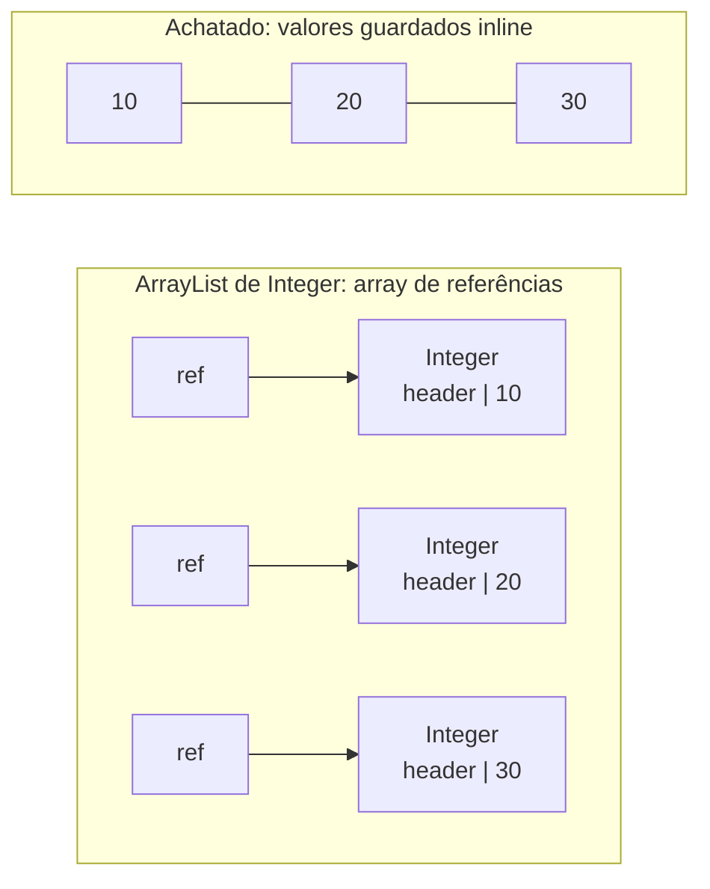

## Question

# O que é flattening?

## Short Answer

Flattening é copiar o conteúdo de um objeto em vez de criar uma referência para ele.

## Less Short Answer

Suponha que você tem um `ArrayList<Integer>`. Dentro desse `ArrayList` existe um array, e esse array contém referências para objetos `Integer`. Isso é ineficiente, tanto em CPU quanto em memória.

- **Em CPU**: toda vez que você precisa ler o valor de um elemento, primeiro precisa seguir a referência até ele. Isso pode causar um cache miss, e uma perda grande de performance.
- **Em memória**: tudo que você precisa é guardar um `int` de 32 bits. Mas como ele está embrulhado num objeto `Integer`, você acaba guardando uma referência, depois um objeto com um header, e possivelmente alguns bytes para preservar o alinhamento em memória. Isso pode representar 128 bits na memória da sua aplicação.

Flattening é guardar esse inteiro como um valor: se livrar da referência e do objeto.

## Visualizando



À esquerda, ler um elemento significa um salto até o array, depois outro salto até um objeto que pode estar em qualquer lugar do heap. À direita, os valores são contíguos: sem referência, sem header, sem salto.

## Exemplos

### Boxed vs primitivo, hoje

```java
List<Integer> boxed = new ArrayList<>();
for (int i = 0; i < 1_000_000; i++) {
    boxed.add(i);   // autoboxing: Integer.valueOf(i)
}

int[] flat = new int[1_000_000];
for (int i = 0; i < 1_000_000; i++) {
    flat[i] = i;    // o próprio valor fica guardado no array
}
```

Numa JVM HotSpot típica de 64 bits com referências comprimidas, cada elemento de `boxed` custa uma referência de 4 bytes no array interno mais um objeto `Integer` de 16 bytes (header de 12 bytes, `int` de 4 bytes). Cada elemento de `flat` custa 4 bytes, e os valores ficam lado a lado na memória, exatamente o que o cache da CPU gosta.

Somar os elementos mostra o lado da CPU:

```java
long sum1 = 0;
for (Integer value : boxed) {
    sum1 += value;  // segue a referência, depois faz unboxing
}

long sum2 = 0;
for (int value : flat) {
    sum2 += value;  // lê o valor diretamente
}
```

É por isso que o JDK tem `IntStream`, `LongStream` e `DoubleStream`: eles permitem processar primitivos sem fazer boxing de cada elemento.

### O mesmo problema com suas próprias classes

```java
record Point(int x, int y) {}

Point[] points = new Point[1_000];
```

`points` é um array de referências. Cada `Point` mora em outro lugar do heap, com seu próprio header. Iterar sobre o array significa pular de um objeto para outro.

### O que o Valhalla quer permitir

Com a JEP 401 (uma feature em preview, que não faz parte do Java 25), você pode declarar uma value class:

```java
value record Point(int x, int y) {}

Point[] points = new Point[1_000];
```

Um value object não tem identidade, então a JVM fica livre para guardar os campos `x` e `y` diretamente dentro do array, como um `int[]` de pares. Repare que a JVM *pode* achatar, não é garantido: o tamanho do valor e a necessidade de representar `null` entram na conta. Na mesma preview, o próprio `Integer` vira uma value class, e é assim que `List<Integer>` poderia se beneficiar de flattening um dia.

## One Last Word

Pode parecer simples, mas na verdade é muito, muito complexo, e é isso que o Project Valhalla está fazendo. O Valhalla cria a noção de value objects: objetos que só carregam um valor, e que podem ser achatados (flattened). Existem algumas restrições bem fortes sobre flattening, mas isso fica para outra vez.

## References

- [Java Coding Tip #397: What Is Flattening?](https://www.youtube.com/shorts/_DF3qwP3vcU) (video)
- [Project Valhalla (OpenJDK)](https://openjdk.org/projects/valhalla/) (doc)
- [JEP 401: Value Classes and Objects](https://openjdk.org/jeps/401) (doc)
