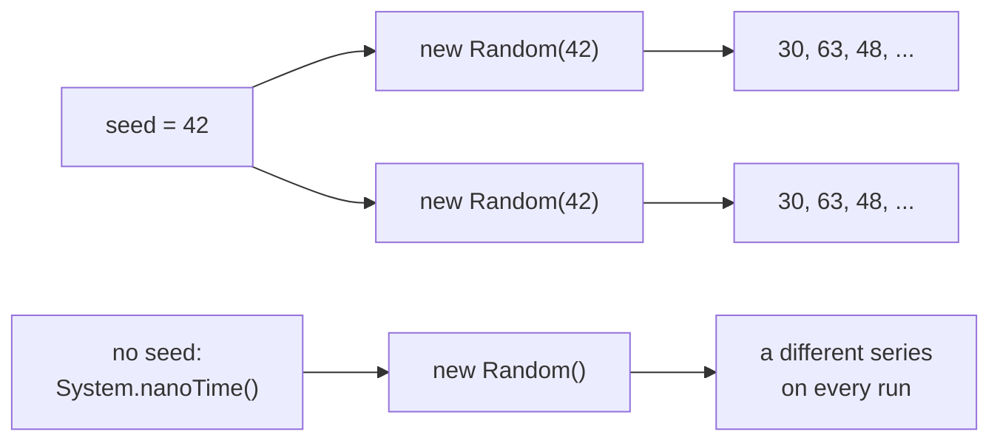
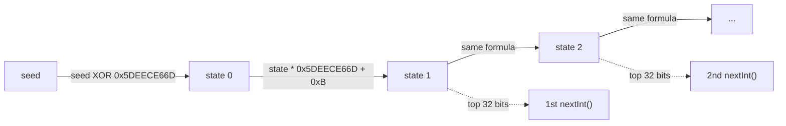
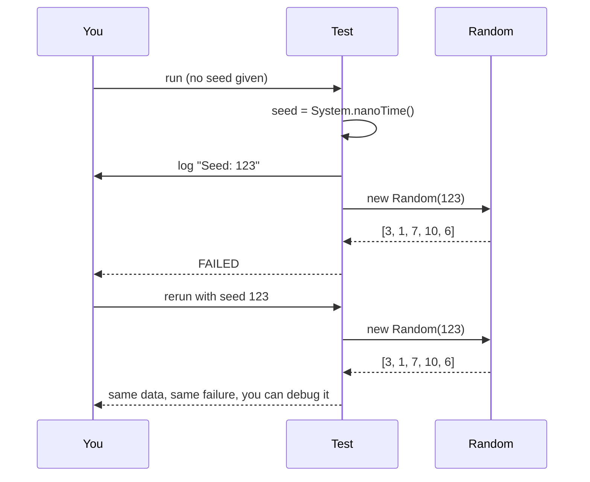
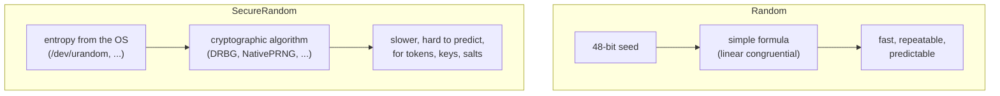

## Question

# How can you generate repeatable random numbers?

## Short Answer

A series of random numbers is always repeatable.

## Less Short Answer

When you create an instance of the `Random` class, you initialize a series of random numbers that you can get one at a time with the various methods of the class: `nextInt()`, `nextDouble()`, and the like.

You can give a seed when you create this instance, and for a given seed you will always get the same series. This may be very useful when you want to write tests, for instance.

If you do not provide any seed, then the seed is generated from `System.nanoTime()` (mixed with a counter, so that two instances created at the same instant still get different seeds).

## Picture It



`Random` is not really random: it is a deterministic algorithm (a linear congruential generator) that turns the seed into an internal state, then computes each number from the previous state. Same seed, same state, same series.

## Examples

### Same seed, same series

```java
Random first = new Random(42L);
Random second = new Random(42L);

for (int i = 0; i < 5; i++) {
    System.out.println(first.nextInt(100) + " " + second.nextInt(100));
}
// prints 30, 63, 48, 84, 70 in both columns
// same output on every run and on every JVM
```

The algorithm of `java.util.Random` is specified in its Javadoc, so the series for a given seed is the same on every platform and every Java version.

### What happens inside `Random`



The whole state of a `Random` is a 48-bit number. Each call applies the same formula to it and returns its top bits. Here is a tiny version of the algorithm, which gives exactly the same numbers as `java.util.Random`:

```java
public class MiniRandom {
    private static final long MULTIPLIER = 0x5DEECE66DL;
    private static final long ADDEND = 0xBL;
    private static final long MASK = (1L << 48) - 1;

    private long state;

    public MiniRandom(long seed) {
        this.state = (seed ^ MULTIPLIER) & MASK;
    }

    public int nextInt() {
        state = (state * MULTIPLIER + ADDEND) & MASK;
        return (int) (state >>> 16);
    }

    public static void main(String[] args) {
        MiniRandom mini = new MiniRandom(42L);
        Random random = new Random(42L);
        for (int i = 0; i < 3; i++) {
            System.out.println(mini.nextInt() + " " + random.nextInt());
        }
    }
}
// -1170105035 -1170105035
// 234785527 234785527
// -1360544799 -1360544799
```

Nothing in this code is random: once the seed is fixed, every number that follows is fixed too.

### Repeatable tests

```java
@Test
void shuffle_is_repeatable() {
    List<Integer> list1 = new ArrayList<>(List.of(1, 2, 3, 4, 5));
    List<Integer> list2 = new ArrayList<>(List.of(1, 2, 3, 4, 5));

    Collections.shuffle(list1, new Random(2026L));
    Collections.shuffle(list2, new Random(2026L));

    assertEquals(list1, list2);
}
```

A common pattern is to pick a random seed, log it, and use it to create the `Random` instance. If a test fails, you rerun it with the logged seed and get exactly the same data.



```java
public class OrderGenerator {

    static List<Integer> generateQuantities(Random random, int count) {
        List<Integer> quantities = new ArrayList<>();
        for (int i = 0; i < count; i++) {
            quantities.add(1 + random.nextInt(10));
        }
        return quantities;
    }

    public static void main(String[] args) {
        long seed = args.length > 0 ? Long.parseLong(args[0]) : System.nanoTime();
        System.out.println("Seed: " + seed);
        System.out.println(generateQuantities(new Random(seed), 5));
    }
}
```

```text
$ java OrderGenerator.java 123
Seed: 123
[3, 1, 7, 10, 6]
$ java OrderGenerator.java 123
Seed: 123
[3, 1, 7, 10, 6]
```

### Streams of random numbers

```java
List<Integer> dice = new Random(7L)
        .ints(10, 1, 7)   // 10 numbers between 1 and 6
        .boxed()
        .toList();
```

Same seed, same 10 dice rolls.

### Not every generator can be seeded

`ThreadLocalRandom` is the generator to use in concurrent code, but you cannot choose its seed: `ThreadLocalRandom.current().setSeed(42L)` throws an `UnsupportedOperationException`. If you need repeatability, create your own `Random` (or `SplittableRandom`) with a seed.

Since Java 17, the `RandomGenerator` interface also lets you pick an algorithm by name, and the seeded ones are repeatable as well:

```java
RandomGenerator generator = RandomGeneratorFactory.of("L64X128MixRandom").create(42L);
```

## One Last Word

Predictability is a different topic. Having non-predictable random series is harder than it seems: with `Random`, observing a couple of consecutive `nextInt()` values is enough to recompute the internal state and predict all the next ones.

You can use the `SecureRandom` class instead of `Random`, which is the preferred random generator for cryptographic and security applications. The series it generates still depends on a seed, but it is hard to predict.

```java
SecureRandom secureRandom = new SecureRandom();
byte[] token = new byte[32];
secureRandom.nextBytes(token);
```



Do not pass a fixed seed to `SecureRandom` expecting repeatable series: depending on the algorithm, the seed may only be added to the entropy it already gathers from the operating system.

## References

- [Java Coding Tip #398: How Can You Generate Repeatable Random Numbers?](https://www.youtube.com/watch?v=mhd_T3bQEeQ) (video)
- [java.util.Random (Java SE 25 API)](https://docs.oracle.com/en/java/javase/25/docs/api/java.base/java/util/Random.html) (doc)
- [java.security.SecureRandom (Java SE 25 API)](https://docs.oracle.com/en/java/javase/25/docs/api/java.base/java/security/SecureRandom.html) (doc)
- [JEP 356: Enhanced Pseudo-Random Number Generators](https://openjdk.org/jeps/356) (doc)
