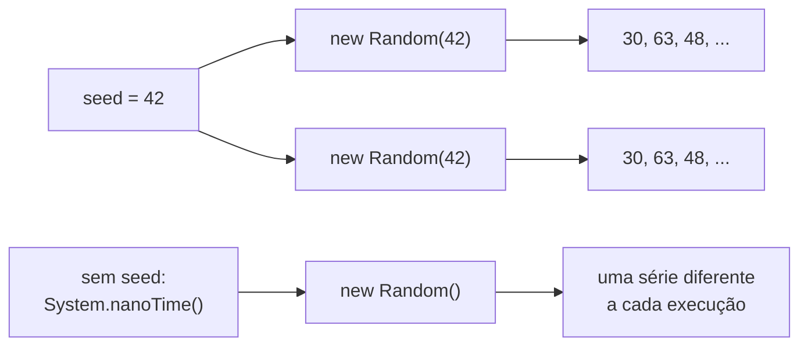
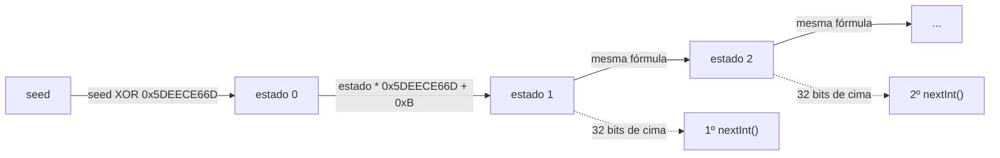
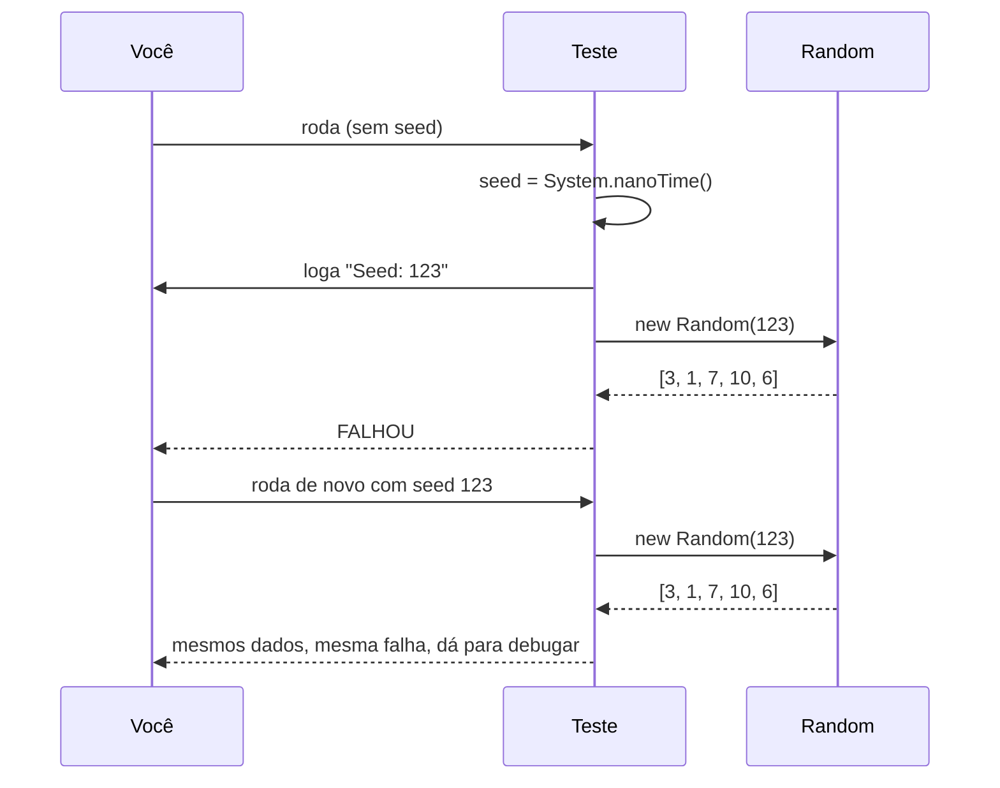
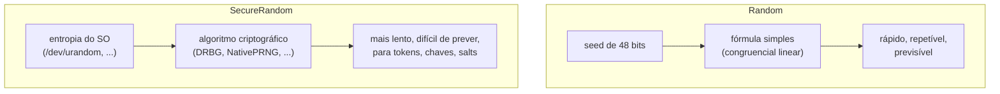

## Question

# Como gerar números aleatórios repetíveis?

## Short Answer

Uma série de números aleatórios é sempre repetível.

## Less Short Answer

Quando você cria uma instância da classe `Random`, você inicializa uma série de números aleatórios que pode obter um de cada vez com os vários métodos da classe: `nextInt()`, `nextDouble()`, e afins.

Você pode passar uma seed ao criar essa instância, e para uma dada seed você sempre vai obter a mesma série. Isso pode ser muito útil quando você quer escrever testes, por exemplo.

Se você não passar nenhuma seed, então ela é gerada a partir de `System.nanoTime()` (misturado com um contador, para que duas instâncias criadas no mesmo instante ainda recebam seeds diferentes).

## Visualizando



`Random` não é realmente aleatório: é um algoritmo determinístico (um gerador congruencial linear) que transforma a seed num estado interno, e depois calcula cada número a partir do estado anterior. Mesma seed, mesmo estado, mesma série.

## Exemplos

### Mesma seed, mesma série

```java
Random first = new Random(42L);
Random second = new Random(42L);

for (int i = 0; i < 5; i++) {
    System.out.println(first.nextInt(100) + " " + second.nextInt(100));
}
// imprime 30, 63, 48, 84, 70 nas duas colunas
// mesma saída em toda execução e em toda JVM
```

O algoritmo de `java.util.Random` é especificado no seu Javadoc, então a série para uma dada seed é a mesma em qualquer plataforma e qualquer versão do Java.

### O que acontece dentro de `Random`



Todo o estado de um `Random` é um número de 48 bits. Cada chamada aplica a mesma fórmula nele e devolve os bits de cima. Aqui está uma versão mínima do algoritmo, que gera exatamente os mesmos números que `java.util.Random`:

```java
public class MiniRandom {
    private static final long MULTIPLIER = 0x5DEECE66DL;
    private static final long ADDEND = 0xBL;
    private static final long MASK = (1L << 48) - 1;

    private long state;

    public MiniRandom(long seed) {
        this.state = (seed ^ MULTIPLIER) & MASK;
    }

    public int nextInt() {
        state = (state * MULTIPLIER + ADDEND) & MASK;
        return (int) (state >>> 16);
    }

    public static void main(String[] args) {
        MiniRandom mini = new MiniRandom(42L);
        Random random = new Random(42L);
        for (int i = 0; i < 3; i++) {
            System.out.println(mini.nextInt() + " " + random.nextInt());
        }
    }
}
// -1170105035 -1170105035
// 234785527 234785527
// -1360544799 -1360544799
```

Nada nesse código é aleatório: depois que a seed é fixada, todos os números seguintes também estão fixados.

### Testes repetíveis

```java
@Test
void shuffle_is_repeatable() {
    List<Integer> list1 = new ArrayList<>(List.of(1, 2, 3, 4, 5));
    List<Integer> list2 = new ArrayList<>(List.of(1, 2, 3, 4, 5));

    Collections.shuffle(list1, new Random(2026L));
    Collections.shuffle(list2, new Random(2026L));

    assertEquals(list1, list2);
}
```

Um padrão comum é sortear uma seed, logar ela, e usá-la para criar a instância de `Random`. Se um teste falhar, você roda de novo com a seed logada e obtém exatamente os mesmos dados.



```java
public class OrderGenerator {

    static List<Integer> generateQuantities(Random random, int count) {
        List<Integer> quantities = new ArrayList<>();
        for (int i = 0; i < count; i++) {
            quantities.add(1 + random.nextInt(10));
        }
        return quantities;
    }

    public static void main(String[] args) {
        long seed = args.length > 0 ? Long.parseLong(args[0]) : System.nanoTime();
        System.out.println("Seed: " + seed);
        System.out.println(generateQuantities(new Random(seed), 5));
    }
}
```

```text
$ java OrderGenerator.java 123
Seed: 123
[3, 1, 7, 10, 6]
$ java OrderGenerator.java 123
Seed: 123
[3, 1, 7, 10, 6]
```

### Streams de números aleatórios

```java
List<Integer> dice = new Random(7L)
        .ints(10, 1, 7)   // 10 números entre 1 e 6
        .boxed()
        .toList();
```

Mesma seed, mesmos 10 lançamentos de dado.

### Nem todo gerador aceita seed

`ThreadLocalRandom` é o gerador para usar em código concorrente, mas você não pode escolher a seed dele: `ThreadLocalRandom.current().setSeed(42L)` lança uma `UnsupportedOperationException`. Se você precisa de repetibilidade, crie seu próprio `Random` (ou `SplittableRandom`) com uma seed.

Desde o Java 17, a interface `RandomGenerator` também permite escolher um algoritmo pelo nome, e os que recebem seed também são repetíveis:

```java
RandomGenerator generator = RandomGeneratorFactory.of("L64X128MixRandom").create(42L);
```

## One Last Word

Previsibilidade é outro assunto. Ter séries aleatórias imprevisíveis é mais difícil do que parece: com `Random`, observar alguns valores consecutivos de `nextInt()` é suficiente para recalcular o estado interno e prever todos os próximos.

Você pode usar a classe `SecureRandom` em vez de `Random`, que é o gerador aleatório preferido para aplicações de criptografia e segurança. A série que ela gera ainda depende de uma seed, mas é difícil de prever.

```java
SecureRandom secureRandom = new SecureRandom();
byte[] token = new byte[32];
secureRandom.nextBytes(token);
```



Não passe uma seed fixa para `SecureRandom` esperando séries repetíveis: dependendo do algoritmo, a seed pode ser apenas somada à entropia que ele já coleta do sistema operacional.

## References

- [Java Coding Tip #398: How Can You Generate Repeatable Random Numbers?](https://www.youtube.com/watch?v=mhd_T3bQEeQ) (video)
- [java.util.Random (Java SE 25 API)](https://docs.oracle.com/en/java/javase/25/docs/api/java.base/java/util/Random.html) (doc)
- [java.security.SecureRandom (Java SE 25 API)](https://docs.oracle.com/en/java/javase/25/docs/api/java.base/java/security/SecureRandom.html) (doc)
- [JEP 356: Enhanced Pseudo-Random Number Generators](https://openjdk.org/jeps/356) (doc)
