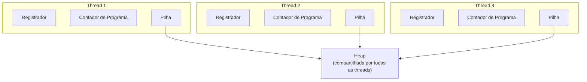

## Question

# O que é a pilha (stack) de uma thread?

## Short Answer

Uma porção de memória. Felizmente, isso não é algo que você precisa gerenciar em Java — é controlado pra você pela JVM.

## What It Is

A pilha de uma thread é a porção de memória usada por essa thread para guardar tudo que ela precisa enquanto executa. Ela armazena todas as **variáveis locais** criadas pelo código em execução, e pode conter **referências** a objetos na heap.

As referências em si vivem na pilha; a memória para a qual elas apontam vive na **heap**.

## Stack vs. Heap

O que vive na pilha não é compartilhado: **cada thread tem sua própria pilha**. Isso não acontece com a heap, onde todas as threads da sua aplicação podem ler e escrever dados.

Como a heap é compartilhada, é nela que podem acontecer **condições de corrida (race conditions)**. Não há condição de corrida para o que vive na pilha, já que nenhuma outra thread consegue ver ou tocar nela.



## Stack Size

Threads são um recurso do sistema, e o tamanho da pilha de uma thread é fixado no nível do sistema. Pode variar de um sistema operacional para outro, mas tipicamente é de **vários megabytes** de memória.

## Practical Example

É também por isso que uma recursão profunda e sem limite eventualmente lança um `StackOverflowError`: cada chamada recursiva empilha um novo frame com suas próprias variáveis locais na pilha da thread, e uma vez que essa pilha de tamanho fixo se esgota, não sobra mais espaço.

### Veja acontecendo: frames empilhados e desempilhados por `fib(3)`

Um `fib(n)` recursivo ingênuo chama a si mesmo duas vezes por nível. Cada chamada empilha um novo frame na pilha da thread; cada `return` o desempilha de volta. Observe a profundidade crescer até 3 e voltar a 0 conforme `fib(3)` se desenrola:

```viz
type: moves
mark 0 | Chama fib(3): empilha um frame na profundidade 0.
mark 1 | fib(3) chama fib(2): empilha um frame na profundidade 1.
mark 2 | fib(2) chama fib(1): empilha um frame na profundidade 2 — caso base, retorna 1 imediatamente.
mark 3 | fib(2) então chama fib(0): empilha um frame na profundidade 2 — caso base, retorna 0.
mark 2 | fib(2) = fib(1) + fib(0) = 1: seu frame na profundidade 1 é desempilhado.
mark 1 | fib(3) agora chama fib(1): empilha um frame na profundidade 1 — caso base, retorna 1 imediatamente.
mark 0 | fib(3) = fib(2) + fib(1) = 2: seu frame na profundidade 0 é desempilhado. A pilha está vazia de novo.
---
profundidade 0
profundidade 1
profundidade 2
profundidade 3
```

Só 4 níveis de profundidade aqui, então cabe tranquilamente. Remova o caso base, ou recurse milhares de níveis, e esse mesmo padrão de crescimento vai direto para um `StackOverflowError` — a pilha de tamanho fixo da thread não tem mais espaço para outro frame.

## References

- [Java Coding Tip #387: What Is the Stack of a Thread?](https://www.youtube.com/watch?v=pcyxXj-YH4s) — video
- [java.lang.Thread — Java SE 25 API](https://docs.oracle.com/en/java/javase/25/docs/api/java.base/java/lang/Thread.html) — doc
- [-Xss (Thread Stack Size) — java Tool Reference](https://docs.oracle.com/en/java/javase/25/docs/specs/man/java.html) — doc
