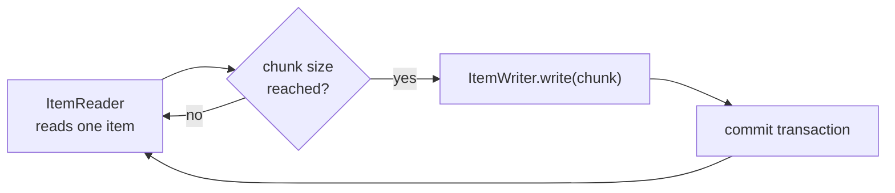
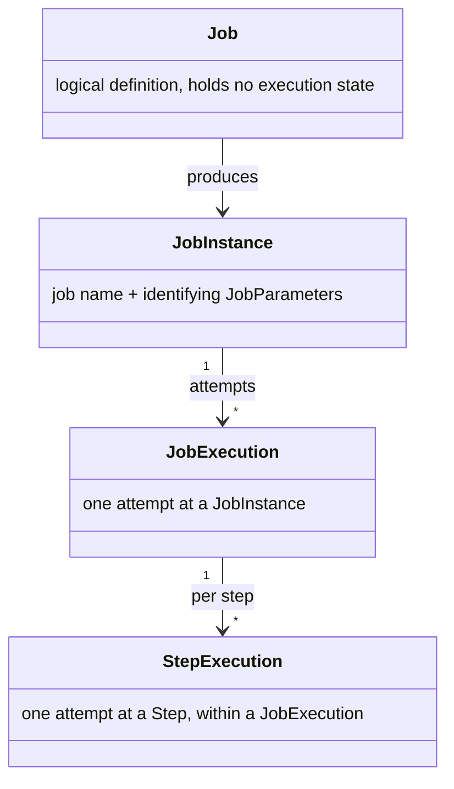

## Objective

Entenda o modelo de processamento orientado a chunks do Spring Batch — um `ItemReader` alimenta itens em chunks transacionais de tamanho fixo que um `ItemWriter` confirma (commit) juntos — e o modelo de domínio que acompanha uma execução em lote (`Job`, `Step`, `JobInstance`, `JobExecution`, `StepExecution`, `JobRepository`), além de como um job é montado hoje com `JobBuilder`/`StepBuilder` em vez do namespace XML de batch, agora deprecated.

## Use Cases

- Importar um arquivo texto grande para um banco de dados em chunks transacionais de tamanho fixo, em vez de uma única transação gigante para o arquivo inteiro ou um commit por linha.
- Rodar uma unidade de trabalho que não é de leitura/escrita — descompactar um arquivo, limpar um diretório — como um step que não se encaixa no formato reader/processor/writer, via um `Tasklet`.
- Distinguir "a importação de hoje já rodou" de "quantas vezes tentamos rodá-la": a identidade de um `JobInstance` vem do nome do job mais seus `JobParameters` identificadores, enquanto cada tentativa (incluindo retentativas após uma falha) ganha seu próprio `JobExecution`.
- Decidir o intervalo de commit (tamanho do chunk) de um step com base no trade-off entre overhead de transação e custo de rollback, em vez de chutar.

## Deep Dive

### `FlatFileItemReader` delega o parsing de linhas a um `LineTokenizer` e um `FieldSetMapper`

Ler um arquivo texto é, em si, uma cadeia de delegação: `FlatFileItemReader` lê linhas brutas, um `DefaultLineMapper` divide cada linha com um `LineTokenizer` (um `DelimitedLineTokenizer` de fábrica para entrada estilo CSV), e então mapeia o `FieldSet` resultante para um objeto de domínio com um `FieldSetMapper` que você mesmo escreve:

```java
public interface FieldSetMapper<T> {
  T mapFieldSet(FieldSet fieldSet) throws BindException;
}

public class ProductFieldSetMapper implements FieldSetMapper<Product> {

  public Product mapFieldSet(FieldSet fieldSet) throws BindException {
    Product product = new Product();
    product.setId(fieldSet.readString("PRODUCT_ID"));
    product.setName(fieldSet.readString("NAME"));
    product.setDescription(fieldSet.readString("DESCRIPTION"));
    product.setPrice(fieldSet.readBigDecimal("PRICE"));
    return product;
  }
}
```

`FieldSet` desempenha aqui o mesmo papel que o `ResultSet` do JDBC desempenha para uma linha de banco de dados: ele expõe acessores tipados (`readString`, `readBigDecimal`, …) sobre os campos tokenizados, de modo que o mapper só lida com conversão de domínio, nunca com divisão de strings.

### Um `ItemWriter` escrito à mão decide entre insert e update

Nada em `ItemWriter` obriga a um único comando SQL — a implementação decide, linha por linha, se um item é novo:

```java
public class ProductJdbcItemWriter implements ItemWriter<Product> {

  private JdbcTemplate jdbcTemplate;

  public void write(List<? extends Product> items) throws Exception {
    for (Product item : items) {
      int updated = jdbcTemplate.update(UPDATE_PRODUCT,
          item.getName(), item.getDescription(), item.getPrice(), item.getId());
      if (updated == 0) {
        jdbcTemplate.update(INSERT_PRODUCT,
            item.getId(), item.getName(), item.getDescription(), item.getPrice());
      }
    }
  }
}
```

O Spring Batch chama `write()` uma vez por chunk, com o lote inteiro de itens — o writer nunca vê uma única linha isolada, o que é exatamente o que torna possível transações em nível de chunk.

### Steps orientados a chunk agrupam leituras, processamento e escritas em uma transação

Um step orientado a chunk lê itens um a um, mas os confirma em lote: o `commit-interval` (hoje, `.chunk(size, transactionManager)` no `StepBuilder`) controla quantos itens se acumulam antes de `ItemWriter.write()` ser chamado e a transação ser confirmada:

```xml
<step id="readWriteProducts">
  <tasklet>
    <chunk reader="reader" writer="writer" commit-interval="100" />
  </tasklet>
</step>
```

Um chunk de tamanho 100 significa: leia até 100 produtos, depois escreva os 100 em uma única transação. Se o item 57 falhar, o chunk inteiro sofre rollback — não apenas aquele item — o que é o mecanismo que troca throughput por simplicidade transacional.



### Um `Tasklet` cuida de trabalho que não tem o formato de um loop de leitura/escrita

Nem todo step processa um fluxo de itens. Descompactar um arquivo enviado antes mesmo do step de leitura/escrita começar é uma única unidade de trabalho, modelada com a interface `Tasklet` em vez de um par reader/writer:

```java
public class DecompressTasklet implements Tasklet {

  public RepeatStatus execute(StepContribution contribution, ChunkContext chunkContext) throws Exception {
    ZipInputStream zis = new ZipInputStream(new BufferedInputStream(inputResource.getInputStream()));
    // ... decompress each entry to targetDirectory ...
    zis.close();
    return RepeatStatus.FINISHED;
  }
}
```

`Tasklet` tem um único método, `execute`, chamado repetidamente até que retorne `RepeatStatus.FINISHED` — para uma tarefa de tiro único como essa, isso acontece já na primeira chamada. É a válvula de escape para lógica de step que o processamento em chunk não comporta.

### O modelo de domínio: Job, Step, JobInstance, JobExecution, StepExecution

Um `Job` é a definição lógica de um processo em lote (seus steps e a ordem entre eles); ele próprio não guarda estado de execução. Executá-lo produz:

- **`JobInstance`** — uma execução lógica, identificada pelo nome do job mais seus `JobParameters` identificadores. Importar o arquivo de hoje e o de amanhã são dois `JobInstance`s diferentes do mesmo `Job`.
- **`JobExecution`** — uma tentativa técnica de um `JobInstance`. Se a execução de hoje falhar e for reiniciada, é o mesmo `JobInstance`, mas um novo `JobExecution` — status, horário de início/fim e exit status pertencem todos aqui.
- **`StepExecution`** — uma tentativa de um único step dentro de um `JobExecution`, rastreando contagens de leitura/escrita/commit/rollback/skip especificamente para aquele step.

O `JobRepository` persiste tudo isso (para que um restart saiba exatamente onde um job parou), e o `JobLauncher` é quem inicia um `Job` com um determinado conjunto de `JobParameters` em primeiro lugar — veja `spring-batch-job-model` para saber como o próprio `JobLauncher` está agora deprecated em favor de `JobOperator` a partir do Spring Batch 6.0.



### O livro vs. hoje: namespace XML de batch → `JobBuilder`/`StepBuilder`

O livro (2012, Spring Batch 2.1) monta jobs e sua infraestrutura (`JobRepository`, `JobLauncher`, `DataSource`) inteiramente em XML, dividida entre um arquivo de configuração de job e um arquivo de infraestrutura separado:

```xml
<job id="importProducts" xmlns="http://www.springframework.org/schema/batch">
  <step id="decompress" next="readWriteProducts">
    <tasklet ref="decompressTasklet" />
  </step>
  <step id="readWriteProducts">
    <tasklet>
      <chunk reader="reader" writer="writer" commit-interval="100" />
    </tasklet>
  </step>
</job>
```

O namespace XML `batch:` está deprecated a partir do Spring Batch 6.0, com remoção planejada para a 7.0. Hoje o mesmo job é configuração Java construída com `JobBuilder`/`StepBuilder`, com um `JobRepository` injetado em vez de declarado como bean à mão:

```java
@Bean
public Job importProductsJob(JobRepository jobRepository, Step decompress, Step readWriteProducts) {
  return new JobBuilder("importProducts", jobRepository)
      .start(decompress)
      .next(readWriteProducts)
      .build();
}

@Bean
public Step readWriteProducts(JobRepository jobRepository, PlatformTransactionManager txManager,
    ItemReader<Product> reader, ItemWriter<Product> writer) {
  return new StepBuilder("readWriteProducts", jobRepository)
      .<Product, Product>chunk(100, txManager)
      .reader(reader)
      .writer(writer)
      .build();
}
```

A prática do livro de separar configuração de *infraestrutura* (`JobRepository`, `DataSource`) da configuração de *job* ainda se sustenta conceitualmente — só que agora `@EnableBatchProcessing` autoconfigura o `JobRepository` para você em vez do bean `MapJobRepositoryFactoryBean` declarado à mão pelo livro.

## Trade-offs

- **O tamanho do chunk é um trade-off direto entre overhead de transação e custo de rollback** — um chunk pequeno demais cria transações excessivas e deixa o job mais lento; um chunk grande demais mantém um recurso transacional (como um banco de dados) aberto por mais tempo e torna um rollback mais caro. A própria regra de bolso do livro é um intervalo de commit entre 10 e 200, ajustado por job em vez de assumido.
- **Processamento em chunk compra segurança transacional por chunk; um `Tasklet` não** — um step em chunk sofre rollback do chunk inteiro numa falha no meio dele e pode pular/retentar itens individuais; um step `Tasklet` é uma unidade atômica única, sem nenhuma dessa granularidade, o que é a troca certa para trabalho (como descompactação) que não tem noção significativa de "item parcial."
- **A identidade de um `JobInstance` depende inteiramente de quais parâmetros você marca como identificadores** — duas execuções do mesmo `Job` com os mesmos `JobParameters` identificadores são o *mesmo* `JobInstance`, então um job que deveria rodar uma vez por dia precisa de um parâmetro distintivo (uma data, um timestamp) ou uma segunda execução no mesmo dia será tratada como um restart da primeira em vez de uma nova execução lógica.

## Documentation Links

- [Spring Batch in Action (Manning, 2012) — Chapter 1: "Introducing Spring Batch", p. 16-27](https://www.manning.com/books/spring-batch-in-action) — doc
- [Spring Batch Reference — Domain Language (Job, Step, JobInstance, JobExecution, StepExecution, JobRepository)](https://docs.spring.io/spring-batch/reference/domain.html) — doc
- [Spring Batch 6.0 Migration Guide — XML namespace deprecation](https://github.com/spring-projects/spring-batch/wiki/Spring-Batch-6.0-Migration-Guide) — doc
