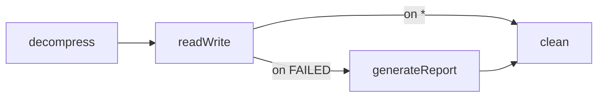

## Objective

A linear job runs its steps one after another, but a real batch job is a *graph*:
depending on how a step actually finished, it takes one path or another. Every step
finishes with an `ExitStatus` — a String exit code — and transitions are declared as
`on("<pattern>").to(<next step>)`, matched against that exit code with `*`/`?`
wildcards, so the *same* step can branch to different next steps at runtime.

The crucial distinction — the heart of this concept — is that `ExitStatus` is not the
same thing as `BatchStatus`. `BatchStatus` is a framework **enum**
(`COMPLETED`/`FAILED`/`STOPPED`/…) that records the *real* state of the execution and
drives persistence and restartability. `ExitStatus` is a **customizable String** that
drives *flow transitions*. By default they align (a step whose `BatchStatus` is
`COMPLETED` exits with the code `"COMPLETED"`), but you can override the exit status
independently — returning `"COMPLETED WITH SKIPS"` or `"NO INPUT"` — so the flow can
branch on business outcomes the framework enum can't express.

## Use Cases

- Branch to a report-generating step **only** when the read-write step completed with
  skipped items, otherwise go straight to cleanup.
- Let a step end the whole job **early and successfully** (exit code `"NO INPUT"`)
  when there was nothing to download, instead of running the remaining steps.
- Route on a custom business outcome (`"COMPLETED WITH SKIPS"`, `"MISSING FILE"`) that
  no built-in status can express.
- Explicitly **fail** the job on a specific exit status instead of letting a `*`
  wildcard silently swallow a real failure.
- Make a routing decision that belongs to *no single step* — inspect the whole
  `JobExecution` first — using a `JobExecutionDecider`.

## Deep Dive

### Each step ends with an ExitStatus; transitions branch on it

A transition is a triple: *from* a step, *on* an exit-status pattern, go *to* another
state. The same step can declare several, so its exit status chooses the branch. This
is the book's Figure 10.3 — if `readWrite` fails, don't end the job, generate a
report; otherwise clean up:

```java
@Bean
public Job importProductsJob(JobRepository jobRepository, Step decompress,
        Step readWrite, Step generateReport, Step clean) {
    return new JobBuilder("importProductsJob", jobRepository)
            .start(decompress)
            .next(readWrite)
            .on("FAILED").to(generateReport)   // readWrite exit code FAILED -> report
            .from(readWrite).on("*").to(clean) // anything else -> straight to cleanup
            .from(generateReport).next(clean)
            .end()
            .build();
}
```



`on()` accepts exact codes and two wildcards: `*` matches zero or more characters
(`COMPLETED*` matches both `COMPLETED` and `COMPLETED WITH SKIPS`) and `?` matches
exactly one (`C?T` matches `CAT` but not `COUNT`). Spring Batch orders transitions
from most- to least-specific automatically, so declaration order doesn't matter — an
exact `on("FAILED")` always wins over `on("*")`. **Watch the `*` trap:** if no more
specific pattern matches, `*` also matches `FAILED`, so the "next" step runs even
though the step failed. When you use conditional transitions you own failure handling
— add an explicit `on("FAILED")` terminator if that's not what you want.

### BatchStatus vs. ExitStatus: the distinction that drives the flow

Both `JobExecution` and `StepExecution` carry *two* status properties, and confusing
them is the classic flow bug:

```java
// BatchStatus — a framework enum, persisted, drives restartability
public enum BatchStatus {
    COMPLETED, STARTING, STARTED, STOPPING, STOPPED, FAILED, ABANDONED, UNKNOWN
}

// ExitStatus — a class wrapping a String exit code (+ description), you can customize it
ExitStatus completed = ExitStatus.COMPLETED;                 // exit code "COMPLETED"
ExitStatus custom    = new ExitStatus("COMPLETED WITH SKIPS"); // your own code
```

`BatchStatus` enumerates a finite set the framework understands; it is written to the
batch metadata as the overall outcome of a job or step and is what the job repository
consults on restart (covered in the *Job Repository, Launcher, and Job Model* sibling).
`ExitStatus` is a *class*, not an enum, precisely so you can mint your own instances.
The key fact — easy to get wrong — is that **`on()` matches the `ExitStatus` exit code,
not the `BatchStatus`.** By default the exit code equals the `BatchStatus` name, which
is why `on("FAILED")` "just works"; but the moment you want a richer decision than the
enum offers, you override the exit code and branch on *that* string. `BatchStatus`
still records the real state independently.

### Customizing the exit status in a StepExecutionListener

There's no built-in exit code that says "finished, but skipped some rows." You produce
one by running code right after the step: `StepExecutionListener.afterStep()` has
access to the finished `StepExecution` and its return value *replaces* the step's exit
status. This is the book's Listing 10.2 (the *Listeners* sibling catalogs the whole
listener family; here the relevant detail is that `afterStep` is non-`void`):

```java
public class SkippedItemsStepListener implements StepExecutionListener {

    @Override
    public void beforeStep(StepExecution stepExecution) { }

    @Override
    public ExitStatus afterStep(StepExecution stepExecution) {
        if (!ExitStatus.FAILED.equals(stepExecution.getExitStatus())
                && stepExecution.getSkipCount() > 0) {
            return new ExitStatus("COMPLETED WITH SKIPS"); // custom code -> drives flow
        }
        return stepExecution.getExitStatus();              // otherwise leave it untouched
    }
}
```

Register the listener on the step, then branch the job on the code it emits (Figure
10.4):

```java
return new JobBuilder("importProductsJob", jobRepository)
        .start(readWrite)
        .on("COMPLETED WITH SKIPS").to(generateReport)
        .from(readWrite).on("*").to(clean)
        .from(generateReport).next(clean)
        .end()
        .build();
```

When the routing logic isn't tied to one step — you want a standalone node in the
graph that inspects the whole `JobExecution` and returns a `FlowExecutionStatus` — use
a `JobExecutionDecider` instead. The *Non-Linear Flow and Job Instance Identity*
sibling already derives that decider, so it isn't repeated here; the two approaches
reach the same result and the Trade-offs below say when to pick which. Branching is
only one half of the book's advanced import job — a branched report step often needs
data (an import ID) computed by an earlier step, which the *Sharing Data Between Steps*
sibling covers separately.

### Flow terminators: end(), fail(), and stopAndRestart()

A transition doesn't have to point at another step — it can *terminate* the flow.
`FlowBuilder`'s `TransitionBuilder` exposes three outcomes: `end()` finishes the job
successfully (optionally `end("CODE")`), `fail()` finishes it as `FAILED`, and
`stopAndRestart(step)` stops the job but records where a restart should resume:

```java
return new JobBuilder("importProductsJob", jobRepository)
        .start(readWrite)
        .on("FAILED").fail()                              // real failure -> fail the job
        .from(readWrite).on("NO INPUT").end()             // nothing to do -> complete early
        .from(readWrite).on("COMPLETED WITH SKIPS").to(generateReport)
        .from(readWrite).on("*").to(clean)
        .from(generateReport).next(clean)
        .end()
        .build();
```

These are the deliberate counterpart to the `*` trap: `fail()` makes a failure fail the
job on purpose, `end()` lets a step short-circuit the rest of the graph, and
`stopAndRestart(...)` pauses a long job at a known boundary so a later launch of the
same instance picks up from the given step.

### Book vs. today: XML `<next>`/`<decision>` replaced by the Java `FlowBuilder` DSL

The 2012 book configures every transition in XML: linear flow with the `next`
attribute (`<step id="readWriteProducts" next="clean">`), conditional flow with nested
`<next on="FAILED" to="generateReport"/>` elements, and step-independent routing with a
`<decision id="…" decider="…">` element. Today that wiring is expressed with the Java
DSL on `JobBuilder`/`FlowBuilder`: `.start(step)`, `.on("PATTERN").to(step2)`,
`.from(step)`, and the `.end()`/`.fail()`/`.stopAndRestart()` terminators — the exact
chain shown throughout this concept. The `on()` wildcard grammar (`*`/`?`), the
most-to-least-specific ordering, the `BatchStatus` enum vs. customizable `ExitStatus`
String distinction, `StepExecutionListener.afterStep()` returning a new `ExitStatus`,
and `JobExecutionDecider` returning a `FlowExecutionStatus` all carry over unchanged —
only the configuration surface moved from XML to Java. The book's `batch:` XML
namespace still parses but is **deprecated as of Spring Batch 6.0** and slated for
removal in 7.0, so new flows should be written with the Java DSL. Confirmed via the
Spring Batch 6.0 reference ("Controlling Step Flow"), the `FlowBuilder` /
`FlowBuilder.TransitionBuilder` API, and the Spring Batch 6.0 migration guide /
"What's new in Spring Batch 6".

## Trade-offs

- **`*` silently swallows `FAILED`.** Because `*` is the least-specific pattern, it
  matches a failed step when nothing more specific does, and the "next" step runs
  anyway. If a failure should stop the job, you must say so explicitly with
  `on("FAILED").fail()` (or route to an error step) — conditional flow hands failure
  handling back to you.
- **`ExitStatus` is stringly-typed.** Transitions match String exit codes, so a typo —
  a listener returning `"COMPLETE WITH SKIPS"` while the flow tests
  `on("COMPLETED WITH SKIPS")` — compiles cleanly and simply never matches, falling
  through to `*`. Nothing ties the listener's returned string to the `on()` pattern at
  compile time.
- **Overriding the exit status decouples flow from the real state.** A listener that
  returns `"COMPLETED WITH SKIPS"` changes only how the job *branches*; the persisted
  `BatchStatus` is still `COMPLETED`. Someone reading restart/monitoring metadata sees
  a plain completed step, so the custom code must not be mistaken for the framework's
  view of success or failure.
- **`StepExecutionListener` vs. `JobExecutionDecider`.** A listener's returned exit
  status is *persisted* in the step metadata (handy for monitoring) and supports late
  binding of job parameters via SpEL, because it's part of the step; a decider is
  *not* persisted and can't use late binding, but it reads as explicit, self-announcing
  flow logic (a dedicated node whose only job is to return a status). The choice, as
  the book notes, rarely matters — pick the listener when you want the outcome in the
  metadata, the decider when you want the flow intent obvious.

## Documentation Links

- Cogoluègnes, Templier, Gregory, Bazoud, "Spring Batch in Action" (Manning, 2012) — Chapter 10, "Controlling execution", sections 10.1-10.2, "A complex flow…" / "Driving the flow of a job", p. 278-287 — doc
- [Spring Batch Reference — Controlling Step Flow (Batch Status vs. Exit Status, conditional flow, JobExecutionDecider)](https://docs.spring.io/spring-batch/reference/step/controlling-flow.html) — doc
- [Spring Batch 6.0 Migration Guide — XML namespace deprecated in favor of Java configuration](https://github.com/spring-projects/spring-batch/wiki/Spring-Batch-6.0-Migration-Guide) — doc
