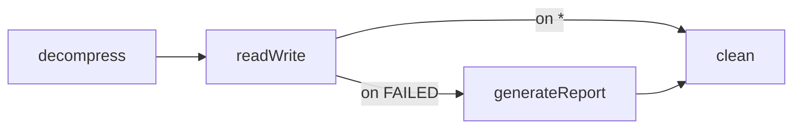

## Objective

Um job linear roda seus steps um após o outro, mas um job de batch de verdade é um
*grafo*: dependendo de como um step realmente terminou, ele segue um caminho ou outro.
Todo step termina com um `ExitStatus` — um código de saída String — e as transições são
declaradas como `on("<pattern>").to(<próximo step>)`, comparadas contra esse código de
saída com wildcards `*`/`?`, de modo que o *mesmo* step pode ramificar para steps
diferentes em runtime.

A distinção crucial — o coração deste conceito — é que `ExitStatus` não é a mesma coisa
que `BatchStatus`. `BatchStatus` é um **enum** do framework (`COMPLETED`/`FAILED`/
`STOPPED`/…) que registra o estado *real* da execução e dirige a persistência e a
capacidade de restart. `ExitStatus` é uma **String customizável** que dirige as
*transições de fluxo*. Por padrão os dois se alinham (um step cujo `BatchStatus` é
`COMPLETED` sai com o código `"COMPLETED"`), mas você pode sobrescrever o exit status
independentemente — retornando `"COMPLETED WITH SKIPS"` ou `"NO INPUT"` — para que o
fluxo possa ramificar em cima de resultados de negócio que o enum do framework não
consegue expressar.

## Use Cases

- Ramificar para um step que gera relatório **somente** quando o step de leitura-escrita
  terminou com itens pulados (skipped), senão ir direto para a limpeza.
- Deixar um step encerrar o job inteiro **cedo e com sucesso** (código de saída
  `"NO INPUT"`) quando não havia nada para baixar, em vez de rodar os steps restantes.
- Rotear com base num resultado de negócio customizado (`"COMPLETED WITH SKIPS"`,
  `"MISSING FILE"`) que nenhum status embutido consegue expressar.
- **Falhar** explicitamente o job num exit status específico em vez de deixar um wildcard
  `*` engolir silenciosamente uma falha real.
- Tomar uma decisão de roteamento que não pertence a *nenhum step individual* —
  inspecionar o `JobExecution` inteiro primeiro — usando um `JobExecutionDecider`.

## Deep Dive

### Cada step termina com um ExitStatus; as transições ramificam a partir dele

Uma transição é uma tripla: *de* um step, *ao* casar um padrão de exit status, vai *para*
outro estado. O mesmo step pode declarar várias, para que seu exit status escolha o
ramo. Esta é a Figura 10.3 do livro — se `readWrite` falhar, não encerre o job, gere um
relatório; caso contrário, limpe:

```java
@Bean
public Job importProductsJob(JobRepository jobRepository, Step decompress,
        Step readWrite, Step generateReport, Step clean) {
    return new JobBuilder("importProductsJob", jobRepository)
            .start(decompress)
            .next(readWrite)
            .on("FAILED").to(generateReport)   // readWrite exit code FAILED -> report
            .from(readWrite).on("*").to(clean) // anything else -> straight to cleanup
            .from(generateReport).next(clean)
            .end()
            .build();
}
```



`on()` aceita códigos exatos e dois wildcards: `*` casa zero ou mais caracteres
(`COMPLETED*` casa tanto `COMPLETED` quanto `COMPLETED WITH SKIPS`) e `?` casa exatamente
um (`C?T` casa `CAT` mas não `COUNT`). O Spring Batch ordena as transições do mais para
o menos específico automaticamente, então a ordem de declaração não importa — um
`on("FAILED")` exato sempre ganha de `on("*")`. **Cuidado com a armadilha do `*`:** se
nenhum padrão mais específico casar, `*` também casa `FAILED`, então o "próximo" step
roda mesmo que o step tenha falhado. Ao usar transições condicionais, você assume a
responsabilidade pelo tratamento de falha — adicione um terminador explícito
`on("FAILED")` se não for isso que você quer.

### BatchStatus vs. ExitStatus: a distinção que dirige o fluxo

Tanto `JobExecution` quanto `StepExecution` carregam *duas* propriedades de status, e
confundi-las é o bug clássico de fluxo:

```java
// BatchStatus — um enum do framework, persistido, dirige a capacidade de restart
public enum BatchStatus {
    COMPLETED, STARTING, STARTED, STOPPING, STOPPED, FAILED, ABANDONED, UNKNOWN
}

// ExitStatus — uma classe que envelopa um código String (+ descrição), você pode customizá-la
ExitStatus completed = ExitStatus.COMPLETED;                 // exit code "COMPLETED"
ExitStatus custom    = new ExitStatus("COMPLETED WITH SKIPS"); // seu próprio código
```

`BatchStatus` enumera um conjunto finito que o framework entende; é escrito nos
metadados do batch como o resultado geral de um job ou step e é o que o job repository
consulta no restart (coberto no conceito irmão *Job Repository, Launcher, and Job
Model*). `ExitStatus` é uma *classe*, não um enum, exatamente para que você possa criar
suas próprias instâncias. O fato-chave — fácil de errar — é que **`on()` casa o código de
saída do `ExitStatus`, não o `BatchStatus`.** Por padrão o código de saída é igual ao
nome do `BatchStatus`, e é por isso que `on("FAILED")` "simplesmente funciona"; mas no
momento em que você quer uma decisão mais rica do que o enum oferece, você sobrescreve o
código de saída e ramifica a partir *dessa* string. `BatchStatus` continua registrando
o estado real, independentemente.

### Customizando o exit status num StepExecutionListener

Não existe um código de saída embutido que diga "terminou, mas pulou algumas linhas".
Você produz um rodando código logo depois do step: `StepExecutionListener.afterStep()`
tem acesso ao `StepExecution` finalizado e seu valor de retorno *substitui* o exit
status do step. Este é o Listing 10.2 do livro (o conceito irmão *Listeners* cataloga
toda a família de listeners; aqui o detalhe relevante é que `afterStep` não é `void`):

```java
public class SkippedItemsStepListener implements StepExecutionListener {

    @Override
    public void beforeStep(StepExecution stepExecution) { }

    @Override
    public ExitStatus afterStep(StepExecution stepExecution) {
        if (!ExitStatus.FAILED.equals(stepExecution.getExitStatus())
                && stepExecution.getSkipCount() > 0) {
            return new ExitStatus("COMPLETED WITH SKIPS"); // custom code -> drives flow
        }
        return stepExecution.getExitStatus();              // otherwise leave it untouched
    }
}
```

Registre o listener no step, depois ramifique o job a partir do código que ele emite
(Figura 10.4):

```java
return new JobBuilder("importProductsJob", jobRepository)
        .start(readWrite)
        .on("COMPLETED WITH SKIPS").to(generateReport)
        .from(readWrite).on("*").to(clean)
        .from(generateReport).next(clean)
        .end()
        .build();
```

Quando a lógica de roteamento não está amarrada a um step — você quer um nó independente
no grafo que inspecione o `JobExecution` inteiro e devolva um `FlowExecutionStatus` — use
um `JobExecutionDecider` em vez disso. O conceito irmão *Non-Linear Flow and Job Instance
Identity* já deriva esse decider, então não é repetido aqui; as duas abordagens chegam ao
mesmo resultado e os Trade-offs abaixo dizem quando escolher qual. Ramificação é só
metade do job de importação avançado do livro — um step de relatório ramificado
frequentemente precisa de dados (um ID de importação) computados por um step anterior,
o que o conceito irmão *Sharing Data Between Steps* cobre separadamente.

### Terminadores de fluxo: end(), fail() e stopAndRestart()

Uma transição não precisa apontar para outro step — ela pode *terminar* o fluxo. O
`TransitionBuilder` do `FlowBuilder` expõe três resultados: `end()` finaliza o job com
sucesso (opcionalmente `end("CODE")`), `fail()` finaliza como `FAILED`, e
`stopAndRestart(step)` para o job mas registra onde um restart deve retomar:

```java
return new JobBuilder("importProductsJob", jobRepository)
        .start(readWrite)
        .on("FAILED").fail()                              // real failure -> fail the job
        .from(readWrite).on("NO INPUT").end()             // nothing to do -> complete early
        .from(readWrite).on("COMPLETED WITH SKIPS").to(generateReport)
        .from(readWrite).on("*").to(clean)
        .from(generateReport).next(clean)
        .end()
        .build();
```

Esses são a contrapartida deliberada da armadilha do `*`: `fail()` faz uma falha
realmente falhar o job de propósito, `end()` deixa um step interromper o resto do
grafo, e `stopAndRestart(...)` pausa um job longo num ponto conhecido para que um
lançamento posterior da mesma instância retome a partir do step dado.

### Livro vs. hoje: `<next>`/`<decision>` em XML substituídos pela DSL Java FlowBuilder

O livro de 2012 configura toda transição em XML: fluxo linear com o atributo `next`
(`<step id="readWriteProducts" next="clean">`), fluxo condicional com elementos aninhados
`<next on="FAILED" to="generateReport"/>`, e roteamento independente de step com um
elemento `<decision id="…" decider="…">`. Hoje essa configuração é expressa com a DSL
Java em `JobBuilder`/`FlowBuilder`: `.start(step)`, `.on("PATTERN").to(step2)`,
`.from(step)`, e os terminadores `.end()`/`.fail()`/`.stopAndRestart()` — exatamente a
cadeia mostrada ao longo deste conceito. A gramática de wildcards de `on()` (`*`/`?`), a
ordenação do mais para o menos específico, a distinção entre o enum `BatchStatus` e a
String customizável `ExitStatus`, `StepExecutionListener.afterStep()` retornando um novo
`ExitStatus`, e `JobExecutionDecider` retornando um `FlowExecutionStatus` permanecem
todos inalterados — só a superfície de configuração se moveu de XML para Java. O
namespace XML `batch:` do livro ainda faz parse mas está **deprecated desde o Spring
Batch 6.0** e programado para remoção na 7.0, então novos fluxos deveriam ser escritos
com a DSL Java. Confirmado pela referência do Spring Batch 6.0 ("Controlling Step
Flow"), a API `FlowBuilder` / `FlowBuilder.TransitionBuilder`, e o guia de migração do
Spring Batch 6.0 / "What's new in Spring Batch 6".

## Trade-offs

- **`*` engole `FAILED` silenciosamente.** Como `*` é o padrão menos específico, ele
  casa um step que falhou quando nada mais específico casa, e o "próximo" step roda
  mesmo assim. Se uma falha deveria parar o job, você precisa dizer isso explicitamente
  com `on("FAILED").fail()` (ou rotear para um step de erro) — o fluxo condicional
  devolve o tratamento de falha para você.
- **`ExitStatus` é stringly-typed.** Transições casam códigos de saída String, então um
  typo — um listener retornando `"COMPLETE WITH SKIPS"` enquanto o fluxo testa
  `on("COMPLETED WITH SKIPS")` — compila normalmente e simplesmente nunca casa, caindo
  para `*`. Nada amarra a string retornada pelo listener ao padrão de `on()` em tempo de
  compilação.
- **Sobrescrever o exit status desacopla o fluxo do estado real.** Um listener que
  retorna `"COMPLETED WITH SKIPS"` muda só como o job *ramifica*; o `BatchStatus`
  persistido continua `COMPLETED`. Quem lê metadados de restart/monitoramento vê um
  step simplesmente completado, então o código customizado não deve ser confundido com a
  visão do framework sobre sucesso ou falha.
- **`StepExecutionListener` vs. `JobExecutionDecider`.** O exit status retornado por um
  listener é *persistido* nos metadados do step (útil para monitoramento) e suporta late
  binding de job parameters via SpEL, porque faz parte do step; um decider *não* é
  persistido e não pode usar late binding, mas se lê como lógica de fluxo explícita,
  autoexplicativa (um nó dedicado cujo único trabalho é retornar um status). A escolha,
  como o livro observa, raramente importa — escolha o listener quando você quer o
  resultado nos metadados, o decider quando você quer a intenção do fluxo óbvia.

## Documentation Links

- Cogoluègnes, Templier, Gregory, Bazoud, "Spring Batch in Action" (Manning, 2012) — Chapter 10, "Controlling execution", sections 10.1-10.2, "A complex flow…" / "Driving the flow of a job", p. 278-287 — doc
- [Spring Batch Reference — Controlling Step Flow (Batch Status vs. Exit Status, conditional flow, JobExecutionDecider)](https://docs.spring.io/spring-batch/reference/step/controlling-flow.html) — doc
- [Spring Batch 6.0 Migration Guide — XML namespace deprecated in favor of Java configuration](https://github.com/spring-projects/spring-batch/wiki/Spring-Batch-6.0-Migration-Guide) — doc
