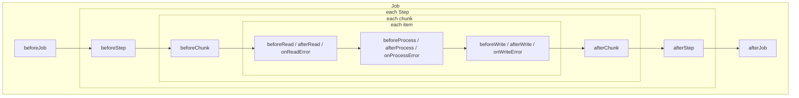

## Objective

A configuração de reader/processor/writer de um batch job descreve quais dados
se movem e como são transformados — ela não diz nada sobre notificar um
sistema externo quando o job falha, registrar quais itens foram pulados, ou
rodar lógica de limpeza depois que um step termina. Os listeners do Spring
Batch preenchem essa lacuna: uma família de interfaces (e seus equivalentes
baseados em annotation) que se conectam a eventos de ciclo de vida de job,
step, chunk e item individual sem exigir nenhuma mudança no reader, processor
ou writer em si.

## Use Cases

- Notificar um sistema de monitoramento externo quando um job completa ou
  falha, reagindo ao `BatchStatus` de `afterJob` em vez de fazer polling do
  estado do job de fora.
- Registrar exatamente quais itens foram pulados durante o processamento (e
  por quê) para uma revisão posterior, usando `SkipListener` em vez de vasculhar
  logs.
- Rodar lógica de setup/teardown restrita a um único step — abrindo um recurso
  em `beforeStep`, liberando-o em `afterStep` — sem misturar essa
  responsabilidade no reader ou writer do próprio step.
- Reagir a um retry esgotado (todas as tentativas falharam) para logar ou
  alertar, em vez de só ver a exception final propagada sem visibilidade de
  quantas tentativas vieram antes.

## Deep Dive



### Listeners de job: antes/depois do job inteiro

```java
public interface JobExecutionListener {
  void beforeJob(JobExecution jobExecution);
  void afterJob(JobExecution jobExecution);
}
```

`beforeJob` roda uma vez, logo antes do job começar; `afterJob` roda uma vez,
depois que o job termina, independentemente de ter tido sucesso ou falhado —
`JobExecution.getStatus()` (uma constante `BatchStatus`) é como o listener
distingue os dois casos:

```java
public class ImportProductsJobListener implements JobExecutionListener {
  public void beforeJob(JobExecution jobExecution) {
    // called when the job starts
  }

  public void afterJob(JobExecution jobExecution) {
    if (jobExecution.getStatus() == BatchStatus.COMPLETED) {
      // called when the job ends successfully
    } else if (jobExecution.getStatus() == BatchStatus.FAILED) {
      // called when the job ends in failure
    }
  }
}
```

O XML do livro registra um listener como filho do elemento `job`:

```xml
<batch:job id="importProductsJob">
  <batch:listeners>
    <batch:listener ref="importProductsJobListener"/>
  </batch:listeners>
</batch:job>

<bean id="importProductsJobListener" class="ImportProductsJobListener"/>
```

### Sem a interface: listeners baseados em annotation

Um POJO simples também pode atuar como listener, sem implementar
`JobExecutionListener` de forma alguma — `@BeforeJob`/`@AfterJob` marcam quais
métodos o Spring Batch deve chamar:

```java
public class AnnotatedImportProductsJobListener {
  @BeforeJob
  public void executeBeforeJob(JobExecution jobExecution) {
    // notifying when the job starts
  }

  @AfterJob
  public void executeAfterJob(JobExecution jobExecution) {
    if (jobExecution.getStatus() == BatchStatus.COMPLETED) {
      // notifying on success
    } else if (jobExecution.getStatus() == BatchStatus.FAILED) {
      // notifying on failure
    }
  }
}
```

Os mesmos dois hooks, sem interface para implementar — útil quando uma classe
já tem uma superclasse não relacionada, ou quando só um dos dois eventos de
ciclo de vida é realmente necessário.

### Listeners de step: `StepExecutionListener` e `ChunkListener`

Todo listener em nível de step estende a interface marcadora `StepListener`.
`StepExecutionListener` envolve o step inteiro:

```java
public interface StepExecutionListener extends StepListener {
  void beforeStep(StepExecution stepExecution);
  ExitStatus afterStep(StepExecution stepExecution);
}
```

`afterStep` não é, notavelmente, `void` — seu valor de retorno pode sobrescrever
o status de saída do próprio step, o que é como um listener consegue
transformar um step tecnicamente bem sucedido em outro resultado (ou
vice-versa) com base em condições que o próprio step não checa. `ChunkListener`
envolve cada chunk individual em vez do step inteiro, sem nenhum parâmetro:

```java
public interface ChunkListener extends StepListener {
  void beforeChunk();
  void afterChunk();
}
```

### Listeners em nível de item: read, process, write e skip

Três interfaces genéricas espelham os três estágios do processamento orientado
a chunk, cada uma com um trio before/after/on-error:

```java
public interface ItemReadListener<T> extends StepListener {
  void beforeRead();
  void afterRead(T item);
  void onReadError(Exception ex);
}

public interface ItemProcessListener<T, S> extends StepListener {
  void beforeProcess(T item);
  void afterProcess(T item, S result);
  void onProcessError(T item, Exception e);
}

public interface ItemWriteListener<S> extends StepListener {
  void beforeWrite(List<? extends S> items);
  void afterWrite(List<? extends S> items);
  void onWriteError(Exception exception, List<? extends S> items);
}
```

Uma quarta interface, `SkipListener`, é distinta das três acima — ela dispara
especificamente quando um item é pulado (via o mecanismo de skip-limit coberto
em outra parte deste capítulo), com um método por estágio em que o skip
aconteceu:

```java
public interface SkipListener<T, S> extends StepListener {
  void onSkipInRead(Throwable t);
  void onSkipInProcess(T item, Throwable t);
  void onSkipInWrite(S item, Throwable t);
}
```

Existem annotations para todo método de toda interface desta seção —
`@BeforeStep`/`@AfterStep`, `@BeforeRead`/`@AfterRead`/`@OnReadError`, e assim
por diante — seguindo exatamente o mesmo padrão de POJO mostrado para os
listeners de job:

```java
public class ImportProductsExecutionListener {
  @BeforeStep
  public void handlingBeforeStep(StepExecution stepExecution) {
    // ...
  }

  @AfterStep
  public ExitStatus afterStep(StepExecution stepExecution) {
    // ...
    return ExitStatus.FINISHED;
  }
}
```

O registro é um filho `listeners` do elemento `tasklet` (vários listeners
podem ser registrados de uma vez):

```xml
<batch:job id="importProductsJob">
  <batch:step id="decompress" next="readWrite">
    <batch:tasklet ref="decompressTasklet">
      <batch:listeners>
        <batch:listener ref="stepListener"/>
      </batch:listeners>
    </batch:tasklet>
  </batch:step>
</batch:job>
```

### Listeners de repeat e retry: robustez, não ciclo de vida

Um par separado de interfaces de listener tem como alvo mecanismos de
*robustez* — repeat e retry — em vez do ciclo de vida de job/step/item acima:

```java
public interface RepeatListener {
  void before(RepeatContext context);
  void after(RepeatContext context, RepeatStatus result);
  void open(RepeatContext context);
  void onError(RepeatContext context, Throwable e);
  void close(RepeatContext context);
}

public interface RetryListener {
  <T> void open(RetryContext context, RetryCallback<T> callback);
  <T> void onError(RetryContext context,
             RetryCallback<T> callback, Throwable e);
  <T> void close(RetryContext context,
             RetryCallback<T> callback, Throwable e);
}
```

`open`/`close` envolvem toda a sequência de retry ou repeat de um item;
`onError` dispara em toda tentativa malsucedida. O registro segue o mesmo
elemento filho `listeners` usado para listeners de step.

## Trade-offs

- **O valor de retorno de `afterStep` pode sobrescrever silenciosamente o
  resultado real do step.** Retornar um `ExitStatus` diferente do que o step
  realmente produziu é uma capacidade legítima e documentada — mas também
  significa que o sucesso/falha de um step não é totalmente determinado pela
  lógica do próprio step assim que um listener entra em cena, o que é fácil de
  esquecer ao debugar um resultado de job inesperado.
- **`SkipListener` é uma interface distinta dos listeners de read/process/write,
  não um quarto método parafusado neles.** É fácil assumir que
  `onReadError`/`onProcessError`/`onWriteError` já cobrem skips — não cobrem;
  esses disparam em *todo* erro naquele estágio, enquanto `SkipListener`
  dispara especificamente quando o mecanismo de skip-limit aceita o erro e
  segue em frente em vez de falhar o step.
- **Listeners baseados em annotation evitam uma interface mas escondem o
  contrato.** Um POJO anotado com `@BeforeStep` parece "só um método", mas
  ainda está preso às mesmas regras de assinatura do método da interface que
  ele substitui (tipo de parâmetro, tipo de retorno para `@AfterStep`) — uma
  assinatura incompatível falha na inicialização, não em tempo de compilação,
  a mesma categoria de risco já observada para os métodos de query derivados
  do Spring Data em outra parte deste workflow.
- **Listeners de repeat e retry resolvem um problema mais estreito do que
  parece.** Eles não observam o ciclo de vida do job ou step de forma alguma —
  só o loop interno de retry/repeat ao redor de um único item — então recorrer
  a `RetryListener` para logar progresso em nível de step é a ferramenta
  errada; é para isso que servem `StepExecutionListener`/`ChunkListener`.
- **Livro vs. hoje: o registro de listener em configuração Java é um método de
  builder, não um elemento filho de XML.** O
  `<batch:listeners><batch:listener ref="..."/></batch:listeners>` do livro
  vira `.listener(...)` no builder de step/job na configuração Java atual —
  funcionalmente equivalente, só invocado como chamada de método em vez de XML
  aninhado, seguindo a mesma migração de XML para Java já documentada para
  outros conceitos do Spring Batch neste workflow. O conjunto de annotations em
  si (`@BeforeStep`/`@AfterStep`, `@BeforeRead`/`@AfterRead`/`@OnReadError`,
  etc.) permanece inalterado.
- **Livro vs. hoje: `RepeatListenerSupport` (uma classe base no-op para
  `RepeatListener`) foi deprecada no Spring Batch 5.0 e removida na 6.0** —
  `RetryListener` ganhou métodos default (no-op) no lugar, então a classe de
  suporte ficou redundante em vez da interface ser substituída; código
  existente que estende `RepeatListenerSupport` precisa implementar
  `RepeatListener` diretamente. Confirmado pela deprecated-list atual do
  Spring Batch.
- **Livro vs. hoje: todo o pacote e conjunto de métodos de `RetryListener`
  mudaram, não só sua localização.** Desde o Spring Batch 6.0, o retry deixou
  de se basear na biblioteca separada Spring Retry que o livro descreve
  (`org.springframework.batch.retry.RetryListener`, com
  `open`/`onError`/`close`) — passa a se basear no próprio recurso de retry do
  núcleo do Spring Framework (`org.springframework.core.retry.RetryListener`),
  cujos métodos não mapeiam um-para-um com os três do livro: `beforeRetry()`,
  `onRetrySuccess()`, `onRetryFailure()`, `onRetryPolicyExhaustion()`,
  `onRetryPolicyInterruption()`, e `onRetryPolicyTimeout()` substituem o trio
  `open`/`onError`/`close` do livro por um conjunto mais granular de callbacks
  específicos para cada resultado de retry. Confirmado pela documentação atual
  da API do Spring Framework.

## Documentation Links

- Cogoluègnes, Templier, Gregory, Bazoud, "Spring Batch in Action" (Manning, 2012) — Chapter 3, "Batch configuration", section 3.4.3, "Using listeners to provide additional processing", p. 78-83 — doc
- [Spring Batch Reference — Intercepting Step Execution (listener interfaces and annotations)](https://docs.spring.io/spring-batch/reference/step/chunk-oriented-processing/intercepting-execution.html) — doc
- [Spring Batch API — Deprecated List (RepeatListenerSupport removal)](https://docs.spring.io/spring-batch/docs/current/api/deprecated-list.html) — doc
- [Spring Framework API — RetryListener (org.springframework.core.retry)](https://docs.spring.io/spring-framework/docs/current/javadoc-api/org/springframework/core/retry/RetryListener.html) — doc
