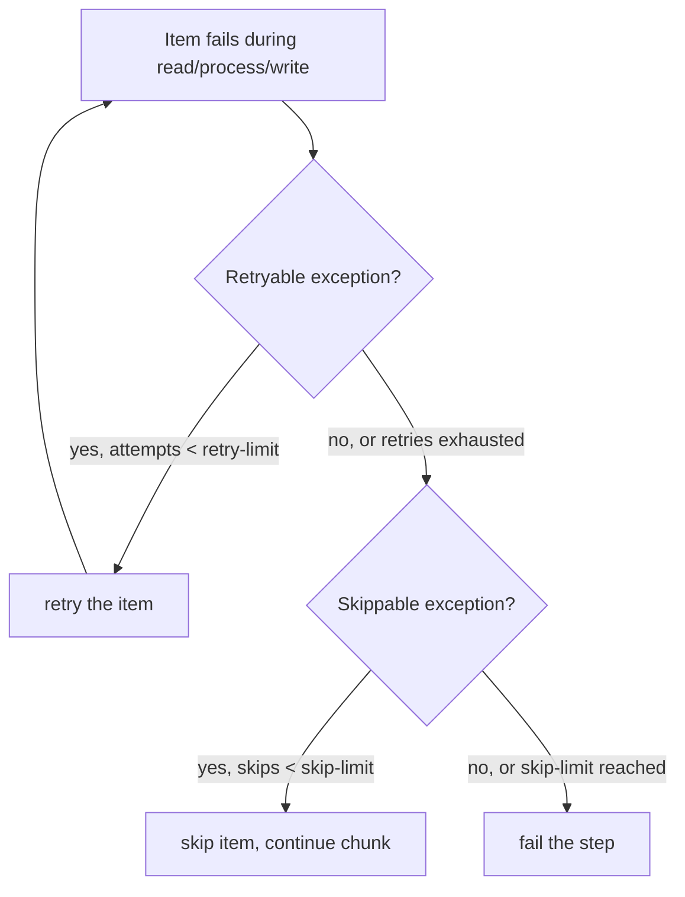

## Objective

A configuração básica de reader/processor/writer de um step chunk-oriented
não diz nada sobre o que acontece quando um item falha. Os atributos do
elemento `chunk` do livro — `skip-limit`, `retry-limit`, `cache-capacity`,
mais o próprio `transaction-attributes` e `no-rollback-exception-classes` do
tasklet — são o que transforma um step de "falha no primeiro registro ruim"
em um que tolera uma quantidade limitada de problemas. A superfície de
configuração em Java para isso mudou duas vezes desde que o livro foi
escrito: primeiro para o `FaultTolerantStepBuilder`, e, a partir do Spring
Batch 6.0, para o modelo de objetos de política do `ChunkOrientedStepBuilder`.

## Use Cases

- Importar um arquivo onde um punhado de linhas malformadas não deve abortar
  uma carga, por outro lado bem-sucedida, de milhares de linhas boas — pular
  até um número limitado, falhar além disso.
- Repetir a escrita de um item que falhou por uma condição transitória (um
  deadlock de um processo concorrente) sem tratá-la como falha permanente já
  na primeira vez.
- Escolher um nível de isolamento de transação para o commit de um chunk que
  combine com o quanto de atividade de escrita concorrente a tabela alvo vê,
  em vez de deixar num padrão escolhido pelo banco que pode estar errado para
  uma importação de alta contenção.
- Dizer ao Spring Batch que uma exceção de validação específica não deve
  fazer rollback da transação do chunk, porque o registro já foi sinalizado e
  pulado, e não é um problema de consistência de banco de dados.

## Deep Dive

### O XML do livro: atributos de tolerância a falhas do chunk

```xml
<batch:step id="readWrite">
  <batch:tasklet transaction-manager="transactionManager">
    <batch:chunk reader="productItemReader" processor="productItemProcessor"
                 writer="productItemWriter" commit-interval="100"
                 skip-limit="20" retry-limit="3" cache-capacity="100"
                 chunk-completion-policy="timeoutCompletionPolicy">
      <batch:skippable-exception-classes>
        <batch:include class="org.springframework.batch.item.file.FlatFileParseException"/>
        <batch:exclude class="java.io.FileNotFoundException"/>
      </batch:skippable-exception-classes>
      <batch:retryable-exception-classes>
        <batch:include class="org.springframework.dao.DeadlockLoserDataAccessException"/>
      </batch:retryable-exception-classes>
    </batch:chunk>
    <batch:transaction-attributes isolation="DEFAULT" propagation="REQUIRED" timeout="30"/>
    <batch:no-rollback-exception-classes>
      <batch:include class="org.springframework.batch.item.validator.ValidationException"/>
    </batch:no-rollback-exception-classes>
  </batch:tasklet>
</batch:step>
```

`skip-limit` limita quantos itens que falharam um step tolera antes de falhar
de vez; `retry-limit` limita quantas vezes um único item é reprocessado numa
falha transitória; `cache-capacity` limita o cache de contexto de retry
(itens aguardando recuperação entre transações) como salvaguarda contra
crescimento ilimitado de memória, caso os itens não possam ser identificados
de forma confiável entre tentativas.



### Configuração em Java, era 1: `FaultTolerantStepBuilder` (ainda comum hoje, mas depreciada desde a 6.0)

```java
@Bean
public Step readWrite(JobRepository jobRepository, PlatformTransactionManager transactionManager,
                       ItemReader<Product> reader, ItemProcessor<Product, Product> processor,
                       ItemWriter<Product> writer) {
    return new StepBuilder("readWrite", jobRepository)
        .<Product, Product>chunk(100, transactionManager)
        .reader(reader)
        .processor(processor)
        .writer(writer)
        .faultTolerant()
        .skip(FlatFileParseException.class)
        .skipLimit(20)
        .noSkip(FileNotFoundException.class)
        .retry(DeadlockLoserDataAccessException.class)
        .retryLimit(3)
        .retryContextCache(new MapRetryContextCache(100))   // cache-capacity
        .noRollback(ValidationException.class)
        .transactionAttribute(transactionAttribute())        // isolation/propagation/timeout
        .build();
}

private TransactionAttribute transactionAttribute() {
    DefaultTransactionAttribute attr = new DefaultTransactionAttribute();
    attr.setIsolationLevel(TransactionDefinition.ISOLATION_DEFAULT);
    attr.setPropagationBehavior(TransactionDefinition.PROPAGATION_REQUIRED);
    attr.setTimeout(30);
    return attr;
}
```

Cada atributo XML tem uma chamada de builder quase 1:1: `skip-limit`→
`.skipLimit()`, `retry-limit`→`.retryLimit()`, `cache-capacity`→
`.retryContextCache(new MapRetryContextCache(n))`,
`no-rollback-exception-classes`→`.noRollback(...)`. É essa a forma que a
maioria das bases de código Spring Batch 4.x/5.x usa hoje — e é **exatamente**
a API para a qual os próprios atributos do livro se traduzem, por isso vale
aprender mesmo já estando depreciada: ainda é o que você vai ler na maioria
do código de produção e da maioria dos tutoriais.

### Configuração em Java, era 2: `ChunkOrientedStepBuilder` (Spring Batch 6.0+, o rumo atual)

O Spring Batch 6.0 depreciou o `FaultTolerantStepBuilder` (remoção planejada
para a 7.0) em favor do `ChunkOrientedStepBuilder`, que abandona os métodos
de conveniência individuais `skip(class)`/`skipLimit(n)`/`retry(class)`/
`retryLimit(n)` em favor de fornecer objetos de política diretamente:

```java
@Bean
public Step readWrite(JobRepository jobRepository, PlatformTransactionManager transactionManager,
                       ItemReader<Product> reader, ItemProcessor<Product, Product> processor,
                       ItemWriter<Product> writer) {
    return new StepBuilder("readWrite", jobRepository)
        .chunk(100)
        .reader(reader)
        .processor(processor)
        .writer(writer)
        .transactionAttribute(transactionAttribute())
        .faultTolerant()
        .skipPolicy(skipPolicy())
        .retryPolicy(retryPolicy())
        .build();
}

private SkipPolicy skipPolicy() {
    Map<Class<? extends Throwable>, Boolean> skippable = Map.of(
        FlatFileParseException.class, true,
        FileNotFoundException.class, false);
    return new LimitCheckingItemSkipPolicy(20, skippable);   // skip-limit + skippable-exception-classes, combined
}

private RetryPolicy retryPolicy() {
    return RetryPolicy.builder()
        .maxAttempts(3)                                      // retry-limit
        .includes(DeadlockLoserDataAccessException.class)
        .build();
}
```

Duas coisas mudaram, não só os nomes dos métodos: o `RetryPolicy` aqui é
`org.springframework.core.retry.RetryPolicy` — **o próprio recurso de retry
nativo do Spring Framework**, não a biblioteca separada Spring Retry da qual
o `FaultTolerantStepBuilder` dependia — e a lógica de skip é expressa como um
único objeto `SkipPolicy` (`LimitCheckingItemSkipPolicy` combina o que
`skip-limit` + `skippable-exception-classes` costumavam dividir em dois)
em vez de um limite mais uma lista de chamadas include/exclude.
`cache-capacity`'s retry-context cache e `no-rollback-exception-classes` não
têm um equivalente direto nesse novo builder até o Spring Batch 6.0 — a
questão do cache de retry é tratada internamente pela nova integração
core-retry.

## Trade-offs

- **`FaultTolerantStepBuilder` está depreciado, não desaparecido.** Ainda
  está presente no Spring Batch 6.x e é o que a maioria das bases de código
  existentes usa — não se surpreenda ao vê-lo em projetos reais. A remoção
  está planejada para a 7.0, então cadeias `.skip()`/`.retry()`/
  `.retryLimit()` existentes precisam de um plano de migração, não de uma
  reescrita urgente.
- **A migração para objetos explícitos `SkipPolicy`/`RetryPolicy` é mais
  verbosa para o caso simples** (um único limite e umas poucas classes de
  exceção), mas escala melhor para lógica customizada — uma implementação de
  `SkipPolicy` pode consultar estado externo (um circuit breaker, uma
  contagem de retry por item vinda de um banco de dados) de um jeito que
  `skipLimit`/`skip(class)` nunca conseguiu.
- **A salvaguarda de `cache-capacity` (lançar exceção quando itens demais
  estão em retry sem serem pulados/recuperados) importa mais em chunks
  grandes e altamente concorrentes** — um cache dimensionado pequeno demais
  num step com um commit-interval grande e uma dependência downstream instável
  vai lançar `RetryCacheCapacityExceededException` bem antes do próprio
  `retry-limit` ser atingido para qualquer item individual.
- **`no-rollback-exception-classes` é especificamente para exceções que
  significam "esse item já foi tratado" (como uma falha de validação que
  também está sendo pulada), não tolerância geral a erros** — marcar a
  exceção errada como no-rollback pode fazer commit de uma transação que
  deixou o banco de dados num estado que o step não pretendia.

## Documentation Links

- Cogoluègnes, Templier, Gregory, Bazoud, "Spring Batch in Action" (Manning, 2012) — Chapter 3, "Batch configuration", sections 3.2.4-3.2.5, p. 61-71 — doc
- [Spring Batch API — FaultTolerantStepBuilder (deprecated since 6.0)](https://docs.spring.io/spring-batch/reference/api/org/springframework/batch/core/step/builder/FaultTolerantStepBuilder.html) — doc
- [Spring Batch API — ChunkOrientedStepBuilder](https://docs.spring.io/spring-batch/docs/6.0.0-M2/api/org/springframework/batch/core/step/builder/ChunkOrientedStepBuilder.html) — doc
- [Spring Batch API — LimitCheckingItemSkipPolicy](https://docs.spring.io/spring-batch/docs/current/api/org/springframework/batch/core/step/skip/LimitCheckingItemSkipPolicy.html) — doc
- [Spring Batch 6.0 release announcement](https://spring.io/blog/2025/08/20/spring-batch-6/) — doc
