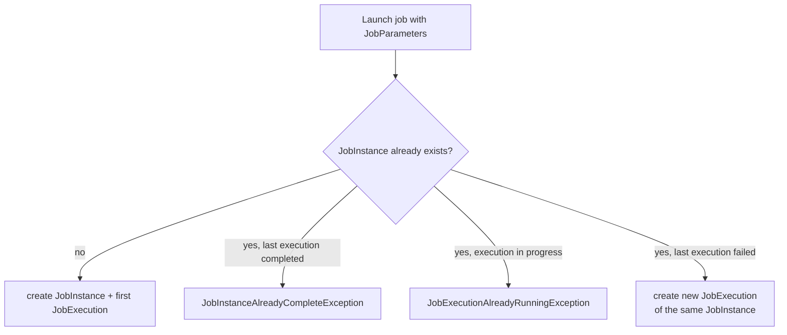

## Objective

A Spring Batch job is a sequence of steps, but two more concepts make that sequence
useful in production: non-linear flow lets a job branch based on how a step actually
finished (not just "next"), and the JobInstance/JobExecution model gives every run a
strict identity so Spring Batch can tell "the same job, run again" apart from "the
same run, retried after a failure."

## Use Cases

- A job that behaves differently depending on outcome — e.g., skip a reporting step
  if a prior step reported nothing was skipped, but run it if something was.
- Launching the same daily import job with a `date` parameter and being able to
  trust that "June 27" only ever refers to one specific run, no matter how many
  times someone tries to launch it.
- Distinguishing a genuine re-run attempt (should fail, because June 27 already
  completed) from a legitimate retry after a corrupted file was fixed (a new
  execution of the same instance, before it ever completed).

## Deep Dive

### Non-linear flow with a decision step

A step's outcome doesn't have to just move to a fixed "next" step — a decider can
inspect the execution and route the flow based on its status. In Java configuration,
`JobExecutionDecider` returns a `FlowExecutionStatus`, and `JobBuilder`/`FlowBuilder`
wire it into the flow:

```java
public class SkippedDecider implements JobExecutionDecider {
    @Override
    public FlowExecutionStatus decide(JobExecution jobExecution, StepExecution stepExecution) {
        return new FlowExecutionStatus(hadSkips(stepExecution) ? "SKIPPED" : "CLEAN");
    }
}

@Bean
public Job importProductsJob(JobRepository jobRepository, SkippedDecider decider,
                              Step readWrite, Step generateReport, Step sendReport, Step clean) {
    return new JobBuilder("importProductsJob", jobRepository)
        .start(readWrite)
        .next(decider).on("SKIPPED").to(generateReport)
        .from(decider).on("*").to(clean)
        .from(generateReport).next(sendReport).next(clean)
        .end()
        .build();
}
```

`.next(decider)` routes control to the decider, `.on("STATUS")` matches the string
the decider returned (`*`/`?` wildcards allowed), and `.to(step)` picks the branch —
the same branching semantics the book's XML `<decision>`/`<next on="...">` elements
expressed declaratively.

### TaskletStep and the Tasklet interface

Every step delegates its work to a `Tasklet` — `TaskletStep` is the implementation
application developers actually configure (Spring Batch also has `FlowStep`,
`JobStep`, and `PartitionStep` for composing jobs, but they wrap other jobs/flows
rather than doing work directly). A custom `Tasklet` is for one-off work like
decompressing a file; the chunk-oriented read-process-write pattern is itself
implemented as a built-in `Tasklet` (`ChunkOrientedTasklet`) under the hood.

### JobInstance = Job + identifying JobParameters

A `JobInstance` is uniquely identified by the job plus the parameters used to launch
it:

```java
jobOperator.start(job, new JobParametersBuilder()
    .addString("date", "2010-06-27")
    .toJobParameters()
);
```

Not every parameter has to participate in that identity. `JobParameter` carries an
`identifying` flag (`true` by default); a parameter explicitly marked non-identifying
— a run timestamp used only for logging, say — doesn't affect which `JobInstance`
a launch resolves to:

```java
new JobParametersBuilder()
    .addString("date", "2010-06-27")                 // identifying (default)
    .addString("runTimestamp", Instant.now().toString(), false)  // non-identifying
    .toJobParameters();
```

### Job execution lifecycle rules

Three rules govern what happens when a job is launched:

- The first launch of a set of parameters creates both the `JobInstance` and its
  first `JobExecution`.
- Launching a `JobInstance` that already has a *successfully completed* execution
  throws `JobInstanceAlreadyCompleteException` — Spring Batch refuses to silently
  re-run finished work.
- Launching a `JobInstance` that already has an execution *in progress* throws
  `JobExecutionAlreadyRunningException` — two concurrent executions of the same
  instance are never allowed.

A failed execution, by contrast, leaves the instance open: relaunching with the same
parameters starts a new execution of the same instance rather than failing, which is
what makes retrying a corrected job (like a re-uploaded, uncorrupted archive)
possible.



## Trade-offs

- **`JobLauncher.run(job, jobParameters)` — the call this book uses throughout — is
  deprecated as of Spring Batch 6.0.** `JobOperator` now extends `JobLauncher` and
  adds `start(Job, JobParameters)` as the recommended entry point; `JobLauncher` is
  slated for removal in 6.2+. Existing code built directly on `jobLauncher.run(...)`
  needs to move to `jobOperator.start(...)` before that removal lands.
- **Non-identifying parameters are convenient but easy to get backwards.** Marking a
  parameter that *should* distinguish runs (like the book's `date`) as
  non-identifying by mistake silently collapses what should be separate
  `JobInstance`s into one — the second launch either no-ops against a completed
  instance or throws, instead of running the job you intended.
- **XML's `<decision>` element and the Java `JobBuilder`/`FlowBuilder` chain express
  the same branching logic, but the Java form keeps the decider class and the wiring
  that references it in the same compiled, refactorable unit** — renaming a decider
  bean in XML risks a silent mismatch that only surfaces at job-startup time, while
  the Java form fails to compile instead.

## Documentation Links

- Cogoluègnes, Templier, Gregory, Bazoud, "Spring Batch in Action" (Manning, 2012) — Chapter 2, "Spring Batch concepts", sections 2.3.1 (non-linear flow) and 2.3.2 (job instances and executions), p. 44-50 — doc
- [Spring Batch Reference — Controlling Step Flow (conditional flow, JobExecutionDecider)](https://docs.spring.io/spring-batch/reference/step/controlling-flow.html) — doc
- [Spring Batch Reference — Domain Language (JobInstance, JobParameters, identifying flag)](https://docs.spring.io/spring-batch/reference/domain.html) — doc
- [Spring Batch 6.0 Migration Guide — JobLauncher deprecated in favor of JobOperator](https://github.com/spring-projects/spring-batch/wiki/Spring-Batch-6.0-Migration-Guide) — doc
