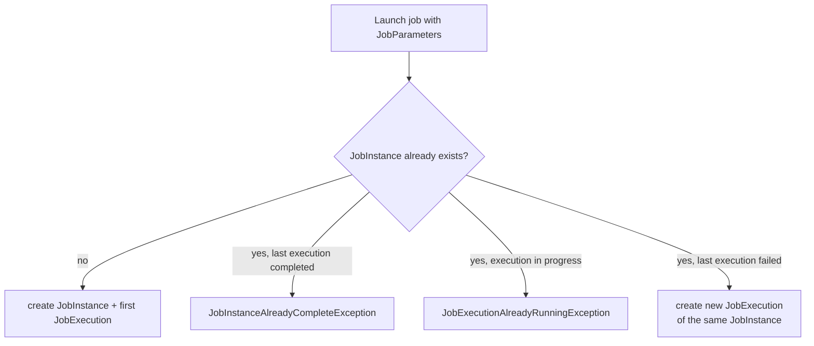

## Objective

Um job Spring Batch é uma sequência de steps, mas dois conceitos a mais tornam essa sequência útil em produção: fluxo não linear permite que um job ramifique com base em como um step realmente terminou (não só "próximo"), e o modelo JobInstance/JobExecution dá a cada execução uma identidade estrita, para que o Spring Batch consiga distinguir "o mesmo job, rodado de novo" de "a mesma execução, tentada novamente depois de uma falha."

## Use Cases

- Um job que se comporta diferente dependendo do resultado — por exemplo, pular um step de relatório se um step anterior reportou que nada foi pulado, mas rodá-lo se algo foi.
- Lançar o mesmo job de importação diária com um parâmetro `date` e poder confiar que "27 de junho" só se refere a uma execução específica, não importa quantas vezes alguém tente lançá-lo.
- Distinguir uma tentativa genuína de re-execução (deveria falhar, porque 27 de junho já foi concluído) de um retry legítimo depois que um arquivo corrompido foi corrigido (uma nova execução da mesma instância, antes de ela ter sido concluída).

## Deep Dive

### Fluxo não linear com um decision step

O resultado de um step não precisa apenas mover para um "próximo" fixo — um decider pode inspecionar a execução e rotear o fluxo com base no seu status. Em configuração Java, `JobExecutionDecider` retorna um `FlowExecutionStatus`, e `JobBuilder`/`FlowBuilder` o ligam ao fluxo:

```java
public class SkippedDecider implements JobExecutionDecider {
    @Override
    public FlowExecutionStatus decide(JobExecution jobExecution, StepExecution stepExecution) {
        return new FlowExecutionStatus(hadSkips(stepExecution) ? "SKIPPED" : "CLEAN");
    }
}

@Bean
public Job importProductsJob(JobRepository jobRepository, SkippedDecider decider,
                              Step readWrite, Step generateReport, Step sendReport, Step clean) {
    return new JobBuilder("importProductsJob", jobRepository)
        .start(readWrite)
        .next(decider).on("SKIPPED").to(generateReport)
        .from(decider).on("*").to(clean)
        .from(generateReport).next(sendReport).next(clean)
        .end()
        .build();
}
```

`.next(decider)` roteia o controle para o decider, `.on("STATUS")` casa com a string que o decider retornou (wildcards `*`/`?` permitidos), e `.to(step)` escolhe o ramo — a mesma semântica de ramificação que os elementos XML `<decision>`/`<next on="...">` do livro expressavam de forma declarativa.

### TaskletStep e a interface Tasklet

Todo step delega seu trabalho a um `Tasklet` — `TaskletStep` é a implementação que os desenvolvedores de aplicação realmente configuram (o Spring Batch também tem `FlowStep`, `JobStep`, e `PartitionStep` para compor jobs, mas eles envolvem outros jobs/flows em vez de fazer o trabalho diretamente). Um `Tasklet` customizado serve para trabalho pontual, como descompactar um arquivo; o próprio padrão chunk-oriented de read-process-write é implementado como um `Tasklet` embutido (`ChunkOrientedTasklet`) por baixo dos panos.

### JobInstance = Job + JobParameters identificadores

Uma `JobInstance` é identificada de forma única pelo job mais os parâmetros usados para lançá-lo:

```java
jobOperator.start(job, new JobParametersBuilder()
    .addString("date", "2010-06-27")
    .toJobParameters()
);
```

Nem todo parâmetro precisa participar dessa identidade. `JobParameter` carrega uma flag `identifying` (`true` por padrão); um parâmetro explicitamente marcado como não identificador — um timestamp de execução usado só para logging, digamos — não afeta qual `JobInstance` um lançamento resolve:

```java
new JobParametersBuilder()
    .addString("date", "2010-06-27")                 // identifying (default)
    .addString("runTimestamp", Instant.now().toString(), false)  // non-identifying
    .toJobParameters();
```

### Regras do ciclo de vida de execução do job

Três regras governam o que acontece quando um job é lançado:

- O primeiro lançamento de um conjunto de parâmetros cria tanto a `JobInstance` quanto sua primeira `JobExecution`.
- Lançar uma `JobInstance` que já tem uma execução *concluída com sucesso* lança `JobInstanceAlreadyCompleteException` — o Spring Batch se recusa a rerodar silenciosamente trabalho já terminado.
- Lançar uma `JobInstance` que já tem uma execução *em progresso* lança `JobExecutionAlreadyRunningException` — duas execuções concorrentes da mesma instância nunca são permitidas.

Uma execução que falhou, em contraste, deixa a instância aberta: relançar com os mesmos parâmetros inicia uma nova execução da mesma instância em vez de falhar, o que é o que torna possível repetir um job corrigido (como um arquivo reenviado, sem corrupção).



## Trade-offs

- **`JobLauncher.run(job, jobParameters)` — a chamada que este livro usa o tempo todo — está deprecated desde o Spring Batch 6.0.** `JobOperator` agora estende `JobLauncher` e adiciona `start(Job, JobParameters)` como o ponto de entrada recomendado; `JobLauncher` está programado para remoção na 6.2+. Código existente construído diretamente sobre `jobLauncher.run(...)` precisa migrar para `jobOperator.start(...)` antes que essa remoção aconteça.
- **Parâmetros não identificadores são convenientes, mas fáceis de inverter por engano.** Marcar um parâmetro que *deveria* distinguir execuções (como o `date` do livro) como não identificador por engano colapsa silenciosamente o que deveriam ser `JobInstance`s separadas numa só — o segundo lançamento ou faz no-op contra uma instância concluída ou lança exception, em vez de rodar o job que você pretendia.
- **O elemento `<decision>` do XML e a cadeia Java `JobBuilder`/`FlowBuilder` expressam a mesma lógica de ramificação, mas a forma Java mantém a classe do decider e a ligação que o referencia na mesma unidade compilada e refatorável** — renomear um bean decider no XML arrisca um descompasso silencioso que só aparece no momento de subir o job, enquanto a forma Java falha na compilação em vez disso.

## Documentation Links

- Cogoluègnes, Templier, Gregory, Bazoud, "Spring Batch in Action" (Manning, 2012) — Chapter 2, "Spring Batch concepts", sections 2.3.1 (non-linear flow) and 2.3.2 (job instances and executions), p. 44-50 — doc
- [Spring Batch Reference — Controlling Step Flow (conditional flow, JobExecutionDecider)](https://docs.spring.io/spring-batch/reference/step/controlling-flow.html) — doc
- [Spring Batch Reference — Domain Language (JobInstance, JobParameters, identifying flag)](https://docs.spring.io/spring-batch/reference/domain.html) — doc
- [Spring Batch 6.0 Migration Guide — JobLauncher deprecated in favor of JobOperator](https://github.com/spring-projects/spring-batch/wiki/Spring-Batch-6.0-Migration-Guide) — doc
