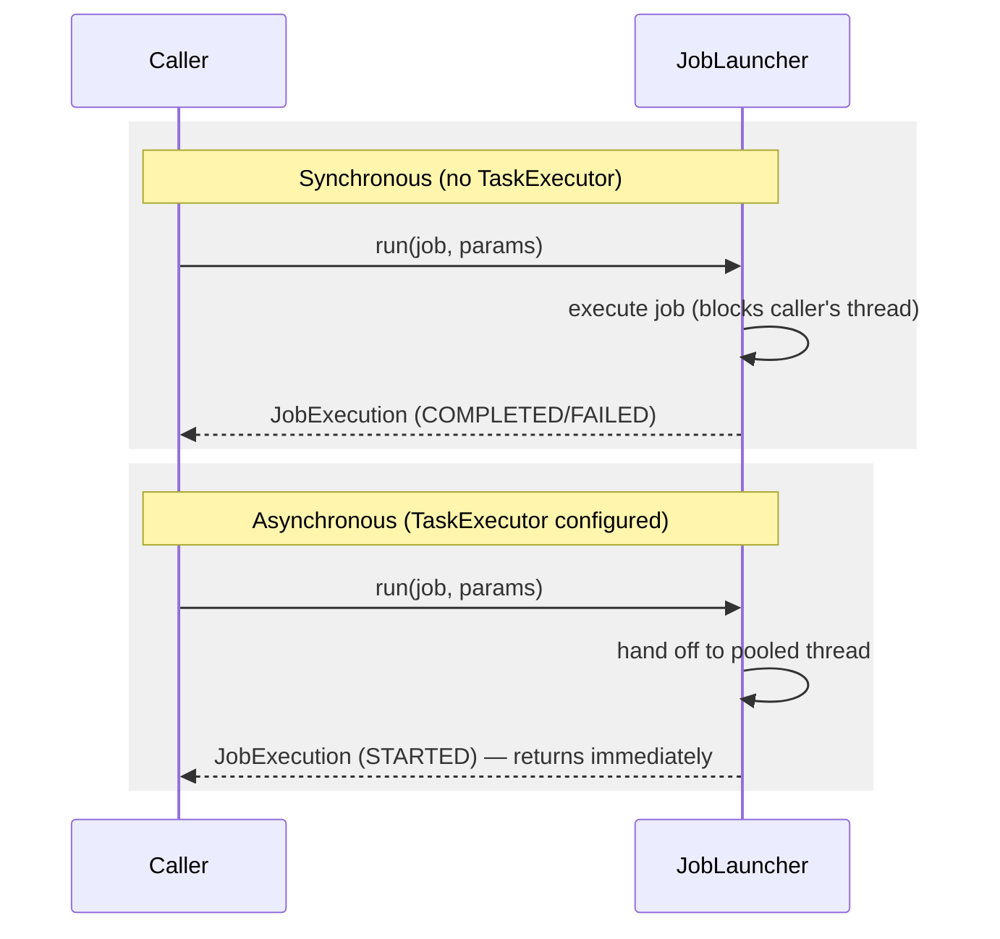

## Objective

A configured `Job` bean doesn't run itself — something has to call it, and that
something is the Spring Batch launcher API. Its entire surface is one interface
with one method, but that single method hides a real design decision: whether
the caller waits for the job to finish before getting control back, or gets a
handle to a still-running execution immediately. Getting that choice wrong is
the difference between a batch job quietly starting in the background and one
that ties up every thread in a web container.

## Use Cases

- Launching a job from a plain Java `main` method invoked by `cron` or another
  external scheduler, where the process should stay alive until the job
  genuinely finishes (a synchronous launch).
- Launching a job in response to an HTTP request handled by a web controller,
  where the request thread must return quickly instead of blocking for however
  long the batch process takes (an asynchronous launch).
- Deciding, before writing any launching code, which of the chapter's several
  launching solutions (command line, embedded scheduler, web-triggered) fits a
  given job's frequency, duration, and triggering event.

## Deep Dive

### The `JobLauncher` interface: one method, two Spring beans as arguments

```java
public interface JobLauncher {
  public JobExecution run(Job job, JobParameters jobParameters) throws (...);
}
```

Both the `Job` and the `JobLauncher` itself are ordinary Spring beans, looked
up (or injected) like any other:

```java
ApplicationContext context = (...)
JobLauncher jobLauncher = context.getBean(JobLauncher.class);
Job job = context.getBean(Job.class);
jobLauncher.run(
   job,
   new JobParametersBuilder()
     .addString("inputFile", "file:./products.txt")
     .addDate("date", new Date())
     .toJobParameters()
);
```

`JobParametersBuilder` gives a fluent way to build the `JobParameters`
argument at the call site — each parameter is a key/value pair, and Spring
Batch supports four value types: string, long, double, and date. These are
the same job parameters that determine `JobInstance` identity, covered
elsewhere in this workflow.

The book's own XML wiring for the standard implementation needs only a job
repository:

```xml
<batch:job-repository id="jobRepository" />

<bean id="jobLauncher" class="org.springframework.
 ➥ batch.core.launch.support.SimpleJobLauncher">
  <property name="jobRepository" ref="jobRepository" />
</bean>
```

`run()` returns a `JobExecution` — the same domain object covered elsewhere in
this workflow — which is how a caller queries whether the launched execution
is running, finished, or failed.

### Synchronous by default: the caller waits

Without any extra configuration, `run()` blocks: the calling thread doesn't
get control back until the job execution ends, successfully or not. This is
exactly right for a `main` method a scheduler like `cron` invokes — the
process should stay alive for the job's entire duration, then exit with a
status reflecting the outcome.

It's exactly wrong for a web controller that triggers a job on an HTTP
request. A synchronous launch runs the batch process on the request-handling
thread itself, monopolizing a web container's limited thread pool for however
long the job takes — submit a handful of long jobs this way and the container
runs out of threads to serve any other request.

### Making a launch asynchronous: supply a `TaskExecutor`

The fix is entirely configuration, not application code — give the job
launcher a `TaskExecutor` and it hands job execution off to a pooled thread
instead of running it on the caller's own thread:

```xml
<task:executor id="executor" pool-size="10" />

<bean id="jobLauncher" class="org.springframework.
 ➥ batch.core.launch.support.SimpleJobLauncher">
  <property name="jobRepository" ref="jobRepository" />
  <property name="taskExecutor" ref="executor" />
</bean>
```

With a `TaskExecutor` in place, `run()` returns immediately with a
`JobExecution` in a `STARTED` state — the caller has an execution handle to
query later, without ever blocking on the job's actual completion. The
`<task:executor>` XML shortcut comes from Spring's own `task` namespace
(available since Spring 3.0); a `TaskExecutor` bean like
`ThreadPoolTaskExecutor` can be declared the same way as any other bean
instead, with identical effect.



### Choosing a launching solution: the chapter's roadmap

The book frames "how do I actually trigger this?" as a separate question from
the launcher API itself, driven by factors like launch frequency, job count,
triggering event, and job duration — and previews three shapes covered later
in the same chapter:

- **Command-line launching** — each execution spawns a new JVM process,
  triggered by a scheduler (`cron`) or a human operator; simple, but pays the
  cost of initializing the whole batch environment on every single run.
- **Embedding Spring Batch (plus a scheduler) in a running container** — a web
  container keeps the batch environment warm at all times, avoiding
  per-execution startup cost, and can host a Java-based scheduler alongside it.
- **Embedding Spring Batch and triggering jobs by an external event** — a mix
  of the two above, e.g. `cron` submitting an HTTP request to a web controller
  that's already running inside a container with Spring Batch embedded.

None of these are mutually exclusive, and the book is explicit that the list
isn't exhaustive — nothing rules out other triggers (JMS, JMX) built on the
same simple launcher API.

## Trade-offs

- **The synchronous default is correct far more often than it first
  appears.** A scheduler-invoked `main` method *wants* to block — the process
  existing at all is the mechanism that keeps the job alive. The asynchronous
  case is the one that needs deliberate opt-in via a `TaskExecutor`, not the
  reverse.
- **Forgetting to make a web-triggered launcher asynchronous is a resource
  exhaustion bug, not a correctness bug.** The job still runs and still
  completes — the failure mode is the web container's thread pool silently
  draining as concurrent batch launches pile onto request-handling threads,
  which surfaces as unrelated requests timing out rather than as an obvious
  batch-related error.
- **An asynchronous launch trades "wait for the result" for "poll for the
  result."** The caller gets a `JobExecution` back immediately, in a
  `STARTED` state — actually knowing whether the job succeeded means querying
  that execution object later, not assuming success just because `run()`
  returned without throwing.
- **Book vs. today: `JobLauncher` itself — the interface this whole section
  is built around — is deprecated since Spring Batch 6.0, in favor of
  `JobOperator`, with removal planned for 6.2+.** Confirmed via the official
  Spring Batch 6.0 migration guide and current API docs. `JobOperator` now
  extends `JobLauncher`, so a `JobLauncher` bean is no longer needed
  separately — the current recommended launcher implementation is
  `TaskExecutorJobOperator`, replacing both the synchronous and asynchronous
  cases this section covers with one class:
  ```java
  @Bean
  public JobOperator jobOperator(JobRepository jobRepository) {
      TaskExecutorJobOperator jobOperator = new TaskExecutorJobOperator();
      jobOperator.setJobRepository(jobRepository);
      // omit setTaskExecutor(...) for synchronous behavior (the default,
      // a SyncTaskExecutor); supply one for asynchronous behavior
      return jobOperator;
  }
  ```
  The book's `run(Job, JobParameters)` method signature and its
  synchronous-by-default/asynchronous-via-`TaskExecutor` behavior are
  otherwise unchanged in spirit — `JobOperator` inherits `run()` from
  `JobLauncher` and behaves the same way, just under a renamed, expanded
  interface.
- **Book vs. today: the book's specific `SimpleJobLauncher` class was already
  on a deprecation path before Spring Batch 6.0 even shipped.**
  `SimpleJobLauncher` was deprecated since 5.0 (removal planned for 5.2) in
  favor of `TaskExecutorJobLauncher` — which was itself then deprecated at
  6.0 in favor of `TaskExecutorJobOperator`. Anyone following the book's XML
  bean definition verbatim on a current Spring Batch version is instantiating
  a class two deprecation cycles removed from the currently recommended one.
  Confirmed via the current Spring Batch deprecated-list and API docs.

## Documentation Links

- Cogoluègnes, Templier, Gregory, Bazoud, "Spring Batch in Action" (Manning, 2012) — Chapter 4, "Running batch jobs", section 4.1, "Launching concepts", p. 88-92 — doc
- [Spring Batch API — JobOperator (6.0)](https://docs.spring.io/spring-batch/reference/api/org/springframework/batch/core/launch/JobOperator.html) — doc
- [Spring Batch API — TaskExecutorJobOperator](https://docs.spring.io/spring-batch/reference/api/org/springframework/batch/core/launch/support/TaskExecutorJobOperator.html) — doc
- [Spring Batch 6.0 Migration Guide — JobLauncher deprecated in favor of JobOperator](https://github.com/spring-projects/spring-batch/wiki/Spring-Batch-6.0-Migration-Guide) — doc
