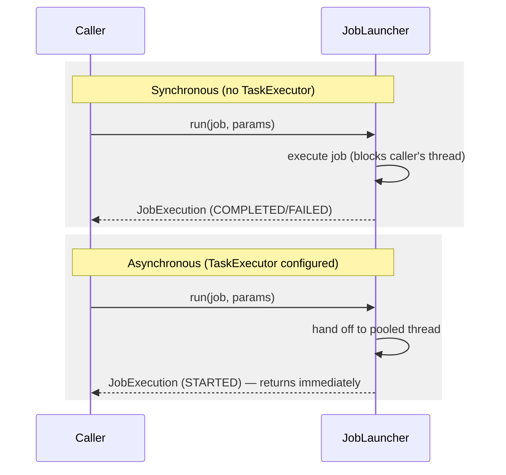

## Objective

Um bean `Job` configurado não roda sozinho — algo precisa chamá-lo, e esse
algo é a API de launcher do Spring Batch. Sua superfície inteira é uma
interface com um método, mas esse único método esconde uma decisão de design
real: se o caller espera o job terminar antes de receber o controle de volta,
ou recebe imediatamente um handle para uma execução ainda em andamento.
Errar essa escolha é a diferença entre um batch job iniciando
silenciosamente em background e um que trava todas as threads de um
container web.

## Use Cases

- Lançar um job a partir de um método `main` Java simples invocado pelo
  `cron` ou outro scheduler externo, onde o processo deve continuar vivo até
  o job genuinamente terminar (um lançamento síncrono).
- Lançar um job em resposta a um request HTTP tratado por um controller web,
  onde a thread de request precisa retornar rapidamente em vez de bloquear
  pelo tempo que o processo batch levar (um lançamento assíncrono).
- Decidir, antes de escrever qualquer código de lançamento, qual das várias
  soluções de lançamento do capítulo (linha de comando, scheduler embutido,
  disparado via web) se encaixa na frequência, duração e evento de disparo de
  um dado job.

## Deep Dive

### A interface `JobLauncher`: um método, dois beans Spring como argumentos

```java
public interface JobLauncher {
  public JobExecution run(Job job, JobParameters jobParameters) throws (...);
}
```

Tanto `Job` quanto o próprio `JobLauncher` são beans Spring comuns,
localizados (ou injetados) como qualquer outro:

```java
ApplicationContext context = (...)
JobLauncher jobLauncher = context.getBean(JobLauncher.class);
Job job = context.getBean(Job.class);
jobLauncher.run(
   job,
   new JobParametersBuilder()
     .addString("inputFile", "file:./products.txt")
     .addDate("date", new Date())
     .toJobParameters()
);
```

`JobParametersBuilder` dá uma forma fluente de construir o argumento
`JobParameters` no ponto de chamada — cada parâmetro é um par chave/valor, e o
Spring Batch suporta quatro tipos de valor: string, long, double e date.
Esses são os mesmos job parameters que determinam a identidade de
`JobInstance`, cobertos em outra parte deste workflow.

O próprio wiring XML do livro para a implementação padrão precisa só de um
job repository:

```xml
<batch:job-repository id="jobRepository" />

<bean id="jobLauncher" class="org.springframework.
 ➥ batch.core.launch.support.SimpleJobLauncher">
  <property name="jobRepository" ref="jobRepository" />
</bean>
```

`run()` retorna um `JobExecution` — o mesmo objeto de domínio coberto em outra
parte deste workflow — que é como um caller consulta se a execução lançada
está rodando, terminou, ou falhou.

### Síncrono por padrão: o caller espera

Sem nenhuma configuração extra, `run()` bloqueia: a thread chamadora não
recebe o controle de volta até que a execução do job termine, com sucesso ou
não. Isso é exatamente certo para um método `main` que um scheduler como
`cron` invoca — o processo deve continuar vivo pela duração inteira do job, e
então sair com um status refletindo o resultado.

É exatamente errado para um controller web que dispara um job numa requisição
HTTP. Um lançamento síncrono roda o processo batch na própria thread que
trata o request, monopolizando o pool limitado de threads de um container web
pelo tempo que o job levar — envie alguns jobs longos dessa forma e o
container fica sem threads para servir qualquer outro request.

### Tornando um lançamento assíncrono: fornecendo um `TaskExecutor`

A correção é inteiramente configuração, não código de aplicação — dê ao job
launcher um `TaskExecutor` e ele passa a execução do job para uma thread do
pool em vez de rodar na própria thread do caller:

```xml
<task:executor id="executor" pool-size="10" />

<bean id="jobLauncher" class="org.springframework.
 ➥ batch.core.launch.support.SimpleJobLauncher">
  <property name="jobRepository" ref="jobRepository" />
  <property name="taskExecutor" ref="executor" />
</bean>
```

Com um `TaskExecutor` em vigor, `run()` retorna imediatamente com um
`JobExecution` num estado `STARTED` — o caller tem um handle de execução para
consultar depois, sem nunca bloquear na conclusão real do job. O atalho XML
`<task:executor>` vem do próprio namespace `task` do Spring (disponível desde
o Spring 3.0); um bean `TaskExecutor` como `ThreadPoolTaskExecutor` pode ser
declarado da mesma forma que qualquer outro bean, com efeito idêntico.



### Escolhendo uma solução de lançamento: o roteiro do capítulo

O livro trata "como eu de fato disparo isso?" como uma pergunta separada da
própria API de launcher, guiada por fatores como frequência de lançamento,
número de jobs, evento de disparo e duração do job — e antecipa três formatos
cobertos mais adiante no mesmo capítulo:

- **Lançamento via linha de comando** — cada execução dispara um novo
  processo JVM, disparado por um scheduler (`cron`) ou um operador humano;
  simples, mas paga o custo de inicializar todo o ambiente batch em cada
  execução.
- **Embutir o Spring Batch (mais um scheduler) num container em execução** —
  um container web mantém o ambiente batch aquecido o tempo todo, evitando o
  custo de startup por execução, e pode hospedar um scheduler baseado em Java
  junto com ele.
- **Embutir o Spring Batch e disparar jobs por um evento externo** — uma
  mistura das duas anteriores, por exemplo o `cron` submetendo um request
  HTTP a um controller web que já está rodando dentro de um container com o
  Spring Batch embutido.

Nenhuma dessas se exclui mutuamente, e o livro é explícito que a lista não é
exaustiva — nada impede outros gatilhos (JMS, JMX) construídos sobre a mesma
API de launcher simples.

## Trade-offs

- **O default síncrono está correto com muito mais frequência do que
  parece à primeira vista.** Um método `main` invocado por scheduler *quer*
  bloquear — o processo existir de forma alguma é o mecanismo que mantém o
  job vivo. O caso assíncrono é o que precisa de opt-in deliberado via um
  `TaskExecutor`, não o contrário.
- **Esquecer de tornar assíncrono um launcher disparado via web é um bug
  de exaustão de recursos, não um bug de correção.** O job ainda roda e ainda
  completa — o modo de falha é o pool de threads do container web esvaziando
  silenciosamente conforme lançamentos batch concorrentes se empilham sobre
  threads de tratamento de request, o que aparece como requests não
  relacionados dando timeout em vez de um erro óbvio relacionado a batch.
- **Um lançamento assíncrono troca "esperar pelo resultado" por "fazer
  polling pelo resultado".** O caller recebe um `JobExecution` de volta
  imediatamente, num estado `STARTED` — realmente saber se o job teve
  sucesso significa consultar esse objeto de execução depois, não assumir
  sucesso só porque `run()` retornou sem lançar exception.
- **Livro vs. hoje: `JobLauncher` em si — a interface ao redor da qual esta
  seção inteira é construída — está deprecado desde o Spring Batch 6.0, em
  favor de `JobOperator`, com remoção planejada para 6.2+.** Confirmado pelo
  guia de migração oficial do Spring Batch 6.0 e pela documentação atual da
  API. `JobOperator` agora estende `JobLauncher`, então um bean `JobLauncher`
  não é mais necessário separadamente — a implementação de launcher
  recomendada atualmente é `TaskExecutorJobOperator`, substituindo tanto o
  caso síncrono quanto o assíncrono cobertos nesta seção por uma única
  classe:
  ```java
  @Bean
  public JobOperator jobOperator(JobRepository jobRepository) {
      TaskExecutorJobOperator jobOperator = new TaskExecutorJobOperator();
      jobOperator.setJobRepository(jobRepository);
      // omit setTaskExecutor(...) for synchronous behavior (the default,
      // a SyncTaskExecutor); supply one for asynchronous behavior
      return jobOperator;
  }
  ```
  A assinatura de método `run(Job, JobParameters)` do livro e seu
  comportamento síncrono-por-padrão/assíncrono-via-`TaskExecutor` permanecem
  inalterados em essência — `JobOperator` herda `run()` de `JobLauncher` e se
  comporta da mesma forma, só sob uma interface renomeada e expandida.
- **Livro vs. hoje: a classe específica `SimpleJobLauncher` do livro já
  estava num caminho de depreciação antes mesmo do Spring Batch 6.0 ser
  lançado.** `SimpleJobLauncher` foi deprecada desde a 5.0 (remoção planejada
  para a 5.2) em favor de `TaskExecutorJobLauncher` — que por sua vez foi
  então deprecada na 6.0 em favor de `TaskExecutorJobOperator`. Quem segue a
  definição de bean XML do livro ao pé da letra numa versão atual do Spring
  Batch está instanciando uma classe dois ciclos de depreciação distante da
  atualmente recomendada. Confirmado pela deprecated-list e pela
  documentação de API atuais do Spring Batch.

## Documentation Links

- Cogoluègnes, Templier, Gregory, Bazoud, "Spring Batch in Action" (Manning, 2012) — Chapter 4, "Running batch jobs", section 4.1, "Launching concepts", p. 88-92 — doc
- [Spring Batch API — JobOperator (6.0)](https://docs.spring.io/spring-batch/reference/api/org/springframework/batch/core/launch/JobOperator.html) — doc
- [Spring Batch API — TaskExecutorJobOperator](https://docs.spring.io/spring-batch/reference/api/org/springframework/batch/core/launch/support/TaskExecutorJobOperator.html) — doc
- [Spring Batch 6.0 Migration Guide — JobLauncher deprecated in favor of JobOperator](https://github.com/spring-projects/spring-batch/wiki/Spring-Batch-6.0-Migration-Guide) — doc
