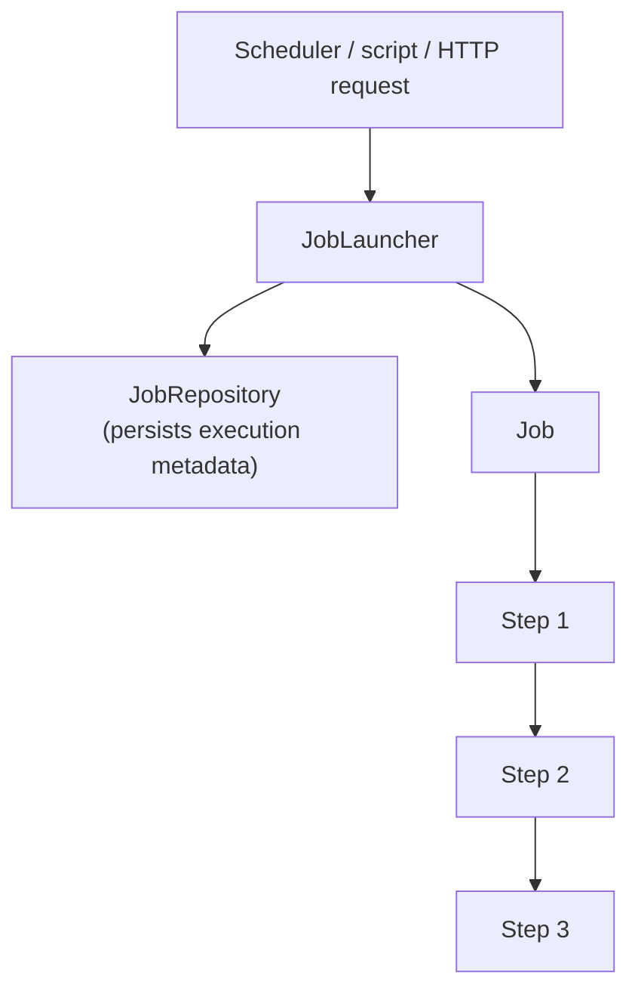

## Objective

Entenda os dois componentes de infraestrutura de que toda aplicação Spring Batch depende — o `JobLauncher`, que inicia execuções de job, e o `JobRepository`, que persiste os metadados de execução — e como um `Job` é modelado como uma sequência de `Step`s com fluxo de controle não linear opcional, baseado no resultado de um step.

## Use Cases

- Decidir se os metadados de um job precisam sobreviver a um restart (job repository persistente) ou podem ser descartados após uma única execução (repositório leve, em memória) — essa decisão também determina se o job pode ser reiniciado de onde falhou.
- Modelar um processo em lote como uma sequência de `Step`s testáveis de forma independente (descompactar → ler-escrever → limpar) em vez de um job monolítico, para que os steps possam ser reutilizados entre jobs.
- Adicionar um branch condicional a um job — por exemplo, gerar e enviar um relatório apenas se o step anterior tiver pulado registros — usando o fluxo de controle do Spring Batch baseado no resultado do step em vez de lógica de orquestração feita à mão.
- Ler uma configuração de Spring Batch desconhecida e reconhecer quais partes são infraestrutura (job repository, job launcher — fornecidos pelo framework) versus código de aplicação (o job e seus steps — escritos pelo desenvolvedor).

## Deep Dive

### Dois componentes de infraestrutura: `JobLauncher` e `JobRepository`

Toda aplicação Spring Batch depende das duas mesmas interfaces de infraestrutura. O `JobLauncher` é o ponto de entrada — onde o mundo externo (um scheduler, um script, uma requisição HTTP) encontra o Spring Batch:

```java
public interface JobLauncher {
  JobExecution run(Job job, JobParameters jobParameters)
      throws JobExecutionAlreadyRunningException, JobRestartException,
             JobInstanceAlreadyCompleteException, JobParametersInvalidException;
}
```

`SimpleJobLauncher`, a implementação do framework, só *inicia* um job — ele delega a criação e persistência de fato do estado de execução para o `JobRepository`:

```java
public interface JobRepository {
  boolean isJobInstanceExists(String jobName, JobParameters jobParameters);
  JobExecution createJobExecution(String jobName, JobParameters jobParameters)
      throws JobExecutionAlreadyRunningException, JobRestartException,
             JobInstanceAlreadyCompleteException;
  void update(JobExecution jobExecution);
  void add(StepExecution stepExecution);
  void update(StepExecution stepExecution);
  StepExecution getLastStepExecution(JobInstance jobInstance, String stepName);
  JobExecution getLastJobExecution(String jobName, JobParameters jobParameters);
}
```

O repositório rastreia quais steps rodaram, quantos itens foram lidos/escritos/pulados, e quanto tempo cada step levou — tudo de forma transparente, sem que o código da aplicação o chame diretamente.



### Job repository em memória vs. persistente: o trade-off é monitoramento e restart

Um job repository em memória é mais simples de configurar, mas perde tudo ao sair do processo — sem restart de onde falhou, sem visibilidade entre processos, e não é seguro para execução concorrente de jobs. Um job repository persistente, apoiado em um banco relacional, adiciona três capacidades em troca do overhead de conversar com um banco a cada step: monitoramento (o histórico de execução é consultável), restart (um job que falhou retoma do último step bem-sucedido em vez de recomeçar do zero), e segurança contra lançar a mesma instância de job duas vezes a partir de processos diferentes, já que o banco fornece o isolamento.

A orientação prática se mantém independente da época: use o repositório em memória para desenvolvimento e testes; use o repositório persistente — idealmente contra o *mesmo* banco de dados dos dados de negócio, para manter os metadados de batch e os dados de negócio transacionalmente consistentes — para qualquer coisa que precise de restart ou monitoramento.

### Modelando um job como uma sequência de steps

Um `Job` não é uma unidade opaca única de trabalho; ele é composto por `Step`s, cada um configurável e testável de forma independente:

| Component | Description |
|---|---|
| Job repository | Infrastructure component that persists job execution metadata |
| Job launcher | Infrastructure component that starts job executions |
| Job | Application component representing a batch process |
| Step | A phase in a job; a job is a sequence of steps |
| Tasklet | A transactional, potentially repeatable process occurring in a step |
| Item reader / processor / writer | Read, transform/validate/filter, and write one item of a chunk |

Decompor um job em steps (descompactar → ler-escrever → limpar, por exemplo) é mais limpo do que um job monolítico tanto para testes — cada step pode ser testado isoladamente — quanto para reuso, já que um step como "descompactar um arquivo" pode ser compartilhado entre qualquer job que precise da mesma operação, apenas referenciando-o a partir de uma configuração de job diferente.

### Fluxo de controle não linear baseado no resultado do step

Os steps de um job não precisam rodar em linha reta. O Spring Batch pode ramificar com base no status de um step (completado, falhou) ou em lógica de decisão customizada — por exemplo, rodando um par "gerar relatório" / "enviar relatório" apenas quando o step de leitura/escrita pulou registros, antes de continuar para um step de limpeza compartilhado:

```xml
<job id="importProductsJob" xmlns="http://www.springframework.org/schema/batch">
  <step id="decompress" next="readWrite">
    <tasklet ref="decompressTasklet" />
  </step>
  <step id="readWrite" next="skippedDecision">
    <tasklet>
      <chunk reader="reader" writer="writer" commit-interval="100" />
    </tasklet>
  </step>
  <!-- skippedDecision branches to generateReport+sendReport, or straight to cleanup -->
</job>
```

Isso mantém a lógica de processamento (dentro dos steps) separada da lógica de fluxo de execução (as transições entre steps), que é declarada uma única vez em nível de job em vez de ficar espalhada como lógica condicional dentro dos steps individuais — os steps permanecem desacoplados entre si porque nenhum deles precisa saber o que roda a seguir.

### O livro vs. hoje: do XML `<batch:job-repository>` ao `@EnableJdbcJobRepository`, e `ResourcelessJobRepository` para execuções leves

O livro (2012, Spring Batch 2.1) configura o job repository e o launcher inteiramente em XML:

```xml
<batch:job-repository id="jobRepository"
    data-source="dataSource" transaction-manager="transactionManager" />
<bean id="jobLauncher" class="org.springframework.batch.core.launch.support.SimpleJobLauncher">
  <property name="jobRepository" ref="jobRepository" />
</bean>
```

O namespace XML está deprecated (veja `spring-batch-chunk-processing` para o substituto baseado em Java `JobBuilder`/`StepBuilder`). O lado da infraestrutura seguiu na mesma direção: `@EnableBatchProcessing` agora autoconfigura um `JobRepository` e um `JobLauncher` como beans, e um repositório persistente apoiado em JDBC é configurado declarativamente via `@EnableJdbcJobRepository` (data source, transaction manager, prefixo de tabela, isolation level como atributos) em vez de um elemento XML `job-repository`.

A outra opção em memória do livro, `MapJobRepositoryFactoryBean`, foi deprecated no Spring Batch 4 e removida no Spring Batch 5. Sua substituta para execuções leves, de único JVM, não reiniciáveis (desenvolvimento, testes, jobs pontuais) **não** é "simplesmente aponte para o H2" — é um `ResourcelessJobRepository` construído para esse propósito, o padrão quando `@EnableBatchProcessing` não tem um `DataSource` configurado, introduzido no Spring Batch 5.2. Um banco embarcado (H2 ou similar) continua sendo o caminho recomendado quando um teste realmente precisa verificar comportamento de restart/monitoramento, já que o `ResourcelessJobRepository` é intencionalmente não persistente e não thread-safe.

## Trade-offs

- **O repositório em memória troca segurança por simplicidade — isso é um risco real de produção, não só um atalho de teste.** Ele não é projetado para acesso concorrente; rodá-lo em produção arrisca exatamente o mesmo job ser lançado duas vezes a partir de nós diferentes sem nenhum isolamento para impedir isso.
- **Um job repository persistente contra um banco separado dos dados de negócio reintroduz o problema do two-phase commit** — sem um JTA abrangendo os dois bancos, os metadados de batch (contagens de itens pulados, posição de restart) e os dados de negócio podem desincronizar em caso de falha, produzindo contagens de skip incorretas ou restarts quebrados. Compartilhar um único banco evita o problema por completo, ao custo de acoplar os schemas.
- **Fluxo de controle não linear adiciona poder ao custo de rastreabilidade** — um job com vários pontos de decisão é mais flexível que uma sequência linear, mas mais difícil de entender rapidamente do que "step 1, depois step 2, depois step 3"; o trade-off vale a pena exatamente quando os branches refletem condições de negócio genuínas (um limite de skip, um caso de arquivo não encontrado), não como uma escolha padrão de estruturação.

> **Update:** as of Spring Batch 6.0, `JobLauncher` (including `run(...)`, used
> throughout this concept) is deprecated in favor of `JobOperator.start(Job, JobParameters)`,
> a drop-in replacement — removal is slated for 6.2+.

## Documentation Links

- [Spring Batch in Action (Manning, 2012) — Chapter 1, "Introducing Spring Batch", p. 26-31, and Chapter 2, "Spring Batch concepts", p. 32-43](https://www.manning.com/books/spring-batch-in-action) — doc
- [Spring Batch Reference — Configuring a JobRepository](https://docs.spring.io/spring-batch/reference/job/configuring-repository.html) — doc
- [Spring Batch Reference — Configuring a JobLauncher](https://docs.spring.io/spring-batch/reference/5.1/job/configuring-launcher.html) — doc
- [Spring Boot Reference — Spring Batch](https://docs.spring.io/spring-boot/reference/io/spring-batch.html) — doc
- [Spring Batch 5.0 Migration Guide](https://github.com/spring-projects/spring-batch/wiki/Spring-Batch-5.0-Migration-Guide) — doc
- [Spring Batch 6.0 Migration Guide — JobLauncher deprecated in favor of JobOperator](https://github.com/spring-projects/spring-batch/wiki/Spring-Batch-6.0-Migration-Guide) — doc
