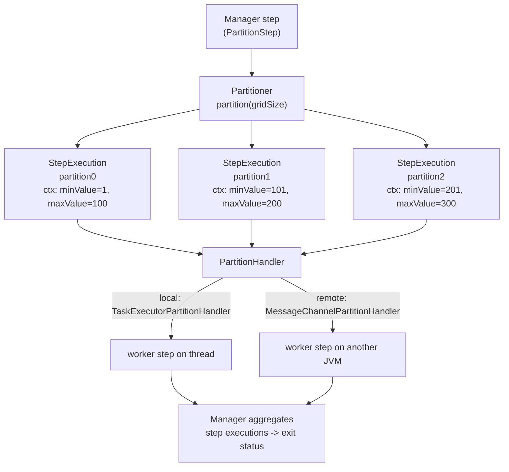

## Objective

Partitioning is the fourth and, in the book's words, "arguably the most popular"
scaling strategy in Spring Batch. Instead of throwing threads at one step
(`spring-batch-multithreaded-and-parallel-steps`) or shipping chunks over
middleware (`spring-batch-remote-chunking`), you **split the input data into
non-overlapping partitions** and let each partition run as its own
**`StepExecution`** of an ordinary chunk-oriented step
(`spring-batch-chunk-processing`). A *manager* step does the splitting; *workers*
do the work.

The payoff is that the split is *your* decision — primary-key ranges, one file per
partition, one tenant per partition — and the worker step is completely unaware it
was partitioned. Two interfaces carry the whole design: a **`Partitioner`** decides
*what* the partitions are, and a **`PartitionHandler`** decides *where* they run.
Swap the handler and the same job goes from local threads to a cluster without
touching the reader, processor, or writer. And because every partition is a real
`StepExecution` recorded in the job repository, **restart still works out of the
box** — the one thing remote chunking cannot promise without transactional
middleware. This entry closes with the book's comparison of all four Chapter 13
strategies.

## Use Cases

- Importing a directory of input files where each file should be handled
  independently and concurrently — one partition per file, via the built-in
  `MultiResourcePartitioner`.
- Loading a large table where rows can be sliced by an integer key — a
  `ColumnRangePartitioner` hands each worker a `minValue`/`maxValue` range so the
  readers never see the same row twice.
- Scaling I/O-bound work (the case remote chunking handles badly, because the
  manager's single reader becomes the bottleneck): every worker reads its own slice.
- Growing from one box to many *without a rewrite*: start with
  `TaskExecutorPartitionHandler` (threads), later move to
  `MessageChannelPartitionHandler` (remote workers) — same `Partitioner`, same step.
- Per-partition parameters via late binding: `#{stepExecutionContext['fileName']}`
  in a `@StepScope` reader.

## Deep Dive

### The shape of a partitioned step

Partitioning happens **at the step level** and divides into two concerns that the
book keeps deliberately separate:

- **Data partitioning** — creating the step executions that describe the work.
  This is domain logic (key ranges, filenames, first letter of a product name) and
  is the part you normally write: a `Partitioner`.
- **Step execution handling** — deciding how those step executions actually run:
  local threads, or remote nodes over messaging. This is infrastructure and Spring
  Batch (plus Spring Batch Integration) supplies it: a `PartitionHandler`.



The manager step invokes the handler, the handler runs the partitions, then the
manager **aggregates the results** and sets its own status from them. A partition
failing fails the manager step.

### Configuring a local partitioned step

The book uses XML (`<batch:partition step="…" partitioner="…">` with a nested
`<batch:handler grid-size="2" task-executor="taskExecutor"/>`). Today it is a
`StepBuilder` that switches into a `PartitionStepBuilder` the moment you call
`.partitioner(...)`:

```java
@Bean
public Step readWriteProductsManagerStep(JobRepository jobRepository,
        Partitioner partitioner, Step readWriteProductsStep) {

    return new StepBuilder("readWriteProducts.manager", jobRepository)
        .partitioner("readWriteProductsStep", partitioner) // worker step name + splitting strategy
        .step(readWriteProductsStep)                       // the step to run per partition
        .gridSize(4)                                       // hint: how many partitions to create
        .taskExecutor(new SimpleAsyncTaskExecutor("partition-"))
        .build();
}

@Bean
public Step readWriteProductsStep(JobRepository jobRepository,
        PlatformTransactionManager tx, ItemReader<Product> reader, ItemWriter<Product> writer) {
    return new StepBuilder("readWriteProductsStep", jobRepository)
        .<Product, Product>chunk(100).transactionManager(tx)
        .reader(reader).writer(writer)
        .build();
}
```

Three things to notice:

- The **worker step is untouched** — a plain chunk-oriented step. Partitioning is
  "only a matter of configuration"; it has no impact on readers, processors, or
  writers.
- `.step(workerStep)` + `.taskExecutor(...)` is shorthand: the builder assembles a
  `TaskExecutorPartitionHandler` for you. That is the **default and only**
  `PartitionHandler` in Spring Batch core, and it is *local* — partitions run as
  threads in this JVM.
- `.step(...)` only makes sense **locally**, because it references a `Step` bean in
  *this* application context. For remote partitioning you instead give the handler a
  step **name** (a `String`) that it sends to workers, where it resolves against
  *their* context.

`gridSize` is a **hint**, not a guarantee: it is passed to the splitter and on to
`Partitioner.partition(int gridSize)`, and a partitioner is free to return a
different number of partitions (a per-file partitioner returns one per file
regardless). It also keeps a single step from saturating the task executor.

### The partitioning SPI

Table 13.3 in the book lists the three interfaces, and they are unchanged in
substance today (all now in `org.springframework.batch.core.partition`):

| Interface | Role | Default implementation |
| --- | --- | --- |
| `PartitionHandler` | Controls execution of a partitioned `StepExecution`. Knows nothing about *how* the data was split and does not aggregate results. | `TaskExecutorPartitionHandler` (local threads) |
| `StepExecutionSplitter` | Generates the input execution contexts / `StepExecution`s for a partitioned step, independent of the fabric they run on. | `SimpleStepExecutionSplitter` |
| `Partitioner` | Creates the partition metadata — the actual splitting strategy. | `SimplePartitioner` (empty contexts) |

The collaboration, in order: `PartitionStep` → `PartitionHandler` →
`StepExecutionSplitter` → `Partitioner`.

```java
@FunctionalInterface
public interface PartitionHandler {
    Collection<StepExecution> handle(StepExecutionSplitter stepSplitter,
                                     StepExecution stepExecution) throws Exception;
}

public interface StepExecutionSplitter {
    String getStepName();
    Set<StepExecution> split(StepExecution stepExecution, int gridSize)
            throws JobExecutionException;
}

public interface Partitioner {
    Map<String, ExecutionContext> partition(int gridSize);
}
```

`SimpleStepExecutionSplitter` delegates to a `Partitioner` for the
`ExecutionContext`s, then does the bookkeeping the developer should not have to:
it names each partition `<workerStepName>:<partitionKey>` (for example
`readWriteProductsStep:partition0`) and, **on a restart, reuses the step
executions from the previous run** so completed partitions are not redone. That is
why the book says custom `StepExecutionSplitter` implementations are rare —
"customizations take place at the `Partitioner` level."

### Writing a `Partitioner`: how metadata reaches each worker

A `Partitioner` returns a `Map` whose **keys are unique partition names** and whose
**values are `ExecutionContext`s** — the input parameters for that partition. Those
contexts are persisted as each worker's *step* `ExecutionContext`, which is exactly
how a remote worker in another JVM receives its instructions. The book's
`ColumnRangePartitioner`, modernized to `JdbcTemplate` (`SimpleJdbcTemplate` is long
gone):

```java
public class ColumnRangePartitioner implements Partitioner {

    private JdbcTemplate jdbcTemplate;
    private String table;
    private String column;

    @Override
    public Map<String, ExecutionContext> partition(int gridSize) {
        int min = jdbcTemplate.queryForObject("SELECT MIN(" + column + ") FROM " + table, Integer.class);
        int max = jdbcTemplate.queryForObject("SELECT MAX(" + column + ") FROM " + table, Integer.class);
        int targetSize = (max - min) / gridSize + 1;

        Map<String, ExecutionContext> result = new HashMap<>();
        int number = 0, start = min, end = start + targetSize - 1;

        while (start <= max) {
            ExecutionContext value = new ExecutionContext();
            result.put("partition" + number, value);
            if (end >= max) {
                end = max;
            }
            value.putInt("minValue", start);   // consumed by the worker's reader
            value.putInt("maxValue", end);
            start += targetSize;
            end += targetSize;
            number++;
        }
        return result;
    }
}
```

The worker's reader then picks its slice up through **late binding**, which is where
partitioning gets its real power — each `StepExecution` runs the same step
definition with *different* parameter values. The reader must be `@StepScope` so
the expression is resolved per step execution, not at context startup:

```java
@Bean
@StepScope
public JdbcPagingItemReader<Product> reader(DataSource dataSource,
        @Value("#{stepExecutionContext['minValue']}") Integer minValue,
        @Value("#{stepExecutionContext['maxValue']}") Integer maxValue) {

    return new JdbcPagingItemReaderBuilder<Product>()
        .name("productReader")
        .dataSource(dataSource)
        .selectClause("SELECT id, name, price")
        .fromClause("FROM product")
        .whereClause("WHERE id >= :minValue AND id <= :maxValue")
        .parameterValues(Map.of("minValue", minValue, "maxValue", maxValue))
        .sortKeys(Map.of("id", Order.ASCENDING))
        .pageSize(100)
        .build();
}
```

Note the consequence for the multithreaded-step caveat: because each partition gets
its **own** reader instance (step-scoped) reading a **disjoint** slice, the
thread-safety and restart-position problems of a multithreaded step simply do not
arise. Restart re-creates the partitions and reruns only the ones that failed.

### One partition per file: `MultiResourcePartitioner`

For the common "import every file in a directory" case Spring Batch ships a ready
partitioner. It creates one partition per `Resource` and puts the resource under a
context key — `keyName`, defaulting to `"fileName"`:

```java
@Bean
public Partitioner partitioner(
        @Value("file:./resources/partition/input/*.txt") Resource[] resources) {
    MultiResourcePartitioner partitioner = new MultiResourcePartitioner();
    partitioner.setResources(resources);
    partitioner.setKeyName("fileName");   // default
    return partitioner;
}

@Bean
@StepScope
public FlatFileItemReader<Product> reader(
        @Value("#{stepExecutionContext['fileName']}") Resource resource) {
    return new FlatFileItemReaderBuilder<Product>()
        .name("productReader").resource(resource)
        .delimited().names("id", "name", "price")
        .targetType(Product.class)
        .build();
}
```

This is the concrete win over a multithreaded step: a multithreaded step "can't
control which thread processes which data", whereas here **one dedicated thread
handles all the data for one file**. Partitions are named `partition0 … partitionN`.

### Going remote: same `Partitioner`, different handler

`TaskExecutorPartitionHandler` is the only handler in core; remote handlers live in
the **`spring-batch-integration`** module, in
`org.springframework.batch.integration.partition`. The manager side uses
`MessageChannelPartitionHandler` (channels for requests and replies, a `stepName`
that identifies the worker step remotely, and `gridSize`); the worker side is a
Spring Integration service activator delegating to `StepExecutionRequestHandler`,
which resolves the step through a `StepLocator` — typically
`BeanFactoryStepLocator`, which looks the step up in the worker's own bean factory.

The manual wiring the book shows still exists, but the ergonomic path today is
`@EnableBatchIntegration`, which exposes two builder factories:

```java
@Configuration
@EnableBatchProcessing
@EnableBatchIntegration
public class RemotePartitioningConfiguration {

    // --- manager side ---
    @Bean
    public Step managerStep(RemotePartitioningManagerStepBuilderFactory managerStepBuilderFactory) {
        return managerStepBuilderFactory.get("managerStep")
            .partitioner("workerStep", partitioner())   // unchanged Partitioner
            .gridSize(10)
            .outputChannel(requestsToWorkers())         // partition requests out
            .inputChannel(repliesFromWorkers())         // replies aggregated back
            .build();
    }

    // --- worker side (separate JVM / context) ---
    @Bean
    public Step workerStep(RemotePartitioningWorkerStepBuilderFactory workerStepBuilderFactory) {
        return workerStepBuilderFactory.get("workerStep")
            .inputChannel(requestsFromManager())
            .outputChannel(repliesToManager())
            .chunk(100)
            .reader(itemReader()).processor(itemProcessor()).writer(itemWriter())
            .build();
    }
}
```

The manager can learn that workers finished in two ways: **replies aggregation**
(declare an `inputChannel`) or **job-repository polling** (omit it and give a poll
interval/timeout instead) — the latter being the fire-and-forget option when you do
not want a reply channel at all.

Crucially, and unlike remote chunking, **the messages need not be durable or have
guaranteed delivery**. The reference states it plainly: Spring Batch metadata in the
`JobRepository` ensures each worker executes once and only once per job execution,
and a failed job restarts re-executing only the failed steps. The book gives the
same reason: on restart Spring Batch re-creates the partitions and processes them
again, so no data is left unprocessed.

### Comparing the four Chapter 13 strategies

The book's Tables 13.4 and 13.5, condensed:

| Strategy | Local / remote | What it parallelizes | Main caveat |
| --- | --- | --- | --- |
| **Multithreaded step** (`spring-batch-multithreaded-and-parallel-steps`) | Local | Chunks of one step across a thread pool | Everything shared must be thread-safe; stateful readers break restart (largely fixed in 6.0, where only the `ItemProcessor` is multithreaded) |
| **Parallel steps** (`spring-batch-multithreaded-and-parallel-steps`) | Local | Whole independent steps/flows via a `split` | Requires genuinely independent steps and a job organized into them; no concurrency issues if so |
| **Remote chunking** (`spring-batch-remote-chunking`) | Remote | Processing/writing of chunks read by one manager | Needs transactional middleware with guaranteed delivery; the manager's reader plus serialization is a potential bottleneck. Upside: no need to know the input data structure, insensitive to timeouts |
| **Partitioning step** (this entry) | Local **and** remote | Data sets, each as its own `StepExecution` | You must know the input data structure well enough to split it; can be sensitive to timeouts; the manager must not itself be a bottleneck. Upside: no transactional middleware, no reader bottleneck, low bandwidth/transport cost |

The book's guidance, in order:

1. **Don't.** Write the job normally; reach for scaling only when you actually miss
   the batch window. "Keep it simple!"
2. **Local first**, if the hardware is multicore — but be extremely cautious with a
   multithreaded step (thread safety, job state). Parallel steps and *local*
   partitioning give you multithreading with far fewer hazards; "one thread per file
   to import data is particularly convenient and efficient."
3. **Remote last.** It buys high scalability at the cost of real complexity. Between
   the two remote options: **remote chunking** when you cannot or do not want to
   partition the input (and reading is cheap relative to processing); **partitioning**
   when you can slice the data — it avoids the reader bottleneck and the
   durable-messaging requirement.

### Book vs. today: same SPI, moved packages, more strategies

The 2012 SPI has aged remarkably well. `Partitioner.partition(int gridSize)`,
`StepExecutionSplitter.split(StepExecution, int)`, `SimpleStepExecutionSplitter`,
`SimplePartitioner`, `MultiResourcePartitioner`, `TaskExecutorPartitionHandler` as
the only core handler, `MessageChannelPartitionHandler` /
`StepExecutionRequestHandler` / `BeanFactoryStepLocator` in Spring Batch
Integration — all still current in 6.0 with the same contracts. What changed:

- **Vocabulary.** *Master/slave* became **manager/worker** throughout the docs and
  builder names (`RemotePartitioningManagerStepBuilder`,
  `RemotePartitioningWorkerStepBuilder`).
- **Configuration style.** The `batch:` and `batch-integration:` XML namespaces are
  deprecated in 6.0 (removal targeted for 7), so `<batch:partition>` becomes
  `StepBuilder.partitioner(...)` returning a `PartitionStepBuilder`
  (`org.springframework.batch.core.step.builder`) with `.step()`, `.gridSize()`,
  `.taskExecutor()`, `.partitionHandler()`, `.splitter()`, `.aggregator()`.
- **Packages moved in 6.0.** `Partitioner`, `PartitionNameProvider`,
  `PartitionStep`, `StepExecutionAggregator` and the two interfaces
  `PartitionHandler` / `StepExecutionSplitter` now live in
  `org.springframework.batch.core.partition`; the implementations
  (`TaskExecutorPartitionHandler`, `SimplePartitioner`, `MultiResourcePartitioner`,
  `SimpleStepExecutionSplitter`, `AbstractPartitionHandler`,
  `DefaultStepExecutionAggregator`, `RemoteStepExecutionAggregator`) remain under
  `…core.partition.support`. `PartitionHandler` is now `@FunctionalInterface`.
- **`JobExplorer` folded into `JobRepository`.** `StepExecutionRequestHandler` and
  `RemoteStepExecutionAggregator` take a `JobRepository` now
  (`setJobRepository(...)`), not a `JobExplorer`. Some
  `RemotePartitioning*StepBuilder` constructors and methods were removed in 6.0 —
  prefer the `@EnableBatchIntegration` builder factories.
- **`PartitionNameProvider`**, added after the book, lets a `Partitioner` expose
  partition *names* separately from partition *data*; on restart only the names are
  queried, so an expensive partitioning query is not rerun.
- **Two more strategies.** The reference now lists six parallel-processing options,
  not four: the chapter's quartet plus **local chunking** (6.0's
  `ChunkTaskExecutorItemWriter`, chunks processed in parallel in one JVM) and
  **remote step** (6.0's `RemoteStep`, which ships a whole step to a remote worker
  over Spring Integration channels).

Verified against the current Spring Batch reference "Scaling and Parallel
Processing" and "Externalizing Batch Process Execution" pages, the 6.0 Javadoc for
`PartitionHandler`, `StepExecutionSplitter`, `MultiResourcePartitioner`,
`PartitionStepBuilder` and `StepExecutionRequestHandler`, and the Spring Batch 6.0
Migration Guide.

## Trade-offs

- **You must understand your data.** This is partitioning's defining cost: unlike
  remote chunking, you need a splitting rule that produces **non-overlapping,
  roughly equal** partitions. Get it wrong and you either process rows twice or one
  straggler partition holds the whole job open.
- **Skew beats parallelism.** `gridSize` divides the key range, not the *work*. A
  `ColumnRangePartitioner` assumes uniform distribution (the book says so
  explicitly); gaps or hot ranges leave threads idle while one worker grinds. Same
  for one-file-per-partition when files differ wildly in size.
- **No middleware guarantees needed — but timeouts matter.** Partitioning trades
  remote chunking's durable-messaging requirement for timeout sensitivity: the
  manager waits for partition replies (`receiveTimeout`), and a long-running
  partition can trip that. Job-repository polling avoids the reply timeout at the
  cost of latency.
- **Restart is cheap, and that is the headline feature.** Every partition is a
  persisted `StepExecution`, so restart reruns only the failed ones — no compensating
  logic, no transactional queue. The flip side is metadata volume: a big `gridSize`
  on a frequently run job writes a lot of `BATCH_STEP_EXECUTION` rows.
- **Late binding is easy to get wrong.** Forget `@StepScope` on the reader and
  `#{stepExecutionContext[...]}` cannot resolve — every partition silently shares one
  reader configured from whichever context existed first.
- **The manager can still be the bottleneck.** Partitioning removes the *reader*
  bottleneck, not every bottleneck: an expensive `partition()` query, or workers all
  hammering one database, re-centralizes the contention you were trying to spread.
- **Local partitioning is cheap; remote partitioning is a distributed system.** The
  handler swap is a one-bean change in *configuration*, but it buys you messaging
  infrastructure, deployment of worker contexts, and shared access to the job
  repository. Follow the book: only if you must.

## Documentation Links

- Cogoluègnes, Templier, Gregory, Bazoud, "Spring Batch in Action" (Manning, 2012) — Chapter 13, "Scaling and parallel processing", sections 13.5-13.6, "Fine-grained scaling with partitioning" / "Comparing patterns", p. 394-405 — doc
- [Spring Batch Reference — Scaling and Parallel Processing (Partitioning, PartitionHandler, Partitioner, gridSize, binding input data to steps)](https://docs.spring.io/spring-batch/reference/scalability.html) — doc
- [Spring Batch Reference — Externalizing Batch Process Execution (Remote Partitioning, @EnableBatchIntegration builder factories)](https://docs.spring.io/spring-batch/reference/spring-batch-integration/externalizing-execution.html) — doc
- [Spring Batch 6.0 Migration Guide (partition package relocations, JobExplorer to JobRepository, XML namespace deprecation)](https://github.com/spring-projects/spring-batch/wiki/Spring-Batch-6.0-Migration-Guide) — doc
- [Spring Batch API — PartitionHandler (org.springframework.batch.core.partition)](https://docs.spring.io/spring-batch/reference/api/org/springframework/batch/core/partition/PartitionHandler.html) — doc
- [Spring Batch API — StepExecutionSplitter (split(StepExecution, int gridSize))](https://docs.spring.io/spring-batch/reference/api/org/springframework/batch/core/partition/StepExecutionSplitter.html) — doc
- [Spring Batch API — org.springframework.batch.core.partition.support (TaskExecutorPartitionHandler, SimplePartitioner, SimpleStepExecutionSplitter)](https://docs.spring.io/spring-batch/reference/api/org/springframework/batch/core/partition/support/package-summary.html) — doc
- [Spring Batch API — MultiResourcePartitioner (keyName defaults to "fileName")](https://docs.spring.io/spring-batch/reference/api/org/springframework/batch/core/partition/support/MultiResourcePartitioner.html) — doc
- [Spring Batch API — PartitionStepBuilder (partitioner, step, gridSize, taskExecutor, partitionHandler, splitter, aggregator)](https://docs.spring.io/spring-batch/reference/api/org/springframework/batch/core/step/builder/PartitionStepBuilder.html) — doc
- [Spring Batch API — StepExecutionRequestHandler (setJobRepository, setStepLocator)](https://docs.spring.io/spring-batch/reference/api/org/springframework/batch/integration/partition/StepExecutionRequestHandler.html) — doc
