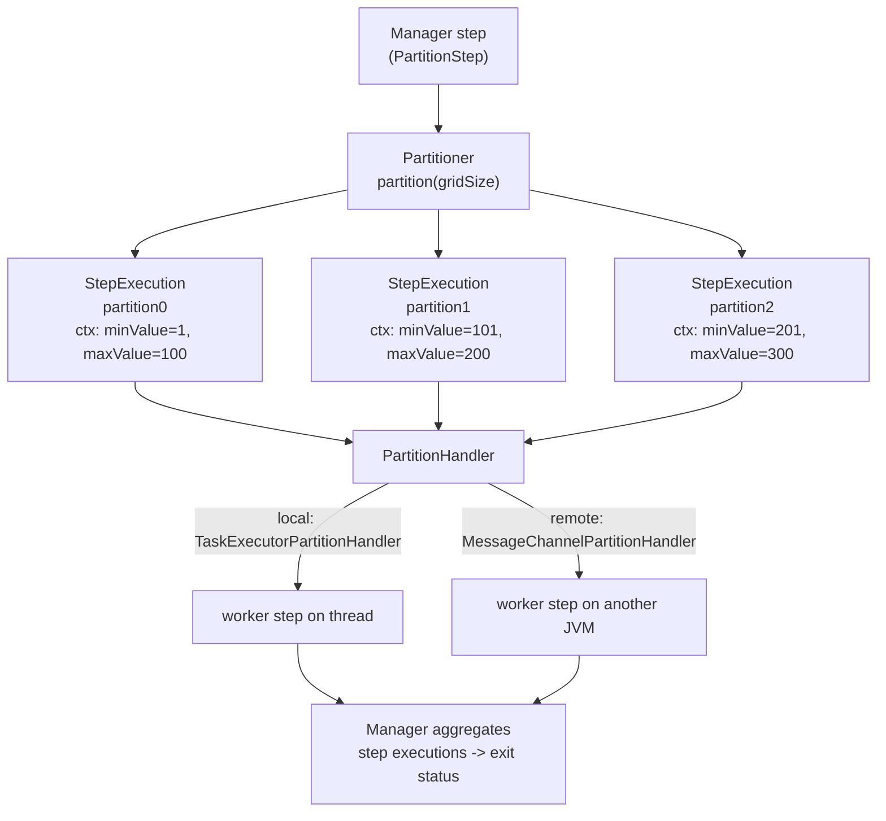

## Objective

Partitioning é a quarta e, nas palavras do livro, "possivelmente mais popular" estratégia de escala no Spring Batch. Em vez de jogar threads num único step (`spring-batch-multithreaded-and-parallel-steps`) ou enviar chunks por middleware (`spring-batch-remote-chunking`), você **divide os dados de entrada em partições que não se sobrepõem** e deixa cada partição rodar como sua própria **`StepExecution`** de um step chunk-oriented comum (`spring-batch-chunk-processing`). Um step *manager* faz a divisão; *workers* fazem o trabalho.

A vantagem é que a divisão é *sua* decisão — faixas de chave primária, um arquivo por partição, um tenant por partição — e o step worker não tem consciência alguma de que foi particionado. Duas interfaces carregam todo o design: um **`Partitioner`** decide *quais* são as partições, e um **`PartitionHandler`** decide *onde* elas rodam. Troque o handler e o mesmo job vai de threads locais para um cluster sem tocar no reader, processor, ou writer. E como cada partição é uma `StepExecution` real registrada no job repository, **o restart continua funcionando de fábrica** — a única coisa que remote chunking não consegue prometer sem middleware transacional. Esta entrada fecha com a comparação do livro entre as quatro estratégias do Capítulo 13.

## Use Cases

- Importar um diretório de arquivos de entrada onde cada arquivo deve ser tratado de forma independente e concorrente — uma partição por arquivo, via `MultiResourcePartitioner` embutido.
- Carregar uma tabela grande onde as linhas podem ser fatiadas por uma chave inteira — um `ColumnRangePartitioner` entrega a cada worker uma faixa `minValue`/`maxValue`, para que os readers nunca vejam a mesma linha duas vezes.
- Escalar trabalho limitado por I/O (o caso em que remote chunking se sai mal, porque o único reader do manager vira o gargalo): cada worker lê sua própria fatia.
- Crescer de uma máquina para muitas *sem reescrever*: comece com `TaskExecutorPartitionHandler` (threads), depois migre para `MessageChannelPartitionHandler` (workers remotos) — mesmo `Partitioner`, mesmo step.
- Parâmetros por partição via late binding: `#{stepExecutionContext['fileName']}` num reader `@StepScope`.

## Deep Dive

### A forma de um step particionado

Particionamento acontece **no nível do step** e se divide em duas responsabilidades que o livro mantém deliberadamente separadas:

- **Particionamento de dados** — criar as step executions que descrevem o trabalho. Isso é lógica de domínio (faixas de chave, nomes de arquivo, primeira letra do nome de um produto) e é a parte que você normalmente escreve: um `Partitioner`.
- **Manuseio de execução de step** — decidir como essas step executions realmente rodam: threads locais, ou nós remotos via messaging. Isso é infraestrutura, e o Spring Batch (mais o Spring Batch Integration) já entrega pronto: um `PartitionHandler`.



O step manager invoca o handler, o handler roda as partições, e então o manager **agrega os resultados** e define seu próprio status a partir deles. Uma partição que falha faz o step manager falhar.

### Configurando um step particionado local

O livro usa XML (`<batch:partition step="…" partitioner="…">` com um `<batch:handler grid-size="2" task-executor="taskExecutor"/>` aninhado). Hoje é um `StepBuilder` que vira um `PartitionStepBuilder` no momento em que você chama `.partitioner(...)`:

```java
@Bean
public Step readWriteProductsManagerStep(JobRepository jobRepository,
        Partitioner partitioner, Step readWriteProductsStep) {

    return new StepBuilder("readWriteProducts.manager", jobRepository)
        .partitioner("readWriteProductsStep", partitioner) // worker step name + splitting strategy
        .step(readWriteProductsStep)                       // the step to run per partition
        .gridSize(4)                                       // hint: how many partitions to create
        .taskExecutor(new SimpleAsyncTaskExecutor("partition-"))
        .build();
}

@Bean
public Step readWriteProductsStep(JobRepository jobRepository,
        PlatformTransactionManager tx, ItemReader<Product> reader, ItemWriter<Product> writer) {
    return new StepBuilder("readWriteProductsStep", jobRepository)
        .<Product, Product>chunk(100).transactionManager(tx)
        .reader(reader).writer(writer)
        .build();
}
```

Três coisas para notar:

- O **step worker permanece intocado** — um step chunk-oriented comum. Particionar é "só uma questão de configuração"; não tem impacto sobre readers, processors, ou writers.
- `.step(workerStep)` + `.taskExecutor(...)` é atalho: o builder monta um `TaskExecutorPartitionHandler` para você. Esse é o **único e default** `PartitionHandler` no Spring Batch core, e é *local* — partições rodam como threads nesta JVM.
- `.step(...)` só faz sentido **localmente**, porque referencia um bean `Step` *neste* contexto de aplicação. Para particionamento remoto, você entrega ao handler um **nome** de step (uma `String`) que ele envia para os workers, onde resolve contra *o contexto deles*.

`gridSize` é uma **dica**, não uma garantia: ela é passada ao splitter e para `Partitioner.partition(int gridSize)`, e um partitioner é livre para retornar um número diferente de partições (um partitioner por arquivo retorna uma por arquivo independentemente). Também impede que um único step sature o task executor.

### A SPI de particionamento

A Tabela 13.3 do livro lista as três interfaces, e elas permanecem inalteradas em substância hoje (todas agora em `org.springframework.batch.core.partition`):

| Interface | Papel | Implementação default |
| --- | --- | --- |
| `PartitionHandler` | Controla a execução de uma `StepExecution` particionada. Não sabe nada sobre *como* os dados foram divididos e não agrega resultados. | `TaskExecutorPartitionHandler` (threads locais) |
| `StepExecutionSplitter` | Gera os execution contexts / `StepExecution`s de entrada para um step particionado, independente do fabric em que rodam. | `SimpleStepExecutionSplitter` |
| `Partitioner` | Cria os metadados de partição — a estratégia de divisão em si. | `SimplePartitioner` (contexts vazios) |

A colaboração, em ordem: `PartitionStep` → `PartitionHandler` → `StepExecutionSplitter` → `Partitioner`.

```java
@FunctionalInterface
public interface PartitionHandler {
    Collection<StepExecution> handle(StepExecutionSplitter stepSplitter,
                                     StepExecution stepExecution) throws Exception;
}

public interface StepExecutionSplitter {
    String getStepName();
    Set<StepExecution> split(StepExecution stepExecution, int gridSize)
            throws JobExecutionException;
}

public interface Partitioner {
    Map<String, ExecutionContext> partition(int gridSize);
}
```

`SimpleStepExecutionSplitter` delega a um `Partitioner` para os `ExecutionContext`s, e então faz a contabilidade que o desenvolvedor não deveria precisar fazer: nomeia cada partição `<nomeDoStepWorker>:<chaveDaPartição>` (por exemplo `readWriteProductsStep:partition0`) e, **num restart, reutiliza as step executions da execução anterior**, para que partições concluídas não sejam refeitas. É por isso que o livro diz que implementações customizadas de `StepExecutionSplitter` são raras — "customizações acontecem no nível do `Partitioner`."

### Escrevendo um `Partitioner`: como os metadados chegam a cada worker

Um `Partitioner` retorna um `Map` cujas **chaves são nomes de partição únicos** e cujos **valores são `ExecutionContext`s** — os parâmetros de entrada para aquela partição. Esses contexts são persistidos como o `ExecutionContext` de *step* de cada worker, que é exatamente como um worker remoto em outra JVM recebe suas instruções. O `ColumnRangePartitioner` do livro, modernizado para `JdbcTemplate` (`SimpleJdbcTemplate` já era há muito tempo):

```java
public class ColumnRangePartitioner implements Partitioner {

    private JdbcTemplate jdbcTemplate;
    private String table;
    private String column;

    @Override
    public Map<String, ExecutionContext> partition(int gridSize) {
        int min = jdbcTemplate.queryForObject("SELECT MIN(" + column + ") FROM " + table, Integer.class);
        int max = jdbcTemplate.queryForObject("SELECT MAX(" + column + ") FROM " + table, Integer.class);
        int targetSize = (max - min) / gridSize + 1;

        Map<String, ExecutionContext> result = new HashMap<>();
        int number = 0, start = min, end = start + targetSize - 1;

        while (start <= max) {
            ExecutionContext value = new ExecutionContext();
            result.put("partition" + number, value);
            if (end >= max) {
                end = max;
            }
            value.putInt("minValue", start);   // consumed by the worker's reader
            value.putInt("maxValue", end);
            start += targetSize;
            end += targetSize;
            number++;
        }
        return result;
    }
}
```

O reader do worker então pega sua fatia através de **late binding**, que é onde o particionamento ganha seu poder real — cada `StepExecution` roda a mesma definição de step com valores de parâmetro *diferentes*. O reader precisa ser `@StepScope` para que a expressão seja resolvida por step execution, não no startup do contexto:

```java
@Bean
@StepScope
public JdbcPagingItemReader<Product> reader(DataSource dataSource,
        @Value("#{stepExecutionContext['minValue']}") Integer minValue,
        @Value("#{stepExecutionContext['maxValue']}") Integer maxValue) {

    return new JdbcPagingItemReaderBuilder<Product>()
        .name("productReader")
        .dataSource(dataSource)
        .selectClause("SELECT id, name, price")
        .fromClause("FROM product")
        .whereClause("WHERE id >= :minValue AND id <= :maxValue")
        .parameterValues(Map.of("minValue", minValue, "maxValue", maxValue))
        .sortKeys(Map.of("id", Order.ASCENDING))
        .pageSize(100)
        .build();
}
```

Note a consequência para a ressalva do step multithreaded: como cada partição recebe sua **própria** instância de reader (step-scoped) lendo uma fatia **disjunta**, os problemas de thread-safety e de posição-de-restart de um step multithreaded simplesmente não surgem. O restart recria as partições e reexecuta só as que falharam.

### Uma partição por arquivo: `MultiResourcePartitioner`

Para o caso comum de "importar cada arquivo de um diretório" o Spring Batch traz um partitioner pronto. Ele cria uma partição por `Resource` e coloca o resource sob uma chave de contexto — `keyName`, com default `"fileName"`:

```java
@Bean
public Partitioner partitioner(
        @Value("file:./resources/partition/input/*.txt") Resource[] resources) {
    MultiResourcePartitioner partitioner = new MultiResourcePartitioner();
    partitioner.setResources(resources);
    partitioner.setKeyName("fileName");   // default
    return partitioner;
}

@Bean
@StepScope
public FlatFileItemReader<Product> reader(
        @Value("#{stepExecutionContext['fileName']}") Resource resource) {
    return new FlatFileItemReaderBuilder<Product>()
        .name("productReader").resource(resource)
        .delimited().names("id", "name", "price")
        .targetType(Product.class)
        .build();
}
```

Esse é o ganho concreto sobre um step multithreaded: um step multithreaded "não consegue controlar qual thread processa quais dados", enquanto aqui **uma thread dedicada cuida de todos os dados de um arquivo**. As partições são nomeadas `partition0 … partitionN`.

### Indo remoto: o mesmo `Partitioner`, um handler diferente

`TaskExecutorPartitionHandler` é o único handler no core; handlers remotos vivem no módulo **`spring-batch-integration`**, em `org.springframework.batch.integration.partition`. O lado manager usa `MessageChannelPartitionHandler` (canais para requests e replies, um `stepName` que identifica o step worker remotamente, e `gridSize`); o lado worker é um service activator do Spring Integration delegando para `StepExecutionRequestHandler`, que resolve o step através de um `StepLocator` — tipicamente `BeanFactoryStepLocator`, que procura o step no bean factory do próprio worker.

A ligação manual que o livro mostra ainda existe, mas o caminho ergonômico hoje é `@EnableBatchIntegration`, que expõe duas fábricas de builder:

```java
@Configuration
@EnableBatchProcessing
@EnableBatchIntegration
public class RemotePartitioningConfiguration {

    // --- manager side ---
    @Bean
    public Step managerStep(RemotePartitioningManagerStepBuilderFactory managerStepBuilderFactory) {
        return managerStepBuilderFactory.get("managerStep")
            .partitioner("workerStep", partitioner())   // unchanged Partitioner
            .gridSize(10)
            .outputChannel(requestsToWorkers())         // partition requests out
            .inputChannel(repliesFromWorkers())         // replies aggregated back
            .build();
    }

    // --- worker side (separate JVM / context) ---
    @Bean
    public Step workerStep(RemotePartitioningWorkerStepBuilderFactory workerStepBuilderFactory) {
        return workerStepBuilderFactory.get("workerStep")
            .inputChannel(requestsFromManager())
            .outputChannel(repliesToManager())
            .chunk(100)
            .reader(itemReader()).processor(itemProcessor()).writer(itemWriter())
            .build();
    }
}
```

O manager pode saber que os workers terminaram de duas formas: **agregação de replies** (declare um `inputChannel`) ou **polling do job repository** (omita e dê um intervalo/timeout de polling em vez disso) — sendo a segunda a opção fire-and-forget quando você não quer nenhum canal de reply.

Crucialmente, e diferente de remote chunking, **as mensagens não precisam ser duráveis nem ter entrega garantida**. A referência afirma isso claramente: os metadados do Spring Batch no `JobRepository` garantem que cada worker execute uma e só uma vez por execução de job, e um job que falha reinicia reexecutando só os steps que falharam. O livro dá a mesma razão: num restart o Spring Batch recria as partições e as processa de novo, então nenhum dado fica sem ser processado.

### Comparando as quatro estratégias do Capítulo 13

As Tabelas 13.4 e 13.5 do livro, condensadas:

| Estratégia | Local / remota | O que paraleliza | Principal ressalva |
| --- | --- | --- | --- |
| **Step multithreaded** (`spring-batch-multithreaded-and-parallel-steps`) | Local | Chunks de um step num pool de threads | Tudo que é compartilhado precisa ser thread-safe; readers com estado quebram o restart (em boa parte corrigido na 6.0, onde só o `ItemProcessor` é multithreaded) |
| **Steps paralelos** (`spring-batch-multithreaded-and-parallel-steps`) | Local | Steps/flows inteiros e independentes via um `split` | Exige steps genuinamente independentes e um job organizado dessa forma; sem problemas de concorrência se isso for verdade |
| **Remote chunking** (`spring-batch-remote-chunking`) | Remota | Processamento/escrita de chunks lidos por um manager | Precisa de middleware transacional com entrega garantida; o reader do manager mais a serialização é um gargalo potencial. Vantagem: não precisa conhecer a estrutura dos dados de entrada, insensível a timeouts |
| **Step particionado** (esta entrada) | Local **e** remota | Conjuntos de dados, cada um como sua própria `StepExecution` | Você precisa conhecer bem a estrutura dos dados de entrada para dividi-los; pode ser sensível a timeouts; o manager não pode ele mesmo virar gargalo. Vantagem: sem middleware transacional, sem gargalo de reader, baixo custo de banda/transporte |

A orientação do livro, em ordem:

1. **Não faça.** Escreva o job normalmente, e recorra a escala só quando você realmente não conseguir cumprir a janela de batch. "Mantenha simples!"
2. **Local primeiro**, se o hardware for multicore — mas seja extremamente cauteloso com um step multithreaded (thread safety, estado do job). Steps paralelos e particionamento *local* dão multithreading com muito menos riscos; "uma thread por arquivo para importar dados é particularmente conveniente e eficiente."
3. **Remoto por último.** Ele compra alta escalabilidade ao custo de complexidade real. Entre as duas opções remotas: **remote chunking** quando você não pode ou não quer particionar a entrada (e ler é barato relativo a processar); **particionamento** quando você consegue fatiar os dados — evita o gargalo de reader e a exigência de messaging durável.

### Livro vs. hoje: mesma SPI, pacotes movidos, mais estratégias

A SPI de 2012 envelheceu notavelmente bem. `Partitioner.partition(int gridSize)`, `StepExecutionSplitter.split(StepExecution, int)`, `SimpleStepExecutionSplitter`, `SimplePartitioner`, `MultiResourcePartitioner`, `TaskExecutorPartitionHandler` como único handler do core, `MessageChannelPartitionHandler` / `StepExecutionRequestHandler` / `BeanFactoryStepLocator` no Spring Batch Integration — tudo ainda vigente na 6.0 com os mesmos contratos. O que mudou:

- **Vocabulário.** *Master/slave* virou **manager/worker** em toda a documentação e nos nomes de builder (`RemotePartitioningManagerStepBuilder`, `RemotePartitioningWorkerStepBuilder`).
- **Estilo de configuração.** Os namespaces XML `batch:` e `batch-integration:` estão deprecated na 6.0 (remoção prevista para a 7), então `<batch:partition>` vira `StepBuilder.partitioner(...)` retornando um `PartitionStepBuilder` (`org.springframework.batch.core.step.builder`) com `.step()`, `.gridSize()`, `.taskExecutor()`, `.partitionHandler()`, `.splitter()`, `.aggregator()`.
- **Pacotes movidos na 6.0.** `Partitioner`, `PartitionNameProvider`, `PartitionStep`, `StepExecutionAggregator` e as duas interfaces `PartitionHandler` / `StepExecutionSplitter` agora vivem em `org.springframework.batch.core.partition`; as implementações (`TaskExecutorPartitionHandler`, `SimplePartitioner`, `MultiResourcePartitioner`, `SimpleStepExecutionSplitter`, `AbstractPartitionHandler`, `DefaultStepExecutionAggregator`, `RemoteStepExecutionAggregator`) permanecem em `…core.partition.support`. `PartitionHandler` agora é `@FunctionalInterface`.
- **`JobExplorer` incorporado ao `JobRepository`.** `StepExecutionRequestHandler` e `RemoteStepExecutionAggregator` agora recebem um `JobRepository` (`setJobRepository(...)`), não um `JobExplorer`. Alguns construtores e métodos de `RemotePartitioning*StepBuilder` foram removidos na 6.0 — prefira as fábricas de builder do `@EnableBatchIntegration`.
- **`PartitionNameProvider`**, adicionado depois do livro, permite que um `Partitioner` exponha *nomes* de partição separadamente dos *dados* da partição; num restart só os nomes são consultados, então uma query de particionamento cara não é reexecutada.
- **Duas estratégias a mais.** A referência agora lista seis opções de processamento paralelo, não quatro: as quatro do capítulo mais **local chunking** (o `ChunkTaskExecutorItemWriter` da 6.0, chunks processados em paralelo numa única JVM) e **remote step** (o `RemoteStep` da 6.0, que envia um step inteiro para um worker remoto via canais do Spring Integration).

Verificado contra a referência atual do Spring Batch nas páginas "Scaling and Parallel Processing" e "Externalizing Batch Process Execution", o Javadoc 6.0 de `PartitionHandler`, `StepExecutionSplitter`, `MultiResourcePartitioner`, `PartitionStepBuilder` e `StepExecutionRequestHandler`, e o Guia de Migração do Spring Batch 6.0.

## Trade-offs

- **Você precisa entender seus dados.** Esse é o custo definidor do particionamento: diferente de remote chunking, você precisa de uma regra de divisão que produza partições **sem sobreposição e razoavelmente iguais**. Erre nisso e você processa linhas em dobro ou uma partição atrasada segura o job inteiro aberto.
- **Desequilíbrio vence paralelismo.** `gridSize` divide a faixa de chave, não o *trabalho*. Um `ColumnRangePartitioner` assume distribuição uniforme (o livro diz isso explicitamente); lacunas ou faixas quentes deixam threads ociosas enquanto um worker mói sozinho. O mesmo vale para um arquivo por partição quando os arquivos variam muito de tamanho.
- **Sem garantias de middleware necessárias — mas timeouts importam.** Particionamento troca a exigência de messaging durável de remote chunking por sensibilidade a timeout: o manager espera pelas replies de partição (`receiveTimeout`), e uma partição de longa duração pode disparar isso. Polling do job repository evita o timeout de reply ao custo de latência.
- **Restart é barato, e essa é a característica principal.** Cada partição é uma `StepExecution` persistida, então o restart reexecuta só as que falharam — sem lógica compensatória, sem fila transacional. O lado inverso é o volume de metadados: um `gridSize` grande num job rodado com frequência escreve muitas linhas em `BATCH_STEP_EXECUTION`.
- **Late binding é fácil de errar.** Esqueça o `@StepScope` no reader e `#{stepExecutionContext[...]}` não consegue resolver — cada partição silenciosamente compartilha um único reader configurado a partir de qualquer contexto que existisse primeiro.
- **O manager ainda pode ser o gargalo.** Particionamento remove o gargalo do *reader*, não todo gargalo: uma query `partition()` cara, ou workers todos martelando o mesmo banco, recentraliza a contenção que você estava tentando espalhar.
- **Particionamento local é barato; particionamento remoto é um sistema distribuído.** A troca de handler é uma mudança de um bean na *configuração*, mas compra infraestrutura de messaging, deployment de contextos worker, e acesso compartilhado ao job repository. Siga o livro: só se for realmente necessário.

## Documentation Links

- Cogoluègnes, Templier, Gregory, Bazoud, "Spring Batch in Action" (Manning, 2012) — Chapter 13, "Scaling and parallel processing", sections 13.5-13.6, "Fine-grained scaling with partitioning" / "Comparing patterns", p. 394-405 — doc
- [Spring Batch Reference — Scaling and Parallel Processing (Partitioning, PartitionHandler, Partitioner, gridSize, binding input data to steps)](https://docs.spring.io/spring-batch/reference/scalability.html) — doc
- [Spring Batch Reference — Externalizing Batch Process Execution (Remote Partitioning, @EnableBatchIntegration builder factories)](https://docs.spring.io/spring-batch/reference/spring-batch-integration/externalizing-execution.html) — doc
- [Spring Batch 6.0 Migration Guide (partition package relocations, JobExplorer to JobRepository, XML namespace deprecation)](https://github.com/spring-projects/spring-batch/wiki/Spring-Batch-6.0-Migration-Guide) — doc
- [Spring Batch API — PartitionHandler (org.springframework.batch.core.partition)](https://docs.spring.io/spring-batch/reference/api/org/springframework/batch/core/partition/PartitionHandler.html) — doc
- [Spring Batch API — StepExecutionSplitter (split(StepExecution, int gridSize))](https://docs.spring.io/spring-batch/reference/api/org/springframework/batch/core/partition/StepExecutionSplitter.html) — doc
- [Spring Batch API — org.springframework.batch.core.partition.support (TaskExecutorPartitionHandler, SimplePartitioner, SimpleStepExecutionSplitter)](https://docs.spring.io/spring-batch/reference/api/org/springframework/batch/core/partition/support/package-summary.html) — doc
- [Spring Batch API — MultiResourcePartitioner (keyName defaults to "fileName")](https://docs.spring.io/spring-batch/reference/api/org/springframework/batch/core/partition/support/MultiResourcePartitioner.html) — doc
- [Spring Batch API — PartitionStepBuilder (partitioner, step, gridSize, taskExecutor, partitionHandler, splitter, aggregator)](https://docs.spring.io/spring-batch/reference/api/org/springframework/batch/core/step/builder/PartitionStepBuilder.html) — doc
- [Spring Batch API — StepExecutionRequestHandler (setJobRepository, setStepLocator)](https://docs.spring.io/spring-batch/reference/api/org/springframework/batch/integration/partition/StepExecutionRequestHandler.html) — doc
