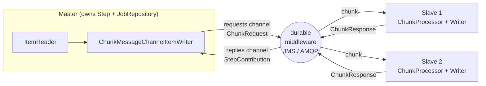

## Objective

A single machine eventually hits a wall: once you have exhausted the *local* scaling
strategies of `spring-batch-multithreaded-and-parallel-steps` (multithreaded step,
parallel steps via `split`), the only way left is to spread the work across **several
JVMs**. **Remote chunking** is the first of Chapter 13's two scale-out strategies (the
other is `spring-batch-partitioning`): a **master** node runs the step, reads the
items, and ships each chunk over durable messaging to **slave** nodes that do the
processing and writing, then report back.

The defining constraint is where the reading happens. Because the master alone owns the
`ItemReader`, remote chunking **only pays off when reading is not the bottleneck** —
processing/writing must be the expensive part. The second defining constraint is
delivery: chunks travel over the wire as messages, and a lost message is lost *data*,
so the transport must guarantee delivery (JMS, AMQP). Both constraints, and the
`ChunkProvider`/`ChunkProcessor` split that makes the whole thing pluggable, are what
this entry is about.

## Use Cases

- A step whose per-item work is genuinely expensive (pricing calculation, external
  service enrichment, document rendering) where one box's cores are saturated but the
  input query or file is cheap to read.
- An existing chunk-oriented step (`spring-batch-chunk-processing`) you want to scale
  out *without rewriting business logic* — the reader stays on the master, the
  processor/writer move to workers unchanged.
- Elastic capacity: adding a worker node is just starting another process that listens
  on the same request queue; no repartitioning, no job redefinition.
- Offloading writes to nodes that are near the target system (a remote database, an
  API in another datacenter) while the master stays near the source.
- Where remote chunking is the *wrong* fit: a read-bound step (a huge flat file, a slow
  query) — the master serializes all reading, so use partitioning instead.

## Deep Dive

### The mechanic: master reads and dispatches, slaves process

Remote chunking splits a *single* step across processes. The master keeps the step,
the `JobRepository`, and the reader; each slave is an ordinary messaging listener with
a processor and a writer. The master does **not** block waiting for a chunk to come
back — it keeps reading and dispatching, and aggregates the responses as they arrive.



Note what crosses the wire in each direction: **items** go out, but only a
**`StepContribution`** summary (counts, exit status) comes back. That is why workers
need no access to the `JobRepository` or to the job definition at all — the master is
the only node that writes batch metadata.

### The two interfaces it hangs off: `ChunkProvider` and `ChunkProcessor`

The book's key insight is that Spring Batch didn't need new machinery for this: the
chunk-oriented step was already factored into two collaborators used by the
`ChunkOrientedTasklet`, and remote chunking just replaces one of them with a remote
implementation.

```java
public interface ChunkProvider<T> {                 // returns chunks from an ItemReader
  void postProcess(StepContribution contribution, Chunk<T> chunk);
  Chunk<T> provide(StepContribution contribution) throws Exception;
}

public interface ChunkProcessor<I> {                // handles processing + writing
  void process(StepContribution contribution, Chunk<I> chunk) throws Exception;
}
```

Defaults are `SimpleChunkProvider` (delegates straight to `ItemReader.read()`) and
`SimpleChunkProcessor` (processes then writes). In remote chunking the provider stays
on the master, and the processor is what gets moved: the master's local processor is
swapped for one that writes chunks to a message channel, while a real
`SimpleChunkProcessor` is instantiated on each slave.

The book is blunt about how much of this Spring Batch shipped in 2012: *nothing* beyond
the extension points. The Spring Integration-based implementation lived in a separate
**Spring Batch Integration** module distributed with **Spring Batch Admin**.

### Why guaranteed delivery is non-negotiable

The master sends chunks of *items* to slaves. If a message is dropped, those items are
never processed and nobody notices — the job can finish "successfully" with silently
missing data. Hence reliable, durable messaging with a single consumer per message:
JMS is the obvious candidate (asynchronous plus guaranteed delivery), and Spring
Integration wraps JMS rather than exposing it, which is what leaves the door open for
AMQP and friends.

This is the sharpest contrast with `spring-batch-partitioning`, and the book states it
explicitly: **partitioning does not need guaranteed delivery.** Each partition is its
own `StepExecution` tracked in the `JobRepository`, so a restart
(`spring-batch-restart-and-recovery`) simply re-creates and re-runs the partitions that
did not complete. Remote chunking has no such per-chunk metadata — the durability has
to come from the transport.

### The book's master: channels, a messaging gateway, and a factory bean

Spring Integration's **channel** abstraction is what keeps the step transport-agnostic:
the master writes to a `requests` channel and reads from a `replies` channel, and a
channel adapter binds those to actual JMS destinations. The book wires three things —
a `MessagingTemplate` gateway, the channels, and the adapters:

```xml
<bean id="messagingGateway" class="org.springframework.integration.core.MessagingTemplate">
  <property name="defaultChannel" ref="requests" />
  <property name="receiveTimeout" value="1000" />
</bean>

<int:channel id="requests"/>
<int:channel id="incoming"/>

<int-jms:outbound-channel-adapter connection-factory="connectionFactory"
                                 channel="requests" destination-name="requests"/>

<!-- replies come back on a thread-local queue channel, polled from the JMS destination -->
<int:channel id="replies" scope="thread">
  <int:queue />
  <int:interceptors>
    <bean class="org.springframework.batch.integration.chunk.MessageSourcePollerInterceptor">
      <property name="messageSource"><!-- JmsDestinationPollingSource on "replies" --></property>
      <property name="channel" ref="incoming"/>
    </bean>
  </int:interceptors>
</int:channel>
```

Then the Spring Batch side, which the book admits "may seem a bit like magic" — none of
the interfaces from the introduction appear by name:

```xml
<bean id="chunkWriter" scope="step"
      class="org.springframework.batch.integration.chunk.ChunkMessageChannelItemWriter">
  <property name="messagingGateway" ref="messagingGateway"/>
</bean>

<bean id="chunkHandler"
      class="org.springframework.batch.integration.chunk.RemoteChunkHandlerFactoryBean">
  <property name="chunkWriter" ref="chunkWriter"/>
  <property name="step" ref="stepChunk"/>
</bean>
```

`RemoteChunkHandlerFactoryBean` is the trick: it takes an **existing** chunk-oriented
step and transparently converts it into a remote chunk manager by replacing its chunk
processor with one that writes to the channel. Your reader/writer configuration is
untouched — which is exactly the "scale by configuration" promise of Chapter 13.

### The book's slave: a JMS listener in front of a `ChunkProcessorChunkHandler`

A slave is a plain Spring application: a message listener container pulls from the
`requests` destination, hands the chunk to a handler, and the reply goes to the
`replies` destination.

```xml
<jms:listener-container connection-factory="connectionFactory"
                        transaction-manager="transactionManager" acknowledge="transacted">
  <jms:listener destination="requests" response-destination="replies"
                ref="chunkHandler" method="handleChunk"/>
</jms:listener-container>

<bean id="chunkHandler"
      class="org.springframework.batch.integration.chunk.ChunkProcessorChunkHandler">
  <property name="chunkProcessor">
    <bean class="org.springframework.batch.core.step.item.SimpleChunkProcessor">
      <property name="itemWriter" ref="itemWriter"/>
      <property name="itemProcessor">
        <bean class="org.springframework.batch.item.support.PassThroughItemProcessor"/>
      </property>
    </bean>
  </property>
</bean>
```

Two details worth keeping. `acknowledge="transacted"` is what closes the reliability
loop: if the handler throws, the transaction rolls back and the broker **re-delivers**
the chunk to another consumer. And `ChunkProcessorChunkHandler` deliberately
distinguishes a fault-tolerant processor from a plain one — with a fault-tolerant
processor it lets exceptions propagate, precisely *because* it assumes rollback and
re-delivery (see `spring-batch-skip-policy-and-listeners` and
`spring-batch-retry-policy-and-retrytemplate` for what fault-tolerant means here).

### Book vs. today: `@EnableBatchIntegration` and the builder API

Nearly all of the XML above is obsolete, and one whole premise is gone: the Spring
Integration implementation is no longer a Spring Batch Admin add-on — it ships in the
main distribution as the **`spring-batch-integration`** module. Three changes matter.

**1. Terminology.** "Master/slave" is gone from the docs; it is **manager/worker**
everywhere. Class names followed: `RemoteChunkingMasterStepBuilder` became
`RemoteChunkingManagerStepBuilder` in 4.2.

**2. Builders instead of hand-wiring.** Since 4.1, `@EnableBatchIntegration` registers
`RemoteChunkingManagerStepBuilderFactory` and `RemoteChunkingWorkerBuilder`, which
auto-configure the `ChunkMessageChannelItemWriter` + `MessagingTemplate` on the manager
and the `SimpleChunkProcessor` + handler + service activator on the worker. The manager
becomes a normal-looking step declaration plus two channels:

```java
@Configuration
@EnableBatchProcessing
@EnableBatchIntegration
public class RemoteChunkingManagerConfiguration {

    @Autowired
    private RemoteChunkingManagerStepBuilderFactory managerStepBuilderFactory;

    @Bean
    public TaskletStep managerStep(ItemReader<Product> reader) {
        return this.managerStepBuilderFactory.<Product, Product>get("managerStep")
            .chunk(100)
            .reader(reader)
            .outputChannel(requests())   // chunk requests -> workers
            .inputChannel(replies())     // chunk responses <- workers
            .throttleLimit(20)           // cap in-flight requests
            .maxWaitTimeouts(40)         // give-up threshold waiting for replies (default 40)
            .build();
    }

    @Bean
    public DirectChannel requests() { return new DirectChannel(); }

    @Bean
    public QueueChannel replies() { return new QueueChannel(); }   // must be pollable

    @Bean
    public IntegrationFlow outboundFlow(ActiveMQConnectionFactory cf) {
        return IntegrationFlow.from(requests())
            .handle(Jms.outboundAdapter(cf).destination("requests"))
            .get();
    }

    @Bean
    public IntegrationFlow inboundFlow(ActiveMQConnectionFactory cf) {
        return IntegrationFlow.from(Jms.messageDrivenChannelAdapter(cf).destination("replies"))
            .channel(replies())
            .get();
    }
}
```

`RemoteChunkingManagerStepBuilder` extends `FaultTolerantStepBuilder`, so `retry`,
`skip`, and listeners are all available — but `writer(...)` **throws
`UnsupportedOperationException`**, because the writer *is* the
`ChunkMessageChannelItemWriter`. Note also that `inputChannel` takes a
`PollableChannel` (hence `QueueChannel`, the modern replacement for the book's
thread-local channel plus `MessageSourcePollerInterceptor`), while `outputChannel`
takes any `MessageChannel`. Either give it an `outputChannel` or a fully configured
`messagingTemplate(...)` — not both.

The worker is even shorter, and note that `build()` returns an **`IntegrationFlow`**,
not a `Step` — a worker is not a batch job:

```java
@Configuration
@EnableBatchIntegration
public class RemoteChunkingWorkerConfiguration {

    @Autowired
    private RemoteChunkingWorkerBuilder<Product, Product> workerBuilder;

    @Bean
    public IntegrationFlow workerFlow(ItemProcessor<Product, Product> processor,
                                      ItemWriter<Product> writer) {
        return this.workerBuilder
            .itemProcessor(processor)     // omit it and you get a PassThroughItemProcessor
            .itemWriter(writer)
            .inputChannel(requests())     // requests from the manager
            .outputChannel(replies())     // replies back to the manager
            .build();
    }
    // ...JMS inbound/outbound IntegrationFlows as on the manager, mirrored
}
```

**3. Renames and deprecations in 6.0.** The worker-side interface the book calls
`ChunkHandler` is now **`ChunkRequestHandler<T>`** (`ChunkResponse handle(ChunkRequest<T>)`),
and its implementation `ChunkProcessorChunkHandler` is now
**`ChunkProcessorChunkRequestHandler<S>`**. `ChunkProvider` is **deprecated since 6.0
with no replacement** (removal in 7.0), along with `ChunkOrientedTasklet` (superseded by
`ChunkOrientedStep`) — casualties of 6.0's redesigned chunk-oriented step.
`ChunkProcessor` survives as a `@FunctionalInterface`, but with the **argument order
swapped**: `process(Chunk<I>, StepContribution)` is the new method and the book's
`process(StepContribution, Chunk<I>)` is a deprecated `default`. Everything else holds:
remote chunking still runs on Spring Integration, and the reference still names **JMS
and AMQP** as the transports, with the requirement stated as middleware that is
"durable, with guaranteed delivery and a single consumer for each message" — Kafka is
not named for this pattern in the reference, so treat it as unverified territory rather
than a supported option.

### Book vs. today: 6.0 added two neighbours — local chunking and remote steps

The book's Table 13.1 lists four scaling strategies; the current reference lists
**six**, and both newcomers are close relatives of remote chunking.

**Local chunking** (new in 6.0, single-process) is remote chunking with the messaging
removed: `ChunkTaskExecutorItemWriter` submits chunk requests to a local `TaskExecutor`
instead of a message channel. It is the answer to the fact that 6.0's multithreaded
step only parallelizes the `ItemProcessor` — this parallelizes whole chunks in one JVM:

```java
@Bean
public ChunkTaskExecutorItemWriter<Product> itemWriter(ChunkProcessor<Product> chunkProcessor) {
    ThreadPoolTaskExecutor taskExecutor = new ThreadPoolTaskExecutor();
    taskExecutor.setCorePoolSize(4);
    taskExecutor.afterPropertiesSet();
    return new ChunkTaskExecutorItemWriter<>(chunkProcessor, taskExecutor);
}
```

The catch is explicit in the docs: chunk transaction management and fault tolerance
(retry, skip, chunk scanning) are **not** handled by `ChunkTaskExecutorItemWriter` or
the driving step — your `ChunkProcessor` owns them.

**Remote step execution** (also new in 6.0, multi-process) moves a whole `Step`, not
chunks: `new RemoteStep("step", "workerStep", jobRepository, messagingTemplate)` on the
manager, and a `StepExecutionRequestHandler` plus a `BeanFactoryStepLocator` in an
`IntegrationFlow` on the worker. Choose by granularity: remote chunking distributes
*chunks of one step*, remote step distributes *entire steps*, partitioning distributes
*step executions over data ranges*.

## Trade-offs

- **The master is a hard ceiling on reading** — the whole pattern is predicated on
  processing being more expensive than reading. On a read-bound step you add network
  hops and a broker for no gain; `spring-batch-partitioning` (which distributes the
  reading too) is the right answer there.
- **You inherit a message broker** — remote chunking demands durable, guaranteed
  delivery with one consumer per message, so a broker becomes part of your batch
  infrastructure with its own configuration, transactions (`acknowledge="transacted"`),
  monitoring, and failure modes. Partitioning needs none of that, which is a large part
  of why the book calls it the more popular strategy.
- **Restart guarantees are weaker than partitioning's** — the `JobRepository` records
  one `StepExecution` for the manager, not per chunk, so on failure there is no
  per-chunk record of what was completed; correctness leans on transacted delivery and
  re-delivery rather than on batch metadata (`spring-batch-restart-and-recovery`).
- **Chunks must be serializable, and small** — items travel as messages. Fat object
  graphs are expensive to serialize and clog the broker; the docs' advice is to send a
  memento (a primary key) and have the worker re-fetch, which trades network cost for
  extra reads on the worker side.
- **Ordering and back-pressure need explicit tuning** — replies arrive out of order, so
  order-dependent logic breaks. `throttleLimit` bounds in-flight requests so workers
  aren't swamped, and `maxWaitTimeouts` (default 40) bounds how long the manager waits
  before failing; both need real numbers under load. With AMQP, strict inbound ordering
  additionally requires prefetch count 1.
- **Two deployments to keep in sync** — workers are separate processes running separate
  Spring contexts. They need no `JobRepository`, but their processor/writer beans and
  the item classes must stay version-compatible with the manager, or a deploy skew
  turns into deserialization failures at runtime.
- **Deprecated foundations** — the `ChunkProvider`/`ChunkProcessor` pair the book
  explains as *the* remote chunking SPI has partly gone away in 6.0 (`ChunkProvider`
  deprecated with no replacement, `ChunkProcessor.process` arguments reordered). Code
  written against the book's low-level SPI will not survive 7.0; code written against
  `RemoteChunkingManagerStepBuilder`/`RemoteChunkingWorkerBuilder` will.

## Documentation Links

- Cogoluègnes, Templier, Gregory, Bazoud, "Spring Batch in Action" (Manning, 2012) — Chapter 13, "Scaling and parallel processing", section 13.4 "Remote chunking (multiple machines)", p. 387-394 — [Manning](https://www.manning.com/books/spring-batch-in-action) — doc
- [Spring Batch Reference — Scaling and Parallel Processing (Remote Chunking, Local Chunking, Remote Step, Partitioning)](https://docs.spring.io/spring-batch/reference/scalability.html) — doc
- [Spring Batch Reference — Spring Batch Integration: Externalizing Batch Process Execution (Remote Chunking manager/worker configuration, @EnableBatchIntegration)](https://docs.spring.io/spring-batch/reference/spring-batch-integration/externalizing-execution.html) — doc
- [Spring Batch 6.0 Migration Guide (ChunkHandler → ChunkRequestHandler, ChunkProvider/ChunkOrientedTasklet deprecation, new chunk model)](https://github.com/spring-projects/spring-batch/wiki/Spring-Batch-6.0-Migration-Guide) — doc
- [Spring Batch API — org.springframework.batch.integration.chunk package summary (ChunkRequestHandler, ChunkProcessorChunkRequestHandler, ChunkTaskExecutorItemWriter)](https://docs.spring.io/spring-batch/reference/api/org/springframework/batch/integration/chunk/package-summary.html) — doc
- [Spring Batch API — RemoteChunkingManagerStepBuilder (inputChannel, outputChannel, throttleLimit, maxWaitTimeouts)](https://docs.spring.io/spring-batch/docs/current/api/org/springframework/batch/integration/chunk/RemoteChunkingManagerStepBuilder.html) — doc
- [Spring Batch API — RemoteChunkingWorkerBuilder (build() returns an IntegrationFlow)](https://docs.spring.io/spring-batch/reference/api/org/springframework/batch/integration/chunk/RemoteChunkingWorkerBuilder.html) — doc
- [Spring Batch API — ChunkProcessor (process(Chunk, StepContribution) new in 6.0; old argument order deprecated)](https://docs.spring.io/spring-batch/reference/api/org/springframework/batch/core/step/item/ChunkProcessor.html) — doc
