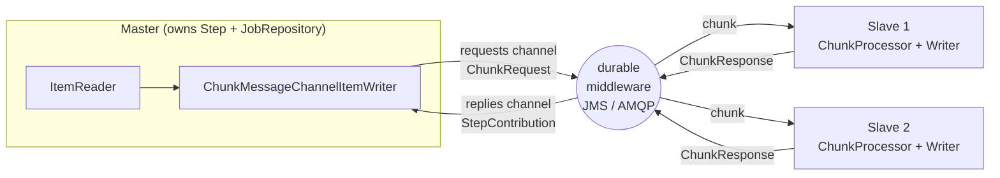

## Objective

Uma única máquina eventualmente esbarra num limite: depois de esgotar as estratégias de
escalonamento *local* de `spring-batch-multithreaded-and-parallel-steps` (step
multithreaded, steps paralelos via `split`), a única saída que resta é distribuir o
trabalho entre **várias JVMs**. **Remote chunking** é a primeira das duas estratégias de
escalonamento horizontal do Capítulo 13 (a outra é `spring-batch-partitioning`): um nó
**master** roda o step, lê os itens, e envia cada chunk por messaging durável a nós
**slave** que fazem o processamento e a escrita, e depois reportam de volta.

A restrição definidora é onde a leitura acontece. Como só o master tem o `ItemReader`,
remote chunking **só compensa quando a leitura não é o gargalo** — o processamento/escrita
precisa ser a parte cara. A segunda restrição definidora é a entrega: os chunks viajam
pela rede como mensagens, e uma mensagem perdida é *dado* perdido, então o transporte
precisa garantir entrega (JMS, AMQP). As duas restrições, e a divisão
`ChunkProvider`/`ChunkProcessor` que torna tudo isso plugável, são o assunto desta entrada.

## Use Cases

- Um step cujo trabalho por item é genuinamente caro (cálculo de preço, enriquecimento
  via serviço externo, renderização de documento), onde os cores de uma máquina estão
  saturados mas a query ou o arquivo de entrada é barato de ler.
- Um step chunk-oriented existente (`spring-batch-chunk-processing`) que você quer
  escalar horizontalmente *sem reescrever a lógica de negócio* — o reader fica no
  master, o processor/writer migram para os workers sem mudanças.
- Capacidade elástica: adicionar um nó worker é só iniciar outro processo que escuta na
  mesma request queue; sem reparticionamento, sem redefinição de job.
- Descarregar as escritas para nós próximos do sistema de destino (um banco de dados
  remoto, uma API em outro datacenter) enquanto o master fica próximo da origem.
- Onde remote chunking é a escolha *errada*: um step limitado por leitura (um flat file
  enorme, uma query lenta) — o master serializa toda a leitura, então use partitioning
  em vez disso.

## Deep Dive

### O mecanismo: o master lê e distribui, os slaves processam

Remote chunking divide um *único* step entre processos. O master mantém o step, o
`JobRepository`, e o reader; cada slave é um simples listener de messaging com um
processor e um writer. O master **não** bloqueia esperando um chunk voltar — ele
continua lendo e distribuindo, e agrega as respostas conforme chegam.



Repare o que atravessa a rede em cada direção: **itens** saem, mas só um resumo de
**`StepContribution`** (contagens, exit status) volta. É por isso que os workers não
precisam de acesso ao `JobRepository` nem à definição do job — o master é o único nó que
escreve metadados de batch.

### As duas interfaces que sustentam tudo: `ChunkProvider` e `ChunkProcessor`

O insight central do livro é que o Spring Batch não precisou de maquinaria nova para
isso: o step chunk-oriented já era organizado em dois colaboradores usados pelo
`ChunkOrientedTasklet`, e remote chunking só substitui um deles por uma implementação
remota.

```java
public interface ChunkProvider<T> {                 // returns chunks from an ItemReader
  void postProcess(StepContribution contribution, Chunk<T> chunk);
  Chunk<T> provide(StepContribution contribution) throws Exception;
}

public interface ChunkProcessor<I> {                // handles processing + writing
  void process(StepContribution contribution, Chunk<I> chunk) throws Exception;
}
```

Os defaults são `SimpleChunkProvider` (delega direto para `ItemReader.read()`) e
`SimpleChunkProcessor` (processa e depois escreve). Em remote chunking o provider fica
no master, e o processor é o que é movido: o processor local do master é trocado por um
que escreve chunks num message channel, enquanto um `SimpleChunkProcessor` de verdade é
instanciado em cada slave.

O livro é direto sobre o quanto disso o Spring Batch entregava em 2012: *nada* além dos
extension points. A implementação baseada em Spring Integration vivia num módulo
separado, o **Spring Batch Integration**, distribuído junto com o **Spring Batch
Admin**.

### Por que entrega garantida não é negociável

O master envia chunks de *itens* aos slaves. Se uma mensagem se perde, aqueles itens
nunca são processados e ninguém percebe — o job pode terminar "com sucesso" com dados
faltando silenciosamente. Daí a necessidade de messaging confiável e durável, com um
único consumer por mensagem: JMS é o candidato óbvio (assíncrono e com entrega
garantida), e o Spring Integration encapsula o JMS em vez de expô-lo diretamente, o que
é o que deixa a porta aberta para AMQP e afins.

Esse é o contraste mais forte com `spring-batch-partitioning`, e o livro afirma isso
explicitamente: **partitioning não precisa de entrega garantida.** Cada partição é sua
própria `StepExecution` rastreada no `JobRepository`, então um restart
(`spring-batch-restart-and-recovery`) simplesmente recria e re-executa as partições que
não completaram. Remote chunking não tem esse tipo de metadado por chunk — a
durabilidade tem que vir do transporte.

### O master do livro: channels, um messaging gateway e um factory bean

A abstração de **channel** do Spring Integration é o que mantém o step agnóstico de
transporte: o master escreve num channel `requests` e lê de um channel `replies`, e um
channel adapter liga isso a destinos JMS de verdade. O livro conecta três coisas — um
gateway `MessagingTemplate`, os channels, e os adapters:

```xml
<bean id="messagingGateway" class="org.springframework.integration.core.MessagingTemplate">
  <property name="defaultChannel" ref="requests" />
  <property name="receiveTimeout" value="1000" />
</bean>

<int:channel id="requests"/>
<int:channel id="incoming"/>

<int-jms:outbound-channel-adapter connection-factory="connectionFactory"
                                 channel="requests" destination-name="requests"/>

<!-- replies come back on a thread-local queue channel, polled from the JMS destination -->
<int:channel id="replies" scope="thread">
  <int:queue />
  <int:interceptors>
    <bean class="org.springframework.batch.integration.chunk.MessageSourcePollerInterceptor">
      <property name="messageSource"><!-- JmsDestinationPollingSource on "replies" --></property>
      <property name="channel" ref="incoming"/>
    </bean>
  </int:interceptors>
</int:channel>
```

Depois vem o lado do Spring Batch, que o livro admite que "pode parecer meio mágico" —
nenhuma das interfaces da introdução aparece pelo nome:

```xml
<bean id="chunkWriter" scope="step"
      class="org.springframework.batch.integration.chunk.ChunkMessageChannelItemWriter">
  <property name="messagingGateway" ref="messagingGateway"/>
</bean>

<bean id="chunkHandler"
      class="org.springframework.batch.integration.chunk.RemoteChunkHandlerFactoryBean">
  <property name="chunkWriter" ref="chunkWriter"/>
  <property name="step" ref="stepChunk"/>
</bean>
```

`RemoteChunkHandlerFactoryBean` é o truque: ele pega um step chunk-oriented
**existente** e o converte de forma transparente num remote chunk manager, substituindo
seu chunk processor por um que escreve no channel. Sua configuração de reader/writer
fica intocada — exatamente a promessa de "escalar por configuração" do Capítulo 13.

### O slave do livro: um listener JMS na frente de um `ChunkProcessorChunkHandler`

Um slave é uma aplicação Spring comum: um message listener container puxa do destino
`requests`, entrega o chunk a um handler, e a resposta vai para o destino `replies`.

```xml
<jms:listener-container connection-factory="connectionFactory"
                        transaction-manager="transactionManager" acknowledge="transacted">
  <jms:listener destination="requests" response-destination="replies"
                ref="chunkHandler" method="handleChunk"/>
</jms:listener-container>

<bean id="chunkHandler"
      class="org.springframework.batch.integration.chunk.ChunkProcessorChunkHandler">
  <property name="chunkProcessor">
    <bean class="org.springframework.batch.core.step.item.SimpleChunkProcessor">
      <property name="itemWriter" ref="itemWriter"/>
      <property name="itemProcessor">
        <bean class="org.springframework.batch.item.support.PassThroughItemProcessor"/>
      </property>
    </bean>
  </property>
</bean>
```

Dois detalhes valem a pena guardar. `acknowledge="transacted"` é o que fecha o ciclo de
confiabilidade: se o handler lançar uma exception, a transação sofre rollback e o broker
**redistribui** o chunk para outro consumer. E `ChunkProcessorChunkHandler`
deliberadamente distingue um processor fault-tolerant de um simples — com um processor
fault-tolerant ele deixa exceptions propagarem, precisamente *porque* assume rollback e
redistribuição (veja `spring-batch-skip-policy-and-listeners` e
`spring-batch-retry-policy-and-retrytemplate` para o que fault-tolerant significa aqui).

### Livro vs. hoje: `@EnableBatchIntegration` e a builder API

Quase todo o XML acima está obsoleto, e uma premissa inteira desapareceu: a
implementação com Spring Integration não é mais um add-on do Spring Batch Admin — ela
vem na distribuição principal como o módulo **`spring-batch-integration`**. Três
mudanças importam.

**1. Terminologia.** "Master/slave" sumiu da documentação; agora é **manager/worker**
em todo lugar. Os nomes de classe seguiram: `RemoteChunkingMasterStepBuilder` virou
`RemoteChunkingManagerStepBuilder` na 4.2.

**2. Builders em vez de fiação manual.** Desde a 4.1, `@EnableBatchIntegration`
registra `RemoteChunkingManagerStepBuilderFactory` e `RemoteChunkingWorkerBuilder`, que
auto-configuram o `ChunkMessageChannelItemWriter` + `MessagingTemplate` no manager e o
`SimpleChunkProcessor` + handler + service activator no worker. O manager vira uma
declaração de step com cara normal, mais dois channels:

```java
@Configuration
@EnableBatchProcessing
@EnableBatchIntegration
public class RemoteChunkingManagerConfiguration {

    @Autowired
    private RemoteChunkingManagerStepBuilderFactory managerStepBuilderFactory;

    @Bean
    public TaskletStep managerStep(ItemReader<Product> reader) {
        return this.managerStepBuilderFactory.<Product, Product>get("managerStep")
            .chunk(100)
            .reader(reader)
            .outputChannel(requests())   // chunk requests -> workers
            .inputChannel(replies())     // chunk responses <- workers
            .throttleLimit(20)           // cap in-flight requests
            .maxWaitTimeouts(40)         // give-up threshold waiting for replies (default 40)
            .build();
    }

    @Bean
    public DirectChannel requests() { return new DirectChannel(); }

    @Bean
    public QueueChannel replies() { return new QueueChannel(); }   // must be pollable

    @Bean
    public IntegrationFlow outboundFlow(ActiveMQConnectionFactory cf) {
        return IntegrationFlow.from(requests())
            .handle(Jms.outboundAdapter(cf).destination("requests"))
            .get();
    }

    @Bean
    public IntegrationFlow inboundFlow(ActiveMQConnectionFactory cf) {
        return IntegrationFlow.from(Jms.messageDrivenChannelAdapter(cf).destination("replies"))
            .channel(replies())
            .get();
    }
}
```

`RemoteChunkingManagerStepBuilder` estende `FaultTolerantStepBuilder`, então `retry`,
`skip`, e listeners ficam todos disponíveis — mas `writer(...)` **lança
`UnsupportedOperationException`**, porque o writer *é* o
`ChunkMessageChannelItemWriter`. Note também que `inputChannel` recebe um
`PollableChannel` (daí `QueueChannel`, o substituto moderno do channel thread-local do
livro mais o `MessageSourcePollerInterceptor`), enquanto `outputChannel` aceita
qualquer `MessageChannel`. Dê a ele ou um `outputChannel` ou um `messagingTemplate(...)`
totalmente configurado — não os dois.

O worker é ainda mais curto, e repare que `build()` retorna um **`IntegrationFlow`**,
não um `Step` — um worker não é um batch job:

```java
@Configuration
@EnableBatchIntegration
public class RemoteChunkingWorkerConfiguration {

    @Autowired
    private RemoteChunkingWorkerBuilder<Product, Product> workerBuilder;

    @Bean
    public IntegrationFlow workerFlow(ItemProcessor<Product, Product> processor,
                                      ItemWriter<Product> writer) {
        return this.workerBuilder
            .itemProcessor(processor)     // omit it and you get a PassThroughItemProcessor
            .itemWriter(writer)
            .inputChannel(requests())     // requests from the manager
            .outputChannel(replies())     // replies back to the manager
            .build();
    }
    // ...JMS inbound/outbound IntegrationFlows as on the manager, mirrored
}
```

**3. Renomeações e depreciações na 6.0.** A interface do lado worker que o livro chama
de `ChunkHandler` agora é **`ChunkRequestHandler<T>`**
(`ChunkResponse handle(ChunkRequest<T>)`), e sua implementação
`ChunkProcessorChunkHandler` agora é **`ChunkProcessorChunkRequestHandler<S>`**.
`ChunkProvider` está **deprecated desde a 6.0 sem substituto** (remoção na 7.0), junto
com `ChunkOrientedTasklet` (substituída por `ChunkOrientedStep`) — baixas do redesenho
do step chunk-oriented na 6.0. `ChunkProcessor` sobrevive como `@FunctionalInterface`,
mas com **a ordem dos argumentos invertida**: `process(Chunk<I>, StepContribution)` é o
novo método e o `process(StepContribution, Chunk<I>)` do livro virou um `default`
deprecated. Tudo o mais permanece: remote chunking ainda roda sobre Spring Integration,
e a referência ainda cita **JMS e AMQP** como os transportes, com o requisito declarado
como middleware "durável, com entrega garantida e um único consumer por mensagem" —
Kafka não é citado para esse padrão na referência, então trate isso como território não
verificado, não como uma opção suportada.

### Livro vs. hoje: a 6.0 adicionou dois vizinhos — local chunking e remote steps

A Tabela 13.1 do livro lista quatro estratégias de escalonamento; a referência atual
lista **seis**, e as duas novidades são parentes próximos de remote chunking.

**Local chunking** (novo na 6.0, processo único) é remote chunking com o messaging
removido: `ChunkTaskExecutorItemWriter` submete requests de chunk a um `TaskExecutor`
local em vez de um message channel. É a resposta ao fato de que o step multithreaded da
6.0 só paraleliza o `ItemProcessor` — isso paraleliza chunks inteiros numa única JVM:

```java
@Bean
public ChunkTaskExecutorItemWriter<Product> itemWriter(ChunkProcessor<Product> chunkProcessor) {
    ThreadPoolTaskExecutor taskExecutor = new ThreadPoolTaskExecutor();
    taskExecutor.setCorePoolSize(4);
    taskExecutor.afterPropertiesSet();
    return new ChunkTaskExecutorItemWriter<>(chunkProcessor, taskExecutor);
}
```

A pegadinha está explícita na documentação: gerenciamento de transação do chunk e
fault tolerance (retry, skip, chunk scanning) **não** são tratados pelo
`ChunkTaskExecutorItemWriter` nem pelo step que o dirige — seu `ChunkProcessor` é quem
tem que cuidar disso.

**Remote step execution** (também novo na 6.0, multi-processo) move um `Step` inteiro,
não chunks: `new RemoteStep("step", "workerStep", jobRepository, messagingTemplate)` no
manager, e um `StepExecutionRequestHandler` mais um `BeanFactoryStepLocator` num
`IntegrationFlow` no worker. Escolha pela granularidade: remote chunking distribui
*chunks de um step*, remote step distribui *steps inteiros*, partitioning distribui
*execuções de step sobre faixas de dados*.

## Trade-offs

- **O master é um teto rígido para leitura** — o padrão inteiro parte do princípio de
  que o processamento é mais caro que a leitura. Num step limitado por leitura você
  adiciona saltos de rede e um broker sem ganho nenhum; `spring-batch-partitioning`
  (que distribui a leitura também) é a resposta certa ali.
- **Você herda um message broker** — remote chunking exige entrega durável e garantida
  com um consumer por mensagem, então um broker vira parte da sua infraestrutura de
  batch, com sua própria configuração, transações (`acknowledge="transacted"`),
  monitoramento, e modos de falha. Partitioning não precisa de nada disso, o que é boa
  parte do motivo pelo qual o livro o chama de a estratégia mais popular.
- **As garantias de restart são mais fracas que as de partitioning** — o
  `JobRepository` registra uma `StepExecution` para o manager, não uma por chunk, então
  numa falha não há registro por chunk do que foi completado; a correção se apoia em
  entrega e redistribuição transacionadas, não em metadados de batch
  (`spring-batch-restart-and-recovery`).
- **Chunks precisam ser serializáveis, e pequenos** — os itens viajam como mensagens.
  Grafos de objetos gordos são caros de serializar e entopem o broker; a recomendação
  da documentação é enviar um memento (uma chave primária) e fazer o worker re-buscar,
  trocando custo de rede por leituras extras do lado do worker.
- **Ordem e back-pressure exigem ajuste explícito** — as respostas chegam fora de
  ordem, então lógica dependente de ordem quebra. `throttleLimit` limita requests em
  trânsito para os workers não serem sobrecarregados, e `maxWaitTimeouts` (default 40)
  limita quanto tempo o manager espera antes de falhar; os dois precisam de números
  reais sob carga. Com AMQP, ordem estrita de entrada exige adicionalmente prefetch
  count 1.
- **Dois deployments para manter sincronizados** — workers são processos separados
  rodando contextos Spring separados. Eles não precisam de `JobRepository`, mas seus
  beans de processor/writer e as classes de item precisam permanecer
  version-compatible com o manager, ou um desalinhamento de deploy vira falha de
  deserialização em runtime.
- **Fundações deprecated** — o par `ChunkProvider`/`ChunkProcessor` que o livro explica
  como *a* SPI de remote chunking parcialmente desapareceu na 6.0 (`ChunkProvider`
  deprecated sem substituto, argumentos de `ChunkProcessor.process` reordenados. Código
  escrito contra a SPI de baixo nível do livro não sobrevive à 7.0; código escrito
  contra `RemoteChunkingManagerStepBuilder`/`RemoteChunkingWorkerBuilder` sobrevive.

## Documentation Links

- Cogoluègnes, Templier, Gregory, Bazoud, "Spring Batch in Action" (Manning, 2012) — Chapter 13, "Scaling and parallel processing", section 13.4 "Remote chunking (multiple machines)", p. 387-394 — [Manning](https://www.manning.com/books/spring-batch-in-action) — doc
- [Spring Batch Reference — Scaling and Parallel Processing (Remote Chunking, Local Chunking, Remote Step, Partitioning)](https://docs.spring.io/spring-batch/reference/scalability.html) — doc
- [Spring Batch Reference — Spring Batch Integration: Externalizing Batch Process Execution (Remote Chunking manager/worker configuration, @EnableBatchIntegration)](https://docs.spring.io/spring-batch/reference/spring-batch-integration/externalizing-execution.html) — doc
- [Spring Batch 6.0 Migration Guide (ChunkHandler → ChunkRequestHandler, ChunkProvider/ChunkOrientedTasklet deprecation, new chunk model)](https://github.com/spring-projects/spring-batch/wiki/Spring-Batch-6.0-Migration-Guide) — doc
- [Spring Batch API — org.springframework.batch.integration.chunk package summary (ChunkRequestHandler, ChunkProcessorChunkRequestHandler, ChunkTaskExecutorItemWriter)](https://docs.spring.io/spring-batch/reference/api/org/springframework/batch/integration/chunk/package-summary.html) — doc
- [Spring Batch API — RemoteChunkingManagerStepBuilder (inputChannel, outputChannel, throttleLimit, maxWaitTimeouts)](https://docs.spring.io/spring-batch/docs/current/api/org/springframework/batch/integration/chunk/RemoteChunkingManagerStepBuilder.html) — doc
- [Spring Batch API — RemoteChunkingWorkerBuilder (build() returns an IntegrationFlow)](https://docs.spring.io/spring-batch/reference/api/org/springframework/batch/integration/chunk/RemoteChunkingWorkerBuilder.html) — doc
- [Spring Batch API — ChunkProcessor (process(Chunk, StepContribution) new in 6.0; old argument order deprecated)](https://docs.spring.io/spring-batch/reference/api/org/springframework/batch/core/step/item/ChunkProcessor.html) — doc
