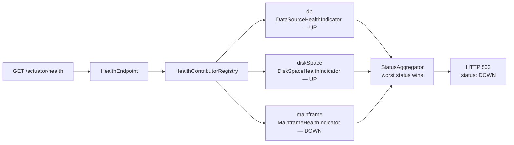

## Objective

Actuator's built-in endpoints — see [Spring Boot Actuator: Endpoints](spring-boot-actuator-endpoints)
for what ships in the box and how to expose it — describe the *framework's* view
of a running application: its beans, its HTTP metrics, its datasource health.
They know nothing about the application's own domain. Customizing Actuator
closes that gap: an `InfoContributor` bean pushes application-specific facts
into `/info`, a `HealthIndicator` bean makes `/health` reflect the status of a
real dependency the framework never anticipated, an injected Micrometer
`MeterRegistry` publishes business counters and gauges alongside the
auto-provided HTTP metrics, and an `@Endpoint`-annotated class adds an entirely
new operation exposed over both HTTP and JMX. Because all of this surface leaks
information about — and in the case of `/loggers` and `/env`, lets a caller
*mutate* — a production system, the last step is always the same: put Spring
Security in front of it, matched by `EndpointRequest` rather than a hardcoded
path.

## Use Cases

- A health indicator that pings a critical downstream dependency — a legacy
  mainframe, a partner payment API, a search cluster — and reports `DOWN` so an
  orchestrator's readiness probe pulls the instance out of rotation before
  users see failures.
- A custom metric tracking domain events rather than infrastructure — orders
  placed per minute, tacos created per ingredient, signup funnel drop-offs —
  scraped by Prometheus and graphed next to JVM and HTTP metrics with no extra
  agent.
- Stamping every deployment's `/info` with build version, timestamp, and git
  commit hash, so "which build is actually running in prod?" is a `curl` away
  instead of a deployment-log archaeology exercise.
- Restricting the whole Actuator surface to authenticated ops staff (or to an
  internal-only management port), while leaving `/health` and `/info` open for
  load balancers and probes that cannot authenticate.
- A custom endpoint that exposes an operation the framework has no concept of —
  flushing an application-level cache, dumping an in-memory queue's contents,
  toggling a feature flag — over the same channel your ops tooling already
  speaks.

## Deep Dive

### Contributing to `/info`, the easy way: `info.*` properties

Out of the box `/info` returns `{}`. The cheapest way to fill it is to define
properties under the `info.` prefix — anything below that key is picked up
verbatim:

```yaml
info:
  app:
    name: Taco Cloud
    encoding: UTF-8
  contact:
    team: platform@example.com
```

```json
{
  "app": { "name": "Taco Cloud", "encoding": "UTF-8" },
  "contact": { "team": "platform@example.com" }
}
```

Build tools can expand these at package time rather than hardcoding them —
Maven's resource filtering turns `info.app.version=@project.version@` into the
real version in the packaged `application.yml`.

The limitation is right there in the mechanism: these are *static* values,
frozen when the artifact was built. Anything computed at runtime needs code.

### Contributing to `/info` programmatically: `InfoContributor`

`InfoContributor` is a one-method interface. Implement it, register the
implementation as a bean, and Actuator merges whatever it contributes into the
`/info` response:

```java
package tacos.tacos;

import java.util.HashMap;
import java.util.Map;
import org.springframework.boot.actuate.info.Info.Builder;
import org.springframework.boot.actuate.info.InfoContributor;
import org.springframework.stereotype.Component;

@Component
public class TacoCountInfoContributor implements InfoContributor {

    private final TacoRepository tacoRepo;

    public TacoCountInfoContributor(TacoRepository tacoRepo) {
        this.tacoRepo = tacoRepo;
    }

    @Override
    public void contribute(Builder builder) {
        long tacoCount = tacoRepo.count();
        Map<String, Object> tacoMap = new HashMap<>();
        tacoMap.put("count", tacoCount);
        builder.withDetail("taco-stats", tacoMap);
    }
}
```

`contribute()` receives an `Info.Builder`; each `withDetail(key, value)` call
adds one top-level key to the response:

```json
{
  "taco-stats": { "count": 44 }
}
```

The contributor is a normal Spring bean, so it can inject repositories,
clients, caches — anything. Note that `contribute()` runs on *every* request to
`/info`, so an expensive query here is an expensive endpoint.

### Build and git metadata: contributors you get by configuring the build

Two of Spring Boot's own `InfoContributor` implementations activate purely on
the presence of a build-time artifact. `BuildInfoContributor` looks for
`META-INF/build-info.properties`, produced by the `build-info` goal:

```xml
<plugin>
  <groupId>org.springframework.boot</groupId>
  <artifactId>spring-boot-maven-plugin</artifactId>
  <executions>
    <execution>
      <goals><goal>build-info</goal></goals>
    </execution>
  </executions>
</plugin>
```

```groovy
// Gradle equivalent
springBoot {
    buildInfo()
}
```

```json
{
  "build": {
    "version": "0.0.16-SNAPSHOT",
    "artifact": "ingredient-service",
    "group": "sia5",
    "time": "2018-06-04T00:24:04.373Z"
  }
}
```

`GitInfoContributor` does the same for a `git.properties` file, generated by
the `git-commit-id-plugin` (Maven) or `gradle-git-properties` (Gradle). By
default it publishes just branch, commit id, and commit time; `full` mode
publishes everything the plugin captured:

```yaml
management:
  info:
    git:
      mode: full
```

```json
{
  "git": {
    "branch": "main",
    "commit": {
      "id": { "abbrev": "b5c104d", "full": "b5c104d1fcbe6c2b84965ea08a330595100fd44e" },
      "message": { "short": "Add Spring Boot Admin and Actuator" },
      "user": { "name": "Craig Walls", "email": "craig@habuma.com" },
      "time": "2018-06-02T18:10:58Z"
    },
    "dirty": "true"
  }
}
```

That `"dirty": true` is the reason full mode earns its keep — it says the build
was produced from a working tree with uncommitted changes, which is exactly the
kind of thing you want to discover *before* spending an afternoon diffing the
tagged commit against what's running.

> **Book vs. today.** The book's `/info` fills up as soon as you add `info.*`
> properties. Since Spring Boot 2.6 that is no longer true: each contributor is
> gated by `management.info.<id>.enabled`, and the ones with no prerequisite —
> `env` (the one that reads `info.*` properties), `java`, `os`, `process` — are
> **disabled by default**. The book's first example silently produces `{}` on
> any modern Boot until you add `management.info.env.enabled=true`. The
> `build` and `git` contributors are the opposite case: enabled by default, but
> only active when `build-info.properties` / `git.properties` actually exist,
> so the build-plugin configuration shown above is still exactly what's
> required. `InfoContributor` itself — package
> `org.springframework.boot.actuate.info`, single `contribute(Info.Builder)`
> method — is unchanged.

### Custom health indicators: `HealthIndicator`

Spring Boot ships health indicators for the systems it knows about — DataSource,
Redis, Mongo, RabbitMQ, disk space. For anything else, implement
`HealthIndicator` and register it as a bean. The `Health` builder produces one
of four statuses (`UP`, `DOWN`, `OUT_OF_SERVICE`, `UNKNOWN`) plus arbitrary
details:

```java
package tacos.tacos;

import org.springframework.boot.health.contributor.Health;
import org.springframework.boot.health.contributor.HealthIndicator;
import org.springframework.stereotype.Component;

@Component
public class MainframeHealthIndicator implements HealthIndicator {

    private final MainframeClient client;

    public MainframeHealthIndicator(MainframeClient client) {
        this.client = client;
    }

    @Override
    public Health health() {
        try {
            PingResponse response = client.ping();   // real remote call
            return Health.up()
                    .withDetail("latencyMs", response.latencyMs())
                    .withDetail("region", response.region())
                    .build();
        } catch (MainframeUnavailableException ex) {
            return Health.down(ex)
                    .withDetail("reason", "mainframe ping failed")
                    .build();
        }
    }
}
```

The bean name determines the key in the aggregated response: strip the
`HealthIndicator` suffix and lowercase the rest, so `MainframeHealthIndicator`
appears under `mainframe`:

```json
{
  "status": "DOWN",
  "components": {
    "db": { "status": "UP" },
    "diskSpace": { "status": "UP" },
    "mainframe": {
      "status": "DOWN",
      "details": { "reason": "mainframe ping failed" }
    }
  }
}
```

The critical mechanic is the aggregation rule: the top-level `status` is the
*worst* status among all contributors. One `DOWN` indicator makes the whole
`/health` endpoint report `DOWN`, which — if that endpoint backs a readiness
probe — takes the instance out of service.



`Health.down(ex)` attaches the exception, but the stack trace only reaches the
response when `management.endpoint.health.show-details` allows it
(`never` by default, commonly `when-authorized` or `always` behind auth).

> **Book vs. today.** `HealthIndicator` was not superseded — it is still the
> interface you implement, still a single `Health health()` method, and the
> `Health.up()/down()/outOfService()/withDetail()` builder is unchanged. Two
> things did move around it. First, Spring Boot 2.2 introduced
> `HealthContributor` as the parent abstraction: `HealthIndicator extends
> HealthContributor`, and `CompositeHealthContributor` lets one bean contribute
> a *tree* of named sub-checks; reactive applications implement
> `ReactiveHealthIndicator` (returning `Mono<Health>`) so the check never blocks
> an event-loop thread. Second, Spring Boot 4.0's modularization moved the
> health types out of `org.springframework.boot.actuate.health` into a dedicated
> `org.springframework.boot.health.contributor` package — `Health`, `Status`,
> `HealthIndicator`, `ReactiveHealthIndicator`, `AbstractHealthIndicator`,
> `CompositeHealthContributor` all live there now. So the book's code compiles
> unchanged on Boot 3.x and needs only an import swap on Boot 4.x. The book's
> flat `{"status":"UP","details":{...}}` response shape is also dated: since 2.2
> the aggregate uses `components` (nested contributors) with each contributor's
> own `details` underneath.

### Custom metrics: injecting Micrometer's `MeterRegistry`

Actuator's `/metrics` endpoint is a facade over Micrometer, and Micrometer is
happy to carry metrics that have nothing to do with the framework. Inject the
Spring-managed `MeterRegistry` and register counters, timers, or gauges against
it:

```java
package tacos.tacos;

import io.micrometer.core.instrument.MeterRegistry;
import org.springframework.data.rest.core.event.AbstractRepositoryEventListener;
import org.springframework.stereotype.Component;

@Component
public class TacoMetrics extends AbstractRepositoryEventListener<Taco> {

    private final MeterRegistry meterRegistry;

    public TacoMetrics(MeterRegistry meterRegistry) {
        this.meterRegistry = meterRegistry;
    }

    @Override
    protected void onAfterCreate(Taco taco) {
        for (Ingredient ingredient : taco.getIngredients()) {
            meterRegistry.counter("tacocloud", "ingredient", ingredient.getId())
                         .increment();
        }
    }
}
```

`counter(name, tagKey, tagValue)` is get-or-create: the first call for a given
name/tag combination registers the counter, every later call reuses it. Tags
are what make a single metric name queryable along multiple dimensions —
`/actuator/metrics/tacocloud` returns the sum across all ingredients, and a
`tag` query parameter slices it:

```bash
$ curl localhost:8081/actuator/metrics/tacocloud
{
  "name": "tacocloud",
  "measurements": [ { "statistic": "COUNT", "value": 84 } ],
  "availableTags": [
    { "tag": "ingredient",
      "values": ["FLTO", "CHED", "LETC", "GRBF", "COTO", "JACK", "TMTO", "SLSA"] }
  ]
}

$ curl "localhost:8081/actuator/metrics/tacocloud?tag=ingredient:FLTO"
{
  "name": "tacocloud",
  "measurements": [ { "statistic": "COUNT", "value": 39 } ],
  "availableTags": []
}
```

Timers and gauges follow the same shape, but a gauge has a subtlety: the
registry holds only a **weak** reference to whatever it observes, so a gauge
built over a local variable can be garbage-collected and start reporting `NaN`.
The documented fix for anything whose value depends on another bean is a
`MeterBinder`, which defers registration until the dependency exists:

```java
import io.micrometer.core.instrument.Gauge;
import io.micrometer.core.instrument.Timer;
import io.micrometer.core.instrument.binder.MeterBinder;

@Bean
MeterBinder pendingOrdersGauge(OrderQueue queue) {
    return registry -> Gauge.builder("orders.pending", queue::size)
                            .description("orders awaiting fulfillment")
                            .register(registry);
}

// timers wrap the work they measure
Timer timer = Timer.builder("orders.fulfillment")
                   .tag("channel", "web")
                   .register(meterRegistry);
Order order = timer.record(() -> fulfillmentService.fulfill(request));
```

Common tags applied to every meter — the ones your dashboards group by — belong
in configuration rather than in each call site:

```yaml
management:
  metrics:
    tags:
      region: us-east-1
      stack: prod
```

> **Book vs. today.** Micrometer's instrumentation API is the stable part of
> this chapter. `io.micrometer.core.instrument.MeterRegistry`, injected as a
> bean, with `counter()`/`gauge()`/`timer()` and vararg tags, is exactly what
> current documentation shows — the book's `TacoMetrics` compiles as written.
> What has grown around it: `MeterBinder` is now the recommended way to register
> gauges that depend on other beans, `MeterFilter` beans rename/filter/deny
> meters globally, and Micrometer's newer Observation API (`ObservationRegistry`,
> the basis of Micrometer Tracing) unifies a single instrumentation point into
> metrics *and* distributed traces. None of that invalidates the direct
> `MeterRegistry` approach; it just means a metric and a span no longer need
> separate instrumentation.

### Custom endpoints: `@Endpoint` and `@ReadOperation`

An Actuator endpoint is not a controller. `@Endpoint` classes are
transport-agnostic — the same class is adapted to HTTP *and* to a JMX MBean —
which is why their operations are annotated `@ReadOperation`,
`@WriteOperation`, `@DeleteOperation` rather than `@GetMapping`/`@PostMapping`:

```java
package tacos.ingredients;

import java.util.ArrayList;
import java.util.Date;
import java.util.List;
import org.springframework.boot.actuate.endpoint.annotation.DeleteOperation;
import org.springframework.boot.actuate.endpoint.annotation.Endpoint;
import org.springframework.boot.actuate.endpoint.annotation.ReadOperation;
import org.springframework.boot.actuate.endpoint.annotation.WriteOperation;
import org.springframework.stereotype.Component;

@Component
@Endpoint(id = "notes")
public class NotesEndpoint {

    private final List<Note> notes = new ArrayList<>();

    @ReadOperation
    public List<Note> notes() {
        return notes;
    }

    @WriteOperation
    public List<Note> addNote(String text) {
        notes.add(new Note(text));
        return notes;
    }

    @DeleteOperation
    public List<Note> deleteNote(int index) {
        if (index < notes.size()) {
            notes.remove(index);
        }
        return notes;
    }

    record Note(Date time, String text) {
        Note(String text) { this(new Date(), text); }
    }
}
```

The HTTP adaptation is mechanical: `@ReadOperation` handles `GET`,
`@WriteOperation` handles `POST` with the method parameters bound from a JSON
body, `@DeleteOperation` handles `DELETE` with parameters bound from the query
string.

```bash
$ curl localhost:8080/actuator/notes \
       -d '{"text":"Bring home milk"}' -H "Content-type: application/json"
[{"time":"2018-06-08T13:50:45.085+0000","text":"Bring home milk"}]

$ curl localhost:8080/actuator/notes
[{"time":"2018-06-08T13:50:45.085+0000","text":"Bring home milk"}]

$ curl "localhost:8080/actuator/notes?index=0" -X DELETE
[]
```

Two knobs matter. Path variables come from `@Selector` on a parameter
(`@ReadOperation public Note note(@Selector int index)` maps to
`/actuator/notes/{index}`). And if you don't want both transports, swap the
annotation: `@WebEndpoint` is HTTP-only, `@JmxEndpoint` is JMX-only. A custom
endpoint still obeys the normal exposure rules — it must appear in
`management.endpoints.web.exposure.include` to be reachable over HTTP.

> **Book vs. today.** `@Endpoint`, `@ReadOperation`, `@WriteOperation`,
> `@DeleteOperation`, `@WebEndpoint`, `@JmxEndpoint` are all current and still
> in `org.springframework.boot.actuate.endpoint.annotation`. The one thing that
> changed is the book's `@Endpoint(id="notes", enableByDefault=true)`:
> `enableByDefault` was deprecated in Spring Boot 3.4 and removed in 4.0, in
> favor of an access model — `@Endpoint(id="notes", defaultAccess = Access.READ_ONLY)`,
> with `Access.UNRESTRICTED` / `READ_ONLY` / `NONE`. The same shift happened in
> configuration: `management.endpoint.<id>.enabled=false` became
> `management.endpoint.<id>.access=none`, and `management.endpoints.access.default=none`
> flips the whole surface to opt-in. Exposure
> (`management.endpoints.web.exposure.include`) and access are now two separate
> gates — exposure decides which transport can see an endpoint, access decides
> whether it may be invoked at all.

### Securing Actuator with `EndpointRequest`

Actuator has no security model of its own — its endpoints are ordinary paths,
so Spring Security secures them the same way it secures anything else. The
naive version matches the base path as a string:

```java
http.authorizeHttpRequests(requests -> requests
    .requestMatchers("/actuator/**").hasRole("ADMIN"));
```

That works until someone sets `management.endpoints.web.base-path=/manage`, at
which point the rule silently stops matching and the entire Actuator surface is
unprotected — a security control that fails *open* on a configuration change.
`EndpointRequest` resolves the actual configured paths at runtime instead:

```java
import org.springframework.boot.security.autoconfigure.actuate.web.servlet.EndpointRequest;
import org.springframework.context.annotation.Bean;
import org.springframework.context.annotation.Configuration;
import org.springframework.security.config.annotation.web.builders.HttpSecurity;
import org.springframework.security.web.SecurityFilterChain;

import static org.springframework.security.config.Customizer.withDefaults;

@Configuration(proxyBeanMethods = false)
public class ActuatorSecurityConfiguration {

    @Bean
    SecurityFilterChain actuatorSecurity(HttpSecurity http) throws Exception {
        http.securityMatcher(EndpointRequest.toAnyEndpoint());
        http.authorizeHttpRequests(requests -> requests
                .anyRequest().hasRole("ENDPOINT_ADMIN"));
        http.httpBasic(withDefaults());
        return http.build();
    }
}
```

`securityMatcher(EndpointRequest.toAnyEndpoint())` scopes this entire filter
chain to Actuator, leaving the application's own chains untouched. The matcher
composes three ways:

```java
// everything except the two endpoints probes need unauthenticated
EndpointRequest.toAnyEndpoint().excluding("health", "info")

// only the genuinely dangerous ones
EndpointRequest.to("beans", "threaddump", "loggers", "env", "heapdump")

// by endpoint class, refactor-safe
EndpointRequest.to(ShutdownEndpoint.class, HealthEndpoint.class)
```

The `excluding("health", "info")` form is the common production shape: a
Kubernetes readiness probe or an ELB health check cannot present credentials,
so those two stay open while everything else requires a role. Note the
asymmetry in failure modes — `to(...)` secures *only* the listed endpoints and
leaves everything else wide open, so adding a new sensitive endpoint means
remembering to add it to the list. `toAnyEndpoint().excluding(...)` fails
closed, which is why it's the better default.

The complementary lever is network-level: moving Actuator to its own port keeps
it off the public listener entirely, so even a misconfigured security rule isn't
reachable from outside.

```yaml
management:
  server:
    port: 8081
    address: 127.0.0.1
  endpoints:
    web:
      exposure:
        include: health,info,metrics,prometheus
```

> **Book vs. today.** The security *idea* is unchanged — `EndpointRequest`
> still exists and still offers `toAnyEndpoint()`, `to(...)`, `toLinks()`, and
> `excluding(...)` — but every line of the book's configuration has been
> rewritten. `WebSecurityConfigurerAdapter` and its `configure(HttpSecurity)`
> override were removed in Spring Security 6 in favor of a `SecurityFilterChain`
> bean; `requestMatcher(...)` became `securityMatcher(...)`;
> `authorizeRequests()` became `authorizeHttpRequests()`; and the `.and()`
> chaining gave way to lambda customizers. `EndpointRequest` itself also moved
> package in Spring Boot 4 — from
> `org.springframework.boot.actuate.autoconfigure.security.servlet` (Boot 2.x
> and 3.x) to `org.springframework.boot.security.autoconfigure.actuate.web.servlet`.
> One behavioral change is worth knowing: modern Spring Boot's own
> auto-configuration already secures Actuator when Spring Security is on the
> classpath, and backs off entirely as soon as you declare a custom
> `SecurityFilterChain` bean — so a partial custom chain replaces the defaults
> rather than layering on top of them.

## Trade-offs

- **A custom health indicator makes `/health` honest about dependencies, but
  the worst status wins.** A `DOWN` from a *non-critical* dependency — a
  recommendations service, an analytics sink — takes the aggregate to `DOWN`,
  and if `/health` backs a load balancer or Kubernetes readiness probe, healthy
  instances that could still serve 95% of traffic get pulled out of rotation.
  Health groups exist precisely to separate these audiences: the probe watches a
  narrow group, the ops dashboard watches everything.
  ```yaml
  management:
    endpoint:
      health:
        group:
          readiness:
            include: db, diskSpace     # mainframe deliberately excluded
  ```
- **`/info` is the easiest place to leak information you didn't mean to
  publish.** Full git mode publishes committer names and emails; `info.*`
  properties expanded from the build can pull in internal hostnames, branch
  names, or an accidentally-templated secret. Spring Boot 2.6's decision to
  disable the `env`, `java`, `os`, and `process` contributors by default was a
  hardening measure, not an inconvenience — turning them back on is a
  deliberate choice to publish that data, and `/info` is frequently left
  unauthenticated so probes can reach it.
- **Custom metrics cost real work at every call site; the auto-provided ones
  cost nothing.** `http.server.requests` already carries URI, status, method,
  and exception tags — a great deal of "how is the app doing" is answerable
  without writing a line of instrumentation. A hand-written counter earns its
  place only when it measures something the framework cannot see (orders
  placed, cache hit ratio, queue depth), and it comes with a maintenance
  burden: the instrumentation lives in domain code and rots when that code is
  refactored.
- **High-cardinality tags will quietly destroy your metrics backend.** Every
  distinct tag *value* creates a separate time series. An `ingredient` tag over
  a dozen ingredients is fine; a `userId` or `orderId` tag is a cardinality
  explosion that runs the registry — and the Prometheus/Datadog bill — into the
  ground.
  ```java
  meterRegistry.counter("orders", "channel", order.channel()).increment();     // bounded set — fine
  meterRegistry.counter("orders", "orderId", order.id()).increment();          // one series per order — never
  ```
- **`EndpointRequest` is strictly better than a path string, but the choice
  between `to()` and `toAnyEndpoint().excluding()` decides your failure mode.**
  An allowlist (`to("beans", "loggers")`) secures what you listed and silently
  leaves every future endpoint — including custom `@Endpoint` classes added
  later — unauthenticated. A denylist fails closed.
  ```java
  http.securityMatcher(EndpointRequest.to("beans", "loggers"));            // new endpoints ship unprotected
  http.securityMatcher(EndpointRequest.toAnyEndpoint()
          .excluding("health", "info"));                                   // new endpoints inherit protection
  ```
- **Custom `@Endpoint` classes are transport-agnostic, which cuts both ways.**
  The same class is exposed over HTTP *and* as a JMX MBean, so an endpoint you
  reasoned about as "internal HTTP only" also lands on the JMX surface unless
  you narrow it with `@WebEndpoint`. And because the operation annotations are
  deliberately minimal, an endpoint that genuinely needs content negotiation,
  custom status codes, or complex request binding is fighting the abstraction —
  at that point it wants to be a `@RestController`, not an Actuator endpoint.

## Documentation Links

- Craig Walls, "Spring in Action", 5th Edition (Manning, 2019) — Chapter 16,
  "Working with Spring Boot Actuator", sections 16.3-16.4, p. 416-428 — doc
- [Spring Boot Reference — Writing Custom HealthIndicators](https://docs.spring.io/spring-boot/reference/actuator/endpoints.html#actuator.endpoints.health.writing-custom-health-indicators) — doc
- [Spring Boot Reference — Metrics (Micrometer, MeterRegistry, MeterBinder)](https://docs.spring.io/spring-boot/reference/actuator/metrics.html) — doc
- [Spring Boot Reference — Actuator Endpoint Security (EndpointRequest)](https://docs.spring.io/spring-boot/reference/actuator/endpoints.html#actuator.endpoints.security) — doc
