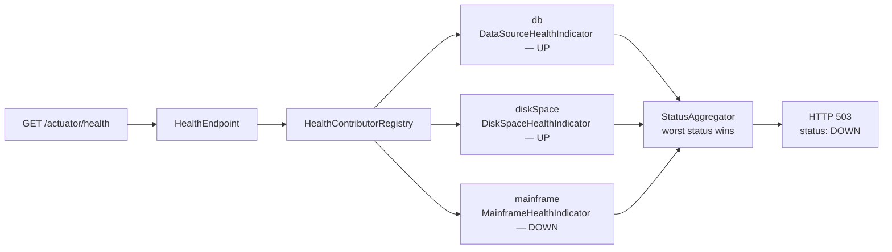

## Objective

Os endpoints nativos do Actuator — veja [Spring Boot Actuator: Built-in Endpoints](spring-boot-actuator-endpoints)
para o que já vem de fábrica e como expô-lo — descrevem a visão que o
*framework* tem de uma aplicação em execução: seus beans, suas métricas HTTP, a
saúde do seu datasource. Eles não sabem nada sobre o domínio próprio da
aplicação. Customizar o Actuator fecha essa lacuna: um bean `InfoContributor`
empurra fatos específicos da aplicação para `/info`, um bean `HealthIndicator`
faz `/health` refletir o status de uma dependência real que o framework nunca
previu, um `MeterRegistry` do Micrometer injetado publica counters e gauges de
negócio ao lado das métricas HTTP fornecidas automaticamente, e uma classe
anotada com `@Endpoint` adiciona uma operação inteiramente nova exposta tanto por
HTTP quanto por JMX. Como toda essa superfície vaza informação sobre — e, no
caso de `/loggers` e `/env`, deixa quem chama *alterar* — um sistema de produção,
o último passo é sempre o mesmo: colocar o Spring Security na frente, casando
por `EndpointRequest` em vez de um path hardcoded.

## Use Cases

- Um health indicator que faz ping numa dependência downstream crítica — um
  mainframe legado, uma API de pagamento parceira, um cluster de busca — e
  reporta `DOWN` para que a readiness probe de um orquestrador tire a instância
  de rotação antes que usuários vejam falhas.
- Uma métrica customizada rastreando eventos de domínio em vez de
  infraestrutura — pedidos feitos por minuto, tacos criados por ingrediente,
  quedas no funil de cadastro — coletada pelo Prometheus e plotada ao lado de
  métricas de JVM e HTTP sem nenhum agente extra.
- Carimbar o `/info` de cada deploy com versão de build, timestamp, e hash de
  commit do git, para que "qual build está de fato rodando em prod?" seja um
  `curl` de distância em vez de um exercício de arqueologia de logs de deploy.
- Restringir toda a superfície do Actuator a pessoal de ops autenticado (ou a
  uma porta de gerenciamento interna), enquanto deixa `/health` e `/info`
  abertos para load balancers e probes que não conseguem se autenticar.
- Um endpoint customizado que expõe uma operação que o framework não tem
  noção — descarregar um cache de nível de aplicação, despejar o conteúdo de
  uma fila em memória, alternar uma feature flag — pelo mesmo canal que suas
  ferramentas de ops já falam.

## Deep Dive

### Contribuindo para `/info`, o jeito fácil: propriedades `info.*`

Fora da caixa, `/info` retorna `{}`. O jeito mais barato de preenchê-lo é
definir propriedades sob o prefixo `info.` — tudo abaixo dessa chave é captado
literalmente:

```yaml
info:
  app:
    name: Taco Cloud
    encoding: UTF-8
  contact:
    team: platform@example.com
```

```json
{
  "app": { "name": "Taco Cloud", "encoding": "UTF-8" },
  "contact": { "team": "platform@example.com" }
}
```

Ferramentas de build podem expandir esses valores no momento do empacotamento em
vez de hardcodá-los — o resource filtering do Maven transforma
`info.app.version=@project.version@` na versão real no `application.yml`
empacotado.

A limitação está ali mesmo, no mecanismo: esses são valores *estáticos*,
congelados quando o artefato foi construído. Qualquer coisa calculada em
runtime precisa de código.

### Contribuindo para `/info` programaticamente: `InfoContributor`

`InfoContributor` é uma interface de um único método. Implemente-a, registre a
implementação como bean, e o Actuator mescla o que ela contribuir na resposta
de `/info`:

```java
package tacos.tacos;

import java.util.HashMap;
import java.util.Map;
import org.springframework.boot.actuate.info.Info.Builder;
import org.springframework.boot.actuate.info.InfoContributor;
import org.springframework.stereotype.Component;

@Component
public class TacoCountInfoContributor implements InfoContributor {

    private final TacoRepository tacoRepo;

    public TacoCountInfoContributor(TacoRepository tacoRepo) {
        this.tacoRepo = tacoRepo;
    }

    @Override
    public void contribute(Builder builder) {
        long tacoCount = tacoRepo.count();
        Map<String, Object> tacoMap = new HashMap<>();
        tacoMap.put("count", tacoCount);
        builder.withDetail("taco-stats", tacoMap);
    }
}
```

`contribute()` recebe um `Info.Builder`; cada chamada `withDetail(key, value)`
adiciona uma chave de nível superior à resposta:

```json
{
  "taco-stats": { "count": 44 }
}
```

O contributor é um bean Spring normal, então pode injetar repositories,
clients, caches — qualquer coisa. Note que `contribute()` roda em *toda*
requisição a `/info`, então uma query cara aqui é um endpoint caro.

### Metadados de build e git: contributors que você ganha configurando o build

Duas das próprias implementações de `InfoContributor` do Spring Boot ativam
puramente pela presença de um artefato de build-time. `BuildInfoContributor`
procura por `META-INF/build-info.properties`, produzido pela goal `build-info`:

```xml
<plugin>
  <groupId>org.springframework.boot</groupId>
  <artifactId>spring-boot-maven-plugin</artifactId>
  <executions>
    <execution>
      <goals><goal>build-info</goal></goals>
    </execution>
  </executions>
</plugin>
```

```groovy
// Gradle equivalent
springBoot {
    buildInfo()
}
```

```json
{
  "build": {
    "version": "0.0.16-SNAPSHOT",
    "artifact": "ingredient-service",
    "group": "sia5",
    "time": "2018-06-04T00:24:04.373Z"
  }
}
```

`GitInfoContributor` faz o mesmo para um arquivo `git.properties`, gerado pelo
`git-commit-id-plugin` (Maven) ou `gradle-git-properties` (Gradle). Por padrão
ele publica só branch, id do commit, e horário do commit; o modo `full` publica
tudo que o plugin capturou:

```yaml
management:
  info:
    git:
      mode: full
```

```json
{
  "git": {
    "branch": "main",
    "commit": {
      "id": { "abbrev": "b5c104d", "full": "b5c104d1fcbe6c2b84965ea08a330595100fd44e" },
      "message": { "short": "Add Spring Boot Admin and Actuator" },
      "user": { "name": "Craig Walls", "email": "craig@habuma.com" },
      "time": "2018-06-02T18:10:58Z"
    },
    "dirty": "true"
  }
}
```

Esse `"dirty": true` é a razão pela qual o modo full se justifica — ele diz que
o build foi produzido a partir de uma working tree com mudanças não commitadas,
que é exatamente o tipo de coisa que você quer descobrir *antes* de gastar uma
tarde comparando o commit da tag com o que está rodando.

> **Livro vs. hoje.** O `/info` do livro se preenche assim que você adiciona
> propriedades `info.*`. Desde o Spring Boot 2.6 isso não é mais verdade: cada
> contributor é controlado por `management.info.<id>.enabled`, e os que não
> têm pré-requisito — `env` (o que lê propriedades `info.*`), `java`, `os`,
> `process` — vêm **desabilitados por padrão**. O primeiro exemplo do livro
> silenciosamente produz `{}` em qualquer Boot moderno até você adicionar
> `management.info.env.enabled=true`. Os contributors `build` e `git` são o
> caso oposto: habilitados por padrão, mas só ativos quando
> `build-info.properties` / `git.properties` realmente existem, então a
> configuração de build plugin mostrada acima continua sendo exatamente o que
> é exigido. O próprio `InfoContributor` — pacote
> `org.springframework.boot.actuate.info`, método único
> `contribute(Info.Builder)` — permanece inalterado.

### Health indicators customizados: `HealthIndicator`

O Spring Boot fornece health indicators para os sistemas que ele conhece —
DataSource, Redis, Mongo, RabbitMQ, espaço em disco. Para qualquer outra coisa,
implemente `HealthIndicator` e registre-o como bean. O builder `Health` produz
um dos quatro status (`UP`, `DOWN`, `OUT_OF_SERVICE`, `UNKNOWN`) mais detalhes
arbitrários:

```java
package tacos.tacos;

import org.springframework.boot.health.contributor.Health;
import org.springframework.boot.health.contributor.HealthIndicator;
import org.springframework.stereotype.Component;

@Component
public class MainframeHealthIndicator implements HealthIndicator {

    private final MainframeClient client;

    public MainframeHealthIndicator(MainframeClient client) {
        this.client = client;
    }

    @Override
    public Health health() {
        try {
            PingResponse response = client.ping();   // real remote call
            return Health.up()
                    .withDetail("latencyMs", response.latencyMs())
                    .withDetail("region", response.region())
                    .build();
        } catch (MainframeUnavailableException ex) {
            return Health.down(ex)
                    .withDetail("reason", "mainframe ping failed")
                    .build();
        }
    }
}
```

O nome do bean determina a chave na resposta agregada: remova o sufixo
`HealthIndicator` e coloque o resto em minúsculas, então `MainframeHealthIndicator`
aparece sob `mainframe`:

```json
{
  "status": "DOWN",
  "components": {
    "db": { "status": "UP" },
    "diskSpace": { "status": "UP" },
    "mainframe": {
      "status": "DOWN",
      "details": { "reason": "mainframe ping failed" }
    }
  }
}
```

O mecanismo crítico é a regra de agregação: o `status` de nível superior é o
*pior* status entre todos os contributors. Um indicator `DOWN` faz o endpoint
`/health` inteiro reportar `DOWN`, o que — se esse endpoint alimenta uma
readiness probe — tira a instância de serviço.



`Health.down(ex)` anexa a exception, mas o stack trace só chega na resposta
quando `management.endpoint.health.show-details` permite (`never` por padrão,
comumente `when-authorized` ou `always` atrás de auth).

> **Livro vs. hoje.** `HealthIndicator` não foi substituído — ainda é a
> interface que você implementa, ainda um único método `Health health()`, e o
> builder `Health.up()/down()/outOfService()/withDetail()` está inalterado.
> Duas coisas mudaram ao redor dele. Primeiro, o Spring Boot 2.2 introduziu
> `HealthContributor` como a abstração pai: `HealthIndicator extends
> HealthContributor`, e `CompositeHealthContributor` permite que um bean
> contribua com uma *árvore* de sub-checks nomeados; aplicações reativas
> implementam `ReactiveHealthIndicator` (retornando `Mono<Health>`) para que a
> checagem nunca bloqueie uma thread de event-loop. Segundo, a modularização
> do Spring Boot 4.0 moveu os tipos de health para fora de
> `org.springframework.boot.actuate.health`, para um pacote dedicado
> `org.springframework.boot.health.contributor` — `Health`, `Status`,
> `HealthIndicator`, `ReactiveHealthIndicator`, `AbstractHealthIndicator`,
> `CompositeHealthContributor` vivem todos ali agora. Então o código do livro
> compila sem mudanças no Boot 3.x e precisa só de uma troca de import no
> Boot 4.x. O formato de resposta plano do livro,
> `{"status":"UP","details":{...}}`, também está datado: desde 2.2 o agregado
> usa `components` (contributors aninhados) com o próprio `details` de cada
> contributor por baixo.

### Métricas customizadas: injetando o `MeterRegistry` do Micrometer

O endpoint `/metrics` do Actuator é uma fachada sobre o Micrometer, e o
Micrometer aceita de bom grado métricas que não têm nada a ver com o
framework. Injete o `MeterRegistry` gerenciado pelo Spring e registre counters,
timers, ou gauges contra ele:

```java
package tacos.tacos;

import io.micrometer.core.instrument.MeterRegistry;
import org.springframework.data.rest.core.event.AbstractRepositoryEventListener;
import org.springframework.stereotype.Component;

@Component
public class TacoMetrics extends AbstractRepositoryEventListener<Taco> {

    private final MeterRegistry meterRegistry;

    public TacoMetrics(MeterRegistry meterRegistry) {
        this.meterRegistry = meterRegistry;
    }

    @Override
    protected void onAfterCreate(Taco taco) {
        for (Ingredient ingredient : taco.getIngredients()) {
            meterRegistry.counter("tacocloud", "ingredient", ingredient.getId())
                         .increment();
        }
    }
}
```

`counter(name, tagKey, tagValue)` é get-or-create: a primeira chamada para uma
dada combinação de nome/tag registra o counter, chamadas posteriores reusam
o mesmo. Tags são o que torna um único nome de métrica consultável ao longo de
múltiplas dimensões — `/actuator/metrics/tacocloud` retorna a soma entre todos
os ingredientes, e um parâmetro de query `tag` a fatia:

```bash
$ curl localhost:8081/actuator/metrics/tacocloud
{
  "name": "tacocloud",
  "measurements": [ { "statistic": "COUNT", "value": 84 } ],
  "availableTags": [
    { "tag": "ingredient",
      "values": ["FLTO", "CHED", "LETC", "GRBF", "COTO", "JACK", "TMTO", "SLSA"] }
  ]
}

$ curl "localhost:8081/actuator/metrics/tacocloud?tag=ingredient:FLTO"
{
  "name": "tacocloud",
  "measurements": [ { "statistic": "COUNT", "value": 39 } ],
  "availableTags": []
}
```

Timers e gauges seguem a mesma forma, mas um gauge tem uma sutileza: o
registry mantém apenas uma referência **fraca** para o que quer que ele
observe, então um gauge construído sobre uma variável local pode ser
coletado pelo garbage collector e começar a reportar `NaN`. A correção
documentada para qualquer coisa cujo valor depende de outro bean é um
`MeterBinder`, que adia o registro até que a dependência exista:

```java
import io.micrometer.core.instrument.Gauge;
import io.micrometer.core.instrument.Timer;
import io.micrometer.core.instrument.binder.MeterBinder;

@Bean
MeterBinder pendingOrdersGauge(OrderQueue queue) {
    return registry -> Gauge.builder("orders.pending", queue::size)
                            .description("orders awaiting fulfillment")
                            .register(registry);
}

// timers wrap the work they measure
Timer timer = Timer.builder("orders.fulfillment")
                   .tag("channel", "web")
                   .register(meterRegistry);
Order order = timer.record(() -> fulfillmentService.fulfill(request));
```

Tags comuns aplicadas a todo meter — aquelas pelas quais seus dashboards
agrupam — pertencem à configuração em vez de a cada call site:

```yaml
management:
  metrics:
    tags:
      region: us-east-1
      stack: prod
```

> **Livro vs. hoje.** A API de instrumentação do Micrometer é a parte estável
> deste capítulo. `io.micrometer.core.instrument.MeterRegistry`, injetado
> como bean, com `counter()`/`gauge()`/`timer()` e tags vararg, é exatamente o
> que a documentação atual mostra — o `TacoMetrics` do livro compila como
> escrito. O que cresceu ao redor dele: `MeterBinder` agora é a forma
> recomendada de registrar gauges que dependem de outros beans, beans
> `MeterFilter` renomeiam/filtram/negam meters globalmente, e a Observation
> API mais nova do Micrometer (`ObservationRegistry`, a base do Micrometer
> Tracing) unifica um único ponto de instrumentação em métricas *e* traces
> distribuídos. Nada disso invalida a abordagem direta com `MeterRegistry`;
> só significa que uma métrica e um span não precisam mais de instrumentação
> separada.

### Endpoints customizados: `@Endpoint` e `@ReadOperation`

Um endpoint do Actuator não é um controller. Classes `@Endpoint` são
agnósticas de transporte — a mesma classe é adaptada tanto para HTTP *quanto*
para um MBean JMX — o que explica por que suas operações são anotadas com
`@ReadOperation`, `@WriteOperation`, `@DeleteOperation` em vez de
`@GetMapping`/`@PostMapping`:

```java
package tacos.ingredients;

import java.util.ArrayList;
import java.util.Date;
import java.util.List;
import org.springframework.boot.actuate.endpoint.annotation.DeleteOperation;
import org.springframework.boot.actuate.endpoint.annotation.Endpoint;
import org.springframework.boot.actuate.endpoint.annotation.ReadOperation;
import org.springframework.boot.actuate.endpoint.annotation.WriteOperation;
import org.springframework.stereotype.Component;

@Component
@Endpoint(id = "notes")
public class NotesEndpoint {

    private final List<Note> notes = new ArrayList<>();

    @ReadOperation
    public List<Note> notes() {
        return notes;
    }

    @WriteOperation
    public List<Note> addNote(String text) {
        notes.add(new Note(text));
        return notes;
    }

    @DeleteOperation
    public List<Note> deleteNote(int index) {
        if (index < notes.size()) {
            notes.remove(index);
        }
        return notes;
    }

    record Note(Date time, String text) {
        Note(String text) { this(new Date(), text); }
    }
}
```

A adaptação para HTTP é mecânica: `@ReadOperation` lida com `GET`,
`@WriteOperation` lida com `POST` com os parâmetros do método vinculados a
partir de um corpo JSON, `@DeleteOperation` lida com `DELETE` com parâmetros
vinculados a partir da query string.

```bash
$ curl localhost:8080/actuator/notes \
       -d '{"text":"Bring home milk"}' -H "Content-type: application/json"
[{"time":"2018-06-08T13:50:45.085+0000","text":"Bring home milk"}]

$ curl localhost:8080/actuator/notes
[{"time":"2018-06-08T13:50:45.085+0000","text":"Bring home milk"}]

$ curl "localhost:8080/actuator/notes?index=0" -X DELETE
[]
```

Dois botões importam. Path variables vêm de `@Selector` num parâmetro
(`@ReadOperation public Note note(@Selector int index)` mapeia para
`/actuator/notes/{index}`). E se você não quiser os dois transportes, troque a
annotation: `@WebEndpoint` é só-HTTP, `@JmxEndpoint` é só-JMX. Um endpoint
customizado ainda obedece às regras normais de exposição — ele precisa
aparecer em `management.endpoints.web.exposure.include` para ser alcançável
via HTTP.

> **Livro vs. hoje.** `@Endpoint`, `@ReadOperation`, `@WriteOperation`,
> `@DeleteOperation`, `@WebEndpoint`, `@JmxEndpoint` estão todos atuais e
> ainda em `org.springframework.boot.actuate.endpoint.annotation`. A única
> coisa que mudou é o `@Endpoint(id="notes", enableByDefault=true)` do livro:
> `enableByDefault` foi deprecated no Spring Boot 3.4 e removido na 4.0, em
> favor de um modelo de acesso — `@Endpoint(id="notes", defaultAccess = Access.READ_ONLY)`,
> com `Access.UNRESTRICTED` / `READ_ONLY` / `NONE`. A mesma mudança aconteceu
> na configuração: `management.endpoint.<id>.enabled=false` virou
> `management.endpoint.<id>.access=none`, e
> `management.endpoints.access.default=none` vira toda a superfície opt-in.
> Exposição (`management.endpoints.web.exposure.include`) e acesso agora são
> dois portões separados — exposição decide qual transporte pode ver um
> endpoint, acesso decide se ele pode ser invocado.

### Protegendo o Actuator com `EndpointRequest`

O Actuator não tem modelo de segurança próprio — seus endpoints são paths
comuns, então o Spring Security os protege da mesma forma que protege
qualquer outra coisa. A versão ingênua casa o path base como string:

```java
http.authorizeHttpRequests(requests -> requests
    .requestMatchers("/actuator/**").hasRole("ADMIN"));
```

Isso funciona até alguém definir
`management.endpoints.web.base-path=/manage`, ponto no qual a regra
silenciosamente para de dar match e toda a superfície do Actuator fica
desprotegida — um controle de segurança que falha *aberto* numa mudança de
configuração. `EndpointRequest` resolve os paths realmente configurados em
runtime, em vez disso:

```java
import org.springframework.boot.security.autoconfigure.actuate.web.servlet.EndpointRequest;
import org.springframework.context.annotation.Bean;
import org.springframework.context.annotation.Configuration;
import org.springframework.security.config.annotation.web.builders.HttpSecurity;
import org.springframework.security.web.SecurityFilterChain;

import static org.springframework.security.config.Customizer.withDefaults;

@Configuration(proxyBeanMethods = false)
public class ActuatorSecurityConfiguration {

    @Bean
    SecurityFilterChain actuatorSecurity(HttpSecurity http) throws Exception {
        http.securityMatcher(EndpointRequest.toAnyEndpoint());
        http.authorizeHttpRequests(requests -> requests
                .anyRequest().hasRole("ENDPOINT_ADMIN"));
        http.httpBasic(withDefaults());
        return http.build();
    }
}
```

`securityMatcher(EndpointRequest.toAnyEndpoint())` escopa toda essa filter
chain ao Actuator, deixando as chains próprias da aplicação intocadas. O
matcher se compõe de três formas:

```java
// everything except the two endpoints probes need unauthenticated
EndpointRequest.toAnyEndpoint().excluding("health", "info")

// only the genuinely dangerous ones
EndpointRequest.to("beans", "threaddump", "loggers", "env", "heapdump")

// by endpoint class, refactor-safe
EndpointRequest.to(ShutdownEndpoint.class, HealthEndpoint.class)
```

A forma `excluding("health", "info")` é o formato comum de produção: uma
readiness probe do Kubernetes ou um health check de ELB não conseguem
apresentar credenciais, então esses dois ficam abertos enquanto tudo mais
exige um role. Note a assimetria nos modos de falha —
`to(...)` protege *só* os endpoints listados e deixa tudo mais totalmente
aberto, então adicionar um novo endpoint sensível significa lembrar de
adicioná-lo à lista. `toAnyEndpoint().excluding(...)` falha fechado, o que
explica por que é o default melhor.

A alavanca complementar é no nível de rede: mover o Actuator para sua própria
porta o mantém completamente fora do listener público, então mesmo uma regra
de segurança mal configurada não é alcançável de fora.

```yaml
management:
  server:
    port: 8081
    address: 127.0.0.1
  endpoints:
    web:
      exposure:
        include: health,info,metrics,prometheus
```

> **Livro vs. hoje.** A *ideia* de segurança permanece inalterada —
> `EndpointRequest` ainda existe e ainda oferece `toAnyEndpoint()`, `to(...)`,
> `toLinks()`, e `excluding(...)` — mas cada linha da configuração do livro
> foi reescrita. `WebSecurityConfigurerAdapter` e sua sobrescrita de
> `configure(HttpSecurity)` foram removidas no Spring Security 6 em favor de
> um bean `SecurityFilterChain`; `requestMatcher(...)` virou
> `securityMatcher(...)`; `authorizeRequests()` virou
> `authorizeHttpRequests()`; e o encadeamento com `.and()` deu lugar a
> customizers em lambda. `EndpointRequest` também mudou de pacote no Spring
> Boot 4 — de `org.springframework.boot.actuate.autoconfigure.security.servlet`
> (Boot 2.x e 3.x) para
> `org.springframework.boot.security.autoconfigure.actuate.web.servlet`. Vale
> conhecer uma mudança de comportamento: a auto-configuração do Spring Boot
> moderno já protege o Actuator quando o Spring Security está no classpath, e
> recua completamente assim que você declara um bean `SecurityFilterChain`
> customizado — então uma chain customizada parcial substitui os defaults em
> vez de se somar a eles.

## Trade-offs

- **Um health indicator customizado torna `/health` honesto sobre dependências,
  mas o pior status vence.** Um `DOWN` de uma dependência *não crítica* — um
  serviço de recomendações, um sink de analytics — leva o agregado para
  `DOWN`, e se `/health` alimenta um load balancer ou readiness probe do
  Kubernetes, instâncias saudáveis que ainda poderiam servir 95% do tráfego
  são tiradas de rotação. Grupos de health existem precisamente para separar
  essas audiências: a probe observa um grupo estreito, o dashboard de ops
  observa tudo.
  ```yaml
  management:
    endpoint:
      health:
        group:
          readiness:
            include: db, diskSpace     # mainframe deliberately excluded
  ```
- **`/info` é o lugar mais fácil de vazar informação que você não pretendia
  publicar.** O modo full do git publica nomes e emails de committers;
  propriedades `info.*` expandidas do build podem trazer hostnames internos,
  nomes de branch, ou um segredo templado por acidente. A decisão do Spring
  Boot 2.6 de desabilitar os contributors `env`, `java`, `os`, e `process`
  por padrão foi uma medida de hardening, não um incômodo — reativá-los é
  uma escolha deliberada de publicar esses dados, e `/info` é
  frequentemente deixado sem autenticação para que probes o alcancem.
- **Métricas customizadas custam trabalho real em cada call site; as
  fornecidas automaticamente não custam nada.** `http.server.requests` já
  carrega tags de URI, status, método, e exception — uma boa parte de "como
  está a aplicação" é respondível sem escrever uma linha de instrumentação.
  Um counter escrito à mão se justifica só quando mede algo que o framework
  não consegue ver (pedidos feitos, taxa de acerto de cache, profundidade de
  fila), e vem com um custo de manutenção: a instrumentação vive em código
  de domínio e apodrece quando esse código é refatorado.
- **Tags de alta cardinalidade vão silenciosamente destruir seu backend de
  métricas.** Cada valor de tag distinto cria uma série temporal separada.
  Uma tag `ingredient` sobre uma dúzia de ingredientes está bem; uma tag
  `userId` ou `orderId` é uma explosão de cardinalidade que leva o registry —
  e a conta do Prometheus/Datadog — ao chão.
  ```java
  meterRegistry.counter("orders", "channel", order.channel()).increment();     // bounded set — fine
  meterRegistry.counter("orders", "orderId", order.id()).increment();          // one series per order — never
  ```
- **`EndpointRequest` é estritamente melhor que uma string de path, mas a
  escolha entre `to()` e `toAnyEndpoint().excluding()` decide seu modo de
  falha.** Uma allowlist (`to("beans", "loggers")`) protege o que você listou
  e deixa silenciosamente todo endpoint futuro — inclusive classes
  `@Endpoint` customizadas adicionadas depois — sem autenticação. Uma
  denylist falha fechado.
  ```java
  http.securityMatcher(EndpointRequest.to("beans", "loggers"));            // new endpoints ship unprotected
  http.securityMatcher(EndpointRequest.toAnyEndpoint()
          .excluding("health", "info"));                                   // new endpoints inherit protection
  ```
- **Classes `@Endpoint` customizadas são agnósticas de transporte, o que
  corta dos dois lados.** A mesma classe é exposta via HTTP *e* como um MBean
  JMX, então um endpoint que você raciocinou como "só HTTP interno" também
  cai na superfície JMX a menos que você o restrinja com `@WebEndpoint`. E
  como as annotations de operação são deliberadamente mínimas, um endpoint
  que genuinamente precisa de content negotiation, status codes
  customizados, ou binding de requisição complexo está lutando contra a
  abstração — nesse ponto ele quer ser um `@RestController`, não um endpoint
  do Actuator.

## Documentation Links

- Craig Walls, "Spring in Action", 5th Edition (Manning, 2019) — Chapter 16,
  "Working with Spring Boot Actuator", sections 16.3-16.4, p. 416-428 — doc
- [Spring Boot Reference — Writing Custom HealthIndicators](https://docs.spring.io/spring-boot/reference/actuator/endpoints.html#actuator.endpoints.health.writing-custom-health-indicators) — doc
- [Spring Boot Reference — Metrics (Micrometer, MeterRegistry, MeterBinder)](https://docs.spring.io/spring-boot/reference/actuator/metrics.html) — doc
- [Spring Boot Reference — Actuator Endpoint Security (EndpointRequest)](https://docs.spring.io/spring-boot/reference/actuator/endpoints.html#actuator.endpoints.security) — doc
