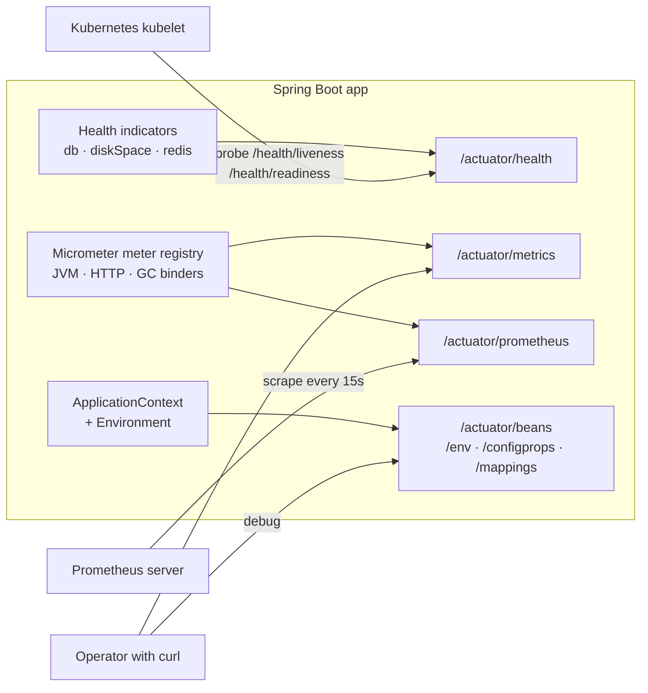

## Objective

A running application is opaque: you can guess at its heap usage, its active
profiles, which beans autoconfiguration actually created, or whether the
database it talks to is reachable — but without instrumentation you can't
know. Spring Boot Actuator is that instrumentation, shipped as a starter. Add
`spring-boot-starter-actuator` and the application gains a set of built-in
production-readiness endpoints — `/health`, `/info`, `/metrics`, `/env`,
`/beans`, `/mappings`, `/loggers`, `/threaddump` and more — exposed over HTTP
(and, optionally, as JMX MBeans) under an `/actuator` base path. They are
ordinary REST endpoints returning JSON, so anything that speaks HTTP can
consume them: a Kubernetes kubelet, a Prometheus scraper, `curl`, or a
dashboard. This concept covers what Actuator is and how to consume its
*built-in* endpoints; writing your own health indicators, metrics, and
endpoints — and locking Actuator down with Spring Security — is covered in
[Spring Boot Actuator Customization](/spring-concepts/spring-boot-actuator-customization).

## Use Cases

- A Kubernetes deployment whose `livenessProbe` and `readinessProbe` hit
  `/actuator/health/liveness` and `/actuator/health/readiness`, so the
  orchestrator restarts a wedged pod and keeps traffic off one that isn't
  ready yet.
- An ops dashboard or Prometheus server scraping `/actuator/prometheus` every
  15 seconds to graph request rates, p99 latency, GC pauses, and heap usage
  without any application code writing metrics by hand.
- Debugging a production config problem — "why is this pointing at the staging
  database?" — by reading `/actuator/env` and `/actuator/configprops` to see
  the effective value *and* which property source won, instead of redeploying
  with extra logging.
- Diagnosing a "why wasn't this bean created?" autoconfiguration mystery with
  `/actuator/conditions`, or answering "what URLs does this service actually
  serve?" with `/actuator/mappings`.
- Turning on `DEBUG` logging for one package on a live instance via a POST to
  `/actuator/loggers/{name}`, reproducing the problem, and turning it back off
  — no restart, no redeploy.
- Capturing a thread dump (`/actuator/threaddump`) or heap dump
  (`/actuator/heapdump`) from a hung instance before killing it.

## Deep Dive

### Enabling Actuator

One dependency:

```xml
<dependency>
  <groupId>org.springframework.boot</groupId>
  <artifactId>spring-boot-starter-actuator</artifactId>
</dependency>
```

That's the whole setup. Autoconfiguration registers the endpoints, maps them
under `/actuator`, and wires up whichever health indicators and metrics binders
match what's on the classpath — a JDBC `DataSource` gets a `db` health
indicator, Mongo gets a `mongo` one, and so on.

A `GET` on the base path returns a HATEOAS-style link map of everything
currently exposed — the discovery document for the rest of this concept:

```bash
$ curl localhost:8080/actuator
{
  "_links": {
    "self":   { "href": "http://localhost:8080/actuator", "templated": false },
    "health": { "href": "http://localhost:8080/actuator/health", "templated": false },
    "health-path": {
      "href": "http://localhost:8080/actuator/health/{*path}", "templated": true
    }
  }
}
```

If that response looks thin, it isn't broken — see exposure, below.

### Base path and port

The `/actuator` prefix is configurable:

```yaml
management:
  endpoints:
    web:
      base-path: /management
```

Health now lives at `/management/health`. More useful in production: move the
whole management surface to a *different port*, so Actuator can be bound to an
internal network interface that the public load balancer never routes to:

```yaml
management:
  server:
    port: 8081
    address: 127.0.0.1
```

The application keeps serving business traffic on `server.port`; Actuator
answers only on `127.0.0.1:8081`. This is the cheapest, most effective way to
keep `/env` and `/heapdump` off the internet.

### Exposure: enabled vs. exposed

Two different switches gate an endpoint, and conflating them is the usual
source of confusion:

- **Access** — whether the endpoint exists and can be operated at all
  (`management.endpoints.access.default`,
  `management.endpoint.<id>.access`, with values `none`, `read-only`,
  `unrestricted`). Most endpoints are readable by default; `shutdown` is
  `none`.
- **Exposure** — whether an existing endpoint is published over a given
  technology (`management.endpoints.web.exposure.include` / `.exclude`, and
  the `jmx` equivalents).

**By default, only `health` is exposed over HTTP.** Everything else is
present in the application but unmapped, which is why the discovery document
above lists a single endpoint. Opting in is explicit:

```yaml
management:
  endpoints:
    web:
      exposure:
        include: health,info,metrics,prometheus,loggers
```

`include` accepts `*` as a wildcard, and `exclude` wins over `include` — the
"expose everything except the dangerous ones" shape:

```yaml
management:
  endpoints:
    web:
      exposure:
        include: '*'
        exclude: env,beans,heapdump,threaddump
```

Note the quotes around `*`: unquoted, YAML parses it as an alias node and the
application fails to start.

To take an endpoint out of service entirely — not merely unexposed, but
non-operational even over JMX — use access instead:

```yaml
management:
  endpoints:
    access:
      default: none        # deny-by-default
  endpoint:
    health:
      access: read-only    # then opt back in, one at a time
    loggers:
      access: unrestricted # allows the POST that changes a level
```

### `/health`: an aggregate of indicators

Unauthenticated, `/health` says as little as possible:

```bash
$ curl localhost:8080/actuator/health
{"status":"UP"}
```

That `UP` is an *aggregate*. Each health indicator — `diskSpace` (always
present), `db`, `mongo`, `redis`, `rabbit`, `mail`, `ping`, plus anything a
third-party starter contributes — reports `UP`, `DOWN`, `UNKNOWN`, or
`OUT_OF_SERVICE`, and the aggregate is computed by the worst status present:
any `DOWN` makes the application `DOWN`, any `OUT_OF_SERVICE` (absent a
`DOWN`) makes it `OUT_OF_SERVICE`, and `UNKNOWN` is ignored. Details are
suppressed unless you ask:

```yaml
management:
  endpoint:
    health:
      show-details: when-authorized   # never (default) | always | when-authorized
```

```bash
$ curl localhost:8080/actuator/health
{
  "status": "UP",
  "components": {
    "db":        { "status": "UP", "details": { "database": "PostgreSQL", "validationQuery": "isValid()" } },
    "diskSpace": { "status": "UP", "details": { "total": 499963170816, "free": 177284784128, "threshold": 10485760, "exists": true } },
    "ping":      { "status": "UP" }
  }
}
```

The HTTP status code follows the aggregate: `UP` maps to `200`, `DOWN` and
`OUT_OF_SERVICE` map to `503`. That mapping is the entire contract a load
balancer or orchestrator needs.

### Health groups and Kubernetes probes

A single aggregate is too blunt for Kubernetes, which asks two different
questions: *should I restart this container?* (liveness) and *should I send it
traffic?* (readiness). A slow database should fail readiness, not liveness —
restarting the pod won't fix the database. Actuator models this with **health
groups**, and ships two predefined ones:

```yaml
management:
  endpoint:
    health:
      probes:
        enabled: true    # automatic when running on Kubernetes
      group:
        readiness:
          include: readinessState,db
```

```yaml
# deployment.yaml
livenessProbe:
  httpGet: { path: /actuator/health/liveness, port: 8081 }
readinessProbe:
  httpGet: { path: /actuator/health/readiness, port: 8081 }
```

`/actuator/health/liveness` reflects only `livenessState` (is the application
context still functioning?) while `/actuator/health/readiness` includes
`readinessState` plus whatever external dependencies you list. Groups are
generic: define `management.endpoint.health.group.<name>.include` and get
`/actuator/health/<name>` for free.

### `/info`: a blank canvas

Out of the box, `/info` returns `{}` — it holds only what contributors put
there. Property-driven info is the simplest source, but on modern Boot the
`env` contributor is opt-in:

```yaml
management:
  info:
    env:
      enabled: true         # required, or info.* properties are ignored
info:
  contact:
    email: support@tacocloud.com
    phone: 822-625-6831
```

```bash
$ curl localhost:8080/actuator/info
{"contact":{"email":"support@tacocloud.com","phone":"822-625-6831"}}
```

Two contributors *are* on by default and cost nothing: `build` (reads
`META-INF/build-info.properties`, generated by the Spring Boot Maven/Gradle
plugin's `build-info` goal) and `git` (reads `git.properties` from the
git-commit-id plugin). Together they turn `/info` into "which commit and
which build is this instance running?" — the single most useful thing to put
behind that URL:

```json
{
  "git":   { "branch": "main", "commit": { "id": "a0140f5", "time": "2026-08-04T09:12:00Z" } },
  "build": { "artifact": "taco-cloud", "name": "taco-cloud", "version": "1.4.2", "time": "2026-08-04T09:15:31Z" }
}
```

### Configuration inspection: `/beans`, `/conditions`, `/configprops`, `/env`, `/mappings`

These four answer "how is this instance actually wired?" without attaching a
debugger.

`/beans` dumps every bean in every context, with its type, scope, defining
resource, and injected dependencies:

```json
{ "contexts": { "application-1": { "beans": {
  "ingredientsController": {
    "aliases": [],
    "scope": "singleton",
    "type": "tacos.ingredients.IngredientsController",
    "dependencies": [ "ingredientRepository" ]
  }
}, "parentId": null } } }
```

`/conditions` explains autoconfiguration — split into `positiveMatches` (a
condition passed, so the bean was configured), `negativeMatches` (it didn't,
and why), and `unconditionalClasses`. This is the endpoint for "why is there
no `DataSource`?":

```json
"negativeMatches": {
  "DispatcherServletAutoConfiguration": {
    "notMatched": [ {
      "condition": "OnClassCondition",
      "message": "@ConditionalOnClass did not find required class 'org.springframework.web.servlet.DispatcherServlet'"
    } ],
    "matched": []
  }
}
```

`/configprops` lists every `@ConfigurationProperties` bean with its *bound*
values — the values the application is really using, after relaxed binding,
profile overrides and defaults have all been applied. `/env` works one level
lower, at the property-source level, and is the one to reach for when the
question is "which source won?":

```bash
$ curl localhost:8081/actuator/env/server.port
{
  "property": { "source": "systemEnvironment", "value": "8081" },
  "activeProfiles": [ "development" ],
  "propertySources": [
    { "name": "systemProperties" },
    { "name": "systemEnvironment",
      "property": { "value": "8081", "origin": "System Environment Property \"SERVER_PORT\"" } },
    { "name": "applicationConfig: [classpath:/application.yml]",
      "property": { "value": 8080, "origin": "class path resource [application.yml]:9:9" } }
  ]
}
```

Sources are listed in precedence order, the winner is hoisted into the
top-level `property` field, and `origin` gives file, line, and column. Values
whose keys look sensitive (`password`, `secret`, `key`, `token`, ...) come
back as `******`; sanitization is configurable via
`management.endpoint.env.show-values` and `SanitizingFunction` beans.

`/mappings` is the routing table — every request predicate and the handler
method behind it, including Actuator's own endpoints:

```json
{
  "predicate": "{[/ingredients],methods=[GET]}",
  "handler": "public reactor.core.publisher.Flux<tacos.ingredients.Ingredient> tacos.ingredients.IngredientsController.allIngredients()",
  "details": { "requestMappingConditions": {
    "methods": [ "GET" ], "patterns": [ "/ingredients" ], "produces": [], "consumes": []
  } }
}
```

`/loggers` is the one read-write endpoint in this group that's routinely safe
to use. `GET /actuator/loggers/tacos.ingredients` reports the configured and
effective level; a `POST` changes it live:

```bash
$ curl -X POST localhost:8081/actuator/loggers/tacos.ingredients \
       -H 'Content-Type: application/json' \
       -d '{"configuredLevel":"DEBUG"}'

$ curl localhost:8081/actuator/loggers/tacos.ingredients
{"configuredLevel":"DEBUG","effectiveLevel":"DEBUG"}
```

Reset by POSTing `{"configuredLevel":null}`, which restores inheritance from
the parent logger.

### Activity: `/httpexchanges`, `/threaddump`, `/heapdump`

`/httpexchanges` reports the most recent request/response exchanges — method,
URI, headers, status, and time taken. Unlike the rest of this list it needs a
bean before it does anything, because the in-memory implementation is
deliberately not auto-configured:

```java
@Bean
public HttpExchangeRepository httpExchangeRepository() {
    return new InMemoryHttpExchangeRepository();  // last 100 exchanges, dev only
}
```

```json
{ "exchanges": [ {
  "timestamp": "2026-08-05T23:41:24.494Z",
  "request":  { "method": "GET", "uri": "http://localhost:8081/ingredients", "headers": { "User-Agent": ["curl/8.4.0"] } },
  "response": { "status": 200, "headers": { "Content-Type": ["application/json"] } },
  "timeTaken": "PT0.004S"
} ] }
```

`/threaddump` returns a snapshot of every thread — state, lock owner, blocked
and waited counts, and a stack trace — which is how you catch a deadlock or a
pool exhausted by threads parked on the same monitor. Request it with
`Accept: text/plain` for the familiar `jstack` format. `/heapdump` downloads a
binary HPROF file for offline analysis in a tool like Eclipse MAT; it is not
JSON, it is not cheap, and it is not exposed by default for good reason.

### Metrics: `/metrics` and `/prometheus`

Actuator's metrics are Micrometer's. `GET /actuator/metrics` returns the
meter names, not the values:

```bash
$ curl localhost:8081/actuator/metrics
{ "names": [ "jvm.memory.used", "jvm.gc.pause", "http.server.requests",
             "system.cpu.usage", "process.uptime", "logback.events", ... ] }
```

Drill into one, and the response carries `measurements` plus the
*dimensions* (`availableTags`) you can slice by:

```bash
$ curl localhost:8081/actuator/metrics/http.server.requests
{
  "name": "http.server.requests",
  "measurements": [
    { "statistic": "COUNT",      "value": 2103 },
    { "statistic": "TOTAL_TIME", "value": 18.086334315 },
    { "statistic": "MAX",        "value": 0.028926313 }
  ],
  "availableTags": [
    { "tag": "status", "values": [ "200", "404", "500" ] },
    { "tag": "method", "values": [ "GET" ] },
    { "tag": "uri",    "values": [ "/ingredients", "/actuator/health", "/**" ] }
  ]
}
```

Each `tag=` query parameter filters, and they compose — this is the whole
query model:

```bash
$ curl 'localhost:8081/actuator/metrics/http.server.requests?tag=status:404&tag=uri:/**'
{ "name": "http.server.requests",
  "measurements": [ { "statistic": "COUNT", "value": 30 },
                    { "statistic": "TOTAL_TIME", "value": 0.519791548 } ],
  "availableTags": [ { "tag": "method", "values": [ "GET" ] } ] }
```

`/metrics` is a debugging tool, though — one meter at a time, point-in-time
values, no history. For real monitoring you add a registry and let a
time-series database scrape it. Prometheus is opt-in via one dependency:

```xml
<dependency>
  <groupId>io.micrometer</groupId>
  <artifactId>micrometer-registry-prometheus</artifactId>
  <scope>runtime</scope>
</dependency>
```

which contributes the `prometheus` endpoint (still needing exposure), serving
the text exposition format Prometheus understands:

```bash
$ curl localhost:8081/actuator/prometheus
# HELP http_server_requests_seconds
# TYPE http_server_requests_seconds summary
http_server_requests_seconds_count{method="GET",status="200",uri="/ingredients"} 2073.0
http_server_requests_seconds_sum{method="GET",status="200",uri="/ingredients"} 17.564273103
# HELP jvm_memory_used_bytes
# TYPE jvm_memory_used_bytes gauge
jvm_memory_used_bytes{area="heap",id="G1 Eden Space"} 5.6623104E7
```

Swap the registry artifact for `micrometer-registry-otlp`, `-datadog`,
`-graphite`, etc., and the same instrumentation ships elsewhere — the
application code doesn't change.



> **Book vs. today.** The most important change since the book is a
> security-relevant default. The book (Spring Boot 2.0/2.1 era) says `/health`
> and `/info` are the two endpoints available by default; **Spring Boot 2.5
> removed `info` from the default web exposure, so today
> `management.endpoints.web.exposure.include` defaults to `health` alone** —
> everything else, `/info` included, must be opted into explicitly. Spring
> Boot 3.0 narrowed the JMX side the same way: `management.endpoints.jmx
> .exposure.include` also defaults to `health`, where 2.x defaulted to `*`
> (and since Spring Boot 2.2, JMX itself is off unless you set
> `spring.jmx.enabled=true`). Spring Boot 2.6 went further on `/info`: the
> `env` contributor that echoes `info.*` properties is now disabled by
> default, so the book's `info.contact.email` example silently returns `{}`
> until you set `management.info.env.enabled=true`. Three more deltas: (1) the
> book's `/httptrace` endpoint no longer exists under that name — Spring Boot
> 3.0 renamed it to `/httpexchanges` and renamed `HttpTraceRepository` to
> `HttpExchangeRepository` in `org.springframework.boot.actuate.web.exchanges`;
> since 2.2 no repository is auto-configured at all, so the endpoint returns
> nothing until you declare an `InMemoryHttpExchangeRepository` bean, and the
> docs now steer production use toward Zipkin/OpenTelemetry instead. (2) The
> book's `/health` response nests indicators under `details`; since Spring Boot
> 2.2 the key is `components`, and `management.endpoint.health.probes.enabled`
> plus health groups added the `/actuator/health/liveness` and
> `/actuator/health/readiness` endpoints the book predates. (3) Spring Boot 3.4
> deprecated `management.endpoint.<id>.enabled` and
> `management.endpoints.enabled-by-default` in favour of the finer-grained
> `management.endpoint.<id>.access` / `management.endpoints.access.default`
> (`none` | `read-only` | `unrestricted`), plus a
> `management.endpoints.access.max-permitted` ceiling. Unchanged: the
> `/actuator` base path, `management.endpoints.web.exposure.include`/`exclude`
> as the exposure mechanism, `show-details`, the endpoint semantics themselves,
> and `/prometheus` still requiring an explicit `micrometer-registry-prometheus`
> dependency.

## Trade-offs

- **Exposing endpoints broadly is genuine information disclosure, not just
  untidiness.** `/env` and `/configprops` reveal your configuration topology,
  `/beans` and `/mappings` map the internals, `/heapdump` hands an attacker
  the full contents of memory — session tokens, decrypted credentials,
  customer data — in one unauthenticated GET. The convenience of `include:
  '*'` in a dev profile is real, but that line has shipped to production in
  enough incidents that the framework itself changed its defaults twice to
  make it harder. Prefer an explicit allowlist, and never let the wildcard
  reach a production profile:
  ```yaml
  # application-prod.yml — allowlist, not wildcard
  management:
    endpoints:
      web:
        exposure:
          include: health,info,prometheus
  ```
- **Restrictive defaults are safe but surprising.** Because only `health` is
  exposed, a working Actuator setup looks broken: `/actuator/metrics` returns
  404, `/actuator/info` returns 404, and nothing in the logs says why. The
  cost of the safer default is that every team rediscovers the `exposure
  .include` property the first time — and a 404 from an unexposed endpoint is
  indistinguishable from a typo in the path.
- **A separate management port isolates the ops surface, at the cost of
  deployment complexity.** `management.server.port` plus `management.server
  .address` keeps Actuator off the public listener entirely — a stronger
  guarantee than any exposure list, since the endpoints simply aren't routable
  from outside. But every probe, scrape config, service definition, and
  network policy now has to know about a second port, and anything that
  assumes one port per container (some ingress setups, some service meshes)
  needs extra configuration.
- **JMX and HTTP trade reachability for tooling.** JMX exposure costs nothing
  over the wire and never touches your HTTP surface, so it is attractive for
  endpoints you want available to a local agent but not to the network — but
  it needs `spring.jmx.enabled=true` since Boot 2.2, JMX remote access is
  awkward to secure and firewall, and it is effectively unusable in a
  container-per-pod world where nobody attaches JConsole. HTTP is what
  Kubernetes, Prometheus, and every dashboard actually speak, which is why the
  defaults have converged on `health` over HTTP and near-nothing over JMX.
- **Metrics have a real, if small, runtime cost — and the danger is
  cardinality, not volume.** Micrometer's built-in binders are cheap, but each
  distinct tag combination is a separate time series held in memory and in the
  scraper's database. Enabling percentile histograms on a high-traffic
  endpoint, or tagging a metric with anything unbounded (a user id, a raw URI
  with path variables interpolated), turns a handful of series into millions
  and can exhaust heap on the application side before the monitoring system
  even complains:
  ```yaml
  management:
    metrics:
      distribution:
        percentiles-histogram:
          http.server.requests: true   # many more series per URI/status pair
  ```
- **Read-write endpoints are an operational escape hatch and an attack
  surface at the same time.** `POST /actuator/loggers/{name}` is the standard
  way to get debug logs out of a live instance without a redeploy, and
  `POST /actuator/env` can inject a property — but the same mechanism lets
  anyone who reaches the endpoint flood your log pipeline or mutate
  configuration. Properties set through `/env` also apply only to the one
  instance that received the request and vanish on restart, which makes them
  a debugging aid that is easy to mistake for a fix. Setting
  `management.endpoints.access.max-permitted: read-only` in production caps
  the whole category in one line.
- **Actuator's JSON is machine-oriented, so it usually needs something on
  top.** Reading a `/beans` or `/threaddump` response by eye is unpleasant,
  and `/metrics` has no history at all — one meter, one point in time. In
  practice these endpoints are the substrate for something else (Prometheus
  plus Grafana, Spring Boot Admin, an APM agent), and the value you get from
  Actuator is bounded by whether you've stood that layer up. This is a
  judgment about operational tooling rather than something a snippet
  demonstrates.

## Documentation Links

- Craig Walls, "Spring in Action", 5th Edition (Manning, 2019) — Chapter 16,
  "Working with Spring Boot Actuator", sections 16.1-16.2, p. 395-415 — doc
- [Spring Boot Reference — Actuator Endpoints (full endpoint list, base path, access control)](https://docs.spring.io/spring-boot/reference/actuator/endpoints.html) — doc
- [Spring Boot Reference — Exposing Endpoints (`management.endpoints.web.exposure.include`/`exclude` defaults)](https://docs.spring.io/spring-boot/reference/actuator/endpoints.html#actuator.endpoints.exposing) — doc
- [Spring Boot Reference — Recording HTTP Exchanges (`HttpExchangeRepository`, the `/httptrace` successor)](https://docs.spring.io/spring-boot/reference/actuator/http-exchanges.html) — doc
