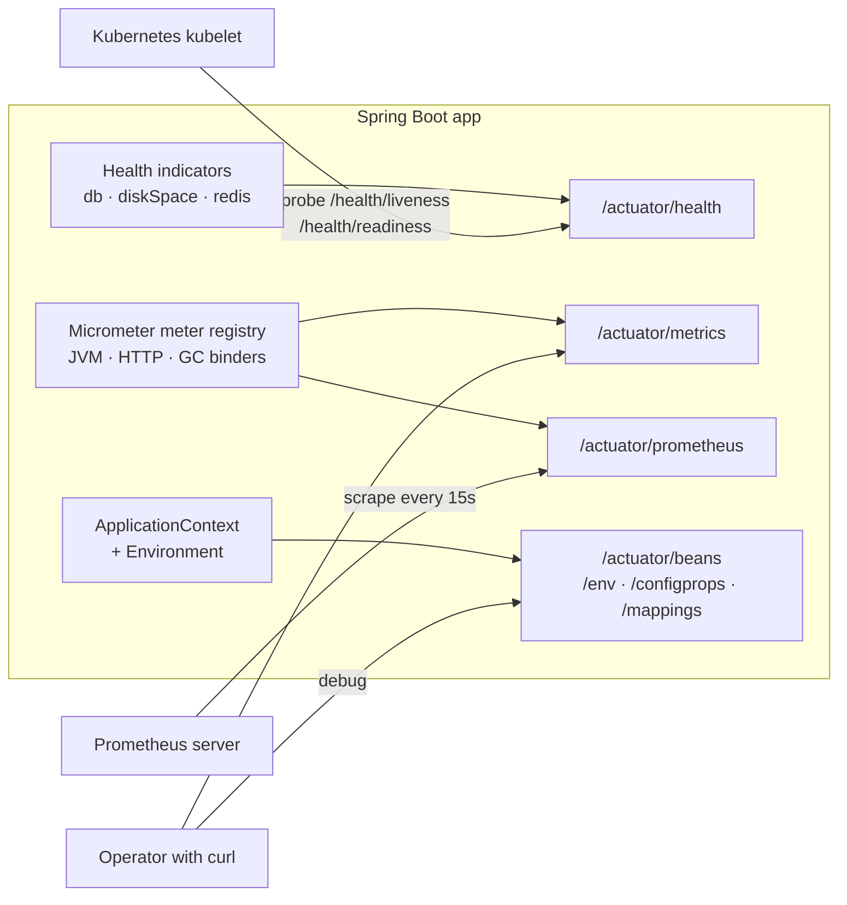

## Objective

Uma aplicação em execução é opaca: você pode chutar seu uso de heap, seus
profiles ativos, quais beans a autoconfiguração realmente criou, ou se o banco
de dados com o qual ela fala está alcançável — mas sem instrumentação você não
consegue saber. O Spring Boot Actuator é essa instrumentação, distribuída como
um starter. Adicione `spring-boot-starter-actuator` e a aplicação ganha um
conjunto de endpoints nativos de prontidão para produção — `/health`, `/info`,
`/metrics`, `/env`, `/beans`, `/mappings`, `/loggers`, `/threaddump` e mais —
expostos via HTTP (e, opcionalmente, como MBeans JMX) sob um path base
`/actuator`. São endpoints REST comuns retornando JSON, então qualquer coisa
que fale HTTP consegue consumi-los: um kubelet do Kubernetes, um scraper do
Prometheus, `curl`, ou um dashboard. Este concept cobre o que é o Actuator e
como consumir seus endpoints *nativos*; escrever seus próprios health
indicators, métricas e endpoints — e travar o Actuator com Spring Security —
está coberto em
[Spring Boot Actuator: Customização](/spring-concepts/spring-boot-actuator-customization).

## Use Cases

- Um deployment Kubernetes cujo `livenessProbe` e `readinessProbe` acessam
  `/actuator/health/liveness` e `/actuator/health/readiness`, para que o
  orquestrador reinicie um pod travado e mantenha o tráfego fora de um que
  ainda não está pronto.
- Um dashboard de ops ou servidor Prometheus fazendo scrape de
  `/actuator/prometheus` a cada 15 segundos para plotar taxas de requisição,
  latência p99, pausas de GC, e uso de heap sem nenhum código de aplicação
  escrevendo métricas manualmente.
- Debugar um problema de configuração em produção — "por que isso está
  apontando para o banco de dados de staging?" — lendo `/actuator/env` e
  `/actuator/configprops` para ver o valor efetivo *e* qual property source
  venceu, em vez de fazer redeploy com logging extra.
- Diagnosticar um mistério de autoconfiguração do tipo "por que esse bean não
  foi criado?" com `/actuator/conditions`, ou responder "quais URLs esse
  serviço de fato serve?" com `/actuator/mappings`.
- Ligar logging `DEBUG` para um pacote numa instância viva via um POST para
  `/actuator/loggers/{name}`, reproduzir o problema, e desligar de volta —
  sem restart, sem redeploy.
- Capturar um thread dump (`/actuator/threaddump`) ou heap dump
  (`/actuator/heapdump`) de uma instância travada antes de matá-la.

## Deep Dive

### Habilitando o Actuator

Uma dependência:

```xml
<dependency>
  <groupId>org.springframework.boot</groupId>
  <artifactId>spring-boot-starter-actuator</artifactId>
</dependency>
```

Esse é todo o setup. A autoconfiguração registra os endpoints, os mapeia sob
`/actuator`, e conecta quaisquer health indicators e binders de métrica que
combinem com o que está no classpath — um `DataSource` JDBC ganha um health
indicator `db`, Mongo ganha um `mongo`, e assim por diante.

Um `GET` no path base retorna um mapa de links estilo HATEOAS de tudo que
está atualmente exposto — o documento de descoberta para o resto deste
concept:

```bash
$ curl localhost:8080/actuator
{
  "_links": {
    "self":   { "href": "http://localhost:8080/actuator", "templated": false },
    "health": { "href": "http://localhost:8080/actuator/health", "templated": false },
    "health-path": {
      "href": "http://localhost:8080/actuator/health/{*path}", "templated": true
    }
  }
}
```

Se essa resposta parecer magra, ela não está quebrada — veja exposição, abaixo.

### Path base e porta

O prefixo `/actuator` é configurável:

```yaml
management:
  endpoints:
    web:
      base-path: /management
```

Health agora vive em `/management/health`. Mais útil em produção: mover toda
a superfície de gerenciamento para uma *porta diferente*, para que o Actuator
possa ser vinculado a uma interface de rede interna que o load balancer
público nunca roteia:

```yaml
management:
  server:
    port: 8081
    address: 127.0.0.1
```

A aplicação continua servindo tráfego de negócio em `server.port`; o Actuator
só responde em `127.0.0.1:8081`. Esse é o jeito mais barato e efetivo de
manter `/env` e `/heapdump` fora da internet.

### Exposição: habilitado vs. exposto

Dois switches diferentes controlam um endpoint, e confundi-los é a fonte
usual de confusão:

- **Acesso** — se o endpoint existe e pode ser operado de alguma forma
  (`management.endpoints.access.default`,
  `management.endpoint.<id>.access`, com valores `none`, `read-only`,
  `unrestricted`). A maioria dos endpoints é legível por padrão; `shutdown`
  é `none`.
- **Exposição** — se um endpoint existente é publicado sobre uma dada
  tecnologia (`management.endpoints.web.exposure.include` / `.exclude`, e os
  equivalentes de `jmx`).

**Por padrão, só `health` é exposto via HTTP.** Tudo mais está presente na
aplicação, mas não mapeado, o que explica por que o documento de descoberta
acima lista um único endpoint. Aderir é explícito:

```yaml
management:
  endpoints:
    web:
      exposure:
        include: health,info,metrics,prometheus,loggers
```

`include` aceita `*` como coringa, e `exclude` vence sobre `include` — o
formato "exponha tudo exceto os perigosos":

```yaml
management:
  endpoints:
    web:
      exposure:
        include: '*'
        exclude: env,beans,heapdump,threaddump
```

Note as aspas em torno de `*`: sem aspas, o YAML interpreta como um nó de
alias e a aplicação falha ao iniciar.

Para tirar um endpoint de serviço por completo — não meramente
desexposto, mas não operacional nem mesmo via JMX — use acesso em vez disso:

```yaml
management:
  endpoints:
    access:
      default: none        # deny-by-default
  endpoint:
    health:
      access: read-only    # then opt back in, one at a time
    loggers:
      access: unrestricted # allows the POST that changes a level
```

### `/health`: um agregado de indicators

Sem autenticação, `/health` diz o mínimo possível:

```bash
$ curl localhost:8080/actuator/health
{"status":"UP"}
```

Esse `UP` é um *agregado*. Cada health indicator — `diskSpace` (sempre
presente), `db`, `mongo`, `redis`, `rabbit`, `mail`, `ping`, mais o que
qualquer starter de terceiros contribuir — reporta `UP`, `DOWN`, `UNKNOWN`, ou
`OUT_OF_SERVICE`, e o agregado é calculado pelo pior status presente:
qualquer `DOWN` torna a aplicação `DOWN`, qualquer `OUT_OF_SERVICE` (na
ausência de um `DOWN`) torna a aplicação `OUT_OF_SERVICE`, e `UNKNOWN` é
ignorado. Detalhes são suprimidos a menos que você peça:

```yaml
management:
  endpoint:
    health:
      show-details: when-authorized   # never (default) | always | when-authorized
```

```bash
$ curl localhost:8080/actuator/health
{
  "status": "UP",
  "components": {
    "db":        { "status": "UP", "details": { "database": "PostgreSQL", "validationQuery": "isValid()" } },
    "diskSpace": { "status": "UP", "details": { "total": 499963170816, "free": 177284784128, "threshold": 10485760, "exists": true } },
    "ping":      { "status": "UP" }
  }
}
```

O status code HTTP segue o agregado: `UP` mapeia para `200`, `DOWN` e
`OUT_OF_SERVICE` mapeiam para `503`. Esse mapeamento é todo o contrato de
que um load balancer ou orquestrador precisa.

### Grupos de health e probes do Kubernetes

Um único agregado é grosseiro demais para o Kubernetes, que faz duas
perguntas diferentes: *devo reiniciar esse container?* (liveness) e *devo
mandar tráfego para ele?* (readiness). Um banco de dados lento deveria falhar
readiness, não liveness — reiniciar o pod não vai consertar o banco de dados.
O Actuator modela isso com **grupos de health**, e vem com dois predefinidos:

```yaml
management:
  endpoint:
    health:
      probes:
        enabled: true    # automatic when running on Kubernetes
      group:
        readiness:
          include: readinessState,db
```

```yaml
# deployment.yaml
livenessProbe:
  httpGet: { path: /actuator/health/liveness, port: 8081 }
readinessProbe:
  httpGet: { path: /actuator/health/readiness, port: 8081 }
```

`/actuator/health/liveness` reflete só o `livenessState` (o contexto da
aplicação ainda está funcionando?) enquanto `/actuator/health/readiness`
inclui `readinessState` mais o que quer que você liste de dependências
externas. Grupos são genéricos: defina
`management.endpoint.health.group.<name>.include` e ganhe
`/actuator/health/<name>` de graça.

### `/info`: uma tela em branco

Fora da caixa, `/info` retorna `{}` — ele só contém o que contributors
colocam ali. Info orientada por propriedades é a fonte mais simples, mas no
Boot moderno o contributor `env` é opt-in:

```yaml
management:
  info:
    env:
      enabled: true         # required, or info.* properties are ignored
info:
  contact:
    email: support@tacocloud.com
    phone: 822-625-6831
```

```bash
$ curl localhost:8080/actuator/info
{"contact":{"email":"support@tacocloud.com","phone":"822-625-6831"}}
```

Dois contributors *estão* ligados por padrão e não custam nada:
`build` (lê `META-INF/build-info.properties`, gerado pela goal `build-info`
do plugin Maven/Gradle do Spring Boot) e `git` (lê `git.properties` do
plugin git-commit-id). Juntos eles transformam `/info` em "qual commit e
qual build essa instância está rodando?" — a coisa mais útil de longe para
colocar atrás dessa URL:

```json
{
  "git":   { "branch": "main", "commit": { "id": "a0140f5", "time": "2026-08-04T09:12:00Z" } },
  "build": { "artifact": "taco-cloud", "name": "taco-cloud", "version": "1.4.2", "time": "2026-08-04T09:15:31Z" }
}
```

### Inspeção de configuração: `/beans`, `/conditions`, `/configprops`, `/env`, `/mappings`

Esses quatro respondem "como essa instância está de fato conectada?" sem
anexar um debugger.

`/beans` despeja todo bean em todo contexto, com seu tipo, escopo, recurso
que o define, e dependências injetadas:

```json
{ "contexts": { "application-1": { "beans": {
  "ingredientsController": {
    "aliases": [],
    "scope": "singleton",
    "type": "tacos.ingredients.IngredientsController",
    "dependencies": [ "ingredientRepository" ]
  }
}, "parentId": null } } }
```

`/conditions` explica a autoconfiguração — dividida em `positiveMatches` (uma
condição passou, então o bean foi configurado), `negativeMatches` (não
passou, e por quê), e `unconditionalClasses`. Esse é o endpoint para "por que
não há `DataSource`?":

```json
"negativeMatches": {
  "DispatcherServletAutoConfiguration": {
    "notMatched": [ {
      "condition": "OnClassCondition",
      "message": "@ConditionalOnClass did not find required class 'org.springframework.web.servlet.DispatcherServlet'"
    } ],
    "matched": []
  }
}
```

`/configprops` lista todo bean `@ConfigurationProperties` com seus valores
*vinculados* — os valores que a aplicação está de fato usando, depois que
binding relaxado, sobreposições de profile e defaults foram todos aplicados.
`/env` trabalha num nível abaixo, no nível de property source, e é o que
você usa quando a pergunta é "qual fonte venceu?":

```bash
$ curl localhost:8081/actuator/env/server.port
{
  "property": { "source": "systemEnvironment", "value": "8081" },
  "activeProfiles": [ "development" ],
  "propertySources": [
    { "name": "systemProperties" },
    { "name": "systemEnvironment",
      "property": { "value": "8081", "origin": "System Environment Property \"SERVER_PORT\"" } },
    { "name": "applicationConfig: [classpath:/application.yml]",
      "property": { "value": 8080, "origin": "class path resource [application.yml]:9:9" } }
  ]
}
```

As fontes são listadas em ordem de precedência, o vencedor é elevado ao
campo `property` de nível superior, e `origin` dá arquivo, linha, e coluna.
Valores cujas chaves parecem sensíveis (`password`, `secret`, `key`,
`token`, ...) voltam como `******`; a sanitização é configurável via
`management.endpoint.env.show-values` e beans `SanitizingFunction`.

`/mappings` é a tabela de roteamento — todo predicado de requisição e o
método handler por trás dele, incluindo os próprios endpoints do Actuator:

```json
{
  "predicate": "{[/ingredients],methods=[GET]}",
  "handler": "public reactor.core.publisher.Flux<tacos.ingredients.Ingredient> tacos.ingredients.IngredientsController.allIngredients()",
  "details": { "requestMappingConditions": {
    "methods": [ "GET" ], "patterns": [ "/ingredients" ], "produces": [], "consumes": []
  } }
}
```

`/loggers` é o único endpoint de leitura-escrita neste grupo que é
rotineiramente seguro de usar. `GET /actuator/loggers/tacos.ingredients`
reporta o nível configurado e o efetivo; um `POST` o altera ao vivo:

```bash
$ curl -X POST localhost:8081/actuator/loggers/tacos.ingredients \
       -H 'Content-Type: application/json' \
       -d '{"configuredLevel":"DEBUG"}'

$ curl localhost:8081/actuator/loggers/tacos.ingredients
{"configuredLevel":"DEBUG","effectiveLevel":"DEBUG"}
```

Resete fazendo POST de `{"configuredLevel":null}`, o que restaura a herança
do logger pai.

### Atividade: `/httpexchanges`, `/threaddump`, `/heapdump`

`/httpexchanges` reporta as trocas de request/response mais recentes —
método, URI, headers, status, e tempo gasto. Diferente do resto desta lista
ele precisa de um bean antes de fazer qualquer coisa, porque a
implementação em memória é deliberadamente não auto-configurada:

```java
@Bean
public HttpExchangeRepository httpExchangeRepository() {
    return new InMemoryHttpExchangeRepository();  // last 100 exchanges, dev only
}
```

```json
{ "exchanges": [ {
  "timestamp": "2026-08-05T23:41:24.494Z",
  "request":  { "method": "GET", "uri": "http://localhost:8081/ingredients", "headers": { "User-Agent": ["curl/8.4.0"] } },
  "response": { "status": 200, "headers": { "Content-Type": ["application/json"] } },
  "timeTaken": "PT0.004S"
} ] }
```

`/threaddump` retorna um snapshot de toda thread — estado, dono do lock,
contagens de bloqueio e espera, e um stack trace — que é como você pega um
deadlock ou um pool esgotado por threads presas no mesmo monitor.
Requisite com `Accept: text/plain` para o formato familiar do `jstack`.
`/heapdump` baixa um arquivo binário HPROF para análise offline numa
ferramenta como o Eclipse MAT; não é JSON, não é barato, e não é exposto por
padrão por um bom motivo.

### Métricas: `/metrics` e `/prometheus`

As métricas do Actuator são as do Micrometer. `GET /actuator/metrics`
retorna os nomes dos meters, não os valores:

```bash
$ curl localhost:8081/actuator/metrics
{ "names": [ "jvm.memory.used", "jvm.gc.pause", "http.server.requests",
             "system.cpu.usage", "process.uptime", "logback.events", ... ] }
```

Aprofunde-se num deles, e a resposta carrega `measurements` mais as
*dimensões* (`availableTags`) pelas quais você pode fatiar:

```bash
$ curl localhost:8081/actuator/metrics/http.server.requests
{
  "name": "http.server.requests",
  "measurements": [
    { "statistic": "COUNT",      "value": 2103 },
    { "statistic": "TOTAL_TIME", "value": 18.086334315 },
    { "statistic": "MAX",        "value": 0.028926313 }
  ],
  "availableTags": [
    { "tag": "status", "values": [ "200", "404", "500" ] },
    { "tag": "method", "values": [ "GET" ] },
    { "tag": "uri",    "values": [ "/ingredients", "/actuator/health", "/**" ] }
  ]
}
```

Cada parâmetro de query `tag=` filtra, e eles se compõem — esse é todo o
modelo de query:

```bash
$ curl 'localhost:8081/actuator/metrics/http.server.requests?tag=status:404&tag=uri:/**'
{ "name": "http.server.requests",
  "measurements": [ { "statistic": "COUNT", "value": 30 },
                    { "statistic": "TOTAL_TIME", "value": 0.519791548 } ],
  "availableTags": [ { "tag": "method", "values": [ "GET" ] } ] }
```

`/metrics` é uma ferramenta de debug, porém — um meter por vez, valores num
único instante, sem histórico. Para monitoramento de verdade você adiciona
um registry e deixa um banco de dados de séries temporais fazer scrape.
Prometheus é opt-in via uma dependência:

```xml
<dependency>
  <groupId>io.micrometer</groupId>
  <artifactId>micrometer-registry-prometheus</artifactId>
  <scope>runtime</scope>
</dependency>
```

o que contribui com o endpoint `prometheus` (ainda precisando de exposição),
servindo o formato de exposição em texto que o Prometheus entende:

```bash
$ curl localhost:8081/actuator/prometheus
# HELP http_server_requests_seconds
# TYPE http_server_requests_seconds summary
http_server_requests_seconds_count{method="GET",status="200",uri="/ingredients"} 2073.0
http_server_requests_seconds_sum{method="GET",status="200",uri="/ingredients"} 17.564273103
# HELP jvm_memory_used_bytes
# TYPE jvm_memory_used_bytes gauge
jvm_memory_used_bytes{area="heap",id="G1 Eden Space"} 5.6623104E7
```

Troque o artefato do registry por `micrometer-registry-otlp`, `-datadog`,
`-graphite`, etc., e a mesma instrumentação é enviada para outro lugar — o
código da aplicação não muda.



> **Livro vs. hoje.** A mudança mais importante desde o livro é um default
> relevante para segurança. O livro (era Spring Boot 2.0/2.1) diz que
> `/health` e `/info` são os dois endpoints disponíveis por padrão; **o
> Spring Boot 2.5 removeu `info` da exposição web padrão, então hoje
> `management.endpoints.web.exposure.include` tem como default só
> `health`** — tudo mais, `/info` incluído, precisa ser aderido
> explicitamente. O Spring Boot 3.0 restringiu o lado JMX da mesma forma:
> `management.endpoints.jmx.exposure.include` também tem default `health`,
> onde a série 2.x tinha default `*` (e desde o Spring Boot 2.2, o próprio
> JMX está desligado a menos que você defina
> `spring.jmx.enabled=true`). O Spring Boot 2.6 foi além no `/info`: o
> contributor `env` que ecoa propriedades `info.*` agora vem desabilitado
> por padrão, então o exemplo `info.contact.email` do livro retorna `{}`
> silenciosamente até você definir `management.info.env.enabled=true`. Mais
> três diferenças: (1) o endpoint `/httptrace` do livro não existe mais sob
> esse nome — o Spring Boot 3.0 o renomeou para `/httpexchanges` e renomeou
> `HttpTraceRepository` para `HttpExchangeRepository` em
> `org.springframework.boot.actuate.web.exchanges`; desde a 2.2 nenhum
> repository é auto-configurado de forma alguma, então o endpoint não
> retorna nada até você declarar um bean `InMemoryHttpExchangeRepository`, e
> a documentação agora direciona o uso em produção para Zipkin/OpenTelemetry
> em vez disso. (2) A resposta de `/health` do livro aninha indicators sob
> `details`; desde o Spring Boot 2.2 a chave é `components`, e
> `management.endpoint.health.probes.enabled` mais grupos de health
> adicionaram os endpoints `/actuator/health/liveness` e
> `/actuator/health/readiness` que o livro antecede. (3) O Spring Boot 3.4
> depreciou `management.endpoint.<id>.enabled` e
> `management.endpoints.enabled-by-default` em favor do mais granular
> `management.endpoint.<id>.access` / `management.endpoints.access.default`
> (`none` | `read-only` | `unrestricted`), mais um teto
> `management.endpoints.access.max-permitted`. Inalterado: o path base
> `/actuator`, `management.endpoints.web.exposure.include`/`exclude` como
> mecanismo de exposição, `show-details`, a semântica dos próprios
> endpoints, e `/prometheus` ainda exigindo uma dependência explícita
> `micrometer-registry-prometheus`.

## Trade-offs

- **Expor endpoints amplamente é vazamento de informação genuíno, não só
  desleixo.** `/env` e `/configprops` revelam sua topologia de configuração,
  `/beans` e `/mappings` mapeiam os internals, `/heapdump` entrega a um
  atacante o conteúdo completo da memória — tokens de sessão, credenciais
  descriptografadas, dados de cliente — num único GET sem autenticação. A
  conveniência de `include: '*'` num profile de dev é real, mas essa linha
  já foi parar em produção em incidentes suficientes para que o próprio
  framework mudasse seus defaults duas vezes só para dificultar isso.
  Prefira uma allowlist explícita, e nunca deixe o coringa alcançar um
  profile de produção:
  ```yaml
  # application-prod.yml — allowlist, not wildcard
  management:
    endpoints:
      web:
        exposure:
          include: health,info,prometheus
  ```
- **Defaults restritivos são seguros, mas surpreendentes.** Como só `health`
  é exposto, um setup de Actuator funcionando parece quebrado:
  `/actuator/metrics` retorna 404, `/actuator/info` retorna 404, e nada nos
  logs diz por quê. O custo do default mais seguro é que todo time
  redescobre a propriedade `exposure.include` na primeira vez — e um 404 de
  um endpoint não exposto é indistinguível de um erro de digitação no path.
- **Uma porta de gerenciamento separada isola a superfície de ops, ao custo
  de complexidade de deploy.** `management.server.port` mais
  `management.server.address` mantém o Actuator completamente fora do
  listener público — uma garantia mais forte que qualquer lista de
  exposição, já que os endpoints simplesmente não são roteáveis de fora.
  Mas toda probe, config de scrape, definição de serviço, e política de rede
  agora precisa saber de uma segunda porta, e qualquer coisa que assuma uma
  porta por container (alguns setups de ingress, alguns service meshes)
  precisa de configuração extra.
- **JMX e HTTP trocam alcançabilidade por ferramental.** A exposição JMX não
  custa nada na rede e nunca toca sua superfície HTTP, então é atraente
  para endpoints que você quer disponíveis para um agente local, mas não
  para a rede — mas ela precisa de `spring.jmx.enabled=true` desde o Boot
  2.2, acesso remoto JMX é incômodo de proteger e configurar firewall, e é
  efetivamente inutilizável num mundo container-por-pod onde ninguém
  conecta o JConsole. HTTP é o que Kubernetes, Prometheus, e todo dashboard
  de fato falam, o que explica por que os defaults convergiram para
  `health` via HTTP e quase-nada via JMX.
- **Métricas têm um custo real, ainda que pequeno, em runtime — e o perigo
  é cardinalidade, não volume.** Os binders nativos do Micrometer são
  baratos, mas cada combinação distinta de tag é uma série temporal
  separada mantida em memória e no banco de dados do scraper. Habilitar
  histogramas de percentil num endpoint de alto tráfego, ou marcar uma
  métrica com algo ilimitado (um id de usuário, uma URI crua com path
  variables interpoladas), transforma um punhado de séries em milhões e
  pode esgotar o heap do lado da aplicação antes mesmo do sistema de
  monitoramento reclamar:
  ```yaml
  management:
    metrics:
      distribution:
        percentiles-histogram:
          http.server.requests: true   # many more series per URI/status pair
  ```
- **Endpoints de leitura-escrita são uma válvula de escape operacional e
  uma superfície de ataque ao mesmo tempo.** `POST /actuator/loggers/{name}`
  é a forma padrão de tirar logs de debug de uma instância viva sem
  redeploy, e `POST /actuator/env` pode injetar uma propriedade — mas o
  mesmo mecanismo permite que qualquer um que alcance o endpoint inunde
  seu pipeline de logs ou altere configuração. Propriedades definidas via
  `/env` também se aplicam só à instância que recebeu a requisição e somem
  no restart, o que as torna um recurso de debug fácil de confundir com uma
  correção. Definir `management.endpoints.access.max-permitted: read-only`
  em produção limita toda a categoria numa única linha.
- **O JSON do Actuator é orientado a máquina, então geralmente precisa de
  algo por cima.** Ler uma resposta de `/beans` ou `/threaddump` a olho nu
  é desagradável, e `/metrics` não tem histórico algum — um meter, um
  instante no tempo. Na prática esses endpoints são o substrato para outra
  coisa (Prometheus mais Grafana, Spring Boot Admin, um agente APM), e o
  valor que você extrai do Actuator é limitado por você ter erguido essa
  camada ou não. Isso é um julgamento sobre ferramental operacional em vez
  de algo que um snippet demonstra.

## Documentation Links

- Craig Walls, "Spring in Action", 5th Edition (Manning, 2019) — Chapter 16,
  "Working with Spring Boot Actuator", sections 16.1-16.2, p. 395-415 — doc
- [Spring Boot Reference — Actuator Endpoints (full endpoint list, base path, access control)](https://docs.spring.io/spring-boot/reference/actuator/endpoints.html) — doc
- [Spring Boot Reference — Exposing Endpoints (`management.endpoints.web.exposure.include`/`exclude` defaults)](https://docs.spring.io/spring-boot/reference/actuator/endpoints.html#actuator.endpoints.exposing) — doc
- [Spring Boot Reference — Recording HTTP Exchanges (`HttpExchangeRepository`, the `/httptrace` successor)](https://docs.spring.io/spring-boot/reference/actuator/http-exchanges.html) — doc
