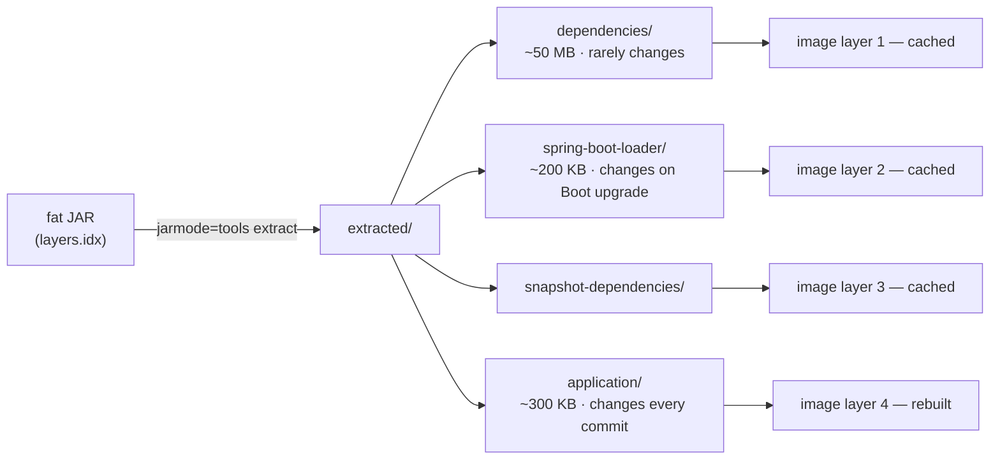

## Objective

A Spring Boot executable JAR already carries everything it needs except a JVM —
containerizing it means wrapping that JAR in an OCI image so the JVM version,
the JAR, and the startup command travel together and run identically on a
laptop, a CI runner, or a Kubernetes node. The book's approach is the classic
one: hand-write a `Dockerfile` that starts `FROM` a JDK base image, `COPY`s the
fat JAR in, and sets an `ENTRYPOINT` that runs `java -jar`. That still works and
is still the most controllable option, but Spring Boot has since grown two
capabilities the book predates — *layered JARs*, which split the fat JAR into
separately-cacheable pieces, and built-in *Cloud Native Buildpacks* support
(`spring-boot:build-image`), which produces an optimized image with no
`Dockerfile` at all.

## Use Cases

- Deploying to Kubernetes, ECS, Cloud Run, or any orchestrator whose unit of
  deployment is an image rather than a JAR.
- Pinning the exact JVM (vendor, major version, GC defaults) alongside the
  application, so "works on my machine" and "works in staging" mean the same
  runtime.
- CI/CD pipelines that build and push one immutable, digest-addressable image
  per commit, then promote that same digest through staging and production.
- Local integration environments where the application and its dependencies
  (Postgres, Kafka, Mongo) come up together via Docker Compose or Testcontainers.
- Supply-chain requirements — reproducible builds, non-root users, and an SBOM
  attached to the image — that are easier to satisfy with a standardized build
  than with an ad-hoc `Dockerfile`.

## Deep Dive

### The book's approach: a hand-written Dockerfile

The minimum viable containerization of a Spring Boot app is four instructions.
The book's version looked like this:

```dockerfile
FROM openjdk:8-jdk-alpine
ENV SPRING_PROFILES_ACTIVE docker
VOLUME /tmp
ARG JAR_FILE
COPY ${JAR_FILE} app.jar
ENTRYPOINT ["java", "-Djava.security.egd=file:/dev/./urandom", "-jar", "/app.jar"]
```

Line by line: `FROM` names the base image the new image extends; `ENV` sets the
active Spring profile so profile-specific beans and properties apply inside the
container; `VOLUME /tmp` creates a mount point (Tomcat writes its work
directory there); `ARG` declares a build-time argument; `COPY` pulls the built
JAR into the image; `ENTRYPOINT` is the command run when a container starts.

The same shape with a currently-maintained base image and no obsolete entropy
flag (the `/dev/./urandom` trick was a workaround for slow JVM startup on Java 8
and is unnecessary on modern JDKs):

```dockerfile
FROM eclipse-temurin:21-jre-alpine
ENV SPRING_PROFILES_ACTIVE=docker
ARG JAR_FILE=target/*.jar
COPY ${JAR_FILE} /app.jar
ENTRYPOINT ["java", "-jar", "/app.jar"]
```

Note `-jre-` rather than `-jdk-`: a running application does not need `javac`,
and dropping the compiler removes both weight and attack surface.

Building and running it is plain Docker — the book routed this through Spotify's
`dockerfile-maven-plugin`, a third-party plugin that is no longer maintained and
that nothing today needs:

```bash
$ ./mvnw package
$ docker build --build-arg JAR_FILE=target/ingredient-service-0.0.19-SNAPSHOT.jar \
      -t tacocloud/ingredient-service .
$ docker run -p 8080:8080 tacocloud/ingredient-service
```

The book also used `docker run --link tacocloud-mongo:mongo` to give the app a
resolvable `mongo` hostname. `--link` is a legacy feature; the modern equivalent
is a user-defined bridge network (or a Compose service name), where container
names resolve via DNS automatically:

```bash
$ docker network create taco-net
$ docker run --name tacocloud-mongo --network taco-net -d mongo:7
$ docker run --network taco-net -p 8080:8080 tacocloud/ingredient-service
```

### The problem with copying the fat JAR as one blob

`COPY app.jar` puts the application classes and every dependency into a single
Docker layer, typically 40–60 MB where the application's own code is a few
hundred kilobytes. Change one line of a controller, rebuild, and that entire
layer's digest changes — so the whole thing is rebuilt, re-pushed to the
registry, and re-pulled by every node. Docker's layer cache buys you nothing,
because the part that rarely changes (dependencies) is fused to the part that
changes on every commit (your code).

There is a second cost: running an uber JAR without unpacking it adds startup
overhead, since the nested-JAR loader has to resolve entries inside the archive
at runtime.

### Layered JARs: splitting the archive so the cache works

Spring Boot's Maven and Gradle plugins write a `layers.idx` into the JAR that
assigns every entry to one of four layers, ordered least- to most-volatile:

- `dependencies` — released third-party dependencies
- `spring-boot-loader` — everything under `org/springframework/boot/loader`
- `snapshot-dependencies` — snapshot dependencies
- `application` — your classes and resources

A `jarmode` built into the JAR extracts those layers on disk:

```bash
$ java -Djarmode=tools -jar application.jar extract --layers --destination extracted
```

In a multi-stage `Dockerfile`, a builder stage runs that extraction and the
runtime stage copies each layer with its own `COPY` — one Docker layer per
Spring Boot layer:

```dockerfile
# builder stage: unpack the fat jar into layers
FROM eclipse-temurin:21-jre-alpine AS builder
WORKDIR /builder
ARG JAR_FILE=target/*.jar
COPY ${JAR_FILE} application.jar
RUN java -Djarmode=tools -jar application.jar extract --layers --destination extracted

# runtime stage: one COPY per layer, least-volatile first
FROM eclipse-temurin:21-jre-alpine
WORKDIR /application
COPY --from=builder /builder/extracted/dependencies/ ./
COPY --from=builder /builder/extracted/spring-boot-loader/ ./
COPY --from=builder /builder/extracted/snapshot-dependencies/ ./
COPY --from=builder /builder/extracted/application/ ./
ENTRYPOINT ["java", "-jar", "application.jar"]
```

Now a code-only change invalidates only the last `COPY`. The dependency layer —
the large one — keeps its digest, so the registry push and the node's pull move
kilobytes instead of tens of megabytes. The `application.jar` started here is
*not* the uber JAR: it is a thin JAR of application code with classpath
references to the extracted dependency directories, which is also why this
layout starts faster and plays well with CDS/AOT caching.



The layer assignment is customizable — a `<layers>` configuration block in the
build plugin can, for example, split volatile in-house libraries into their own
layer instead of lumping them with third-party dependencies.

### Cloud Native Buildpacks: no Dockerfile at all

Since Spring Boot 2.3, the Maven and Gradle plugins can build an OCI image
directly, using [Cloud Native Buildpacks](https://buildpacks.io/). There is no
`Dockerfile` to write or maintain:

```bash
$ ./mvnw spring-boot:build-image
```

Gradle's equivalent is `./gradlew bootBuildImage`. The build inspects the
project, selects a JRE, applies the Paketo Spring Boot buildpack (which honors
`layers.idx`, so the layering above comes for free), and writes the image into
the local Docker daemon. The default image name is
`docker.io/library/${project.artifactId}:${project.version}`; the resulting
container runs as a **non-root user** by default.

Configuration lives in the plugin rather than in a text file:

```xml
<plugin>
  <groupId>org.springframework.boot</groupId>
  <artifactId>spring-boot-maven-plugin</artifactId>
  <configuration>
    <image>
      <name>registry.example.com/tacocloud/${project.artifactId}:${project.version}</name>
      <publish>true</publish>
      <env>
        <BP_JVM_VERSION>21</BP_JVM_VERSION>
      </env>
    </image>
  </configuration>
</plugin>
```

`<publish>true</publish>` pushes straight to the registry (credentials come from
a `<publishRegistry>` block or the Docker config), and `BP_JVM_VERSION` is one
of many Paketo environment variables that steer the buildpack — others control
JVM memory calculation, CDS, and native-image compilation. Binding the
`build-image-no-fork` goal to the `package` phase makes `./mvnw package` produce
an image as part of a normal build.

> **Book vs. today.** Two things in this section have genuinely moved on since
> 2019. First, **the book's whole approach is now optional**: Spring Boot 2.3
> (May 2020) added built-in Cloud Native Buildpacks support, so
> `./mvnw spring-boot:build-image` produces a layered, non-root, sensibly-tuned
> OCI image with no `Dockerfile` in the repository — and the same release added
> layered JARs (`layers.idx`), which hand-written `Dockerfile`s exploit via the
> `jarmode` extract shown above. The book's third-party Spotify
> `dockerfile-maven-plugin` is unmaintained and should not be used; the
> first-party plugin goal replaces it entirely. Note the jarmode name changed
> too: Spring Boot 3.3 deprecated `-Djarmode=layertools` in favor of
> `-Djarmode=tools`, and the `layertools` mode has since been removed, so older
> tutorials showing `layertools` will fail on current versions. Second, **the
> base image is wrong**: Docker Hub's official `openjdk` images were deprecated
> in July 2022 and archived that December — the deprecation notice states the
> image "is officially deprecated and all users are recommended to find and use
> suitable replacements ASAP," naming `eclipse-temurin`, `amazoncorretto`,
> `ibm-semeru-runtimes`, and `sapmachine`. `eclipse-temurin` (Adoptium) is the
> usual drop-in successor and is what most migration guides recommend;
> interestingly, Spring's own current reference `Dockerfile` examples use
> `bellsoft/liberica-openjre-debian`, chosen for its CDS/AOT-cache-ready tags.
> `FROM openjdk:8-jdk-alpine` gets you an unmaintained image with an
> end-of-public-updates JDK — replace it on sight.

## Trade-offs

- **A hand-written Dockerfile gives full control; buildpacks give zero
  maintenance.** With a `Dockerfile` you choose the exact base image, add native
  packages, set JVM flags, and can audit every line — but you own keeping it
  current (base image CVEs, JDK upgrades, the `layertools` → `tools` rename).
  `spring-boot:build-image` hands all of that to the buildpack maintainers, at
  the cost of not being able to `apt-get install` something or start from a
  distroless/scratch base without dropping back to a `Dockerfile`.
- **Layered JARs only pay off once dependencies dominate the image.** The
  multi-stage build adds real complexity — a builder stage, four `COPY`s, and a
  thin JAR that behaves subtly differently from the uber JAR. For a service
  whose dependencies are 50 MB against 300 KB of application code, that turns a
  50 MB push per commit into a 300 KB one. For a small app with few
  dependencies, or one deployed rarely, the single `COPY app.jar` is simpler and
  the cache savings are noise.
  ```dockerfile
  # single-layer: any code change invalidates the whole ~50 MB layer
  COPY target/app.jar /app.jar

  # layered: a code change invalidates only the last, ~300 KB layer
  COPY --from=builder /builder/extracted/dependencies/ ./
  COPY --from=builder /builder/extracted/application/ ./
  ```
- **Base image choice trades size against debuggability and compatibility.** An
  Alpine JRE image is a fraction of the Debian one and shrinks the vulnerability
  surface, but Alpine uses musl rather than glibc, which breaks some native
  libraries and JVM profiling tools, and the stripped image has no shell tooling
  to debug with when something goes wrong at 3 a.m. Choosing `-jre` over `-jdk`
  is nearly free, though: nothing in production needs a compiler.
- **Pinning the JVM inside the image is the point, and also the obligation.**
  The reason to containerize is that the runtime stops being ambient — but that
  means a JDK security release is now *your* rebuild, not the platform's. Images
  that are built once and never rebuilt drift into being the oldest,
  least-patched JVM in the fleet. Buildpacks mitigate this (`build-image` picks
  up a current JRE on every run); a pinned `FROM eclipse-temurin:21.0.4_7-jre`
  does not until someone bumps it.
- **`ENV SPRING_PROFILES_ACTIVE` baked into the image couples the artifact to an
  environment.** The book sets it in the `Dockerfile`, which is convenient for a
  single `docker` profile but works against the promote-the-same-digest model —
  if the image hardcodes its own configuration, staging and production are no
  longer running the identical artifact. Passing it at run time
  (`docker run -e SPRING_PROFILES_ACTIVE=prod`, or a Kubernetes `env` entry)
  keeps one image promotable across environments.
- **`spring-boot:build-image` needs a Docker daemon; the build is no longer pure
  Maven.** It talks to a local (or remote) daemon, which means CI agents need
  Docker-in-Docker, a mounted socket, or a `DOCKER_HOST` pointing somewhere —
  a real constraint on locked-down or rootless build infrastructure. Podman,
  Colima, and minikube are supported, but it is still an external dependency
  that `mvn package` alone did not have.

## Documentation Links

- Craig Walls, "Spring in Action", 5th Edition (Manning, 2019) — Chapter 19,
  "Deploying Spring", section 19.4 "Running Spring Boot in a Docker container",
  p. 461-464 — doc
- [Spring Boot Reference — Container Images: Dockerfiles](https://docs.spring.io/spring-boot/reference/packaging/container-images/dockerfiles.html) — doc
- [Spring Boot Reference — Efficient Container Images (layers)](https://docs.spring.io/spring-boot/reference/packaging/container-images/efficient-images.html) — doc
- [Spring Boot Reference — Cloud Native Buildpacks](https://docs.spring.io/spring-boot/reference/packaging/container-images/cloud-native-buildpacks.html) — doc
- [Spring Boot Maven Plugin — `spring-boot:build-image`](https://docs.spring.io/spring-boot/maven-plugin/build-image.html) — doc
- [Docker Hub — `eclipse-temurin` (successor to the deprecated `openjdk` image)](https://hub.docker.com/_/eclipse-temurin) — doc
