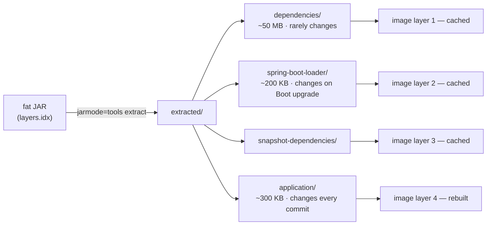

## Objective

Um JAR executável do Spring Boot já carrega tudo o que precisa, exceto uma JVM —
containerizá-lo significa embrulhar esse JAR numa imagem OCI para que a versão
da JVM, o JAR e o comando de start viajem juntos e rodem de forma idêntica num
laptop, num runner de CI ou num node do Kubernetes. A abordagem do livro é a
clássica: escrever à mão um `Dockerfile` que parte `FROM` uma imagem base JDK,
faz `COPY` do fat JAR e define um `ENTRYPOINT` que roda `java -jar`. Isso ainda
funciona e ainda é a opção mais controlável, mas o Spring Boot ganhou desde
então duas capacidades que o livro antecede — *JARs em camadas*, que dividem o
fat JAR em pedaços cacheáveis separadamente, e suporte nativo a *Cloud Native
Buildpacks* (`spring-boot:build-image`), que produz uma imagem otimizada sem
`Dockerfile` nenhum.

## Use Cases

- Deploy no Kubernetes, ECS, Cloud Run, ou qualquer orquestrador cuja unidade
  de deploy seja uma imagem em vez de um JAR.
- Fixar a JVM exata (vendor, major version, defaults de GC) junto com a
  aplicação, para que "funciona na minha máquina" e "funciona em staging"
  signifiquem o mesmo runtime.
- Pipelines de CI/CD que constroem e publicam uma imagem imutável e
  endereçável por digest por commit, e depois promovem esse mesmo digest por
  staging e produção.
- Ambientes de integração locais onde a aplicação e suas dependências
  (Postgres, Kafka, Mongo) sobem juntos via Docker Compose ou Testcontainers.
- Requisitos de supply chain — builds reproduzíveis, usuários não-root, e um
  SBOM anexado à imagem — mais fáceis de satisfazer com um build padronizado
  do que com um `Dockerfile` ad-hoc.

## Deep Dive

### A abordagem do livro: um Dockerfile escrito à mão

A containerização minimamente viável de uma app Spring Boot são quatro
instruções. A versão do livro era assim:

```dockerfile
FROM openjdk:8-jdk-alpine
ENV SPRING_PROFILES_ACTIVE docker
VOLUME /tmp
ARG JAR_FILE
COPY ${JAR_FILE} app.jar
ENTRYPOINT ["java", "-Djava.security.egd=file:/dev/./urandom", "-jar", "/app.jar"]
```

Linha por linha: `FROM` nomeia a imagem base que a nova imagem estende; `ENV`
define o profile Spring ativo para que beans e propriedades específicos de
profile se apliquem dentro do container; `VOLUME /tmp` cria um ponto de mount
(o Tomcat escreve seu diretório de trabalho ali); `ARG` declara um argumento de
build; `COPY` puxa o JAR compilado para dentro da imagem; `ENTRYPOINT` é o
comando executado quando um container inicia.

A mesma estrutura com uma imagem base atualmente mantida e sem a flag de
entropia obsoleta (o truque `/dev/./urandom` era um workaround para startup
lento da JVM no Java 8 e é desnecessário em JDKs modernos):

```dockerfile
FROM eclipse-temurin:21-jre-alpine
ENV SPRING_PROFILES_ACTIVE=docker
ARG JAR_FILE=target/*.jar
COPY ${JAR_FILE} /app.jar
ENTRYPOINT ["java", "-jar", "/app.jar"]
```

Note `-jre-` em vez de `-jdk-`: uma aplicação rodando não precisa do `javac`, e
tirar o compilador reduz tanto o peso quanto a superfície de ataque.

Construir e rodar é Docker puro — o livro passava isso pelo
`dockerfile-maven-plugin` da Spotify, um plugin de terceiros que não é mais
mantido e que nada hoje precisa:

```bash
$ ./mvnw package
$ docker build --build-arg JAR_FILE=target/ingredient-service-0.0.19-SNAPSHOT.jar \
      -t tacocloud/ingredient-service .
$ docker run -p 8080:8080 tacocloud/ingredient-service
```

O livro também usava `docker run --link tacocloud-mongo:mongo` para dar à app
um hostname `mongo` resolvível. `--link` é um recurso legado; o equivalente
moderno é uma rede bridge definida pelo usuário (ou um nome de serviço no
Compose), onde nomes de container resolvem via DNS automaticamente:

```bash
$ docker network create taco-net
$ docker run --name tacocloud-mongo --network taco-net -d mongo:7
$ docker run --network taco-net -p 8080:8080 tacocloud/ingredient-service
```

### O problema de copiar o fat JAR como um blob único

`COPY app.jar` coloca as classes da aplicação e todas as dependências numa
única camada Docker, tipicamente 40–60 MB onde o código próprio da aplicação é
umas poucas centenas de kilobytes. Mude uma linha de um controller, reconstrua,
e o digest daquela camada inteira muda — então tudo é reconstruído,
republicado no registry e repuxado por cada node. O cache de camadas do Docker
não compra nada, porque a parte que raramente muda (dependências) está fundida
com a parte que muda a cada commit (seu código).

Há um segundo custo: rodar um uber JAR sem descompactá-lo adiciona overhead de
startup, já que o loader de JAR aninhado precisa resolver entradas dentro do
arquivo em runtime.

### JARs em camadas: dividindo o arquivo para o cache funcionar

Os plugins Maven e Gradle do Spring Boot escrevem um `layers.idx` dentro do
JAR que atribui cada entrada a uma de quatro camadas, ordenadas da menos para
a mais volátil:

- `dependencies` — dependências de terceiros lançadas
- `spring-boot-loader` — tudo sob `org/springframework/boot/loader`
- `snapshot-dependencies` — dependências snapshot
- `application` — suas classes e recursos

Um `jarmode` embutido no JAR extrai essas camadas em disco:

```bash
$ java -Djarmode=tools -jar application.jar extract --layers --destination extracted
```

Num `Dockerfile` multi-stage, um estágio builder roda essa extração e o
estágio de runtime copia cada camada com seu próprio `COPY` — uma camada
Docker por camada do Spring Boot:

```dockerfile
# builder stage: unpack the fat jar into layers
FROM eclipse-temurin:21-jre-alpine AS builder
WORKDIR /builder
ARG JAR_FILE=target/*.jar
COPY ${JAR_FILE} application.jar
RUN java -Djarmode=tools -jar application.jar extract --layers --destination extracted

# runtime stage: one COPY per layer, least-volatile first
FROM eclipse-temurin:21-jre-alpine
WORKDIR /application
COPY --from=builder /builder/extracted/dependencies/ ./
COPY --from=builder /builder/extracted/spring-boot-loader/ ./
COPY --from=builder /builder/extracted/snapshot-dependencies/ ./
COPY --from=builder /builder/extracted/application/ ./
ENTRYPOINT ["java", "-jar", "application.jar"]
```

Agora uma mudança só de código invalida apenas o último `COPY`. A camada de
dependências — a grande — mantém seu digest, então o push no registry e o pull
do node movem kilobytes em vez de dezenas de megabytes. O `application.jar`
iniciado aqui *não* é o uber JAR: é um JAR fino de código de aplicação com
referências de classpath para os diretórios de dependências extraídos, o que
também é por que esse layout inicia mais rápido e funciona bem com cache de
CDS/AOT.



A atribuição de camadas é customizável — um bloco de configuração `<layers>`
no plugin de build pode, por exemplo, separar bibliotecas internas voláteis em
sua própria camada em vez de misturá-las com dependências de terceiros.

### Cloud Native Buildpacks: sem Dockerfile nenhum

Desde o Spring Boot 2.3, os plugins Maven e Gradle podem construir uma imagem
OCI diretamente, usando [Cloud Native Buildpacks](https://buildpacks.io/). Não
há nenhum `Dockerfile` para escrever ou manter:

```bash
$ ./mvnw spring-boot:build-image
```

O equivalente no Gradle é `./gradlew bootBuildImage`. O build inspeciona o
projeto, seleciona um JRE, aplica o buildpack Paketo Spring Boot (que respeita
o `layers.idx`, então a camadização acima vem de graça), e escreve a imagem no
daemon Docker local. O nome de imagem default é
`docker.io/library/${project.artifactId}:${project.version}`; o container
resultante roda como um **usuário não-root** por padrão.

A configuração fica no plugin em vez de num arquivo de texto:

```xml
<plugin>
  <groupId>org.springframework.boot</groupId>
  <artifactId>spring-boot-maven-plugin</artifactId>
  <configuration>
    <image>
      <name>registry.example.com/tacocloud/${project.artifactId}:${project.version}</name>
      <publish>true</publish>
      <env>
        <BP_JVM_VERSION>21</BP_JVM_VERSION>
      </env>
    </image>
  </configuration>
</plugin>
```

`<publish>true</publish>` publica direto no registry (as credenciais vêm de um
bloco `<publishRegistry>` ou da config do Docker), e `BP_JVM_VERSION` é uma
entre várias variáveis de ambiente do Paketo que direcionam o buildpack —
outras controlam o cálculo de memória da JVM, CDS, e compilação native-image.
Vincular o goal `build-image-no-fork` à fase `package` faz `./mvnw package`
produzir uma imagem como parte de um build normal.

> **Livro vs. hoje.** Duas coisas nesta seção genuinamente mudaram desde 2019.
> Primeiro, **a abordagem inteira do livro agora é opcional**: o Spring Boot
> 2.3 (maio de 2020) adicionou suporte nativo a Cloud Native Buildpacks, então
> `./mvnw spring-boot:build-image` produz uma imagem OCI em camadas, não-root
> e razoavelmente ajustada, sem nenhum `Dockerfile` no repositório — e o mesmo
> release adicionou JARs em camadas (`layers.idx`), que `Dockerfile`s escritos
> à mão exploram via a extração `jarmode` mostrada acima. O
> `dockerfile-maven-plugin` de terceiros da Spotify, do livro, não é mantido e
> não deveria ser usado; o goal do plugin oficial o substitui inteiramente.
> Note que o nome do jarmode também mudou: o Spring Boot 3.3 deprecou
> `-Djarmode=layertools` em favor de `-Djarmode=tools`, e o modo `layertools`
> desde então foi removido, então tutoriais antigos mostrando `layertools`
> vão falhar em versões atuais. Segundo, **a imagem base está errada**: as
> imagens oficiais `openjdk` do Docker Hub foram deprecadas em julho de 2022 e
> arquivadas naquele dezembro — o aviso de depreciação afirma que a imagem
> "está oficialmente deprecada e todos os usuários são recomendados a
> encontrar e usar substitutos adequados o quanto antes", nomeando
> `eclipse-temurin`, `amazoncorretto`, `ibm-semeru-runtimes`, e `sapmachine`.
> `eclipse-temurin` (Adoptium) é o sucessor drop-in usual e é o que a maioria
> dos guias de migração recomenda; curiosamente, os exemplos atuais de
> `Dockerfile` de referência do próprio Spring usam
> `bellsoft/liberica-openjre-debian`, escolhido por suas tags prontas para
> cache CDS/AOT. `FROM openjdk:8-jdk-alpine` te dá uma imagem não mantida com
> um JDK sem atualizações públicas — substitua na hora.

## Trade-offs

- **Um Dockerfile escrito à mão dá controle total; buildpacks dão manutenção
  zero.** Com um `Dockerfile` você escolhe a imagem base exata, adiciona
  pacotes nativos, define flags de JVM, e pode auditar cada linha — mas você é
  responsável por mantê-lo atualizado (CVEs da imagem base, upgrades de JDK, a
  renomeação `layertools` → `tools`). `spring-boot:build-image` entrega tudo
  isso aos mantenedores do buildpack, ao custo de não poder fazer
  `apt-get install` de algo ou partir de uma base distroless/scratch sem
  voltar para um `Dockerfile`.
- **JARs em camadas só compensam quando dependências dominam a imagem.** O
  build multi-stage adiciona complexidade real — um estágio builder, quatro
  `COPY`s, e um JAR fino que se comporta sutilmente diferente do uber JAR. Para
  um serviço cujas dependências são 50 MB contra 300 KB de código de
  aplicação, isso transforma um push de 50 MB por commit num de 300 KB. Para
  uma app pequena com poucas dependências, ou uma implantada raramente, o
  simples `COPY app.jar` é mais simples e a economia de cache é ruído.
  ```dockerfile
  # single-layer: any code change invalidates the whole ~50 MB layer
  COPY target/app.jar /app.jar

  # layered: a code change invalidates only the last, ~300 KB layer
  COPY --from=builder /builder/extracted/dependencies/ ./
  COPY --from=builder /builder/extracted/application/ ./
  ```
- **A escolha da imagem base troca tamanho por debugabilidade e
  compatibilidade.** Uma imagem JRE Alpine é uma fração da imagem Debian e
  reduz a superfície de vulnerabilidade, mas Alpine usa musl em vez de glibc,
  o que quebra algumas bibliotecas nativas e ferramentas de profiling da JVM,
  e a imagem enxuta não tem ferramentas de shell para debugar quando algo dá
  errado às 3 da manhã. Escolher `-jre` em vez de `-jdk` é quase de graça,
  porém: nada em produção precisa de um compilador.
- **Fixar a JVM dentro da imagem é o objetivo, e também a obrigação.** O
  motivo de containerizar é que o runtime deixa de ser ambiente — mas isso
  significa que um release de segurança do JDK agora é *seu* rebuild, não da
  plataforma. Imagens construídas uma vez e nunca reconstruídas viram a JVM
  mais antiga e menos corrigida da frota. Buildpacks mitigam isso (o
  `build-image` pega um JRE atual em cada execução); um `FROM
  eclipse-temurin:21.0.4_7-jre` fixo não, até alguém atualizar.
- **`ENV SPRING_PROFILES_ACTIVE` embutido na imagem acopla o artefato a um
  ambiente.** O livro o define no `Dockerfile`, o que é conveniente para um
  único profile `docker` mas vai contra o modelo de promover-o-mesmo-digest —
  se a imagem embute sua própria configuração, staging e produção não estão
  mais rodando o artefato idêntico. Passá-lo em runtime
  (`docker run -e SPRING_PROFILES_ACTIVE=prod`, ou uma entrada `env` do
  Kubernetes) mantém uma imagem promovível entre ambientes.
- **`spring-boot:build-image` precisa de um daemon Docker; o build deixa de
  ser Maven puro.** Ele fala com um daemon local (ou remoto), o que significa
  que agentes de CI precisam de Docker-in-Docker, um socket montado, ou um
  `DOCKER_HOST` apontando para algum lugar — uma restrição real em
  infraestrutura de build travada ou rootless. Podman, Colima e minikube são
  suportados, mas ainda é uma dependência externa que `mvn package` sozinho
  não tinha.

## Documentation Links

- Craig Walls, "Spring in Action", 5th Edition (Manning, 2019) — Chapter 19,
  "Deploying Spring", section 19.4 "Running Spring Boot in a Docker container",
  p. 461-464 — doc
- [Spring Boot Reference — Container Images: Dockerfiles](https://docs.spring.io/spring-boot/reference/packaging/container-images/dockerfiles.html) — doc
- [Spring Boot Reference — Efficient Container Images (layers)](https://docs.spring.io/spring-boot/reference/packaging/container-images/efficient-images.html) — doc
- [Spring Boot Reference — Cloud Native Buildpacks](https://docs.spring.io/spring-boot/reference/packaging/container-images/cloud-native-buildpacks.html) — doc
- [Spring Boot Maven Plugin — `spring-boot:build-image`](https://docs.spring.io/spring-boot/maven-plugin/build-image.html) — doc
- [Docker Hub — `eclipse-temurin` (successor to the deprecated `openjdk` image)](https://hub.docker.com/_/eclipse-temurin) — doc
