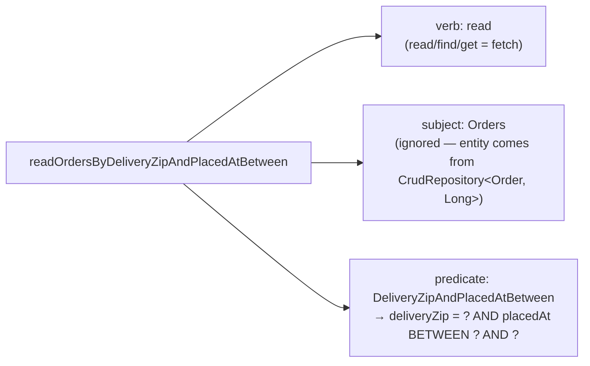

## Objective

The JDBC repositories from earlier in the chapter work, but every method —
even a trivial `findAll()` — still has to be hand-written against
`JdbcTemplate`. Spring Data JPA removes that step entirely for the common
case: annotate the domain classes as JPA entities, declare an interface that
extends `CrudRepository`, and Spring Data generates a working implementation
at runtime — no DAO class, no SQL, no `RowMapper` — while still allowing
custom queries to be derived from a method's name or, for anything more
complex, written explicitly with `@Query`.

## Use Cases

- Replacing a hand-written `JdbcTemplate`-based DAO with an interface that
  needs no implementation at all, for the dozen or so standard CRUD
  operations (save, find by ID, find all, delete, count).
- Adding a domain-specific finder — like "orders delivered to a given ZIP
  code" — without writing SQL, just by naming a method
  `findByDeliveryZip(String deliveryZip)`.
- Expressing a query that the naming convention can't reasonably capture
  (e.g., a fixed literal condition or a query spanning several properties)
  with an explicit `@Query` annotation instead of a long method name.

## Deep Dive

### Annotating the domain as JPA entities

Spring Data JPA generates repository implementations, but it doesn't relieve
the domain classes of standard JPA mapping annotations — `Ingredient`,
`Taco`, and `Order` each need `@Entity` plus an `@Id`-annotated identifier
property:

```java
import jakarta.persistence.Entity;
import jakarta.persistence.Id;

import lombok.AccessLevel;
import lombok.Data;
import lombok.NoArgsConstructor;
import lombok.RequiredArgsConstructor;

@Data
@RequiredArgsConstructor
@NoArgsConstructor(access = AccessLevel.PRIVATE, force = true)
@Entity
public class Ingredient {

    @Id
    private final String id;
    private final String name;
    private final Type type;

    public enum Type {
        WRAP, PROTEIN, VEGGIES, CHEESE, SAUCE
    }
}
```

JPA requires entities to have a no-argument constructor, which clashes with
`Ingredient`'s `final` properties. Lombok's `@NoArgsConstructor(force = true)`
generates one anyway (setting the finals to `null`), kept `private` so
application code can't call it by accident; `@RequiredArgsConstructor` is
added explicitly because `@NoArgsConstructor` would otherwise remove the
all-args constructor that `@Data` implies.

`Taco` needs a database-generated ID and a many-to-many relationship to
`Ingredient`:

```java
import jakarta.persistence.Entity;
import jakarta.persistence.GeneratedValue;
import jakarta.persistence.GenerationType;
import jakarta.persistence.Id;
import jakarta.persistence.ManyToMany;
import jakarta.persistence.PrePersist;

@Data
@Entity
public class Taco {

    @Id
    @GeneratedValue(strategy = GenerationType.AUTO)
    private Long id;

    private String name;
    private Date createdAt;

    @ManyToMany(targetEntity = Ingredient.class)
    private List<Ingredient> ingredients;

    @PrePersist
    void createdAt() {
        this.createdAt = new Date();
    }
}
```

`@GeneratedValue(strategy = GenerationType.AUTO)` lets the database assign
the ID; `@PrePersist` runs a callback right before the entity is saved,
which is how `createdAt` gets set without the caller having to remember to
do it. `Order` follows the same pattern but adds `@Table(name = "Taco_Order")`
— without it, JPA would default to a table literally named `Order`, which
collides with the SQL reserved word.

### Zero-implementation repositories with CrudRepository

With the entities annotated, the JDBC-era DAO classes disappear entirely.
An interface is enough:

```java
public interface IngredientRepository
         extends CrudRepository<Ingredient, String> {
}

public interface TacoRepository extends CrudRepository<Taco, Long> {
}

public interface OrderRepository extends CrudRepository<Order, Long> {
}
```

`CrudRepository<T, ID>` is parameterized with the entity type and its ID
type, and declares about a dozen CRUD methods (`save()`, `findById()`,
`findAll()`, `delete()`, `count()`, ...). At application startup Spring Data
JPA generates a working implementation of each interface on the fly — there
is no class to write and nothing to inject except the interface itself into
a controller or service, exactly as with the hand-written `JdbcTemplate`
repositories from section 3.1.

### Deriving queries from the method name

Beyond the inherited CRUD methods, a repository interface can declare
finder methods that Spring Data implements by parsing the method name
itself:

```java
public interface OrderRepository extends CrudRepository<Order, Long> {

    List<Order> findByDeliveryZip(String deliveryZip);

    List<Order> readOrdersByDeliveryZipAndPlacedAtBetween(
            String deliveryZip, Date startDate, Date endDate);
}
```

A repository method name is parsed as a **verb**, an optional **subject**,
the word **By**, and a **predicate**. In
`readOrdersByDeliveryZipAndPlacedAtBetween`, the verb is `read` (`find`,
`read`, and `get` are all synonyms for "fetch"; `count` returns an `int`
instead), the subject `Orders` is ignored (the entity type comes from
`CrudRepository<Order, Long>`, not from the method name), and the predicate
`DeliveryZipAndPlacedAtBetween` matches `deliveryZip` by equality and
`placedAt` against a `Between` range using the trailing parameters, in
order. Besides the implicit `Equals` and `Between`, the predicate DSL
understands operators like `GreaterThan`, `LessThan`, `IsNull`, `In`,
`StartingWith`, `Containing`, `IgnoringCase`, and a trailing `OrderBy...` for
sorting.



### Escaping the naming convention with @Query

Once a query needs more than the naming convention can reasonably express
in a method name, `@Query` takes an explicit JPQL string instead:

```java
public interface OrderRepository extends CrudRepository<Order, Long> {

    @Query("Order o where o.deliveryCity='Seattle'")
    List<Order> readOrdersDeliveredInSeattle();
}
```

The method name (`readOrdersDeliveredInSeattle`) is now just a label —
Spring Data doesn't parse it — and the actual query is whatever JPQL is
given to `@Query`, which can express conditions the naming DSL can't (a
fixed literal, a join, a subquery) without the method name growing
unreadable.

## Trade-offs

- **`CrudRepository` eliminates the DAO implementation entirely, but the
  price is compile-time silence** — a repository interface with zero
  implementing classes gives up the chance for the compiler to catch a
  mismatch; problems in a derived query surface as a startup failure
  (Spring Data can't parse the method name) rather than a compile error.
- **Query derivation from method names is fast for simple predicates but
  doesn't scale to complex ones** — `readOrdersByDeliveryZipAndPlacedAtBetween`
  is already at the edge of readability; anything with more conditions is
  better expressed with `@Query`, which trades the naming convention's
  "no SQL/JPQL at all" appeal for an explicit query string that can express
  arbitrary conditions.
- **JPA's no-arg-constructor-plus-mutability requirement pushes back against
  immutable domain objects** — `Ingredient` needs Lombok's forced, private
  no-args constructor specifically to satisfy JPA, not because the domain
  model wants a mutable-looking entity. Java records don't offer an escape
  hatch here: records still can't be used as `@Entity` classes today (no
  no-arg constructor, no settable fields, and JPA's identity/proxying model
  assumes a mutable, subclassable class) — they're supported for read-only
  projections, DTOs, and, since Hibernate 6, `@Embeddable` value objects, but
  not for the entities themselves.
- **Book vs. today: the namespace moved from `javax.persistence` to
  `jakarta.persistence`** since the Jakarta EE transition in Spring Boot 3.0
  — the annotations (`@Entity`, `@Id`, `@GeneratedValue`, `@ManyToMany`,
  `@PrePersist`, `@Table`) are otherwise unchanged, just re-packaged. Spring
  Data 3.0 also added `ListCrudRepository` (and `ListPagingAndSortingRepository`)
  alongside `CrudRepository`, returning `List<T>` directly from `findAll()`/
  `findAllById()` instead of `Iterable<T>` — a convenience, not a
  replacement, since `CrudRepository` still works exactly as the book
  describes it.

## Documentation Links

- Craig Walls, "Spring in Action", 5th Edition (Manning, 2019) — Chapter 3, "Working with data", section 3.2, p. 75-83 — doc
- [Spring Data JPA Reference — Repository core concepts (CrudRepository, ListCrudRepository, JpaRepository)](https://docs.spring.io/spring-data/jpa/reference/repositories/core-concepts.html) — doc
- [Spring Data JPA Reference — Query methods derived from method names](https://docs.spring.io/spring-data/jpa/reference/repositories/query-methods-details.html) — doc
- [Vlad Mihalcea — The best way to use Java Records with JPA and Hibernate](https://vladmihalcea.com/java-records-jpa-hibernate/) — doc
