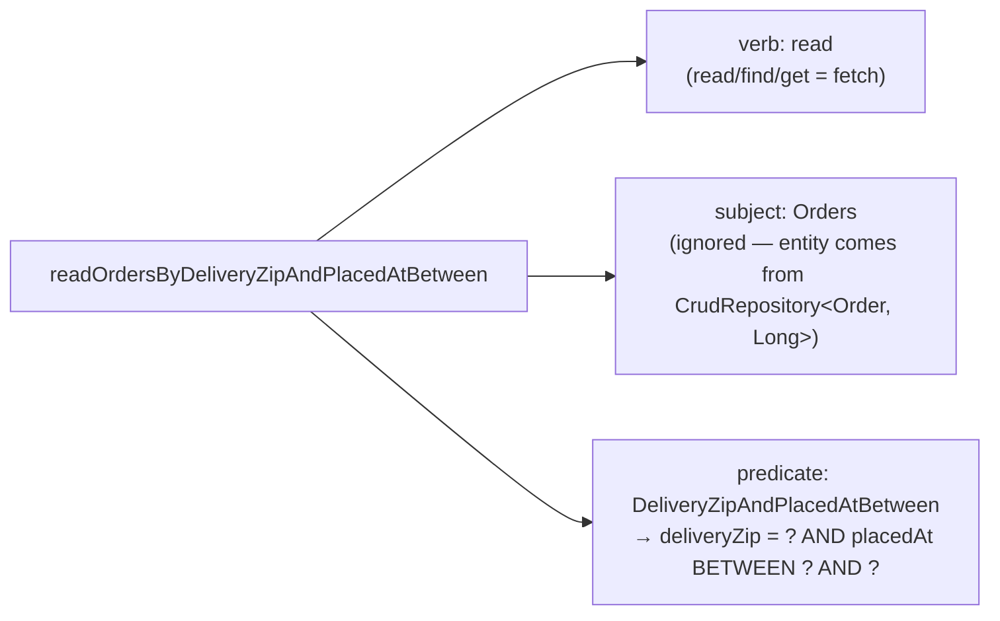

## Objective

Os repositórios JDBC vistos antes no capítulo funcionam, mas cada método —
até um `findAll()` trivial — ainda precisa ser escrito na mão contra o
`JdbcTemplate`. O Spring Data JPA elimina essa etapa por completo para o caso
comum: anote as classes de domínio como entidades JPA, declare uma interface
que estende `CrudRepository`, e o Spring Data gera uma implementação
funcional em tempo de execução — sem classe DAO, sem SQL, sem `RowMapper` —
ao mesmo tempo em que permite queries customizadas derivadas do nome de um
método ou, para algo mais complexo, escritas explicitamente com `@Query`.

## Use Cases

- Substituir um DAO escrito à mão baseado em `JdbcTemplate` por uma interface
  que não precisa de implementação nenhuma, para a dúzia ou mais de operações
  CRUD padrão (save, find por ID, find all, delete, count).
- Adicionar um finder específico do domínio — como "pedidos entregues em um
  determinado CEP" — sem escrever SQL, só nomeando um método
  `findByDeliveryZip(String deliveryZip)`.
- Expressar uma query que a convenção de nomenclatura não consegue capturar
  razoavelmente (ex.: uma condição literal fixa ou uma query que abrange
  várias propriedades) com uma anotação `@Query` explícita em vez de um nome
  de método longo demais.

## Deep Dive

### Anotando o domínio como entidades JPA

O Spring Data JPA gera implementações de repositório, mas não livra as
classes de domínio das anotações padrão de mapeamento JPA — `Ingredient`,
`Taco` e `Order` precisam cada uma de `@Entity` mais uma propriedade
identificadora anotada com `@Id`:

```java
import jakarta.persistence.Entity;
import jakarta.persistence.Id;

import lombok.AccessLevel;
import lombok.Data;
import lombok.NoArgsConstructor;
import lombok.RequiredArgsConstructor;

@Data
@RequiredArgsConstructor
@NoArgsConstructor(access = AccessLevel.PRIVATE, force = true)
@Entity
public class Ingredient {

    @Id
    private final String id;
    private final String name;
    private final Type type;

    public enum Type {
        WRAP, PROTEIN, VEGGIES, CHEESE, SAUCE
    }
}
```

O JPA exige que entidades tenham um construtor sem argumentos, o que choca
com as propriedades `final` de `Ingredient`. O `@NoArgsConstructor(force =
true)` do Lombok gera um mesmo assim (atribuindo `null` aos campos finais),
mantido `private` para que o código da aplicação não consiga chamá-lo por
acidente; `@RequiredArgsConstructor` é adicionado explicitamente porque
`@NoArgsConstructor` removeria, caso contrário, o construtor com todos os
argumentos que `@Data` implica.

`Taco` precisa de um ID gerado pelo banco e um relacionamento many-to-many
com `Ingredient`:

```java
import jakarta.persistence.Entity;
import jakarta.persistence.GeneratedValue;
import jakarta.persistence.GenerationType;
import jakarta.persistence.Id;
import jakarta.persistence.ManyToMany;
import jakarta.persistence.PrePersist;

@Data
@Entity
public class Taco {

    @Id
    @GeneratedValue(strategy = GenerationType.AUTO)
    private Long id;

    private String name;
    private Date createdAt;

    @ManyToMany(targetEntity = Ingredient.class)
    private List<Ingredient> ingredients;

    @PrePersist
    void createdAt() {
        this.createdAt = new Date();
    }
}
```

`@GeneratedValue(strategy = GenerationType.AUTO)` deixa o banco atribuir o
ID; `@PrePersist` roda um callback logo antes da entidade ser salva, que é
como `createdAt` é definido sem que quem chama precise se lembrar de fazer
isso. `Order` segue o mesmo padrão mas adiciona `@Table(name = "Taco_Order")`
— sem isso, o JPA usaria por padrão uma tabela literalmente chamada `Order`,
que colide com a palavra reservada do SQL.

### Repositórios sem nenhuma implementação com CrudRepository

Com as entidades anotadas, as classes DAO da era JDBC desaparecem por
completo. Uma interface basta:

```java
public interface IngredientRepository
         extends CrudRepository<Ingredient, String> {
}

public interface TacoRepository extends CrudRepository<Taco, Long> {
}

public interface OrderRepository extends CrudRepository<Order, Long> {
}
```

`CrudRepository<T, ID>` é parametrizado com o tipo da entidade e o tipo do
seu ID, e declara cerca de uma dúzia de métodos CRUD (`save()`,
`findById()`, `findAll()`, `delete()`, `count()`, ...). Na inicialização da
aplicação, o Spring Data JPA gera uma implementação funcional de cada
interface na hora — não há classe nenhuma para escrever, e nada para
injetar exceto a própria interface num controller ou service, exatamente
como nos repositórios `JdbcTemplate` escritos à mão da seção 3.1.

### Derivando queries a partir do nome do método

Além dos métodos CRUD herdados, uma interface de repositório pode declarar
métodos finder que o Spring Data implementa fazendo o parsing do próprio
nome do método:

```java
public interface OrderRepository extends CrudRepository<Order, Long> {

    List<Order> findByDeliveryZip(String deliveryZip);

    List<Order> readOrdersByDeliveryZipAndPlacedAtBetween(
            String deliveryZip, Date startDate, Date endDate);
}
```

O nome de um método de repositório é interpretado como um **verbo**, um
**sujeito** opcional, a palavra **By** e um **predicado**. Em
`readOrdersByDeliveryZipAndPlacedAtBetween`, o verbo é `read` (`find`,
`read` e `get` são todos sinônimos de "buscar"; `count` retorna um `int` em
vez disso), o sujeito `Orders` é ignorado (o tipo da entidade vem de
`CrudRepository<Order, Long>`, não do nome do método), e o predicado
`DeliveryZipAndPlacedAtBetween` casa `deliveryZip` por igualdade e
`placedAt` contra um intervalo `Between` usando os parâmetros finais, na
ordem. Além do `Equals` e `Between` implícitos, a DSL de predicados entende
operadores como `GreaterThan`, `LessThan`, `IsNull`, `In`, `StartingWith`,
`Containing`, `IgnoringCase`, e um `OrderBy...` no final para ordenação.



### Escapando da convenção de nomenclatura com @Query

Quando uma query precisa de mais do que a convenção de nomenclatura consegue
razoavelmente expressar num nome de método, `@Query` recebe uma string JPQL
explícita:

```java
public interface OrderRepository extends CrudRepository<Order, Long> {

    @Query("Order o where o.deliveryCity='Seattle'")
    List<Order> readOrdersDeliveredInSeattle();
}
```

O nome do método (`readOrdersDeliveredInSeattle`) agora é só um rótulo — o
Spring Data não faz o parsing dele — e a query de fato é o que quer que seja
passado em JPQL para `@Query`, que consegue expressar condições que a DSL de
nomenclatura não consegue (uma literal fixa, um join, uma subquery) sem que
o nome do método vire algo ilegível.

## Trade-offs

- **`CrudRepository` elimina a implementação do DAO por completo, mas o
  preço é o silêncio em tempo de compilação** — uma interface de repositório
  sem nenhuma classe implementando abre mão da chance do compilador detectar
  uma incompatibilidade; problemas numa query derivada aparecem como uma
  falha na inicialização (o Spring Data não consegue fazer o parsing do
  nome do método) em vez de um erro de compilação.
- **A derivação de query a partir do nome do método é rápida para
  predicados simples, mas não escala para os complexos** —
  `readOrdersByDeliveryZipAndPlacedAtBetween` já está no limite da
  legibilidade; qualquer coisa com mais condições fica melhor expressa com
  `@Query`, que troca o apelo do "nada de SQL/JPQL" da convenção de
  nomenclatura por uma string de query explícita que consegue expressar
  condições arbitrárias.
- **O requisito de construtor sem argumentos mais mutabilidade do JPA vai
  contra objetos de domínio imutáveis** — `Ingredient` precisa do construtor
  forçado, privado e sem argumentos do Lombok especificamente para
  satisfazer o JPA, não porque o modelo de domínio queira uma entidade com
  cara de mutável. Java records não oferecem uma saída aqui: records ainda
  não podem ser usados como classes `@Entity` hoje (sem construtor sem
  argumentos, sem campos configuráveis, e o modelo de identidade/proxy do
  JPA assume uma classe mutável e subclassificável) — são suportados para
  projeções somente leitura, DTOs e, desde o Hibernate 6, objetos de valor
  `@Embeddable`, mas não para as entidades em si.
- **Book vs. today: o namespace migrou de `javax.persistence` para
  `jakarta.persistence`** desde a transição para o Jakarta EE no Spring Boot
  3.0 — as anotações (`@Entity`, `@Id`, `@GeneratedValue`, `@ManyToMany`,
  `@PrePersist`, `@Table`) estão, fora isso, inalteradas, só reempacotadas.
  O Spring Data 3.0 também adicionou `ListCrudRepository` (e
  `ListPagingAndSortingRepository`) ao lado de `CrudRepository`, retornando
  `List<T>` diretamente de `findAll()`/`findAllById()` em vez de
  `Iterable<T>` — uma conveniência, não uma substituição, já que
  `CrudRepository` continua funcionando exatamente como o livro descreve.

## Documentation Links

- Craig Walls, "Spring in Action", 5th Edition (Manning, 2019) — Chapter 3, "Working with data", section 3.2, p. 75-83 — doc
- [Spring Data JPA Reference — Repository core concepts (CrudRepository, ListCrudRepository, JpaRepository)](https://docs.spring.io/spring-data/jpa/reference/repositories/core-concepts.html) — doc
- [Spring Data JPA Reference — Query methods derived from method names](https://docs.spring.io/spring-data/jpa/reference/repositories/query-methods-details.html) — doc
- [Vlad Mihalcea — The best way to use Java Records with JPA and Hibernate](https://vladmihalcea.com/java-records-jpa-hibernate/) — doc
