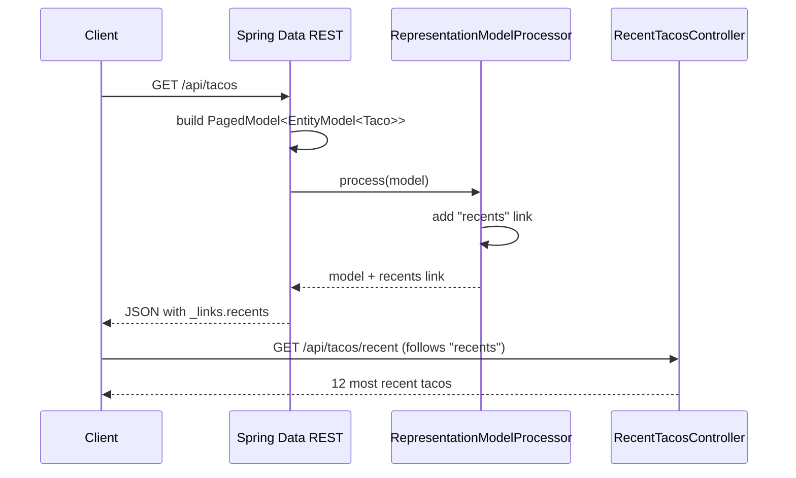

## Objective

`spring-mvc-hateoas-hypermedia` showed how to hand-build a hypermedia response:
wrap the entity, attach a `self` link with `linkTo(methodOn(...))`, return
`CollectionModel<EntityModel<T>>`. Spring Data REST removes even that code.
Adding one dependency — `spring-boot-starter-data-rest` — to a project that
already has Spring Data repositories is enough: every repository interface
(Spring Data JPA, Mongo, and so on) gets a full hypermedia-driven REST
endpoint, with GET/POST/PUT/DELETE and HAL `_links`, without writing a single
`@RestController`. The trade for that "zero code" API is that the
repository — and by extension the persistence model — becomes the API
surface, so the rest of this concept is really about the knobs available to
adjust that surface: resource paths and relation names, paging/sorting
defaults, and how to add hand-written endpoints and links back on top when
plain CRUD isn't enough.

## Use Cases

- Prototyping or internal admin tooling where a full CRUD API over a handful
  of JPA entities is needed fast, and hand-writing controllers for each one
  would be pure boilerplate.
- Backing a UI that already understands HAL/hypermedia and can page/sort
  through collections using the `page`, `size`, and `sort` query parameters
  Spring Data REST wires up automatically.
- A repository that's 90% plain CRUD but has one or two operations (a
  "recent items" view, a custom aggregation) that need a hand-written
  endpoint layered on top of — and linked from — the auto-generated API.
- Deliberately restricting which repository methods are public, once the
  auto-generated surface has been reviewed against what should actually be
  exposed externally.

## Deep Dive

### Zero-config REST API from a repository

Given a `TacoRepository extends CrudRepository<Taco, Long>` (from Spring
Data JPA) already in the project, the only change needed is the dependency:

```xml
<dependency>
  <groupId>org.springframework.boot</groupId>
  <artifactId>spring-boot-starter-data-rest</artifactId>
</dependency>
```

That's it. Spring Boot's auto-configuration detects the starter and exposes
every Spring Data repository as a REST resource. A `GET /ingredients`
already returns HAL-shaped hypermedia, `_links` included, with no controller
written for it:

```json
{
  "_embedded": {
    "ingredients": [
      {
        "name": "Flour Tortilla",
        "type": "WRAP",
        "_links": {
          "self": { "href": "http://localhost:8080/ingredients/FLTO" },
          "ingredient": { "href": "http://localhost:8080/ingredients/FLTO" }
        }
      }
    ]
  },
  "_links": {
    "self": { "href": "http://localhost:8080/ingredients" },
    "profile": { "href": "http://localhost:8080/profile/ingredients" }
  }
}
```

POST, PUT, and DELETE work the same way against the same URLs — `POST
/ingredients` creates one, `DELETE /ingredients/FLTO` removes it — all
without a controller.

### Setting a base path

Left alone, Spring Data REST's endpoints live at the application root, which
collides with any hand-written controllers using the same paths. Setting
`spring.data.rest.base-path` moves every generated endpoint under a prefix:

```yaml
spring:
  data:
    rest:
      base-path: /api
```

`GET /ingredients` becomes `GET /api/ingredients`.

### Adjusting resource paths and relation names

Spring Data REST derives an endpoint's path and relation name by pluralizing
the entity's simple class name — `Ingredient` becomes `/ingredients`,
`Order` becomes `/orders`. The pluralizer isn't infallible: it turns `Taco`
into `/tacoes`, which is technically discoverable (the API's home resource
at `GET /api` lists every relation and its URL) but awkward for clients to
depend on.

The fix is `@RepositoryRestResource`, which lets you pin both the relation
name and the path explicitly. Today it's applied on the repository
interface:

```java
@RepositoryRestResource(rel = "tacos", path = "tacos")
public interface TacoRepository extends CrudRepository<Taco, Long> {
}
```

`GET /api` now advertises a correctly named `tacos` relation at `/api/tacos`.

### Paging and sorting

Every collection resource Spring Data REST generates already accepts `page`,
`size`, and `sort` query parameters — no code required:

```
$ curl "localhost:8080/api/tacos?size=5&page=1"
$ curl "localhost:8080/api/tacos?sort=createdAt,desc&page=0&size=12"
```

`page` is zero-based, `size` defaults to 20, and the response carries
`first`/`self`/`next`/`last` links so a client can page by following a named
link rather than hand-building query strings.

### Adding a custom endpoint with `@RepositoryRestController`

Sometimes plain CRUD isn't enough — the book's example is a "12 most recent
tacos" endpoint that would otherwise require the client to hardcode paging
and sorting parameters. A hand-written `@RestController` works, but its
mappings live outside Spring Data REST's base path unless manually
prefixed, and a base-path change would silently break it.

`@RepositoryRestController` solves that: every mapping in the class is
automatically prefixed with `spring.data.rest.base-path`. Unlike
`@RestController`, it does not imply `@ResponseBody` — handler methods
still need to return a `ResponseEntity` (or add `@ResponseBody`
themselves):

```java
@RepositoryRestController
public class RecentTacosController {

    private final TacoRepository tacoRepo;

    public RecentTacosController(TacoRepository tacoRepo) {
        this.tacoRepo = tacoRepo;
    }

    @GetMapping(path = "/tacos/recent", produces = "application/hal+json")
    public ResponseEntity<CollectionModel<EntityModel<Taco>>> recentTacos() {
        PageRequest page = PageRequest.of(0, 12, Sort.by("createdAt").descending());
        List<Taco> tacos = tacoRepo.findAll(page).getContent();

        CollectionModel<EntityModel<Taco>> recentModels = CollectionModel.wrap(tacos);
        recentModels.add(
            linkTo(methodOn(RecentTacosController.class).recentTacos())
                .withRel("recents"));
        return ResponseEntity.ok(recentModels);
    }
}
```

With `spring.data.rest.base-path=/api`, `recentTacos()` handles
`GET /api/tacos/recent` — but it still won't show up as a link on
`GET /api/tacos` on its own.

### Adding custom hyperlinks with a `RepresentationModelProcessor`

To make the `recents` endpoint discoverable, Spring Data REST needs a
component that runs on every outgoing resource of a given type and adds a
link. The book calls this a `ResourceProcessor` — that interface (along
with `Resource`/`Resources`) was renamed as part of the same Spring HATEOAS
1.0 overhaul covered in `spring-mvc-hateoas-hypermedia`. Today it's a
`RepresentationModelProcessor<T>` bean, discovered automatically and applied
to every resource of the matching type:

```java
@Bean
public RepresentationModelProcessor<PagedModel<EntityModel<Taco>>> tacoProcessor(
        EntityLinks links) {

    return new RepresentationModelProcessor<PagedModel<EntityModel<Taco>>>() {
        @Override
        public PagedModel<EntityModel<Taco>> process(
                PagedModel<EntityModel<Taco>> model) {
            model.add(links.linkFor(Taco.class).slash("recent").withRel("recents"));
            return model;
        }
    };
}
```

Any `PagedModel<EntityModel<Taco>>` returned by Spring Data REST — including
the response for `GET /api/tacos` — now carries a `recents` link pointing at
the hand-written endpoint, so a client can discover it the same way it
discovers `first`/`next`/`last`.



## Trade-offs

- **Zero controller code also means the persistence model is the API
  contract by default.** Every field on the entity, and every method on the
  repository — including custom finders — is reachable unless deliberately
  restricted. Spring Data REST documents this explicitly: repositories or
  methods "not exposing those methods — either by not declaring them at all
  or explicitly using `@RestResource(exported = false)`" respond with a 405
  rather than being silently hidden, which means restriction is opt-out, not
  opt-in:
  ```java
  public interface TacoRepository extends CrudRepository<Taco, Long> {
      @RestResource(exported = false)
      void deleteById(Long id);
  }
  ```
- **Automatic pluralization is convenient until it isn't.** `Taco` becomes
  `/tacoes` with no code written at all — harmless once discovered via the
  API's home resource, but a URL nobody would guess. `@RepositoryRestResource`
  fixes it, but only once someone notices the mismatch:
  ```java
  @RepositoryRestResource(rel = "tacos", path = "tacos")
  public interface TacoRepository extends CrudRepository<Taco, Long> { }
  ```
- **The moment business logic is needed beyond CRUD — validation beyond bean
  validation, a workflow, an aggregation — the "zero code" pitch stops
  applying.** `@RepositoryRestController` and `RepresentationModelProcessor`
  bring back exactly the boilerplate (link builders, resource wrapping) that
  Spring Data REST was adopted to avoid, just for a subset of endpoints. In
  practice, teams either accept it for the CRUD majority and hand-write the
  rest, or skip Spring Data REST altogether once enough custom endpoints
  accumulate — a judgment call about how CRUD-shaped the API actually stays.
- **Coupling the wire format directly to the entity graph is convenient for
  a prototype, riskier for a long-lived public API.** A JPA relationship
  added or renamed for persistence reasons changes the JSON shape and
  `_embedded` keys for every client, with no version boundary in between —
  the same versioning concern that makes hand-rolled hypermedia (see
  `spring-mvc-hateoas-hypermedia`'s `@Relation` discussion) a deliberate
  choice rather than a default for external-facing APIs.

## Documentation Links

- Craig Walls, "Spring in Action", 5th Edition (Manning, 2019) — Chapter 6,
  "Creating REST services", section 6.3 "Enabling data-backed services",
  p. 160-168 — doc
- [Spring Data REST Reference — Repository resources](https://docs.spring.io/spring-data/rest/reference/repository-resources.html) — doc
- [Spring Data REST Reference — Overriding Spring Data REST Response Handlers (@RepositoryRestController)](https://docs.spring.io/spring-data/rest/reference/customizing/overriding-sdr-response-handlers.html) — doc
- [Spring Data REST Reference — Configuring the REST URL Path](https://docs.spring.io/spring-data/rest/reference/customizing/configuring-the-rest-url-path.html) — doc
- [Spring Data REST Reference — Integration (RepositoryEntityLinks)](https://docs.spring.io/spring-data/rest/reference/integration.html) — doc
