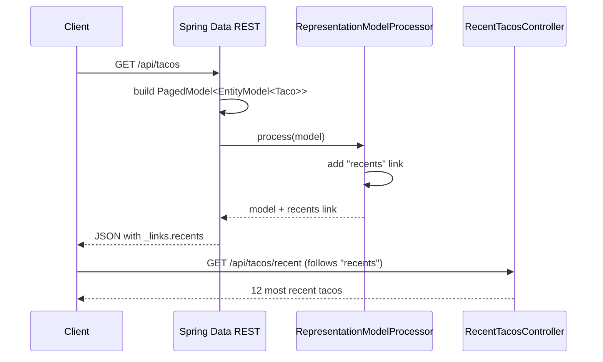

## Objective

`spring-mvc-hateoas-hypermedia` mostrou como construir uma resposta de
hipermídia manualmente: envolver a entidade, anexar um link `self` com
`linkTo(methodOn(...))`, retornar `CollectionModel<EntityModel<T>>`. O
Spring Data REST elimina até esse código. Adicionar uma única dependência —
`spring-boot-starter-data-rest` — a um projeto que já tem repositórios
Spring Data já é suficiente: toda interface de repositório (Spring Data JPA,
Mongo, etc.) ganha um endpoint REST completo orientado a hipermídia, com
GET/POST/PUT/DELETE e `_links` no formato HAL, sem escrever um único
`@RestController`. O preço dessa API "zero código" é que o repositório — e,
por extensão, o modelo de persistência — se torna a superfície da API, então
o restante deste conceito trata exatamente dos controles disponíveis para
ajustar essa superfície: paths de recurso e nomes de relação, defaults de
paginação/ordenação, e como adicionar endpoints e links escritos à mão por
cima quando o CRUD puro não é suficiente.

## Use Cases

- Prototipagem ou ferramentas administrativas internas onde uma API CRUD
  completa sobre um punhado de entidades JPA é necessária rapidamente, e
  escrever controllers para cada uma seria puro boilerplate.
- Alimentar uma UI que já entende HAL/hipermídia e consegue paginar/ordenar
  coleções usando os parâmetros de query `page`, `size` e `sort` que o
  Spring Data REST conecta automaticamente.
- Um repositório que é 90% CRUD puro, mas tem uma ou duas operações (uma
  visão de "itens recentes", uma agregação customizada) que precisam de um
  endpoint escrito à mão, adicionado por cima — e conectado por link — à API
  gerada automaticamente.
- Restringir deliberadamente quais métodos do repositório são públicos, uma
  vez que a superfície gerada automaticamente foi revisada em relação ao que
  deveria de fato ser exposto externamente.

## Deep Dive

### API REST zero-config a partir de um repositório

Dado um `TacoRepository extends CrudRepository<Taco, Long>` (do Spring Data
JPA) já existente no projeto, a única mudança necessária é a dependência:

```xml
<dependency>
  <groupId>org.springframework.boot</groupId>
  <artifactId>spring-boot-starter-data-rest</artifactId>
</dependency>
```

Só isso. A auto-configuração do Spring Boot detecta o starter e expõe todo
repositório Spring Data como um recurso REST. Um `GET /ingredients` já
retorna hipermídia no formato HAL, `_links` incluídos, sem nenhum controller
escrito para isso:

```json
{
  "_embedded": {
    "ingredients": [
      {
        "name": "Flour Tortilla",
        "type": "WRAP",
        "_links": {
          "self": { "href": "http://localhost:8080/ingredients/FLTO" },
          "ingredient": { "href": "http://localhost:8080/ingredients/FLTO" }
        }
      }
    ]
  },
  "_links": {
    "self": { "href": "http://localhost:8080/ingredients" },
    "profile": { "href": "http://localhost:8080/profile/ingredients" }
  }
}
```

POST, PUT e DELETE funcionam da mesma forma contra as mesmas URLs — `POST
/ingredients` cria um, `DELETE /ingredients/FLTO` remove um — tudo sem
controller.

### Definindo um path base

Se deixado como está, os endpoints do Spring Data REST vivem na raiz da
aplicação, o que colide com qualquer controller escrito à mão usando os
mesmos paths. Definir `spring.data.rest.base-path` move todo endpoint
gerado para debaixo de um prefixo:

```yaml
spring:
  data:
    rest:
      base-path: /api
```

`GET /ingredients` vira `GET /api/ingredients`.

### Ajustando paths de recurso e nomes de relação

O Spring Data REST deriva o path e o nome de relação de um endpoint
pluralizando o nome simples da classe da entidade — `Ingredient` vira
`/ingredients`, `Order` vira `/orders`. O pluralizador não é infalível: ele
transforma `Taco` em `/tacoes`, o que é tecnicamente descobrível (o recurso
raiz da API em `GET /api` lista toda relação e sua URL), mas incômodo para
um cliente depender disso.

A correção é `@RepositoryRestResource`, que permite fixar explicitamente
tanto o nome de relação quanto o path. Hoje ele é aplicado na interface do
repositório:

```java
@RepositoryRestResource(rel = "tacos", path = "tacos")
public interface TacoRepository extends CrudRepository<Taco, Long> {
}
```

`GET /api` agora anuncia uma relação `tacos` corretamente nomeada em
`/api/tacos`.

### Paginação e ordenação

Todo recurso de coleção que o Spring Data REST gera já aceita os parâmetros
de query `page`, `size` e `sort` — sem nenhum código necessário:

```
$ curl "localhost:8080/api/tacos?size=5&page=1"
$ curl "localhost:8080/api/tacos?sort=createdAt,desc&page=0&size=12"
```

`page` começa em zero, `size` tem default 20, e a resposta carrega links
`first`/`self`/`next`/`last` para que um cliente possa paginar seguindo um
link nomeado em vez de montar strings de query manualmente.

### Adicionando um endpoint customizado com `@RepositoryRestController`

Às vezes o CRUD puro não é suficiente — o exemplo do livro é um endpoint de
"12 tacos mais recentes", que de outra forma exigiria que o cliente
codificasse manualmente parâmetros de paginação e ordenação. Um
`@RestController` escrito à mão funciona, mas seus mappings ficam fora do
path base do Spring Data REST a menos que sejam prefixados manualmente, e
uma mudança no path base quebraria isso silenciosamente.

`@RepositoryRestController` resolve isso: todo mapping na classe é
automaticamente prefixado com `spring.data.rest.base-path`. Diferente de
`@RestController`, ele não implica `@ResponseBody` — os métodos handler
ainda precisam retornar um `ResponseEntity` (ou adicionar `@ResponseBody`
eles mesmos):

```java
@RepositoryRestController
public class RecentTacosController {

    private final TacoRepository tacoRepo;

    public RecentTacosController(TacoRepository tacoRepo) {
        this.tacoRepo = tacoRepo;
    }

    @GetMapping(path = "/tacos/recent", produces = "application/hal+json")
    public ResponseEntity<CollectionModel<EntityModel<Taco>>> recentTacos() {
        PageRequest page = PageRequest.of(0, 12, Sort.by("createdAt").descending());
        List<Taco> tacos = tacoRepo.findAll(page).getContent();

        CollectionModel<EntityModel<Taco>> recentModels = CollectionModel.wrap(tacos);
        recentModels.add(
            linkTo(methodOn(RecentTacosController.class).recentTacos())
                .withRel("recents"));
        return ResponseEntity.ok(recentModels);
    }
}
```

Com `spring.data.rest.base-path=/api`, `recentTacos()` trata
`GET /api/tacos/recent` — mas ainda não aparece sozinho como link em
`GET /api/tacos`.

### Adicionando hyperlinks customizados com um `RepresentationModelProcessor`

Para tornar o endpoint `recents` descobrível, o Spring Data REST precisa de
um componente que rode em todo recurso de saída de um determinado tipo e
adicione um link. O livro chama isso de `ResourceProcessor` — essa
interface (junto com `Resource`/`Resources`) foi renomeada como parte da
mesma reforma do Spring HATEOAS 1.0 coberta em
`spring-mvc-hateoas-hypermedia`. Hoje é um bean `RepresentationModelProcessor<T>`,
descoberto automaticamente e aplicado a todo recurso do tipo correspondente:

```java
@Bean
public RepresentationModelProcessor<PagedModel<EntityModel<Taco>>> tacoProcessor(
        EntityLinks links) {

    return new RepresentationModelProcessor<PagedModel<EntityModel<Taco>>>() {
        @Override
        public PagedModel<EntityModel<Taco>> process(
                PagedModel<EntityModel<Taco>> model) {
            model.add(links.linkFor(Taco.class).slash("recent").withRel("recents"));
            return model;
        }
    };
}
```

Todo `PagedModel<EntityModel<Taco>>` retornado pelo Spring Data REST —
incluindo a resposta de `GET /api/tacos` — agora carrega um link `recents`
apontando para o endpoint escrito à mão, então um cliente consegue
descobri-lo da mesma forma que descobre `first`/`next`/`last`.



## Trade-offs

- **Zero código de controller também significa que o modelo de persistência
  é o contrato da API por padrão.** Todo campo da entidade, e todo método do
  repositório — incluindo finders customizados — é alcançável a menos que
  deliberadamente restringido. O próprio Spring Data REST documenta isso
  explicitamente: repositórios ou métodos "não expondo esses métodos — seja
  não os declarando de forma alguma, seja usando explicitamente
  `@RestResource(exported = false)`" respondem com 405 em vez de serem
  silenciosamente escondidos, o que significa que a restrição é opt-out, não
  opt-in:
  ```java
  public interface TacoRepository extends CrudRepository<Taco, Long> {
      @RestResource(exported = false)
      void deleteById(Long id);
  }
  ```
- **A pluralização automática é conveniente até deixar de ser.** `Taco` vira
  `/tacoes` sem nenhum código escrito — inofensivo assim que descoberto via
  o recurso raiz da API, mas uma URL que ninguém adivinharia. O
  `@RepositoryRestResource` corrige isso, mas só depois que alguém percebe a
  incompatibilidade:
  ```java
  @RepositoryRestResource(rel = "tacos", path = "tacos")
  public interface TacoRepository extends CrudRepository<Taco, Long> { }
  ```
- **No momento em que é preciso lógica de negócio além do CRUD — validação
  além do bean validation, um workflow, uma agregação — a proposta "zero
  código" para de se aplicar.** `@RepositoryRestController` e
  `RepresentationModelProcessor` trazem de volta exatamente o boilerplate
  (link builders, empacotamento de recursos) que o Spring Data REST foi
  adotado para evitar, só que para um subconjunto de endpoints. Na prática,
  times ou aceitam isso para a maioria CRUD e escrevem o resto à mão, ou
  abandonam o Spring Data REST completamente quando endpoints customizados
  se acumulam demais — uma decisão de julgamento sobre o quanto a API ainda
  se parece com CRUD.
- **Acoplar o formato de transporte diretamente ao grafo de entidades é
  conveniente para um protótipo, mas mais arriscado para uma API pública de
  vida longa.** Um relacionamento JPA adicionado ou renomeado por motivos de
  persistência muda o formato JSON e as chaves de `_embedded` para todo
  cliente, sem nenhuma fronteira de versão no meio — a mesma preocupação com
  versionamento que faz da hipermídia escrita à mão (veja a discussão sobre
  `@Relation` em `spring-mvc-hateoas-hypermedia`) uma escolha deliberada, não
  um padrão, para APIs voltadas ao público externo.

## Documentation Links

- Craig Walls, "Spring in Action", 5th Edition (Manning, 2019) — Chapter 6,
  "Creating REST services", section 6.3 "Enabling data-backed services",
  p. 160-168 — doc
- [Spring Data REST Reference — Repository resources](https://docs.spring.io/spring-data/rest/reference/repository-resources.html) — doc
- [Spring Data REST Reference — Overriding Spring Data REST Response Handlers (@RepositoryRestController)](https://docs.spring.io/spring-data/rest/reference/customizing/overriding-sdr-response-handlers.html) — doc
- [Spring Data REST Reference — Configuring the REST URL Path](https://docs.spring.io/spring-data/rest/reference/customizing/configuring-the-rest-url-path.html) — doc
- [Spring Data REST Reference — Integration (RepositoryEntityLinks)](https://docs.spring.io/spring-data/rest/reference/integration.html) — doc
