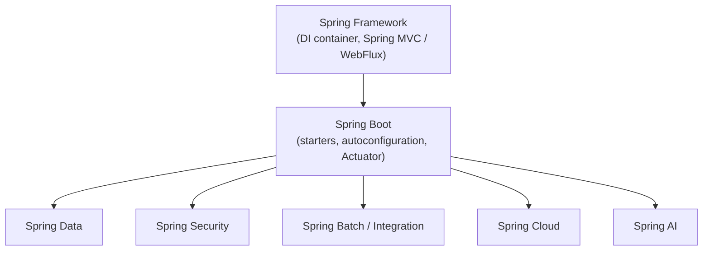

## Objective

Entenda como as peças do ecossistema Spring se encaixam em torno de um núcleo: o core do Spring Framework fornece injeção de dependência e o Spring MVC; o Spring Boot adiciona por cima starters, autoconfiguração e o Actuator; e uma família de projetos especializados (Spring Data, Spring Security, Spring Batch/Integration, Spring Cloud) cada um endereça uma preocupação transversal usando o mesmo container subjacente.

## Use Cases

- Decidir qual starter adicionar para uma nova capacidade (persistência, segurança, mensageria) reconhecendo qual projeto Spring nomeado é dono daquela preocupação, em vez de caçar bibliotecas individuais.
- Ler um código Spring desconhecido e situar uma anotação ou bean desconhecido em contexto — isso é DI do core, uma preocupação de autoconfiguração do Spring Boot, ou uma abstração de Spring Data/Security/Batch?
- Explicar a um colega por que "Spring" e "Spring Boot" não são a mesma coisa, e por que praticamente todo projeto Spring moderno é escrito em termos centrados no Boot mesmo que o core framework não exija isso.
- Definir o escopo das dependências de um projeto deliberadamente — trazendo apenas os starters de que um serviço realmente precisa (web, security, batch) em vez de tratar "Spring" como uma dependência monolítica.

## Deep Dive



### O core do Spring Framework: container DI mais Spring MVC

Tudo mais no ecossistema é construído em cima do container core e do seu modelo de injeção de dependência. O core framework também traz o Spring MVC (o framework web usado para tratar requisições) e suporte básico a JDBC via `JdbcTemplate`:

```java
@Controller
public class HomeController {

  @GetMapping("/")
  public String home() {
    return "home";
  }
}
```

A partir do Spring 5.0, o core framework também introduziu um segundo framework web, não-bloqueante, o Spring WebFlux, construído sobre Reactive Streams e coexistindo ao lado do Spring MVC em vez de substituí-lo — a escolha entre eles é feita por aplicação, não imposta pelo framework.

### Spring Boot: starters, autoconfiguração e o Actuator

O Spring Boot não é um substituto do core framework — é uma camada opinativa que remove a fiação manual que o core framework exigiria de outra forma (veja o conceito `spring-boot-autoconfiguration` para os detalhes do mecanismo). Além de starters e autoconfiguração, o Boot adiciona o **Actuator**, um conjunto de endpoints prontos para produção expondo métricas, health checks, thread dumps e propriedades de ambiente sem nenhum código além de uma dependência starter:

```xml
<dependency>
  <groupId>org.springframework.boot</groupId>
  <artifactId>spring-boot-starter-actuator</artifactId>
</dependency>
```

```
curl http://localhost:8080/actuator/health
# {"status":"UP"}
```

O Boot se tornou tão central para o ecossistema que a maior parte da documentação e dos tutoriais Spring — incluindo este — descreve as coisas em termos centrados no Boot, mesmo para comportamento que tecnicamente pertence ao core framework.

### Spring Data: repositories como interfaces, independentes do tipo de banco

O Spring Data permite que uma camada de acesso a dados seja definida como uma interface Java simples, com o comportamento de query derivado de convenções de nomenclatura de método em vez de código de implementação escrito à mão:

```java
public interface IngredientRepository extends CrudRepository<Ingredient, String> {
  List<Ingredient> findByType(Ingredient.Type type);
}
```

O mesmo modelo de programação abrange bancos relacionais (Spring Data JPA), stores de documentos (MongoDB) e bancos de grafos (Neo4j) — trocar o store subjacente é, em grande parte, uma questão de trocar o módulo do Spring Data, não de reescrever o contrato do repository.

### Spring Security, Spring Batch/Integration e Spring Cloud, cada um dono de uma preocupação transversal

Três projetos adicionais endereçam preocupações que se aplicam à maioria das aplicações não triviais, cada um com seu próprio conceito já coberto neste app:

- **Spring Security** — autenticação e autorização (veja `spring-security-authentication-architecture`).
- **Spring Batch** — processamento de dados em massa, orientado a chunks, disparado sob demanda ou em agenda (veja `spring-batch-chunk-processing`), diferentemente do **Spring Integration**, que lida com integração em tempo real, orientada a mensagens, entre sistemas.
- **Spring Cloud** — uma coleção de projetos endereçando preocupações de microsserviços (service discovery, configuração, resiliência) que não existem em uma aplicação de unidade de deploy única.

A distinção entre Spring Batch e Spring Integration é sobre *quando* os dados são processados: o Batch espera os dados se acumularem e os processa em massa a partir de um gatilho, enquanto o Integration reage a cada unidade de dado assim que ela chega.

### O livro vs. hoje: o panorama cresceu, mas a forma não mudou

O livro (5ª edição, 2019) mira o Spring 5.0/Spring Boot 2.0, Java 8, e o namespace `javax.*`. Desde então:

- O Spring Boot 3.x elevou a base para **Java 17** e completou a migração dos pacotes `javax.*` do Java EE para os pacotes `jakarta.*` do Jakarta EE (uma renomeação mecânica, mas incompatível, em todo o ecossistema, incluindo Spring Security e Spring Data).
- O Spring Boot 3 adicionou suporte de primeira classe à compilação **GraalVM native image** via processamento ahead-of-time (AOT), e substituiu o antigo modelo de métricas apenas do Actuator pelo **Micrometer Observation** (métricas + tracing distribuído sob uma única abstração) — nenhum dos dois existia na edição de 2019.
- O Spring Cloud continua sendo o toolkit padrão para preocupações de microsserviços no Spring, embora quais subprojetos são considerados atuais tenha mudado: componentes da Netflix OSS (Hystrix, Ribbon) referenciados em material mais antigo estão agora em modo de manutenção, superados por Resilience4j e Spring Cloud LoadBalancer.
- O ecossistema ganhou um membro inteiramente novo: o **Spring AI**, endereçando integração com LLMs e vector stores — uma categoria de preocupação que não existia quando o capítulo do panorama do livro foi escrito.

A *forma* do panorama descrito pelo livro — um core, uma camada de bootstrap opinativa, e projetos especializados para preocupações de dados/segurança/batch/cloud — permanece inalterada; as versões concretas, os namespaces, e quais subprojetos são considerados atuais avançaram, como esperado para qualquer inventário de um ecossistema vivo.

## Trade-offs

- **Aprender "Spring" na verdade significa aprender vários projetos, incrementalmente** — o core framework, o Boot e cada projeto especializado são versionados e documentados separadamente; não existe uma única referência que cubra tudo isso, e a maioria das aplicações reais só precisa de um subconjunto.
- **O pensamento centrado no Boot obscurece o que é opcional** — como quase todos os tutoriais assumem o Spring Boot, é fácil perder de vista qual comportamento vem do core framework (portável para qualquer setup Spring) versus da autoconfiguração do Boot (específica do Boot).
- **Escolher o projeto errado para uma necessidade de processamento de dados tem custo real** — escolher o Spring Batch para o que na verdade é um problema de integração em tempo real (ou vice-versa) significa lutar contra o modelo de execução do framework escolhido em vez de usá-lo; a distinção neste Deep Dive é a pergunta decisiva a se fazer primeiro.

## Documentation Links

- [Spring in Action, 5th Edition (Manning, 2019) — Chapter 1, "Getting started with Spring", Section 1.4 "Surveying the Spring landscape", p. 26-28](https://www.manning.com/books/spring-in-action-fifth-edition) — doc
- [Spring — Projects overview](https://spring.io/projects) — doc
- [Spring Boot Reference — System Requirements (Java 17 baseline)](https://docs.spring.io/spring-boot/system-requirements.html) — doc
- [Spring Boot Reference — Actuator](https://docs.spring.io/spring-boot/reference/actuator/index.html) — doc
- [Spring Framework Reference — Web on Reactive Stack (WebFlux)](https://docs.spring.io/spring-framework/reference/web-reactive.html) — doc
- [Preparing for Spring Boot 3.0 (Jakarta EE, GraalVM native, observability)](https://spring.io/blog/2022/05/24/preparing-for-spring-boot-3-0/) — doc
