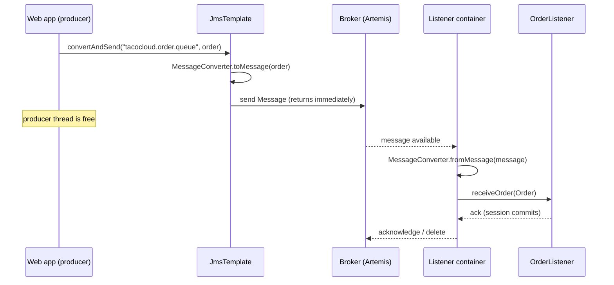

## Objective

A REST call couples two applications in time: the caller blocks until the
callee answers, and if the callee is down the call fails. Asynchronous
messaging removes that coupling — the sender hands a message to a *broker* and
returns immediately; the receiver picks it up whenever it is ready, possibly
seconds later, possibly after a restart. JMS (the Java Message Service, renamed
Jakarta Messaging) is the Java standard that gives every compliant broker one
common API, the same way JDBC does for relational databases. Spring layers
`JmsTemplate` over that API to remove the connection/session/exception
boilerplate on the sending side, and `@JmsListener` to turn an ordinary bean
method into a message-driven POJO on the receiving side.

## Use Cases

- Decoupling a fast producer from a slow downstream process — a web checkout
  accepts an order in milliseconds and drops it on a queue, while a kitchen or
  fulfillment application works through the backlog at its own pace.
- Point-to-point work queues where each message must be handled by exactly one
  consumer, and adding consumers is how you add throughput.
- Surviving downstream outages: messages accumulate in a durable queue while
  the consumer is redeployed, instead of the producer's HTTP calls failing.
- Enterprise integration with systems that already speak JMS — legacy Jakarta
  EE / EJB applications, IBM MQ, TIBCO EMS — where the broker is a given and
  JMS is the only API on offer.
- Fan-out notifications to several independent subscribers via a JMS *topic*,
  when every listener needs its own copy of the event.

## Deep Dive

### Setting up: pick a broker, add a starter

JMS is a spec, not an implementation — nothing happens until a broker exists.
Spring Boot ships two JMS starters, one per Apache broker family:

```xml
<!-- ActiveMQ "Classic" — the original broker -->
<dependency>
  <groupId>org.springframework.boot</groupId>
  <artifactId>spring-boot-starter-activemq</artifactId>
</dependency>

<!-- ActiveMQ Artemis — the next-generation broker, the default choice today -->
<dependency>
  <groupId>org.springframework.boot</groupId>
  <artifactId>spring-boot-starter-artemis</artifactId>
</dependency>
```

Either starter triggers the same autoconfiguration: a `ConnectionFactory`
(wrapped in a `CachingConnectionFactory`), a `JmsTemplate`, and a
`JmsListenerContainerFactory` that backs `@JmsListener`. Only the connection
properties differ. For Artemis:

```yaml
spring:
  artemis:
    mode: native
    broker-url: tcp://artemis.tacocloud.com:61617
    user: tacoweb
    password: l3tm31n
```

For ActiveMQ Classic:

```yaml
spring:
  activemq:
    broker-url: tcp://activemq.tacocloud.com:61616
    user: tacoweb
    password: l3tm31n
```

Neither block is needed in development — the default broker URL is
`tcp://localhost:61616` for both. The code that sends and receives messages is
identical either way; that portability *is* the point of JMS.

### Sending: `send()` and a `MessageCreator`

`JmsTemplate` exposes two families of send methods. The low-level one takes a
`MessageCreator`, a callback handed the JMS `Session` so it can build the
`Message` itself:

```java
package tacos.messaging;

import jakarta.jms.Message;
import jakarta.jms.Session;
import org.springframework.jms.core.JmsTemplate;
import org.springframework.stereotype.Service;

@Service
public class JmsOrderMessagingService implements OrderMessagingService {

    private final JmsTemplate jms;

    public JmsOrderMessagingService(JmsTemplate jms) {
        this.jms = jms;
    }

    @Override
    public void sendOrder(Order order) {
        jms.send("tacocloud.order.queue",
                 session -> session.createObjectMessage(order));
    }
}
```

`MessageCreator` is a functional interface, so the lambda replaces the
anonymous inner class the API originally implied. Drop the destination
argument and the message goes to the template's default destination:

```java
jms.send(session -> session.createObjectMessage(order));
```

```yaml
spring:
  jms:
    template:
      default-destination: tacocloud.order.queue
```

A third overload takes a `Destination` object instead of a name. Declaring one
as a bean lets you configure more than the name, though in practice the name is
all anyone sets:

```java
@Bean
public Destination orderQueue() {
    // Artemis: org.apache.activemq.artemis.jms.client.ActiveMQQueue
    // ActiveMQ Classic has a same-named class in org.apache.activemq.command
    return new ActiveMQQueue("tacocloud.order.queue");
}
```

### Sending: `convertAndSend()` and message converters

Building the `Message` by hand is ceremony when all you want is to ship a
domain object. `convertAndSend()` takes the object and runs it through a
`MessageConverter`:

```java
@Override
public void sendOrder(Order order) {
    jms.convertAndSend("tacocloud.order.queue", order);
}
```

The default converter is `SimpleMessageConverter`, which maps `String` →
`TextMessage`, `byte[]` → `BytesMessage`, `Map` → `MapMessage`, and anything
`Serializable` → `ObjectMessage`. That `Serializable` requirement is the catch:
it forces Java serialization on the wire and forces the consumer to hold the
same class. Declaring a JSON converter bean replaces it globally:

```java
@Bean
public JacksonJsonMessageConverter messageConverter() {
    JacksonJsonMessageConverter converter = new JacksonJsonMessageConverter();
    converter.setTypeIdPropertyName("_typeId");

    Map<String, Class<?>> typeIdMappings = new HashMap<>();
    typeIdMappings.put("order", Order.class);
    converter.setTypeIdMappings(typeIdMappings);

    return converter;
}
```

`setTypeIdPropertyName()` is what makes the message self-describing — without
it the receiver has no idea what type to deserialize into.
`setTypeIdMappings()` then replaces the default fully-qualified class name with
a synthetic id (`"order"`), so the consumer can map that same id onto its own
`Order` class in a different package, with a different name, holding a subset
of the fields.

### Post-processing: adding headers to a converted message

`convertAndSend()` creates the `Message` internally, so there is no obvious
place to set a JMS property on it. That's what the optional
`MessagePostProcessor` parameter is for:

```java
jms.convertAndSend("tacocloud.order.queue", order,
    message -> {
        message.setStringProperty("X_ORDER_SOURCE", "WEB");
        return message;
    });
```

This is the right home for cross-cutting metadata — order source, tenant id,
trace id — that the *transport* cares about but the domain object shouldn't
carry. When the same post-processing is reused, a method reference beats
repeating the lambda:

```java
jms.convertAndSend("tacocloud.order.queue", order, this::addOrderSource);

private Message addOrderSource(Message message) throws JMSException {
    message.setStringProperty("X_ORDER_SOURCE", "WEB");
    return message;
}
```

### Receiving, pull model: `receive()` and `receiveAndConvert()`

`JmsTemplate`'s receive methods mirror its send methods, and all of them
*block* the calling thread until a message arrives:

```java
Message receive() throws JmsException;
Message receive(String destinationName) throws JmsException;
Object receiveAndConvert() throws JmsException;
Object receiveAndConvert(String destinationName) throws JmsException;
```

`receive()` hands back the raw `Message`, which means converting it yourself:

```java
@Component
public class JmsOrderReceiver implements OrderReceiver {

    private final JmsTemplate jms;
    private final MessageConverter converter;

    public JmsOrderReceiver(JmsTemplate jms, MessageConverter converter) {
        this.jms = jms;
        this.converter = converter;
    }

    public Order receiveOrder() {
        Message message = jms.receive("tacocloud.order.queue");
        return (Order) converter.fromMessage(message);
    }
}
```

`receiveAndConvert()` collapses that to one line and removes the need to inject
a converter at all:

```java
public Order receiveOrder() {
    return (Order) jms.receiveAndConvert("tacocloud.order.queue");
}
```

Use `receive()` only when you actually need the headers and properties
(`X_ORDER_SOURCE` above); otherwise `receiveAndConvert()` is strictly simpler.
The pull model earns its keep when the consumer sets the pace — a kitchen
screen where a cook presses "next order" and *then* a message is pulled is the
canonical example.

### Receiving, push model: `@JmsListener`

The push model inverts control: the container polls the broker, and your method
is invoked with the already-converted payload.

```java
@Component
public class OrderListener {

    private final KitchenUI ui;

    public OrderListener(KitchenUI ui) {
        this.ui = ui;
    }

    @JmsListener(destination = "tacocloud.order.queue")
    public void receiveOrder(Order order) {
        ui.displayOrder(order);
    }
}
```

`@JmsListener` is to a destination what `@GetMapping` is to a URL path — a
declarative binding that framework code dispatches to. Nothing in your
application calls `receiveOrder()`; the listener container does, on its own
threads, whenever a message lands. Concurrency is a property, not code:

```yaml
spring:
  jms:
    listener:
      min-concurrency: 2
      max-concurrency: 10
```



The listener container acknowledges only after the method returns normally. A
thrown exception means no acknowledgement, so the broker redelivers — which is
why listener methods must be idempotent, and why an unhandled bug becomes an
infinite redelivery loop unless the broker's dead-letter policy catches it.

> **Book vs. today.** Two things moved since 2019. First, the broker: the book
> presents "Apache ActiveMQ or the newer Apache ActiveMQ Artemis" as an open
> choice while already calling Classic "a legacy option" — that call has held
> up. Artemis is the actively-developed next generation and
> `spring-boot-starter-artemis` is the default choice for new applications;
> `spring-boot-starter-activemq` still exists and is still autoconfigured, but
> it now ships client-only (you must add `org.apache.activemq:activemq-broker`
> yourself for an embedded broker), and its embedded-broker switch was renamed
> from the book's `spring.activemq.in-memory` to
> `spring.activemq.embedded.enabled`. Artemis lost the book's
> `spring.artemis.host` / `spring.artemis.port` pair too — it's a single
> `spring.artemis.broker-url` now, alongside `spring.artemis.mode`
> (`native` or `embedded`). Second, the namespace: Spring Boot 3 moved to
> Jakarta EE 9+, so every `javax.jms.*` import in the book's listings
> (`Message`, `Session`, `JMSException`, `ConnectionFactory`) is `jakarta.jms.*`
> today — a mechanical rename, but a hard compile break if you copy the
> listings verbatim. What did *not* change is the part that matters:
> `JmsTemplate`, `MessageCreator`, `MessagePostProcessor`, `MessageConverter`,
> and `@JmsListener` have identical shapes and semantics. JMS is a mature spec
> and Spring's abstraction over it has been stable for well over a decade. Two
> smaller notes: Spring Framework 7 added a fluent `JmsClient`
> (`jmsClient.destination("q").send(order)`) as a modern alternative that
> delegates to `JmsTemplate` — the template is not deprecated — and
> `MappingJackson2MessageConverter` is deprecated for removal in favour of
> `JacksonJsonMessageConverter`, which is what the converter bean above uses.

## Trade-offs

- **Queues give you exactly-one-consumer semantics; topics give you fan-out —
  and you choose at configuration time, not at send time.** `JmsTemplate`
  sends to a *destination*, and whether that name resolves to a queue or a
  topic is decided by `spring.jms.pub-sub-domain`. Get it wrong and a
  work queue silently becomes a broadcast (every worker does the same job) or
  a broadcast silently becomes a work queue (only one subscriber sees each
  event):
  ```yaml
  spring:
    jms:
      pub-sub-domain: false   # default: destinations are queues (point-to-point)
      # pub-sub-domain: true  # destinations are topics (publish/subscribe)
  ```
- **`receive()` blocks a thread; `@JmsListener` doesn't — but the blocking one
  is sometimes what you want.** A listener can be overwhelmed if messages
  arrive faster than they can be handled, and then the buffering problem just
  moves into your application. The pull model lets a consumer declare *"I am
  ready for one more"*, which is the correct model when the bottleneck is
  downstream of the code (a human, a rate-limited third-party API). The push
  model is the default answer for everything else.
- **The broker-agnostic API doesn't make you broker-agnostic in practice.**
  The same `jms.convertAndSend(...)` compiles against Artemis, ActiveMQ
  Classic, and IBM MQ — but the moment you declare a `Destination` bean you
  import a vendor class, and dead-letter policy, redelivery limits, persistence
  tuning, clustering, and monitoring are all vendor-specific operational
  knowledge that JMS says nothing about:
  ```java
  // portable
  jms.convertAndSend("tacocloud.order.queue", order);

  // vendor-specific the moment you need a Destination object
  new org.apache.activemq.artemis.jms.client.ActiveMQQueue("tacocloud.order.queue");
  ```
- **`SimpleMessageConverter` works out of the box and is the wrong default for
  anything crossing a team boundary.** It requires `Serializable` payloads,
  which pins both sides to the same Java class and makes any field change a
  coordinated deploy. A JSON converter with `setTypeIdMappings()` decouples the
  two sides — the producer's `tacos.Order` and the consumer's
  `tacos.kitchen.Order` need only agree on the synthetic id and the field names
  they both care about.
- **JMS is a Java-only spec, which caps how far the decoupling goes.** The
  whole value proposition is that producer and consumer evolve independently —
  but under JMS they must both be JVM applications. A polyglot system needs a
  wire protocol rather than a Java API: see
  [RabbitMQ Messaging](/spring-concepts/spring-rabbitmq-messaging) for AMQP's
  exchange-and-routing-key model, and
  [Kafka Messaging](/spring-concepts/spring-kafka-messaging) for a partitioned,
  replayable log aimed at high-throughput event streaming.
- **Asynchrony buys availability and pays in observability.** The producer can
  no longer tell the user whether the work succeeded, only that it was
  accepted. Correlating a request across the broker needs trace propagation
  through message headers, and "where did that order go?" becomes a broker
  question rather than a stack trace — a real operational cost that a
  synchronous REST call simply doesn't have.

## Documentation Links

- Craig Walls, "Spring in Action", 5th Edition (Manning, 2019) — Chapter 8,
  "Sending messages asynchronously", section 8.1 "Sending messages with JMS",
  p. 179-191 — doc
- [Spring Framework Reference — Using Spring JMS (JmsTemplate, JmsClient, MessageCreator, MessageConverter)](https://docs.spring.io/spring-framework/reference/integration/jms/using.html) — doc
- [Spring Framework Reference — Annotation-driven listener endpoints (@JmsListener)](https://docs.spring.io/spring-framework/reference/integration/jms/annotated.html) — doc
- [Spring Boot Reference — JMS (Artemis and ActiveMQ "Classic" autoconfiguration)](https://docs.spring.io/spring-boot/reference/messaging/jms.html) — doc
- [Jakarta Messaging Specification](https://jakarta.ee/specifications/messaging/) — doc
