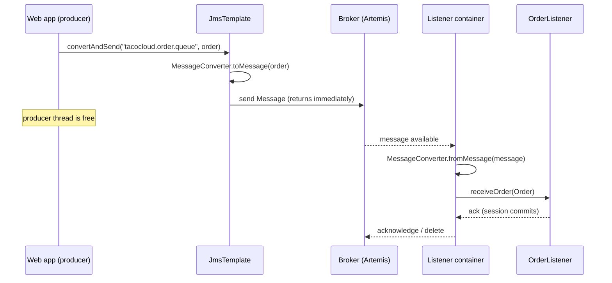

## Objective

Uma chamada REST acopla duas aplicações no tempo: quem chama bloqueia até quem
responde dar a resposta, e se quem responde está fora do ar, a chamada falha.
Mensageria assíncrona remove esse acoplamento — quem envia entrega uma
mensagem a um *broker* e retorna imediatamente; quem recebe pega a mensagem
quando estiver pronto, possivelmente segundos depois, possivelmente após um
restart. JMS (o Java Message Service, renomeado Jakarta Messaging) é o padrão
Java que dá a todo broker compatível uma API comum, da mesma forma que o JDBC
faz para bancos relacionais. O Spring coloca o `JmsTemplate` por cima dessa API
para remover o boilerplate de connection/session/exception do lado de envio, e
o `@JmsListener` para transformar um método de bean comum num POJO orientado a
mensagem do lado de recebimento.

## Use Cases

- Desacoplar um produtor rápido de um processo downstream lento — um checkout
  web aceita um pedido em milissegundos e o coloca numa fila, enquanto uma
  aplicação de cozinha ou de fulfillment trabalha o backlog no seu próprio
  ritmo.
- Filas de trabalho ponto-a-ponto onde cada mensagem deve ser tratada por
  exatamente um consumidor, e adicionar consumidores é como você adiciona
  throughput.
- Sobreviver a quedas downstream: mensagens se acumulam numa fila durável
  enquanto o consumidor é redeployado, em vez das chamadas HTTP do produtor
  falharem.
- Integração empresarial com sistemas que já falam JMS — aplicações Jakarta
  EE/EJB legadas, IBM MQ, TIBCO EMS — onde o broker é um dado e o JMS é a
  única API disponível.
- Fan-out de notificações para vários assinantes independentes via um *topic*
  JMS, quando cada listener precisa da sua própria cópia do evento.

## Deep Dive

### Configurando: escolha um broker, adicione um starter

JMS é uma especificação, não uma implementação — nada acontece até que um
broker exista. O Spring Boot vem com dois starters de JMS, um por família de
broker Apache:

```xml
<!-- ActiveMQ "Classic" — the original broker -->
<dependency>
  <groupId>org.springframework.boot</groupId>
  <artifactId>spring-boot-starter-activemq</artifactId>
</dependency>

<!-- ActiveMQ Artemis — the next-generation broker, the default choice today -->
<dependency>
  <groupId>org.springframework.boot</groupId>
  <artifactId>spring-boot-starter-artemis</artifactId>
</dependency>
```

Qualquer um dos starters dispara a mesma autoconfiguração: uma
`ConnectionFactory` (envolvida numa `CachingConnectionFactory`), um
`JmsTemplate`, e uma `JmsListenerContainerFactory` que sustenta o
`@JmsListener`. Só as propriedades de conexão diferem. Para Artemis:

```yaml
spring:
  artemis:
    mode: native
    broker-url: tcp://artemis.tacocloud.com:61617
    user: tacoweb
    password: l3tm31n
```

Para ActiveMQ Classic:

```yaml
spring:
  activemq:
    broker-url: tcp://activemq.tacocloud.com:61616
    user: tacoweb
    password: l3tm31n
```

Nenhum dos blocos é necessário em desenvolvimento — a URL de broker default é
`tcp://localhost:61616` para ambos. O código que envia e recebe mensagens é
idêntico nos dois casos; essa portabilidade *é* o ponto do JMS.

### Enviando: `send()` e um `MessageCreator`

`JmsTemplate` expõe duas famílias de métodos de envio. A de baixo nível recebe
um `MessageCreator`, um callback que recebe a `Session` JMS para que ele mesmo
construa a `Message`:

```java
package tacos.messaging;

import jakarta.jms.Message;
import jakarta.jms.Session;
import org.springframework.jms.core.JmsTemplate;
import org.springframework.stereotype.Service;

@Service
public class JmsOrderMessagingService implements OrderMessagingService {

    private final JmsTemplate jms;

    public JmsOrderMessagingService(JmsTemplate jms) {
        this.jms = jms;
    }

    @Override
    public void sendOrder(Order order) {
        jms.send("tacocloud.order.queue",
                 session -> session.createObjectMessage(order));
    }
}
```

`MessageCreator` é uma interface funcional, então a lambda substitui a classe
interna anônima que a API originalmente exigia. Removendo o argumento de
destino, a mensagem vai para o destino default do template:

```java
jms.send(session -> session.createObjectMessage(order));
```

```yaml
spring:
  jms:
    template:
      default-destination: tacocloud.order.queue
```

Uma terceira sobrecarga recebe um objeto `Destination` em vez de um nome.
Declarar um como bean permite configurar mais do que o nome, embora na
prática o nome seja tudo que alguém define:

```java
@Bean
public Destination orderQueue() {
    // Artemis: org.apache.activemq.artemis.jms.client.ActiveMQQueue
    // ActiveMQ Classic has a same-named class in org.apache.activemq.command
    return new ActiveMQQueue("tacocloud.order.queue");
}
```

### Enviando: `convertAndSend()` e conversores de mensagem

Construir a `Message` na mão é cerimônia quando tudo que você quer é enviar um
objeto de domínio. `convertAndSend()` pega o objeto e passa por um
`MessageConverter`:

```java
@Override
public void sendOrder(Order order) {
    jms.convertAndSend("tacocloud.order.queue", order);
}
```

O conversor default é o `SimpleMessageConverter`, que mapeia `String` →
`TextMessage`, `byte[]` → `BytesMessage`, `Map` → `MapMessage`, e qualquer
coisa `Serializable` → `ObjectMessage`. Essa exigência de `Serializable` é a
pegadinha: ela força serialização Java na conexão e obriga o consumidor a
manter a mesma classe. Declarar um bean conversor de JSON o substitui
globalmente:

```java
@Bean
public JacksonJsonMessageConverter messageConverter() {
    JacksonJsonMessageConverter converter = new JacksonJsonMessageConverter();
    converter.setTypeIdPropertyName("_typeId");

    Map<String, Class<?>> typeIdMappings = new HashMap<>();
    typeIdMappings.put("order", Order.class);
    converter.setTypeIdMappings(typeIdMappings);

    return converter;
}
```

`setTypeIdPropertyName()` é o que torna a mensagem autodescritiva — sem ele o
receptor não tem ideia de para qual tipo desserializar.
`setTypeIdMappings()` então substitui o nome de classe totalmente qualificado
default por um id sintético (`"order"`), para que o consumidor possa mapear
esse mesmo id para sua própria classe `Order`, em outro pacote, com outro
nome, contendo um subconjunto dos campos.

### Pós-processamento: adicionando headers a uma mensagem convertida

`convertAndSend()` cria a `Message` internamente, então não há um lugar óbvio
para definir uma propriedade JMS nela. É para isso que serve o parâmetro
opcional `MessagePostProcessor`:

```java
jms.convertAndSend("tacocloud.order.queue", order,
    message -> {
        message.setStringProperty("X_ORDER_SOURCE", "WEB");
        return message;
    });
```

Esse é o lugar certo para metadados transversais — origem do pedido, id de
tenant, id de trace — que o *transporte* se importa mas o objeto de domínio
não deveria carregar. Quando o mesmo pós-processamento é reutilizado, uma
referência de método vence repetir a lambda:

```java
jms.convertAndSend("tacocloud.order.queue", order, this::addOrderSource);

private Message addOrderSource(Message message) throws JMSException {
    message.setStringProperty("X_ORDER_SOURCE", "WEB");
    return message;
}
```

### Recebendo, modelo pull: `receive()` e `receiveAndConvert()`

Os métodos de recebimento do `JmsTemplate` espelham seus métodos de envio, e
todos eles *bloqueiam* a thread chamadora até uma mensagem chegar:

```java
Message receive() throws JmsException;
Message receive(String destinationName) throws JmsException;
Object receiveAndConvert() throws JmsException;
Object receiveAndConvert(String destinationName) throws JmsException;
```

`receive()` devolve a `Message` bruta, o que significa converter você mesmo:

```java
@Component
public class JmsOrderReceiver implements OrderReceiver {

    private final JmsTemplate jms;
    private final MessageConverter converter;

    public JmsOrderReceiver(JmsTemplate jms, MessageConverter converter) {
        this.jms = jms;
        this.converter = converter;
    }

    public Order receiveOrder() {
        Message message = jms.receive("tacocloud.order.queue");
        return (Order) converter.fromMessage(message);
    }
}
```

`receiveAndConvert()` reduz isso a uma linha e elimina a necessidade de
injetar um conversor de forma alguma:

```java
public Order receiveOrder() {
    return (Order) jms.receiveAndConvert("tacocloud.order.queue");
}
```

Use `receive()` só quando você realmente precisa dos headers e propriedades
(`X_ORDER_SOURCE` acima); do contrário `receiveAndConvert()` é estritamente
mais simples. O modelo pull ganha seu valor quando o consumidor dita o ritmo —
uma tela de cozinha onde um cozinheiro aperta "próximo pedido" e *então* uma
mensagem é puxada é o exemplo canônico.

### Recebendo, modelo push: `@JmsListener`

O modelo push inverte o controle: o container faz polling no broker, e seu
método é invocado com o payload já convertido.

```java
@Component
public class OrderListener {

    private final KitchenUI ui;

    public OrderListener(KitchenUI ui) {
        this.ui = ui;
    }

    @JmsListener(destination = "tacocloud.order.queue")
    public void receiveOrder(Order order) {
        ui.displayOrder(order);
    }
}
```

`@JmsListener` está para um destino assim como `@GetMapping` está para um
caminho de URL — uma vinculação declarativa que o código do framework
despacha. Nada na sua aplicação chama `receiveOrder()`; o container do
listener chama, nas suas próprias threads, sempre que uma mensagem chega.
Concorrência é uma propriedade, não código:

```yaml
spring:
  jms:
    listener:
      min-concurrency: 2
      max-concurrency: 10
```



O container do listener confirma (acknowledge) somente depois que o método
retorna normalmente. Uma exceção lançada significa nenhuma confirmação, então
o broker reentrega — motivo pelo qual métodos de listener precisam ser
idempotentes, e por que um bug não tratado vira um loop infinito de
reentrega, a menos que a política de dead-letter do broker o capture.

> **Livro vs. hoje.** Duas coisas mudaram desde 2019. Primeiro, o broker: o
> livro apresenta "Apache ActiveMQ ou o mais novo Apache ActiveMQ Artemis"
> como uma escolha aberta, embora já chamasse Classic de "uma opção legada" —
> essa previsão se confirmou. Artemis é a próxima geração ativamente
> desenvolvida e `spring-boot-starter-artemis` é a escolha default para
> aplicações novas; `spring-boot-starter-activemq` ainda existe e ainda é
> autoconfigurado, mas agora vem apenas com o client (você precisa adicionar
> `org.apache.activemq:activemq-broker` você mesmo para um broker embarcado),
> e seu switch de broker embarcado foi renomeado do `spring.activemq.in-memory`
> do livro para `spring.activemq.embedded.enabled`. O Artemis também perdeu o
> par `spring.artemis.host` / `spring.artemis.port` do livro — agora é um
> único `spring.artemis.broker-url`, junto com `spring.artemis.mode`
> (`native` ou `embedded`). Segundo, o namespace: o Spring Boot 3 migrou para
> Jakarta EE 9+, então todo import `javax.jms.*` nas listagens do livro
> (`Message`, `Session`, `JMSException`, `ConnectionFactory`) é `jakarta.jms.*`
> hoje — uma renomeação mecânica, mas uma quebra de compilação dura se você
> copiar as listagens ao pé da letra. O que *não* mudou é a parte que
> importa: `JmsTemplate`, `MessageCreator`, `MessagePostProcessor`,
> `MessageConverter`, e `@JmsListener` têm formas e semânticas idênticas. JMS
> é uma especificação madura e a abstração do Spring sobre ela é estável há
> mais de uma década. Duas notas menores: o Spring Framework 7 adicionou um
> `JmsClient` fluente (`jmsClient.destination("q").send(order)`) como uma
> alternativa moderna que delega para `JmsTemplate` — o template não está
> deprecado — e `MappingJackson2MessageConverter` está deprecado para remoção
> em favor de `JacksonJsonMessageConverter`, que é o que o bean conversor
> acima usa.

## Trade-offs

- **Filas dão semântica de exatamente-um-consumidor; tópicos dão fan-out — e
  você escolhe isso no momento de configuração, não no momento de envio.**
  `JmsTemplate` envia para um *destino*, e se esse nome resolve para uma fila
  ou um tópico é decidido por `spring.jms.pub-sub-domain`. Errar isso faz uma
  fila de trabalho silenciosamente virar um broadcast (todo worker faz o mesmo
  trabalho) ou um broadcast silenciosamente virar uma fila de trabalho (só um
  assinante vê cada evento):
  ```yaml
  spring:
    jms:
      pub-sub-domain: false   # default: destinations are queues (point-to-point)
      # pub-sub-domain: true  # destinations are topics (publish/subscribe)
  ```
- **`receive()` bloqueia uma thread; `@JmsListener` não — mas o bloqueante às
  vezes é o que você quer.** Um listener pode ficar sobrecarregado se
  mensagens chegam mais rápido do que podem ser tratadas, e então o problema
  de buffer só se move para dentro da sua aplicação. O modelo pull deixa um
  consumidor declarar *"estou pronto para mais uma"*, o que é o modelo correto
  quando o gargalo está a jusante do código (um humano, uma API terceira com
  rate limit). O modelo push é a resposta default para tudo o mais.
- **A API agnóstica de broker não te torna agnóstico de broker na prática.**
  O mesmo `jms.convertAndSend(...)` compila contra Artemis, ActiveMQ Classic,
  e IBM MQ — mas no momento em que você declara um bean `Destination` você
  importa uma classe do vendor, e política de dead-letter, limites de
  reentrega, ajuste de persistência, clustering e monitoramento são todos
  conhecimento operacional específico do vendor sobre o qual o JMS não diz
  nada:
  ```java
  // portable
  jms.convertAndSend("tacocloud.order.queue", order);

  // vendor-specific the moment you need a Destination object
  new org.apache.activemq.artemis.jms.client.ActiveMQQueue("tacocloud.order.queue");
  ```
- **`SimpleMessageConverter` funciona pronto para uso e é o default errado
  para qualquer coisa que cruze uma fronteira de times.** Ele exige payloads
  `Serializable`, o que trava os dois lados na mesma classe Java e torna
  qualquer mudança de campo um deploy coordenado. Um conversor JSON com
  `setTypeIdMappings()` desacopla os dois lados — o `tacos.Order` do produtor
  e o `tacos.kitchen.Order` do consumidor só precisam concordar sobre o id
  sintético e os nomes de campo com que ambos se importam.
- **JMS é uma especificação Java-only, o que limita até onde o desacoplamento
  vai.** Toda a proposta de valor é que produtor e consumidor evoluam de
  forma independente — mas sob JMS ambos precisam ser aplicações JVM. Um
  sistema poliglota precisa de um protocolo de rede em vez de uma API Java:
  veja [RabbitMQ Messaging](/spring-concepts/spring-rabbitmq-messaging) para o
  modelo de exchange-e-routing-key do AMQP, e
  [Kafka Messaging](/spring-concepts/spring-kafka-messaging) para um log
  particionado e replayável voltado a streaming de eventos de alto
  throughput.
- **Assincronia compra disponibilidade e paga em observabilidade.** O
  produtor não consegue mais dizer ao usuário se o trabalho teve sucesso, só
  que foi aceito. Correlacionar um request através do broker precisa de
  propagação de trace pelos headers da mensagem, e "para onde foi aquele
  pedido?" vira uma pergunta sobre o broker em vez de um stack trace — um
  custo operacional real que uma chamada REST síncrona simplesmente não tem.

## Documentation Links

- Craig Walls, "Spring in Action", 5th Edition (Manning, 2019) — Chapter 8,
  "Sending messages asynchronously", section 8.1 "Sending messages with JMS",
  p. 179-191 — doc
- [Spring Framework Reference — Using Spring JMS (JmsTemplate, JmsClient, MessageCreator, MessageConverter)](https://docs.spring.io/spring-framework/reference/integration/jms/using.html) — doc
- [Spring Framework Reference — Annotation-driven listener endpoints (@JmsListener)](https://docs.spring.io/spring-framework/reference/integration/jms/annotated.html) — doc
- [Spring Boot Reference — JMS (Artemis and ActiveMQ "Classic" autoconfiguration)](https://docs.spring.io/spring-boot/reference/messaging/jms.html) — doc
- [Jakarta Messaging Specification](https://jakarta.ee/specifications/messaging/) — doc
