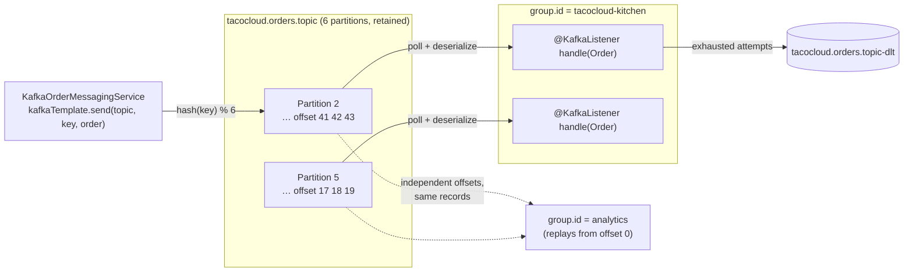

## Objective

JMS and AMQP (the `spring-jms-messaging` and `spring-rabbitmq-messaging`
concepts) both model messaging as *queue consumption*: the broker tracks a
message's delivery state, a consumer acknowledges it, and the broker then
forgets it. Kafka inverts that. A Kafka topic is a partitioned, append-only
**log** on disk; a message is not removed when it's read, it simply sits at an
offset until the retention window expires. Consumers track their own position,
so a second, independent consumer group can read the same topic from offset 0
without disturbing the first, and a consumer that had a bug can rewind and
replay. That's what makes Kafka a high-throughput event-streaming substrate
rather than a work queue. Spring for Apache Kafka (`spring-kafka`) wraps the
raw `org.apache.kafka.clients` producer/consumer API in the same
template-plus-listener shape Spring uses everywhere else: an autoconfigured
`KafkaTemplate<K, V>` for sending and `@KafkaListener` for receiving, with
serializers, consumer threading, offset commits, and container lifecycle
handled for you. This concept is about *using* Kafka from a Spring application
— for how the broker itself partitions, replicates, and coordinates consumer
groups internally, see the `distributed-message-queue-design` concept in System
Design.

## Use Cases

- **High-throughput event streaming with several independent consumers.** One
  `orders` topic read simultaneously by a fulfillment service, a billing
  service, and an analytics loader — each its own consumer group, each with its
  own offsets, none of them competing for the same messages the way workers on
  a JMS queue would.
- **Event sourcing and audit logs.** When the log *is* the system of record,
  Kafka's retention model means the sequence of events is durable and
  re-readable; rebuilding a projection is a matter of resetting a consumer
  group's offsets to the beginning rather than restoring a backup.
- **Feeding a stream-processing pipeline.** Kafka is the standard input/output
  for Kafka Streams, Flink, and Spark Structured Streaming; a Spring
  application that publishes domain events with `KafkaTemplate` gets those
  pipelines for free downstream.
- **Replaying after a bug fix.** A consumer that mis-processed a week of
  messages can be pointed back at an earlier offset and re-run — impossible on
  a broker that deletes on acknowledgment.
- **Buffering a firehose in front of a slower system.** Kafka absorbs bursts on
  disk cheaply (sequential writes) and lets consumers pull at their own rate,
  so a spike doesn't have to be sized for by the downstream database.

## Deep Dive

### Setup: the dependency and `spring.kafka.*`

Kafka's own client library is configured with a `java.util.Properties` map of
string keys — `bootstrap.servers`, `key.serializer`, `value.serializer`,
`group.id` — passed to a `KafkaProducer` or `KafkaConsumer` constructor. That
raw form still works, but from a Spring Boot application you never write it:
autoconfiguration binds `spring.kafka.*` properties to a `KafkaProperties`
object and builds the producer/consumer factories, the `KafkaTemplate`, and the
listener container factory from it.

```yaml
spring:
  kafka:
    bootstrap-servers:
      - kafka.tacocloud.com:9092
      - kafka.tacocloud.com:9093
      - kafka.tacocloud.com:9094
    template:
      default-topic: tacocloud.orders.topic
    producer:
      key-serializer: org.apache.kafka.common.serialization.StringSerializer
      value-serializer: org.springframework.kafka.support.serializer.JsonSerializer
    consumer:
      group-id: tacocloud-kitchen
      auto-offset-reset: earliest
      value-deserializer: org.springframework.kafka.support.serializer.JsonDeserializer
      properties:
        spring.json.trusted.packages: tacos
```

`bootstrap-servers` is plural and takes a list — these are only the *initial*
contact points; the client discovers the rest of the cluster and the partition
leaders from whichever broker answers first, so listing two or three is enough
for the connection to survive one of them being down. It defaults to
`localhost:9092`, which is why a locally running broker needs no configuration
at all.

Anything the Kafka client supports but Spring doesn't expose as a typed
property goes through the passthrough map:

```yaml
spring:
  kafka:
    producer:
      properties:
        compression.type: lz4
        linger.ms: 20
```

Topics can be created at startup by declaring a `NewTopic` bean; the
autoconfigured `KafkaAdmin` reconciles it against the cluster and ignores it if
the topic already exists:

```java
@Bean
public NewTopic ordersTopic() {
    return new NewTopic("tacocloud.orders.topic", 6, (short) 3);
}
```

Six partitions and a replication factor of 3 — the partition count is the cap
on how many consumers in one group can work in parallel, so it's worth
over-provisioning up front (raising it later is easy, lowering it isn't).

### Sending with `KafkaTemplate`

`KafkaTemplate<K, V>` is generically typed over the key and value, which is why
it has no `convertAndSend()` counterpart to `JmsTemplate` — every `send()`
already takes the domain object and runs it through the configured serializer.
The overloads accept, in order of increasing specificity: topic, partition,
key, timestamp, payload.

```java
CompletableFuture<SendResult<K, V>> send(String topic, V data);
CompletableFuture<SendResult<K, V>> send(String topic, K key, V data);
CompletableFuture<SendResult<K, V>> send(String topic, Integer partition, K key, V data);
CompletableFuture<SendResult<K, V>> send(String topic, Integer partition, Long timestamp, K key, V data);
CompletableFuture<SendResult<K, V>> send(ProducerRecord<K, V> record);
CompletableFuture<SendResult<K, V>> send(Message<?> message);

CompletableFuture<SendResult<K, V>> sendDefault(V data);
CompletableFuture<SendResult<K, V>> sendDefault(K key, V data);
CompletableFuture<SendResult<K, V>> sendDefault(Integer partition, K key, V data);
CompletableFuture<SendResult<K, V>> sendDefault(Integer partition, Long timestamp, K key, V data);
```

The service implementation is unremarkable — inject the template, call `send()`:

```java
package tacos.messaging;

import org.springframework.kafka.core.KafkaTemplate;
import org.springframework.stereotype.Service;

@Service
public class KafkaOrderMessagingService implements OrderMessagingService {

    private final KafkaTemplate<String, Order> kafkaTemplate;

    public KafkaOrderMessagingService(KafkaTemplate<String, Order> kafkaTemplate) {
        this.kafkaTemplate = kafkaTemplate;
    }

    @Override
    public void sendOrder(Order order) {
        kafkaTemplate.send("tacocloud.orders.topic", order);
    }
}
```

With `spring.kafka.template.default-topic` set, the topic name drops out of the
call entirely:

```java
@Override
public void sendOrder(Order order) {
    kafkaTemplate.sendDefault(order);
}
```

The important detail the book glosses over: **`send()` is asynchronous and the
returned future is the only place a failure surfaces.** Ignoring it means a
serialization error or an unreachable broker is silently swallowed. Either
attach a callback:

```java
kafkaTemplate.send("tacocloud.orders.topic", order.getId(), order)
    .whenComplete((result, ex) -> {
        if (ex != null) {
            log.error("Failed to publish order {}", order.getId(), ex);
        } else {
            RecordMetadata meta = result.getRecordMetadata();
            log.info("Published to partition {} at offset {}",
                     meta.partition(), meta.offset());
        }
    });
```

...or block, when the caller genuinely needs the send to have landed before it
continues:

```java
SendResult<String, Order> result =
        kafkaTemplate.send("tacocloud.orders.topic", order.getId(), order)
                     .get(10, TimeUnit.SECONDS);
```

Note the second argument in both: the **key**. Kafka routes by
`hash(key) % partitions`, so passing `order.getId()` guarantees every event for
one order lands in the same partition and is therefore consumed in order. Send
with no key and records are spread across partitions round-robin, which
maximizes throughput and destroys any per-entity ordering. The key is the one
"optional" parameter that is almost never optional in practice.

### Receiving with `@KafkaListener`

`KafkaTemplate` has no `receive()` — unlike `JmsTemplate` and `RabbitTemplate`,
there is no pull-based API on the Spring side, because a Kafka consumer is a
long-lived, group-coordinated, offset-committing object that doesn't fit a
one-shot receive call. The only way to consume is a listener:

```java
package tacos.kitchen.messaging.kafka.listener;

import org.springframework.kafka.annotation.KafkaListener;
import org.springframework.stereotype.Component;
import tacos.Order;
import tacos.kitchen.KitchenUI;

@Component
public class OrderListener {

    private final KitchenUI ui;

    public OrderListener(KitchenUI ui) {
        this.ui = ui;
    }

    @KafkaListener(topics = "tacocloud.orders.topic", groupId = "tacocloud-kitchen")
    public void handle(Order order) {
        ui.displayOrder(order);
    }
}
```

Behind the annotation, a `KafkaMessageListenerContainer` (or a concurrent one)
polls the broker on its own thread, deserializes each record, invokes the
method, and commits the offset afterward. `groupId` is the load-balancing unit:
every instance of this application sharing `tacocloud-kitchen` splits the
topic's partitions between them, while a *different* group id on another
service reads the same records independently.

When the payload isn't enough, the method can take the raw `ConsumerRecord` (or
Spring's `Message`) alongside it:

```java
@KafkaListener(topics = "tacocloud.orders.topic")
public void handle(Order order, ConsumerRecord<String, Order> record) {
    log.info("Received key={} from partition {} at offset {} (ts {})",
             record.key(), record.partition(), record.offset(), record.timestamp());
    ui.displayOrder(order);
}
```

```java
@KafkaListener(topics = "tacocloud.orders.topic")
public void handle(Order order, Message<Order> message) {
    MessageHeaders headers = message.getHeaders();
    log.info("Received from partition {} with timestamp {}",
             headers.get(KafkaHeaders.RECEIVED_PARTITION),
             headers.get(KafkaHeaders.RECEIVED_TIMESTAMP));
    ui.displayOrder(order);
}
```

Individual header values can also be pulled in directly with `@Header`, which
is usually tidier than reaching into the `MessageHeaders` map:

```java
@KafkaListener(topics = "tacocloud.orders.topic")
public void handle(@Payload Order order,
                   @Header(KafkaHeaders.RECEIVED_KEY) String key,
                   @Header(KafkaHeaders.RECEIVED_PARTITION) int partition) {
    ui.displayOrder(order);
}
```

Because Kafka fetches in batches anyway, a listener can be configured to
receive the whole batch instead of one record per invocation — one offset
commit per batch instead of per record, which is a large throughput win for
sinks that can write in bulk:

```yaml
spring:
  kafka:
    listener:
      type: batch
```

```java
@KafkaListener(topics = "tacocloud.orders.topic")
public void handleBatch(List<Order> orders) {
    ui.displayOrders(orders);   // one commit for the whole list
}
```

### Failure handling: `@RetryableTopic` and dead-letter topics

A failing record on a Kafka partition is a harder problem than on a queue:
there is no "reject and requeue", and because a partition is a strict sequence,
retrying in place *blocks every subsequent record in that partition*.
`spring-kafka` solves it with non-blocking retries — the failed record is
forwarded to a generated retry topic with a delay, the main partition moves on,
and a record that exhausts its attempts lands in a dead-letter topic:

```java
@RetryableTopic(
    attempts = "4",
    backoff = @Backoff(delay = 1000, multiplier = 2.0),
    dltTopicSuffix = "-dlt")
@KafkaListener(topics = "tacocloud.orders.topic")
public void handle(Order order) {
    ui.displayOrder(order);
}

@DltHandler
public void handleDlt(Order order, @Header(KafkaHeaders.RECEIVED_TOPIC) String topic) {
    log.error("Order {} landed in DLT from {}", order.getId(), topic);
}
```

The annotation provisions `tacocloud.orders.topic-retry-0`, `-retry-1`, … and
`tacocloud.orders.topic-dlt`, plus the listeners that drain them.



> **Book vs. today.** Three of the book's concrete details have moved.
> **(1) The signatures.** Every `send()`/`sendDefault()` overload in listing 8.8's
> surrounding text returns `ListenableFuture<SendResult<K, V>>`; spring-kafka
> 3.0 (shipped with Spring Boot 3.0) replaced Spring's homegrown
> `ListenableFuture` with the JDK's `CompletableFuture` across the whole API, so
> the callback idiom is now `.whenComplete(...)` rather than
> `.addCallback(...)`. The same release renamed the header constants the book
> uses — `KafkaHeaders.RECEIVED_PARTITION_ID` → `RECEIVED_PARTITION`,
> `RECEIVED_MESSAGE_KEY` → `RECEIVED_KEY`. **(2) The dependency.** The book
> states "there isn't a Spring Boot starter for Kafka" and has you add
> `org.springframework.kafka:spring-kafka` directly — correct through Boot 3.x,
> where the presence of that jar alone triggered autoconfiguration. Spring Boot
> 4.0 modularized autoconfiguration out of the monolithic
> `spring-boot-autoconfigure` jar, and there is now a real
> `org.springframework.boot:spring-boot-starter-kafka` that is *required*: with
> only `spring-kafka` on a Boot 4 classpath, no `KafkaTemplate` bean is created
> and `spring.kafka.*` properties are ignored entirely. **(3) The broker.** In
> 2019 every Kafka cluster ran alongside a ZooKeeper ensemble holding cluster
> metadata. KRaft — Kafka's own internal Raft quorum for that metadata — was
> marked production-ready for new clusters in Kafka 3.3 (2022), its migration
> tooling in 3.7, and **Kafka 4.0 (March 2025) removed ZooKeeper support
> outright**; KRaft is now the only mode. Nothing in `KafkaTemplate` or
> `@KafkaListener` changed because of it, but "spin up ZooKeeper, then Kafka" is
> no longer how you get a broker running locally. Meanwhile spring-kafka 4.0
> (November 2025, Spring Framework 7 / Boot 4) tracks kafka-clients 4.1 and adds
> `@ShareKafkaListener` for Kafka's new share-consumer "queue" mode — Kafka
> growing back the point-to-point semantics this concept contrasts it with.
> The core `KafkaTemplate.send()` / `@KafkaListener` programming model the book
> teaches is otherwise intact seven years on.

## Trade-offs

- **Retention and replay make the broker a system of record — and give it that
  system's operational weight.** Being able to reset a consumer group to offset
  0 and rebuild a projection is genuinely something a JMS or AMQP broker cannot
  do, but the flip side is that you are now capacity-planning, replicating, and
  securing weeks of business data on broker disks. A consumer that stays down
  past the retention window doesn't get a backlog waiting for it — it gets a
  gap, and `auto-offset-reset` silently decides whether it resumes at the
  oldest surviving record or skips to the newest:
  ```yaml
  spring:
    kafka:
      consumer:
        auto-offset-reset: earliest   # replay what's left  (vs. "latest": skip the gap)
  ```
- **Operating a Kafka cluster costs more than operating RabbitMQ.** Partition
  counts, replication factors, in-sync replica settings, retention policies,
  broker rebalancing, consumer-group lag monitoring — none of these have
  RabbitMQ equivalents you're forced to think about on day one. KRaft removed
  the ZooKeeper ensemble, which was the single biggest piece of that overhead,
  but a Kafka cluster is still a stateful distributed system you own. If the
  requirement is "a few thousand jobs a minute, consumed once, order doesn't
  matter", RabbitMQ or Artemis is the smaller answer and the sibling
  `spring-rabbitmq-messaging` / `spring-jms-messaging` concepts cover it.
- **Ordering is per-partition, not per-topic — and the key is what makes that
  useful.** A single-queue JMS broker gives FIFO over everything; Kafka gives
  FIFO only within one partition, and there is deliberately no global topic
  order. Getting the guarantee you probably want means routing by a business
  key, and forgetting the key is a bug that only shows up under concurrency:
  ```java
  kafkaTemplate.send(TOPIC, order);                  // round-robin: events for one
                                                     // order can land on 3 partitions
  kafkaTemplate.send(TOPIC, order.getId(), order);   // same key → same partition → ordered
  ```
- **Parallelism is capped by partition count, not by instance count.** Within a
  consumer group each partition is assigned to exactly one consumer, so scaling
  a `@KafkaListener` deployment from 6 pods to 12 against a 6-partition topic
  buys nothing — the extra six sit idle. A competing-consumers JMS queue has no
  such ceiling; you just add workers. Partition count is a capacity decision
  made at topic-creation time and awkward to reduce later.
- **`send()` is fire-and-forget unless you make it otherwise.** The returned
  `CompletableFuture` is the only channel for a serialization failure or an
  unreachable broker, and a call whose result is discarded reports success it
  can't know about. Blocking on `.get()` restores the error but also restores
  the latency the async producer exists to hide — and the producer's `acks`
  setting still decides what "delivered" even means (leader only vs. all in-sync
  replicas).
- **At-least-once is the realistic default, so consumers must be idempotent.**
  With offsets committed after processing, a consumer that crashes mid-work
  reprocesses on restart. Kafka does offer exactly-once via transactions
  (`spring.kafka.producer.transaction-id-prefix` plus `KafkaTransactionManager`
  in Spring), but the guarantee ends at Kafka's own boundary — the moment your
  listener makes an HTTP call or writes to a database outside the transaction,
  you need idempotence there anyway. Most teams ship at-least-once with an
  idempotent sink and skip the transactional machinery entirely; see
  `distributed-message-queue-design` for why.
- **Non-blocking retry is a genuine improvement over blocking redelivery, but it
  breaks ordering for the retried records.** `@RetryableTopic` keeps a poison
  record from stalling its whole partition, at the cost of that record being
  re-delivered from a *different* topic later, out of sequence with its
  neighbours. If strict per-key ordering matters more than throughput, blocking
  retry on the main partition is the correct — and slower — choice.

## Documentation Links

- Craig Walls, "Spring in Action", 5th Edition (Manning, 2019) — Chapter 8,
  "Sending messages asynchronously", section 8.3 "Messaging with Kafka",
  p. 202-208 — doc
- [Spring for Apache Kafka Reference — Sending Messages (KafkaTemplate)](https://docs.spring.io/spring-kafka/reference/kafka/sending-messages.html) — doc
- [Spring for Apache Kafka Reference — Receiving Messages (@KafkaListener)](https://docs.spring.io/spring-kafka/reference/kafka/receiving-messages.html) — doc
- [Spring for Apache Kafka Reference — Non-Blocking Retries (@RetryableTopic)](https://docs.spring.io/spring-kafka/reference/retrytopic.html) — doc
- [Spring Boot Reference — Messaging: Apache Kafka Support](https://docs.spring.io/spring-boot/reference/messaging/kafka.html) — doc
- [Apache Kafka Documentation — Design (log storage, partitioning, delivery semantics)](https://kafka.apache.org/documentation/#design) — doc
- [Apache Kafka 4.0.0 Release Announcement — KRaft-only, ZooKeeper removed](https://kafka.apache.org/blog/2025/03/18/apache-kafka-4.0.0-release-announcement/) — doc
